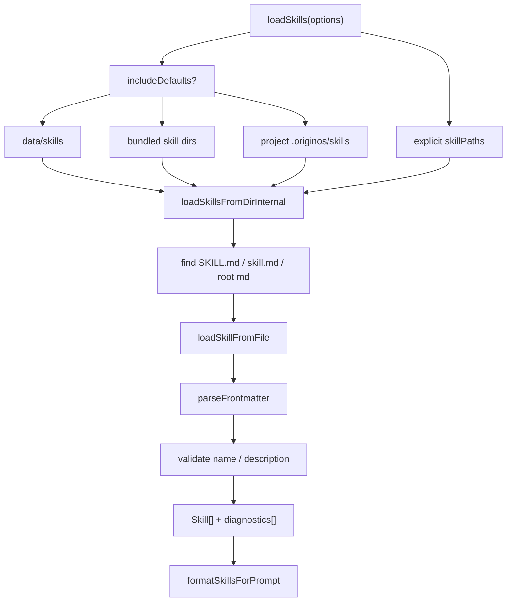
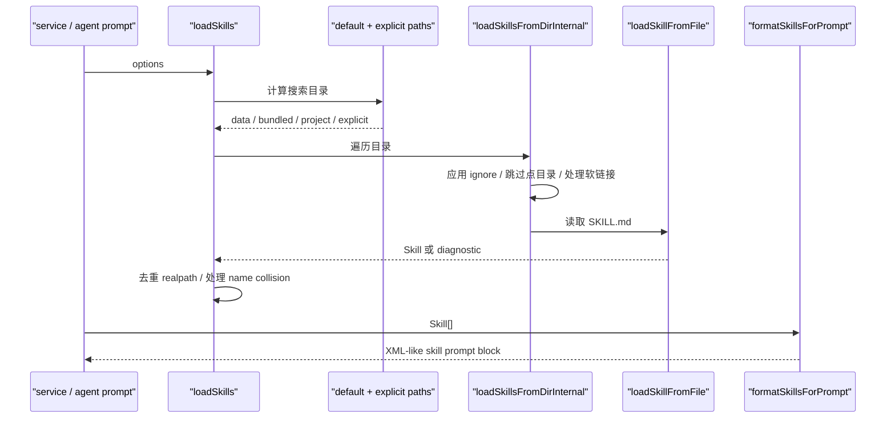

# E3：Pi Agent Skill Loader

## 问题

这一节专门读 [core/skills.ts](../../../../packages/core/src/lib/integrations/pi-agent/core/skills.ts#L1)。

如果 E2 的 `service.ts` 是“技能系统对外提供服务”，那么这一节的 loader 就是“系统如何在文件系统里发现技能”。它解决的问题包括：

- 去哪些目录找技能。
- 哪些文件算技能入口。
- 如何解析 `SKILL.md`。
- 如何处理忽略规则、软链接、重复路径、重名冲突。
- 如何把技能格式化成模型可读的 `<available_skills>`。
- 打包到 Electron 后，内置技能路径怎么找。

这节要掌握的是：Skill loader 不是业务功能，它是一个文件系统发现器 + 元数据规范器。

## 图解



这张图有两个出口：一个是 `Skill[]` 给系统用，一个是 `<available_skills>` 给模型用。

## 源码入口

- [MAX_NAME_LENGTH（第 22 行）](../../../../packages/core/src/lib/integrations/pi-agent/core/skills.ts#L22)
- [MAX_DESCRIPTION_LENGTH（第 23 行）](../../../../packages/core/src/lib/integrations/pi-agent/core/skills.ts#L23)
- [toPosixPath（第 100 行）](../../../../packages/core/src/lib/integrations/pi-agent/core/skills.ts#L100)
- [addIgnoreRules（第 133 行）](../../../../packages/core/src/lib/integrations/pi-agent/core/skills.ts#L133)
- [validateName（第 156 行）](../../../../packages/core/src/lib/integrations/pi-agent/core/skills.ts#L156)
- [validateDescription（第 185 行）](../../../../packages/core/src/lib/integrations/pi-agent/core/skills.ts#L185)
- [parseFrontmatter（第 208 行）](../../../../packages/core/src/lib/integrations/pi-agent/core/skills.ts#L208)
- [loadSkillsFromDirInternal（第 310 行）](../../../../packages/core/src/lib/integrations/pi-agent/core/skills.ts#L310)
- [formatSkillsForPrompt（第 416 行）](../../../../packages/core/src/lib/integrations/pi-agent/core/skills.ts#L416)
- [getDefaultSkillPaths（第 455 行）](../../../../packages/core/src/lib/integrations/pi-agent/core/skills.ts#L455)
- [getBundledSkillDirs（第 475 行）](../../../../packages/core/src/lib/integrations/pi-agent/core/skills.ts#L475)
- [materializeBundledSkill（第 602 行）](../../../../packages/core/src/lib/integrations/pi-agent/core/skills.ts#L602)
- [loadSkills（第 639 行）](../../../../packages/core/src/lib/integrations/pi-agent/core/skills.ts#L639)

## 调用链



## 关键类型

`LoadSkillsOptions` 控制 loader 行为：

- `cwd`：项目上下文根目录。
- `includeDefaults`：是否加载默认技能目录。
- `skillPaths`：额外指定技能路径。

`LoadSkillsResult` 返回两个东西：

- `skills`：成功加载的技能。
- `diagnostics`：失败或跳过原因。

`SkillDiagnostic` 的价值很大。它说明 loader 不是“静默失败”，而是能告诉你某个文件为什么没有变成技能。

`Skill.source` 是后续目录策略的依据：

- `bundled`：系统内置技能。
- `user`：用户安装或物化到 data 的技能。
- `project`：项目级技能。

## 测试入口

- [loadSkills 测试组（第 28 行）](../../../../packages/core/src/lib/integrations/pi-agent/__tests__/skills.test.ts#L28)
- [formatSkillsForPrompt 测试（第 41 行）](../../../../packages/core/src/lib/integrations/pi-agent/__tests__/skills.test.ts#L41)
- [disabled skill 过滤测试（第 60 行）](../../../../packages/core/src/lib/integrations/pi-agent/__tests__/skills.test.ts#L60)
- [skill-creator-app 与 project-skill-creator 去重测试（第 107 行）](../../../../packages/core/src/lib/integrations/pi-agent/__tests__/skills.test.ts#L107)
- [Electron resources 查找测试（第 167 行）](../../../../packages/core/src/lib/integrations/pi-agent/__tests__/skills.test.ts#L167)

可运行：

```bash
pnpm --filter @originos/core test -- --run packages/core/src/lib/integrations/pi-agent/__tests__/skills.test.ts
```

## 逐行精读

[MAX_NAME_LENGTH（第 22 行）](../../../../packages/core/src/lib/integrations/pi-agent/core/skills.ts#L22) 和 [MAX_DESCRIPTION_LENGTH（第 23 行）](../../../../packages/core/src/lib/integrations/pi-agent/core/skills.ts#L23) 说明 loader 有基本输入约束。技能名和描述不是随便长，避免污染 prompt 和 UI。

[toPosixPath（第 100 行）](../../../../packages/core/src/lib/integrations/pi-agent/core/skills.ts#L100) 是跨平台细节。Windows 路径分隔符和 POSIX 路径分隔符不同，ignore 规则通常更适合 POSIX 表达。

[addIgnoreRules（第 133 行）](../../../../packages/core/src/lib/integrations/pi-agent/core/skills.ts#L133) 体现 loader 不是粗暴递归。它会读取忽略规则，避免把不该扫描的目录当成技能。

[loadSkillsFromDirInternal（第 310 行）](../../../../packages/core/src/lib/integrations/pi-agent/core/skills.ts#L310) 是目录遍历核心。第 320 行附近如果目录不存在就返回空，这让默认路径可以宽容存在。第 332 行跳过点目录，第 336 行跳过 `node_modules`，第 345 行处理符号链接。

[loadSkillFromFile（第 250 行）](../../../../packages/core/src/lib/integrations/pi-agent/core/skills.ts#L250) 是文件级解析。它先读原文，再解析 frontmatter，之后校验 description/name，最后决定 source 与 systemManaged。

[formatSkillsForPrompt（第 416 行）](../../../../packages/core/src/lib/integrations/pi-agent/core/skills.ts#L416) 是模型可见技能列表的出口。第 417 行会过滤 `disableModelInvocation` 的技能，避免某些系统技能被模型主动调用。

[getBundledSkillDirs（第 475 行）](../../../../packages/core/src/lib/integrations/pi-agent/core/skills.ts#L475) 体现打包态处理。它会考虑 Electron `resourcesPath`、`MONOREPO_ROOT`、`ORIGINOS_BUNDLED_SKILLS_DIR` 和开发态 `templates/skills`。

[loadSkills（第 639 行）](../../../../packages/core/src/lib/integrations/pi-agent/core/skills.ts#L639) 是总入口。它创建 `skillMap`、`realPathSet`、`diagnostics`，把默认路径和显式路径合并加载，并处理重复路径和重名冲突。

## 深度拆解

这个 loader 的设计可以分成四个层次：

第一层是路径来源。它支持默认目录，也支持调用方传入 `skillPaths`。默认目录又分 data、bundled、project。

第二层是文件发现。目录里可能有很多文件，loader 只关心 `SKILL.md`、`skill.md` 或符合规则的 Markdown 入口。

第三层是元数据规范。Markdown 本身太自由，系统需要把它规范成 `Skill` 对象。

第四层是运行时输出。一个输出给服务层和 UI，一个输出给模型 prompt。

这四层分开后，后续要改“技能放哪里”和“技能如何展示”就不会互相污染。

## 常见故障

技能目录存在但加载不到：检查是否被 ignore、是否是点目录、是否缺少有效 `SKILL.md`。

技能名冲突：`loadSkills` 用 map 管理技能，后加载的同名技能可能被诊断为冲突或跳过。不要依赖“刚好覆盖”。

打包态找不到内置技能：看 `getBundledSkillDirs` 的优先级，尤其 `process.resourcesPath` 和 `templates/skills`。

技能不进入 prompt：检查 `disable-model-invocation` 是否开启。

## 改动场景判断

如果新增一种技能来源，例如团队共享目录，应该改 `getDefaultSkillPaths` 或调用方传入 `skillPaths`，而不是让 UI 直接扫目录。

如果要改变技能文件命名规则，要改 `findSkillMarkdownFile` 和目录遍历逻辑。

如果要增加 frontmatter 字段，要同时考虑 `SkillFrontmatter`、`loadSkillFromFile`、service DTO 和 UI 使用处。

如果要控制模型可见技能，要改 `formatSkillsForPrompt` 相关逻辑。

## 源码追问清单

- 这个技能目录是否被 loader 扫到？
- 入口文件名是否符合规则？
- frontmatter 是否被解析出来？
- description 是否通过校验？
- source 是如何推断的？
- 是否因为 realpath 重复被跳过？
- 是否因为 name collision 被覆盖或跳过？
- 是否进入模型 prompt？

## 练习

1. 从 [loadSkills（第 639 行）](../../../../packages/core/src/lib/integrations/pi-agent/core/skills.ts#L639) 开始，列出默认加载路径的顺序。
2. 找到 [formatSkillsForPrompt（第 416 行）](../../../../packages/core/src/lib/integrations/pi-agent/core/skills.ts#L416)，说明为什么有些技能不会出现在 `<available_skills>`。
3. 解释 [Electron resources 测试（第 167 行）](../../../../packages/core/src/lib/integrations/pi-agent/__tests__/skills.test.ts#L167) 覆盖了哪种真实运行环境。

## 验收

你完成本节后，应该能：

- 手动判断一个目录会不会被 loader 当成技能目录。
- 解释 `Skill[]` 和 `<available_skills>` 的关系。
- 说明打包态、开发态和 data 目录之间的加载差异。
- 排查“技能文件存在但 UI 看不到”的第一批原因。
