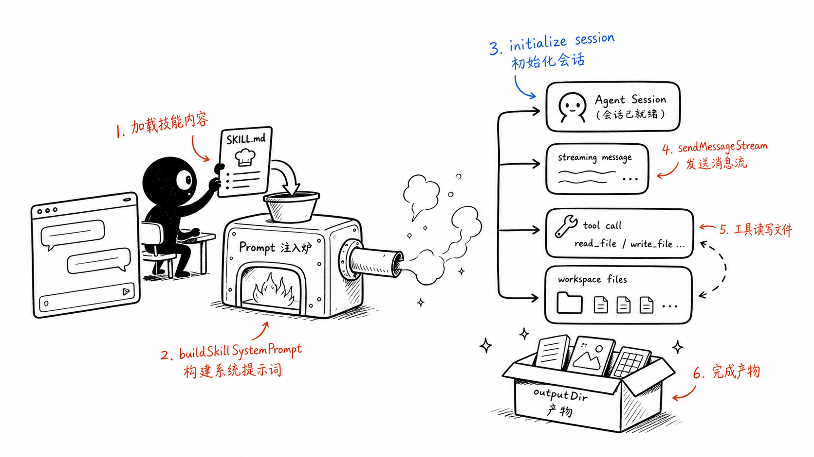
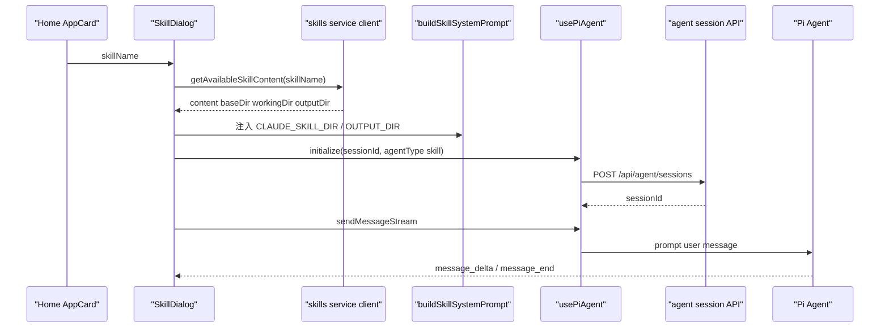
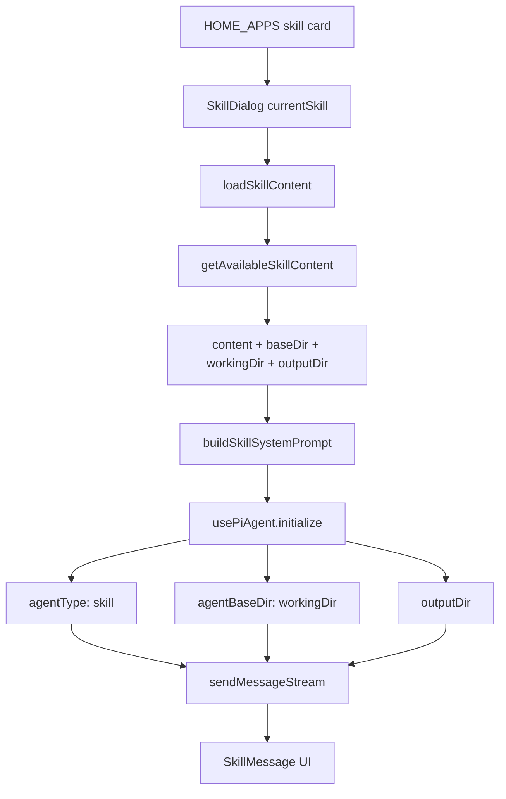

# E4：SkillDialog 执行链

## 问题

前面三节都在 core 侧。现在回到用户真正看到的地方：点击首页技能卡片后弹出的 `SkillDialog`。

这一节回答：

- 首页配置如何打开技能对话框。
- SkillDialog 如何加载 `SKILL.md`。
- Markdown 如何被改造成 system prompt。
- 会话如何初始化为 `agentType: skill`。
- 用户输入如何进入 Pi Agent 流式消息。
- 上传文件、打开产物目录、技能演化这些能力挂在哪里。

SkillDialog 是 E 部分最重要的 Web 入口。它把“技能定义”变成“可交互的 AI 应用”。

## 图解





## 源码入口

- [SkillDialog 文件入口（第 1 行）](../../../../packages/web/src/components/skills/SkillDialog.tsx#L1)
- [loadSkillContent helper（第 59 行）](../../../../packages/web/src/components/skills/SkillDialog.tsx#L59)
- [buildSkillSystemPrompt（第 103 行）](../../../../packages/web/src/components/skills/SkillDialog.tsx#L103)
- [SkillDialog 组件入口（第 228 行）](../../../../packages/web/src/components/skills/SkillDialog.tsx#L228)
- [usePiAgent 解构位置（第 289 行）](../../../../packages/web/src/components/skills/SkillDialog.tsx#L289)
- [初始化 effect（第 412 行）](../../../../packages/web/src/components/skills/SkillDialog.tsx#L412)
- [initialize 调用（第 485 行）](../../../../packages/web/src/components/skills/SkillDialog.tsx#L485)
- [发送初始消息 effect（第 537 行）](../../../../packages/web/src/components/skills/SkillDialog.tsx#L537)
- [handleSendMessage（第 594 行）](../../../../packages/web/src/components/skills/SkillDialog.tsx#L594)
- [sendMessageStream 调用（第 607 行）](../../../../packages/web/src/components/skills/SkillDialog.tsx#L607)
- [首页 skillName 配置（第 27 行）](../../../../packages/web/src/config/homeApps.ts#L27)

## 调用链



这里要牢牢记住：`SkillDialog` 不是直接执行 Markdown；它是把 Markdown 变成 system prompt，再交给 Pi Agent 执行。

## 关键类型

`SkillDefinition` 是前端列表展示用类型，它描述一个技能卡片需要的字段。

`SkillDialogProps` 决定弹窗如何被父组件控制：

- `isOpen`：是否显示。
- `skillName`：当前打开哪个技能。
- `onClose`：关闭回调。
- 其他参数负责初始消息、会话恢复、项目上下文等。

`SkillMessage` 是 UI 消息模型。它不是底层 AgentMessage 的简单照搬，而是给对话框渲染使用的结构。

`buildSkillSystemPrompt` 的输入更像一个 prompt compiler：

- 技能名。
- 技能内容。
- 技能源目录。
- 工作目录。
- 输出目录。
- 是否系统管理。

## 测试入口

SkillDialog 本身没有在这里形成一组独立完整的组件测试，所以要分层验证：

- loader 与 prompt 可见性：[Skill framework 测试（第 27 行）](../../../../packages/core/src/lib/integrations/pi-agent/__tests__/skills.test.ts#L27)
- 内容服务和物化：[Skill feature service 测试（第 8 行）](../../../../packages/core/src/lib/features/skills/__tests__/service.test.ts#L8)
- 导出策略：[skill-export-policy 测试（第 1 行）](../../../../packages/web/src/components/skills/__tests__/skill-export-policy.test.ts#L1)
- UI 源码人工入口：[SkillDialog 组件入口（第 228 行）](../../../../packages/web/src/components/skills/SkillDialog.tsx#L228)

建议运行：

```bash
pnpm --filter @originos/core test -- --run packages/core/src/lib/features/skills/__tests__/service.test.ts
pnpm --filter @originos/core test -- --run packages/core/src/lib/integrations/pi-agent/__tests__/skills.test.ts
```

## 逐行精读

[loadSkillContent helper（第 59 行）](../../../../packages/web/src/components/skills/SkillDialog.tsx#L59) 做的是前端内容获取。它调用 `getAvailableSkillContent`，如果失败可能走 agent 内容 fallback。这体现 SkillDialog 同时兼容 Skill 和 Agent 类入口。

[buildSkillSystemPrompt（第 103 行）](../../../../packages/web/src/components/skills/SkillDialog.tsx#L103) 是本节重点。它不是简单拼一句“你是某技能”，而是注入工作目录、输出目录、技能资源目录，并给出执行规则。第 131 行附近注入 skill assets dir，第 134 行明确 `CLAUDE_SKILL_DIR`，第 210 行和第 215 行会替换正文里的占位变量。

[SkillDialog 组件入口（第 228 行）](../../../../packages/web/src/components/skills/SkillDialog.tsx#L228) 开始进入状态编排。第 236 行维护 `currentSkill`，第 239 行有技能内容缓存，避免重复加载。第 250 行和第 251 行用于防重复自动启动和初始化。

[usePiAgent 解构位置（第 289 行）](../../../../packages/web/src/components/skills/SkillDialog.tsx#L289) 把底层 Agent 能力拿到 UI：初始化、发送消息、流式状态、历史记录等。

[初始化 effect（第 412 行）](../../../../packages/web/src/components/skills/SkillDialog.tsx#L412) 是“打开弹窗之后真正启动技能”的地方。它检查当前 skill 和 session，加载技能内容，构造 prompt，最后调用 initialize。

[initialize 调用（第 485 行）](../../../../packages/web/src/components/skills/SkillDialog.tsx#L485) 传入 `projectId: skill-${currentSkill}`、`agentType: skill`、`systemPrompt`、`agentBaseDir` 和 `outputDir`。这几个字段决定了后续工具调用在哪个目录工作。

[handleSendMessage（第 594 行）](../../../../packages/web/src/components/skills/SkillDialog.tsx#L594) 是用户消息入口。第 607 行调用 `sendMessageStream`，说明 SkillDialog 使用流式 Agent 会话，而不是同步 handler 返回。

## 深度拆解

SkillDialog 有三种“编译”动作。

第一，把 `skillName` 编译成技能内容。它不自己扫目录，而是调用前端 service client，由 API/core service 处理来源。

第二，把 `SKILL.md` 编译成 system prompt。这个编译会处理 frontmatter、正文、工作目录说明、工具规则和变量替换。

第三，把用户输入编译成 Agent 会话消息。`sendMessageStream` 不是调用技能函数，而是让 Agent 在当前技能 prompt 下继续对话。

这就是为什么 SkillDialog 能承载很多不同技能：它不是为某个技能写死的 UI，而是一个“技能运行容器”。

## 常见故障

技能点开后内容不对：看 `loadSkillContent` 是否拿到正确 `skillName`，再看 service 返回的 `content/baseDir/workingDir/outputDir`。

技能生成文件位置不对：看 `initialize` 传入的 `agentBaseDir` 和 `outputDir`，再看 prompt 是否正确替换 `OUTPUT_DIR`。

重复初始化或消息串到旧会话：看 `hasAutoStartedRef`、`lastInitRef`、`stableSessionIdRef` 和 transition guard。

流式消息显示异常：先分清是 `sendMessageStream` 的事件问题，还是消息映射到 `SkillMessage` 的 UI 问题。

上传文件后技能读不到：看 `useFileUpload` 的 basePath 回调是否使用当前 skill 的工作目录。

## 改动场景判断

如果要改技能 prompt 规则，改 `buildSkillSystemPrompt`。

如果要改会话初始化参数，改初始化 effect 和 `initialize` 参数。

如果要改技能列表或内容加载，不应该在 SkillDialog 里直接读文件，而要回到 service client/API/core service。

如果要改文件上传行为，跟 `useFileUpload` 和 basePath 相关，不要混到 prompt 构造里。

如果要改首页入口，先看 [HOME_APPS（第 27 行）](../../../../packages/web/src/config/homeApps.ts#L27)，不要直接改 SkillDialog。

## 源码追问清单

- `skillName` 从哪里传进来？
- 当前技能内容是否来自缓存？
- system prompt 里是否有正确工作目录？
- `CLAUDE_SKILL_DIR` 是否指向定义目录？
- `OUTPUT_DIR` 是否指向产物目录？
- 会话是新建还是恢复？
- `projectId` 为什么是 `skill-${currentSkill}`？
- 用户消息是否走流式发送？

## 练习

1. 从 [首页配置第 29 行](../../../../packages/web/src/config/homeApps.ts#L29) 找到 `agent-creator`，追到 SkillDialog 如何拿到 `skillName`。
2. 读 [buildSkillSystemPrompt（第 103 行）](../../../../packages/web/src/components/skills/SkillDialog.tsx#L103)，列出它注入的所有路径信息。
3. 对照 [initialize 调用（第 485 行）](../../../../packages/web/src/components/skills/SkillDialog.tsx#L485)，解释 `agentBaseDir` 和 `outputDir` 分别控制什么。

## 验收

你完成本节后，应该能：

- 从首页技能卡片一路追到 Pi Agent 会话初始化。
- 说明 `SKILL.md` 如何变成 system prompt。
- 判断技能文件读目录和产物写目录是否正确。
- 排查 SkillDialog 打开、初始化、发送消息三类问题。
