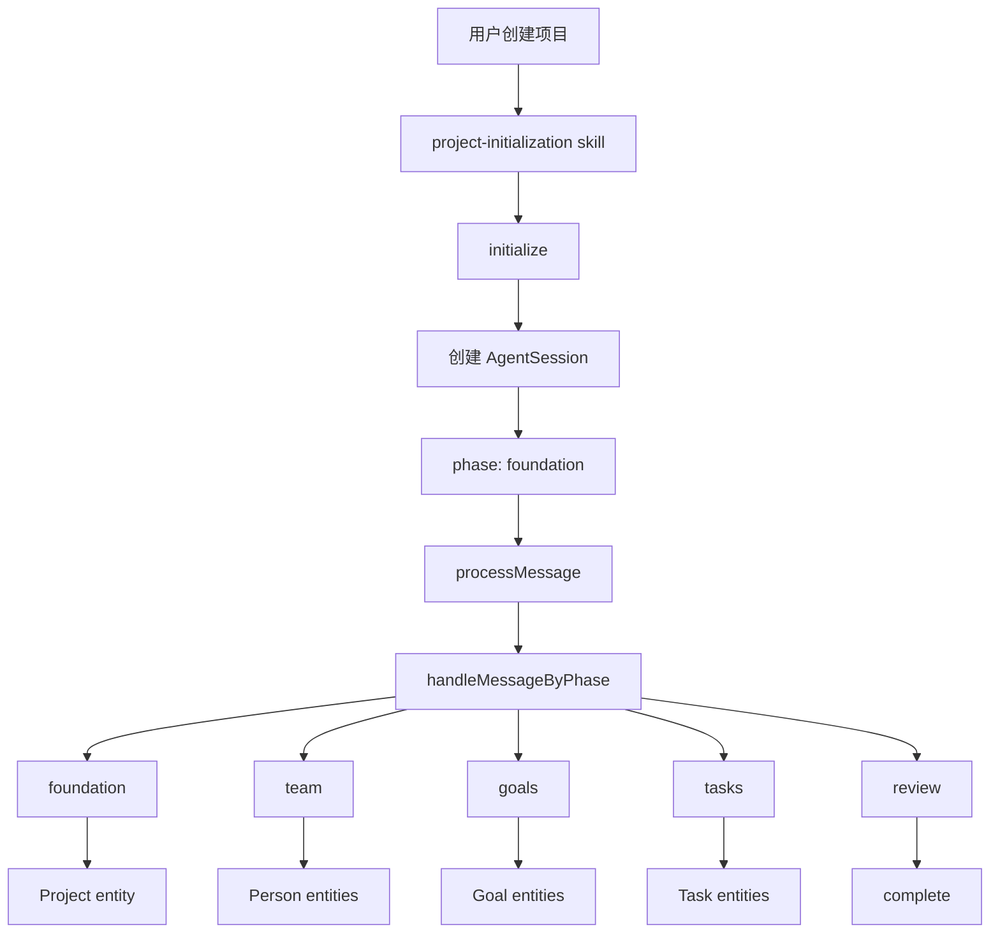
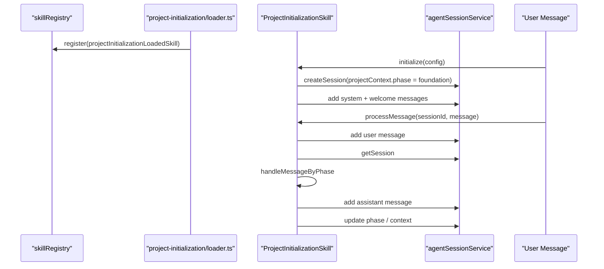

# E5：Project Initialization 复合技能

## 问题

这一节研究一个特别适合当样本的技能：`project-initialization`。

它和普通 prompt 技能不同。普通技能主要靠 `SKILL.md` 指导 Agent 行动，而 `project-initialization` 同时有：

- 一个技能说明文件。
- 一个 TypeScript 类实现。
- 一个 loader，把实现注册进 skill registry。
- 一个分阶段访谈状态机。
- 一个和 ontology 概念绑定的上下文模型。

所以它是理解 OriginOS “复合技能”的好入口。

本节要回答：项目初始化为什么不是简单问几个问题，而是一个有阶段、有上下文、有实体创建意图的技能流程？

## 图解



这不是“聊天记录”而已。每轮对话都带着 `phase` 和 `projectContext` 前进。

## 源码入口

- [project-initialization 实现文件入口（第 1 行）](../../../../packages/core/src/lib/features/skills/project-initialization/index.ts#L1)
- [ProjectInitializationConfig（第 24 行）](../../../../packages/core/src/lib/features/skills/project-initialization/index.ts#L24)
- [InterviewPhase（第 40 行）](../../../../packages/core/src/lib/features/skills/project-initialization/index.ts#L40)
- [InterviewContext（第 51 行）](../../../../packages/core/src/lib/features/skills/project-initialization/index.ts#L51)
- [InterviewResponse（第 68 行）](../../../../packages/core/src/lib/features/skills/project-initialization/index.ts#L68)
- [DEFAULT_SYSTEM_PROMPT（第 85 行）](../../../../packages/core/src/lib/features/skills/project-initialization/index.ts#L85)
- [ProjectInitializationSkill 类（第 134 行）](../../../../packages/core/src/lib/features/skills/project-initialization/index.ts#L134)
- [initialize（第 141 行）](../../../../packages/core/src/lib/features/skills/project-initialization/index.ts#L141)
- [processMessage（第 179 行）](../../../../packages/core/src/lib/features/skills/project-initialization/index.ts#L179)
- [handleMessageByPhase（第 283 行）](../../../../packages/core/src/lib/features/skills/project-initialization/index.ts#L283)
- [loader 注册入口（第 13 行）](../../../../packages/core/src/lib/features/skills/project-initialization/loader.ts#L13)

技能说明文件：

- [project-initialization SKILL.md（第 1 行）](../../../../packages/core/src/lib/features/skills/bundled/project-initialization/SKILL.md#L1)

## 调用链



## 关键类型

`ProjectInitializationConfig` 是启动配置：

- `projectId` 可选，不传会自动生成。
- `projectName` 必填。
- `initialContext` 可把额外上下文塞进 session。
- `customSystemPrompt` 可覆盖默认系统提示。
- `graphPath` 预留给 ontology 存储。

`InterviewPhase` 是访谈状态：

- `foundation`：项目基础信息。
- `team`：团队成员。
- `goals`：目标。
- `tasks`：任务。
- `review`：复核。
- `complete`：完成。

`InterviewContext` 是读上下文时给外部看的结构，包含 `phase`、`entitiesCreated`、conversation 和 `projectEntityId`。

`InterviewResponse` 是每轮处理后的结果，包含下一阶段、创建的实体、是否完成等。

## 测试入口

项目初始化的测试入口需要结合 API 和 skill feature 看：

- [project-initialization loader（第 13 行）](../../../../packages/core/src/lib/features/skills/project-initialization/loader.ts#L13)
- [Skill service 启动执行（第 561 行）](../../../../packages/core/src/lib/features/skills/service.ts#L561)
- [Skill feature service 测试（第 8 行）](../../../../packages/core/src/lib/features/skills/__tests__/service.test.ts#L8)

如果要补测试，建议新增围绕这些路径的单元测试：

```bash
pnpm --filter @originos/core test -- --run packages/core/src/lib/features/skills
```

## 逐行精读

[ProjectInitializationConfig（第 24 行）](../../../../packages/core/src/lib/features/skills/project-initialization/index.ts#L24) 告诉我们启动一个项目初始化技能至少要有 `projectName`。这和普通 SkillDialog 只需要 `skillName` 不同，因为项目初始化天然要创建项目上下文。

[InterviewPhase（第 40 行）](../../../../packages/core/src/lib/features/skills/project-initialization/index.ts#L40) 是最小状态机。它没有单独抽成 state-machine 文件，而是用 union type 和 handler map 管理。

[DEFAULT_SYSTEM_PROMPT（第 85 行）](../../../../packages/core/src/lib/features/skills/project-initialization/index.ts#L85) 暴露了产品目标：通过自然对话收集项目信息，并在信息收集过程中创建 Project、Person、Task、Goal 等实体。

[initialize（第 141 行）](../../../../packages/core/src/lib/features/skills/project-initialization/index.ts#L141) 创建 session。第 145 行组装 `CreateSessionRequest`，第 149 行设置 `agentType: SKILL_NAME`，第 151-154 行把 `phase: foundation` 写入 `projectContext`。

[processMessage（第 179 行）](../../../../packages/core/src/lib/features/skills/project-initialization/index.ts#L179) 是每轮入口。它先写用户消息，再读 session，再根据当前 phase 处理，最后写 assistant 消息并更新 phase。

[handleMessageByPhase（第 283 行）](../../../../packages/core/src/lib/features/skills/project-initialization/index.ts#L283) 用一个 Record 把 phase 映射到 handler。这是一个轻量状态机：状态不复杂时，这种实现比引入大型状态机库更直接。

[handleFoundationPhase（第 308 行）](../../../../packages/core/src/lib/features/skills/project-initialization/index.ts#L308) 如果还没有 `projectEntityId`，会提取描述并创建一个 mock Project entity。源码注释说明真实生产路径应调用 Ontology skill API。

[handleTeamPhase（第 372 行）](../../../../packages/core/src/lib/features/skills/project-initialization/index.ts#L372)、[handleGoalsPhase（第 441 行）](../../../../packages/core/src/lib/features/skills/project-initialization/index.ts#L441)、[handleTasksPhase（第 497 行）](../../../../packages/core/src/lib/features/skills/project-initialization/index.ts#L497) 结构相似：识别是否进入下一阶段，抽取实体，更新 session context。

[loader 注册入口（第 13 行）](../../../../packages/core/src/lib/features/skills/project-initialization/loader.ts#L13) 把这个实现包装成 `LoadedSkill`，第 36 行的 handler 根据有没有 `input.message` 决定是处理消息还是初始化。

## 深度拆解

这个技能其实有两层状态。

第一层是 AgentSession 状态：sessionId、messages、status、projectContext。

第二层是访谈业务状态：foundation、team、goals、tasks、review、complete。

为什么不只靠 LLM 自己记？因为项目初始化最终要变成结构化数据，不能只停留在自然语言里。`phase` 和 `entitiesCreated` 让系统可以知道“访谈进行到哪一步”“已经创建了哪些东西”。

当前实现里，实体创建还是 mock 或注释掉的 ontology 调用。这说明项目可能处于演进阶段：架构目标是实时创建 ontology，现有代码先把流程骨架跑通。

## 常见故障

阶段不推进：看 `processMessage` 是否读取到正确 `session.projectContext.phase`，以及 handler 是否返回了新的 `phase`。

重复创建 Project entity：看 `projectEntityId` 是否已经写入 `projectContext`。

用户说中文但逻辑识别不动：当前 transition 判断多为英文关键词，例如 `goal`、`task`、`review`，这是一处产品国际化和自然语言鲁棒性风险。

真实 ontology 没写入：源码中多处是注释形式的 ontology 调用和 mock entity，不能误以为已经完整落库。

loader 注册无效：确认 `registerProjectInitializationSkill()` 是否被 import 触发。

## 改动场景判断

如果只是调整访谈话术，改 `DEFAULT_SYSTEM_PROMPT` 或 `SKILL.md`。

如果要改变阶段流转，改 `InterviewPhase`、`handleMessageByPhase` 和对应 handler。

如果要真正写 ontology，应该把注释里的 ontology 调用替换成 core ontology service，而不是在 Web API route 里拼数据。

如果要支持中文用户输入，需要加强 phase transition 和实体抽取，而不是只改欢迎语。

如果要让它走 SkillDialog prompt 模式，需要确认 UI 入口打开的是 `SKILL.md`；如果要走 handler 模式，需要走 service 的 `startSkillExecution`。

## 源码追问清单

- 当前项目初始化是 prompt 驱动还是 handler 驱动？
- session 里保存了哪些业务状态？
- `phase` 更新在哪一步发生？
- 每个 phase 负责提取哪类实体？
- 实体是真的写入 ontology，还是 mock？
- loader 注册后，registry 如何路由到它？
- 如果用户跳过某阶段，当前代码是否支持？

## 练习

1. 从 [initialize（第 141 行）](../../../../packages/core/src/lib/features/skills/project-initialization/index.ts#L141) 开始，写出创建 session 时放入了哪些字段。
2. 从 [processMessage（第 179 行）](../../../../packages/core/src/lib/features/skills/project-initialization/index.ts#L179) 开始，追踪一条用户消息如何变成 assistant response。
3. 找出 [handleTeamPhase（第 372 行）](../../../../packages/core/src/lib/features/skills/project-initialization/index.ts#L372) 中进入 goals 阶段的条件，并判断它对中文是否友好。

## 验收

你完成本节后，应该能：

- 解释复合技能和普通 prompt 技能的区别。
- 画出 project initialization 的 phase 流转。
- 说清楚 `projectContext` 为什么是这个技能的核心状态容器。
- 判断当前实现里哪些是完整实现，哪些还是架构预留或 mock。
