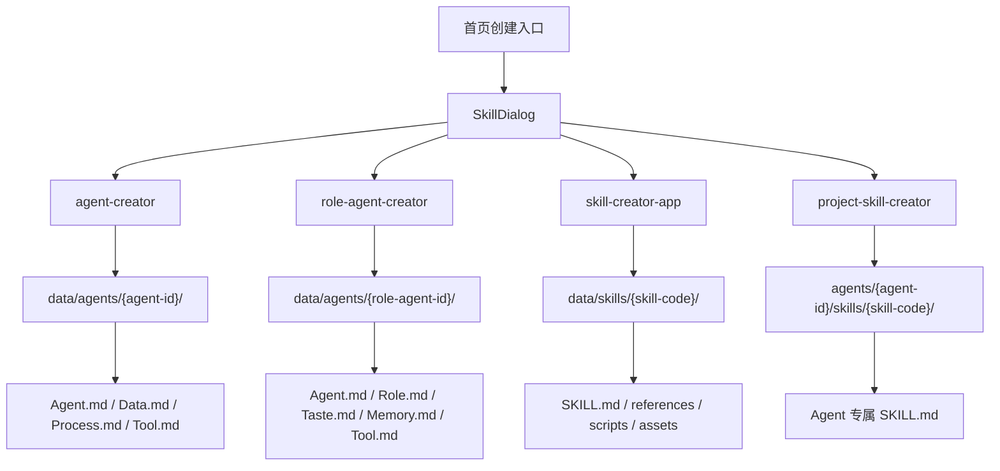
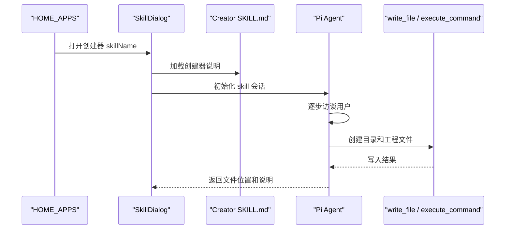

# E6：Agent 与 Skill 创建器系统

## 问题

OriginOS 不只是“运行技能”，它还提供了一组“创建能力”的系统技能：

- `agent-creator`：创建任务型 Agent。
- `role-agent-creator`：创建角色型 Agent。
- `skill-creator-app`：创建通用系统 Skill。
- `project-skill-creator`：在 Agent 工作目录中创建项目级 Skill。

这一节要理解的是：这些创建器本身也是 Skill，它们用同一套 SkillDialog/Agent 执行机制，生成新的 Agent 或 Skill 工程文件。

这是一种元能力：系统用 Skill 来创建更多 Skill 和 Agent。

## 图解



关键区别：系统级创建器写 `data/`，项目级创建器写目标 Agent 工作目录。

## 源码入口

首页入口：

- [HOME_APPS 创建 Agent（第 29 行）](../../../../packages/web/src/config/homeApps.ts#L29)
- [HOME_APPS 创建角色（第 38 行）](../../../../packages/web/src/config/homeApps.ts#L38)
- [HOME_APPS 技能市场（第 47 行）](../../../../packages/web/src/config/homeApps.ts#L47)

创建器技能：

- [agent-creator frontmatter（第 1 行）](../../../../templates/skills/agent-creator/SKILL.md#L1)
- [agent-creator 生成目录说明（第 12 行）](../../../../templates/skills/agent-creator/SKILL.md#L12)
- [agent-creator 生成文件说明（第 50 行）](../../../../templates/skills/agent-creator/SKILL.md#L50)
- [role-agent-creator frontmatter（第 1 行）](../../../../templates/skills/role-agent-creator/SKILL.md#L1)
- [role-agent-creator 交互 YAML 约束（第 52 行）](../../../../templates/skills/role-agent-creator/SKILL.md#L52)
- [role-agent-creator 文件生成说明（第 154 行）](../../../../templates/skills/role-agent-creator/SKILL.md#L154)
- [skill-creator-app 写作流程（第 29 行）](../../../../templates/skills/skill-creator-app/SKILL.md#L29)
- [skill-creator-app anatomy（第 92 行）](../../../../templates/skills/skill-creator-app/SKILL.md#L92)
- [project-skill-creator frontmatter（第 1 行）](../../../../templates/skills/project-skill-creator/SKILL.md#L1)
- [project-skill-creator 创建流程（第 28 行）](../../../../templates/skills/project-skill-creator/SKILL.md#L28)

## 调用链



## 关键类型

这一节没有新的 TypeScript 类型，重点是几种工程文件协议。

任务型 Agent 由 `agent-creator` 生成，核心文件包括：

- `Agent.md`：身份和职责。
- `Data.md`：本体对象和数据边界。
- `Process.md`：处理流程。
- `Memory.md`：记忆。
- `Taste.md`：风格。
- `Tool.md`：工具配置。
- `Patterns.md`：经验模式。

角色型 Agent 由 `role-agent-creator` 生成，核心更偏角色人格和状态：

- `Agent.md`：角色背景。
- `Role.md`：状态机定义。
- `Taste.md`：沟通风格。
- `Memory.md`：记忆。
- `Tool.md`：允许工具。

Skill 由 `skill-creator-app` 或 `project-skill-creator` 生成，典型结构是：

```text
skill-name/
├── SKILL.md
├── references/
├── scripts/
└── assets/
```

`project-skill-creator` 的关键语义是“Agent 专属”：它明确要求在目标 Agent 目录内调用，避免误写到项目根 `skills/` 或全局 `data/skills/`。

## 测试入口

这一组创建器更偏 prompt/workflow，目前更适合通过 SkillDialog 手动验收和目录断言验证。已有自动测试可覆盖基础目录规则：

- [系统技能产物目录测试（第 1 行）](../../../../packages/core/src/lib/integrations/pi-agent/__tests__/skill-output-dir.test.ts#L1)
- [agent outputDir 测试（第 99 行）](../../../../packages/core/src/lib/integrations/pi-agent/__tests__/skill-output-dir.test.ts#L99)
- [skill-creator-app 与 project-skill-creator 区分测试（第 107 行）](../../../../packages/core/src/lib/integrations/pi-agent/__tests__/skills.test.ts#L107)
- [SkillDialog initialize 调用（第 485 行）](../../../../packages/web/src/components/skills/SkillDialog.tsx#L485)

建议运行：

```bash
pnpm --filter @originos/core test -- --run packages/core/src/lib/integrations/pi-agent/__tests__/skill-output-dir.test.ts
pnpm --filter @originos/core test -- --run packages/core/src/lib/integrations/pi-agent/__tests__/skills.test.ts
```

## 逐行精读

[agent-creator 第 12 行](../../../../templates/skills/agent-creator/SKILL.md#L12) 明确产物在 `${OUTPUT_DIR}/agents/{agent-id}/`。这意味着它不是创建临时聊天结果，而是写工程文件。

[agent-creator 第 24 行](../../../../templates/skills/agent-creator/SKILL.md#L24) 要求“一次一个问题”。这和用户学习时的“小步学习”类似：复杂工程文件不能一次性乱问，要按身份、职责、数据、流程、工具、风格逐步收集。

[agent-creator 第 50 行](../../../../templates/skills/agent-creator/SKILL.md#L50) 进入生成文件部分，后面给出多个模板。你读它时要看模板字段如何对应前面的访谈问题。

[role-agent-creator 第 52 行](../../../../templates/skills/role-agent-creator/SKILL.md#L52) 很关键：它要求在回复末尾输出 yaml block，系统用它渲染交互卡片。这说明技能正文不仅指导 Agent 说什么，还会约束 UI 可解析格式。

[role-agent-creator 第 154 行](../../../../templates/skills/role-agent-creator/SKILL.md#L154) 明确必须实际写入磁盘，不是只在对话里展示。

[skill-creator-app 第 80 行](../../../../templates/skills/skill-creator-app/SKILL.md#L80) 进入“写 SKILL.md”。第 84-85 行强调 description 是触发机制的核心，不能写得太含糊。

[skill-creator-app 第 92 行](../../../../templates/skills/skill-creator-app/SKILL.md#L92) 定义 Skill anatomy。第 104-110 行讲 progressive disclosure：metadata 常驻上下文，正文触发时加载，额外资源按需加载。

[project-skill-creator 第 4 行](../../../../templates/skills/project-skill-creator/SKILL.md#L4) 已经把边界写在 description 里：必须在目标 Agent 目录内调用，避免误写项目根或全局技能目录。

## 深度拆解

创建器系统有一个很有意思的递归结构：

系统内置 Skill 运行在 SkillDialog 中，SkillDialog 调 Pi Agent，Pi Agent 按 Skill 指令写出 Agent 或 Skill 文件。这些新文件以后又可能被项目加载，变成新的运行能力。

但这个递归必须靠目录边界控制，否则系统会混乱：

- `agent-creator`、`role-agent-creator` 面向全局 data agents。
- `skill-creator-app` 面向全局 data skills。
- `project-skill-creator` 面向某个 Agent 的本地 skills。

你以后排查创建器问题，最重要不是先看 prompt 漂不漂亮，而是看它到底要写到哪个目录。

## 常见故障

创建器只输出 Markdown 没写文件：检查技能正文是否要求 `write_file`，也要看 Agent 工具是否允许文件写入。

写到了模板目录：说明 `OUTPUT_DIR` 或 prompt 目录约束没有正确注入，回到 SkillDialog 和 service 查。

角色创建器选项卡不显示：检查回复末尾 yaml block 是否格式正确，不能只用自然语言列选项。

项目级 Skill 写到了全局 data：说明误用了 `skill-creator-app`，应该使用 `project-skill-creator`，并且在目标 Agent 工作目录内调用。

新增 Agent 文件不完整：对照创建器模板，看是否漏了 `Tool.md`、`Memory.md`、`Taste.md` 等约定文件。

## 改动场景判断

如果要调整“创建 Agent 的问题顺序”，改 `agent-creator/SKILL.md`。

如果要调整“角色模板库”，改 `role-agent-creator/SKILL.md`。

如果要改 Skill 创作方法论，改 `skill-creator-app/SKILL.md`。

如果要让 solution-design 生成 Agent 专属技能，应优先使用 `project-skill-creator` 的目录协议。

如果要增加首页入口，改 `HOME_APPS`；如果只是让 loader 能发现技能，不一定需要首页入口。

## 源码追问清单

- 这个创建器生成的是 Agent 还是 Skill？
- 生成目标是全局 data 还是项目/Agent 目录？
- 是否要求实际写文件？
- 是否存在 UI 可解析 YAML block？
- 生成文件列表是否和 Agent 运行时加载器一致？
- description 是否足够触发？
- 是否需要 scripts、references、assets？

## 练习

1. 对照 [agent-creator 第 24 行](../../../../templates/skills/agent-creator/SKILL.md#L24)，写出它的 6 个访谈维度。
2. 对照 [role-agent-creator 第 52 行](../../../../templates/skills/role-agent-creator/SKILL.md#L52)，解释为什么 yaml block 必须放在消息末尾。
3. 对照 [project-skill-creator 第 4 行](../../../../templates/skills/project-skill-creator/SKILL.md#L4)，说明它和 `skill-creator-app` 的根本区别。

## 验收

你完成本节后，应该能：

- 区分任务型 Agent、角色型 Agent、系统 Skill、项目级 Skill。
- 说明四个创建器各自写入哪个目录。
- 看懂创建器技能如何约束对话、文件生成和 UI 交互。
- 判断一个“创建失败”问题应该从 prompt、工具权限还是目录边界排查。
