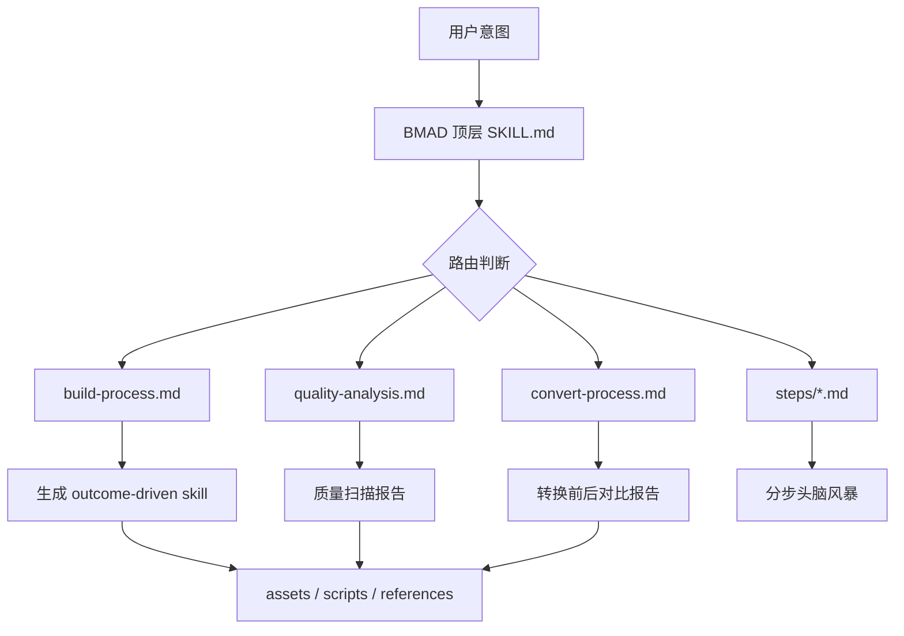
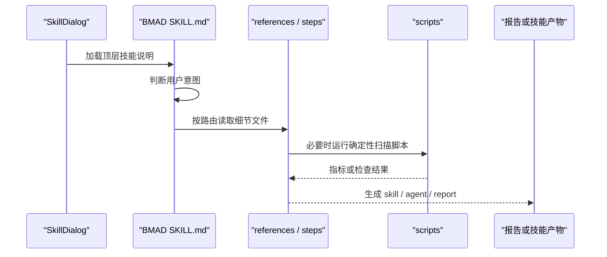

# E7：BMAD 技能族与渐进披露

## 问题

BMAD 技能族和前面的创建器技能很不一样。它们通常不是把所有流程塞进一个 `SKILL.md`，而是采用“顶层路由 + references/steps/scripts”的结构。

这一节要回答：

- 为什么 BMAD 的 `SKILL.md` 有的很短。
- 它如何通过 references 或 steps 延迟加载细节。
- `bmad-workflow-builder` 和 `bmad-agent-builder` 的共同设计是什么。
- `bmad-advanced-elicitation` 为什么更像一个可嵌套的审稿/深化循环。
- 如何判断一个复杂 Skill 是否写得太重、太死、太像 SOP。

BMAD 的核心理念可以概括成一句话：

> 技能应该描述目标、边界和判断标准，把低价值机械步骤从主 prompt 中拆出去。

## 图解

## 源码入口

BMAD 顶层技能：

- [bmad-brainstorming 入口（第 1 行）](../../../../templates/skills/bmad-brainstorming/SKILL.md#L1)
- [bmad-brainstorming 委托 workflow（第 7 行）](../../../../templates/skills/bmad-brainstorming/SKILL.md#L7)
- [bmad-workflow-builder 入口（第 1 行）](../../../../templates/skills/bmad-workflow-builder/SKILL.md#L1)
- [bmad-workflow-builder 核心理念（第 27 行）](../../../../templates/skills/bmad-workflow-builder/SKILL.md#L27)
- [bmad-workflow-builder intent routing（第 70 行）](../../../../templates/skills/bmad-workflow-builder/SKILL.md#L70)
- [bmad-agent-builder 入口（第 1 行）](../../../../templates/skills/bmad-agent-builder/SKILL.md#L1)
- [bmad-agent-builder agent 类型（第 36 行）](../../../../templates/skills/bmad-agent-builder/SKILL.md#L36)
- [bmad-agent-builder quick reference（第 54 行）](../../../../templates/skills/bmad-agent-builder/SKILL.md#L54)
- [bmad-advanced-elicitation 入口（第 1 行）](../../../../templates/skills/bmad-advanced-elicitation/SKILL.md#L1)
- [bmad-advanced-elicitation flow（第 35 行）](../../../../templates/skills/bmad-advanced-elicitation/SKILL.md#L35)

辅助资源示例：

- [bmad-brainstorming workflow](../../../../templates/skills/bmad-brainstorming/workflow.md#L1)
- [bmad-workflow-builder build-process](../../../../templates/skills/bmad-workflow-builder/references/build-process.md#L1)
- [bmad-workflow-builder quality-analysis](../../../../templates/skills/bmad-workflow-builder/references/quality-analysis.md#L1)
- [bmad-agent-builder build-process](../../../../templates/skills/bmad-agent-builder/references/build-process.md#L1)
- [bmad-agent-builder skill best practices](../../../../templates/skills/bmad-agent-builder/references/skill-best-practices.md#L1)

## 调用链

## 关键类型

这里没有 TypeScript 类型，关键是文档结构类型。

`bmad-brainstorming` 是 steps 型：

- 顶层 `SKILL.md` 只说跟随 `workflow.md`。
- `workflow.md` 再调度 `steps/step-*.md`。
- `brain-methods.csv` 存放方法库。
- `template.md` 提供输出模板。

`bmad-workflow-builder` 是 references + scripts 型：

- `references/build-process.md` 负责构建。
- `references/quality-analysis.md` 负责质量分析。
- `references/convert-process.md` 负责转换。
- `scripts/` 负责可确定的统计、扫描、报告生成。

`bmad-agent-builder` 是 Agent 生成型：

- `assets/*-template.md` 是产物模板。
- `references/*` 是设计指导。
- `scripts/*` 是质量检查和报告工具。

`bmad-advanced-elicitation` 是嵌套增强型：

- 它可以被其他流程间接调用。
- 它读取方法注册表。
- 它要求每次方法执行后回到选择菜单。

## 测试入口

BMAD 技能主要是 prompt/resource workflow，当前仓库里没有为每个 BMAD 技能提供独立自动化测试。可用的验证入口是：

- loader 是否能加载：[Skill framework 测试（第 27 行）](../../../../packages/core/src/lib/integrations/pi-agent/__tests__/skills.test.ts#L27)
- 系统技能目录规则：[skill-output-dir 测试（第 30 行）](../../../../packages/core/src/lib/integrations/pi-agent/__tests__/skill-output-dir.test.ts#L30)
- UI 执行容器：[SkillDialog 初始化（第 412 行）](../../../../packages/web/src/components/skills/SkillDialog.tsx#L412)

如果要补 BMAD 专项测试，应该覆盖：

- 顶层 `SKILL.md` 是否存在 description。
- 引用的 `references/`、`steps/`、`scripts/` 文件是否存在。
- `--headless`、`--convert` 等路由是否能进入预期 reference。
- scripts 是否能在无 UI 环境下运行。

## 逐行精读

[bmad-brainstorming 第 7 行](../../../../templates/skills/bmad-brainstorming/SKILL.md#L7) 只有一句“Follow the instructions in ./workflow.md”。这不是偷懒，而是一种加载策略：顶层技能只负责触发和转交，不把完整工作流塞进常驻 prompt。

[bmad-workflow-builder 第 27 行](../../../../templates/skills/bmad-workflow-builder/SKILL.md#L27) 明确 outcome-driven。它反对把技能写成过度微管理的程序清单，因为 LLM 本来就能处理常识性步骤，技能应该保留真正有领域价值的判断。

[bmad-workflow-builder 第 31 行](../../../../templates/skills/bmad-workflow-builder/SKILL.md#L31) 定义参数入口：`--headless`、`--convert`、路径、关键词等。这让一个技能同时支持交互式创建、非交互执行、转换和质量分析。

[bmad-workflow-builder 第 70 行](../../../../templates/skills/bmad-workflow-builder/SKILL.md#L70) 是路由表。读复杂技能时，路由表比正文更重要，因为它告诉你用户一句话会进入哪条路径。

[bmad-agent-builder 第 36 行](../../../../templates/skills/bmad-agent-builder/SKILL.md#L36) 把 Agent 分成 stateless、memory、autonomous 三类。这是产品判断，不只是文件结构判断。

[bmad-advanced-elicitation 第 37 行](../../../../templates/skills/bmad-advanced-elicitation/SKILL.md#L37) 第一阶段是加载方法注册表。第 62 行开始展示选项，第 83 行开始处理用户选择。这是一个典型的“循环型技能”。

## 深度拆解

BMAD 技能的价值在于把 Skill 从“写长 prompt”提升到“设计可维护的认知流程”。

一个差的复杂 Skill 往往有三个问题：

- 把所有细节塞进一个文件，导致上下文臃肿。
- 把 LLM 已经会做的步骤写成机械命令，浪费注意力。
- 缺少质量检查，生成结果不可比较。

BMAD 的解决方案是：

- 顶层只放触发、目标、路由。
- 复杂流程拆到 references。
- 重复扫描交给 scripts。
- 模板放 assets。
- 质量分析有独立路径。

这也是你以后设计 OriginOS Skill 时应该借鉴的结构。

## 常见故障

打开 BMAD 技能后不知道下一步：看顶层路由表，不要只读第一屏。

引用文件找不到：检查相对路径是 `./references/...`、`references/...` 还是 `./steps/...`，路径必须相对技能 `baseDir`。

技能太长：考虑拆 references，而不是继续堆到 `SKILL.md`。

输出不稳定：把可确定的检查提取成 scripts，例如路径扫描、结构检查、指标统计。

用户想直接跑但技能一直追问：看是否支持 `--headless`，以及技能是否正确检测非交互意图。

## 改动场景判断

如果要调整 BMAD 的触发方式，改顶层 frontmatter description。

如果要调整构建流程，改 `references/build-process.md`。

如果要调整质量扫描标准，改 `references/quality-analysis.md` 和相关 scan scripts。

如果要新增输出模板，放到 `assets/`。

如果要新增一种用户意图，先改顶层路由表，再补对应 reference。

## 源码追问清单

- 顶层 `SKILL.md` 是执行全部流程，还是只做路由？
- 被引用的文件是否真实存在？
- 这个技能是否支持 headless？
- 哪些步骤应该交给 LLM，哪些应该交给脚本？
- 输出产物应该写到哪里？
- 质量检查有没有明确标准？
- 这个技能是生成 Skill，生成 Agent，还是增强已有内容？

## 练习

1. 打开 [bmad-workflow-builder 路由表（第 70 行）](../../../../templates/skills/bmad-workflow-builder/SKILL.md#L70)，说明 `--convert` 会进入哪条路径。
2. 打开 [bmad-agent-builder 第 36 行](../../../../templates/skills/bmad-agent-builder/SKILL.md#L36)，解释三种 Agent 类型的差异。
3. 查看 `templates/skills/bmad-agent-builder/scripts/`，判断哪些工作适合脚本完成，哪些仍应由 LLM 判断。

## 验收

你完成本节后，应该能：

- 读懂 BMAD 技能为什么顶层文件可以很短。
- 说明 progressive disclosure 在 Skill 设计里的意义。
- 判断一个复杂 Skill 应该拆到 references、assets 还是 scripts。
- 用 BMAD 的标准反向审查一个 OriginOS Skill 是否过度微管理。
