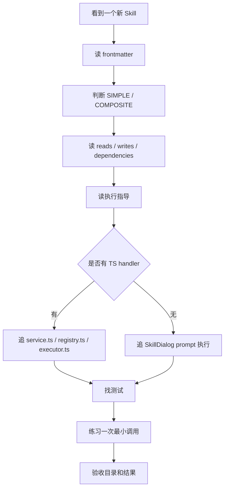
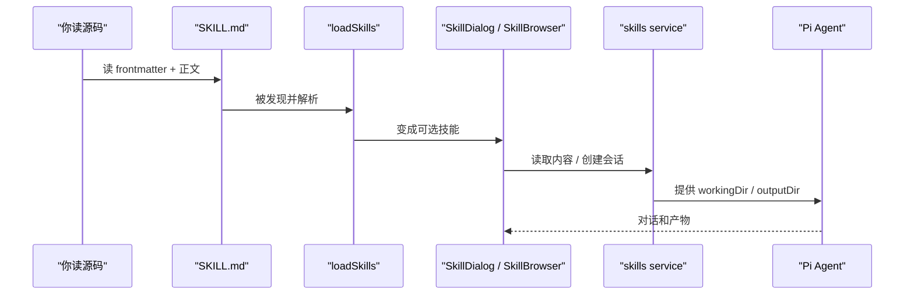

# E8：其他实用技能与阅读方法收束

## 问题

E 部分最后一节不再只看某一个技能，而是把仓库里的实用技能和技能 UI 辅助组件串起来。

你要掌握的是一种方法：以后看到任何新 Skill，都能按统一路线读懂它。

统一路线是：

1. 看 frontmatter：它叫什么，什么时候触发，读写什么。
2. 看正文任务：它解决什么问题。
3. 看执行指导：它如何识别用户意图、提取参数、输出结果。
4. 看依赖和产物：它读哪里、写哪里、依赖哪些工具。
5. 看 UI/API：它是被 SkillDialog 运行，还是有 service handler。
6. 看测试缺口：是否只有文档，没有自动验证。

## 图解



## 源码入口

内置业务技能：

- [info-query frontmatter（第 1 行）](../../../../packages/core/src/lib/features/skills/bundled/info-query/SKILL.md#L1)
- [info-query 执行指导（第 44 行）](../../../../packages/core/src/lib/features/skills/bundled/info-query/SKILL.md#L44)
- [ontology-editor frontmatter（第 1 行）](../../../../packages/core/src/lib/features/skills/bundled/ontology-editor/SKILL.md#L1)
- [ontology-editor 执行指导（第 43 行）](../../../../packages/core/src/lib/features/skills/bundled/ontology-editor/SKILL.md#L43)
- [task-manager frontmatter（第 1 行）](../../../../packages/core/src/lib/features/skills/bundled/task-manager/SKILL.md#L1)
- [task-manager 状态定义（第 45 行）](../../../../packages/core/src/lib/features/skills/bundled/task-manager/SKILL.md#L45)
- [task-manager 依赖 ontology-editor（第 18 行）](../../../../packages/core/src/lib/features/skills/bundled/task-manager/SKILL.md#L18)

业务建模技能：

- [domain-discovery 入口（第 1 行）](../../../../templates/skills/domain-discovery/SKILL.md#L1)
- [domain-discovery 核心原则（第 17 行）](../../../../templates/skills/domain-discovery/SKILL.md#L17)
- [domain-discovery 写入步骤（第 81 行）](../../../../templates/skills/domain-discovery/SKILL.md#L81)
- [business-refinement 入口（第 1 行）](../../../../templates/skills/business-refinement/SKILL.md#L1)
- [business-refinement 探索维度（第 47 行）](../../../../templates/skills/business-refinement/SKILL.md#L47)
- [solution-design 入口（第 1 行）](../../../../templates/skills/solution-design/SKILL.md#L1)
- [solution-design 环境设置（第 23 行）](../../../../templates/skills/solution-design/SKILL.md#L23)
- [solution-design fast-track（第 81 行）](../../../../templates/skills/solution-design/SKILL.md#L81)

工具型技能：

- [search-and-install-skill 入口（第 1 行）](../../../../templates/skills/search-and-install-skill/SKILL.md#L1)
- [search-and-install-skill API 说明（第 38 行）](../../../../templates/skills/search-and-install-skill/SKILL.md#L38)
- [seal-stamper 技术原理（第 39 行）](../../../../templates/skills/seal-stamper/SKILL.md#L39)
- [wrong-answer-review 执行步骤（第 37 行）](../../../../templates/skills/wrong-answer-review/SKILL.md#L37)

UI 辅助：

- [SkillBrowser 组件入口（第 26 行）](../../../../packages/web/src/components/skills/SkillBrowser.tsx#L26)
- [SkillBrowser 加载技能（第 42 行）](../../../../packages/web/src/components/skills/SkillBrowser.tsx#L42)
- [SkillExecution 类型（第 16 行）](../../../../packages/web/src/components/skills/SkillExecution.tsx#L16)
- [SkillExecution 组件入口（第 37 行）](../../../../packages/web/src/components/skills/SkillExecution.tsx#L37)
- [skill export policy（第 1 行）](../../../../packages/web/src/components/skills/skill-export-policy.ts#L1)
- [skill export policy 测试（第 1 行）](../../../../packages/web/src/components/skills/__tests__/skill-export-policy.test.ts#L1)

## 调用链



## 关键类型

`SIMPLE` 技能通常表示流程较轻，主要通过 prompt 指导完成，比如信息查询或工具型任务。

`COMPOSITE` 技能通常表示多阶段、多依赖或需要组合工具，比如 ontology-editor、task-manager、role-agent-creator。

`reads` 表示技能需要读取的领域资源。它不是强类型权限系统，但对理解技能边界很有帮助。

`writes` 表示技能会改变什么。看到 `writes: ontology`、`writes: task`、`writes: Word文档` 时，要马上提高注意力，因为它不是只读回答。

`dependencies` 表示技能依赖别的技能或工具。比如 task-manager 依赖 ontology-editor，说明任务不是孤立存储，而和本体编辑有关。

`SkillExecution` 是 UI 进度展示结构，包含 `executionId`、`skillName`、`status`、`steps`、`result`、`error`。

## 测试入口

真实存在的测试入口：

- [core skill loader 测试（第 27 行）](../../../../packages/core/src/lib/integrations/pi-agent/__tests__/skills.test.ts#L27)
- [core skill service 测试（第 8 行）](../../../../packages/core/src/lib/features/skills/__tests__/service.test.ts#L8)
- [skill output dir 测试（第 29 行）](../../../../packages/core/src/lib/integrations/pi-agent/__tests__/skill-output-dir.test.ts#L29)
- [skill export policy 测试（第 1 行）](../../../../packages/web/src/components/skills/__tests__/skill-export-policy.test.ts#L1)

建议运行：

```bash
pnpm --filter @originos/core test -- --run packages/core/src/lib/integrations/pi-agent/__tests__/skills.test.ts
pnpm --filter @originos/core test -- --run packages/core/src/lib/features/skills/__tests__/service.test.ts
```

测试缺口也要诚实记录：很多具体 `templates/skills/*/SKILL.md` 当前更像文档协议，没有逐个自动化测试验证它们的对话质量、文件写入结果和外部依赖可用性。

## 逐行精读

[info-query 第 11-15 行](../../../../packages/core/src/lib/features/skills/bundled/info-query/SKILL.md#L11) 告诉你它只读 ontology、project、task，不写数据。这是查询型技能的边界。

[info-query 第 44 行](../../../../packages/core/src/lib/features/skills/bundled/info-query/SKILL.md#L44) 开始的执行指导把自然语言查询拆成意图识别、参数提取和流式响应。它依赖关键词规则，但不等同于真正的查询引擎实现。

[ontology-editor 第 11-15 行](../../../../packages/core/src/lib/features/skills/bundled/ontology-editor/SKILL.md#L11) 显示它会读写 ontology，因此它是有副作用的技能。读这种技能时要特别关注“删除、更新、验证”的保护策略是否足够。

[task-manager 第 18-19 行](../../../../packages/core/src/lib/features/skills/bundled/task-manager/SKILL.md#L18) 声明依赖 `ontology-editor`。这说明 task-manager 的任务并不是纯文本任务列表，而应该和本体对象发生关系。

[domain-discovery 第 17 行](../../../../templates/skills/domain-discovery/SKILL.md#L17) 是业务建模技能的核心原则：问“你平时怎么做”，不是问“你想要什么功能”。这是 OriginOS 做本体建模的产品哲学。

[domain-discovery 第 81 行](../../../../templates/skills/domain-discovery/SKILL.md#L81) 开始规定输出格式，要求确认新业务事实时立即写 `business-model.json`、`interview-progress.md` 和 `MEMORY.md`。这说明它不只是聊天收集，而是边访谈边沉淀。

[solution-design 第 23 行](../../../../templates/skills/solution-design/SKILL.md#L23) 要先加载 `_bmad` 配置和模板引用。第 81 行开始的 fast-track detection 说明它支持从用户一句“直接开始”跳过普通阶段。

[SkillBrowser 第 42 行](../../../../packages/web/src/components/skills/SkillBrowser.tsx#L42) 加载技能列表。第 64 行用 `useState(() => { loadSkills(); })` 做初始加载，这里从 React 习惯看更像应该用 `useEffect`；作为源码学习要能看出这种潜在风险。

[SkillExecution 第 16 行](../../../../packages/web/src/components/skills/SkillExecution.tsx#L16) 定义执行展示结构。第 102 行根据非 pending step 计算进度，这适合展示流程，但并不等同于真实后端任务进度。

[skill-export-policy 第 1 行](../../../../packages/web/src/components/skills/skill-export-policy.ts#L1) 很小：只有 `systemManaged === false` 才允许导出。这是一个典型的 UI 策略函数，适合用小测试锁定。

## 深度拆解

这些技能可以分成四类。

第一类是查询/编辑型：`info-query`、`ontology-editor`、`task-manager`。它们围绕项目、本体、任务这些业务对象工作。

第二类是业务建模型：`domain-discovery`、`business-refinement`、`solution-design`。它们把用户的隐性工作经验转成业务模型、解决方案和 Agent/Skill 清单。

第三类是工具型：`search-and-install-skill`、`seal-stamper`、`wrong-answer-review`。它们面向具体任务，可能依赖外部 API、Python 脚本、文件上传或视觉能力。

第四类是 UI 辅助型：`SkillBrowser`、`SkillExecution`、导出策略。它们不定义技能能力，但让技能能被浏览、展示和约束。

真正吃透技能系统，不能只背有哪些技能，而要能回答每个技能：

- 它解决什么用户问题？
- 它读取什么上下文？
- 它写什么产物？
- 它靠 prompt，还是靠 TS handler？
- 它的 UI 容器是什么？
- 它有哪些测试缺口？

## 常见故障

查询型技能回答像编的：可能只有 prompt 指导，没有接入真实查询工具或数据源。

编辑型技能缺少确认：凡是 `writes` 非空，尤其删除和更新，都应该有确认或可回滚设计。

工具型技能依赖不可用：例如 `seal-stamper` 依赖 `python-docx`、Pillow、lxml、rembg，环境缺失会失败。

技能市场硬编码外部 API：`search-and-install-skill` 里出现具体接口和 token 样式内容，真实产品化时要重新审视安全和配置管理。

SkillBrowser 重复加载风险：初始加载用 `useState` 执行副作用不是理想 React 写法，后续维护应考虑改成 `useEffect`。

SkillExecution 进度不准：它按 step 状态算比例，如果后端没有真实 step 数据，就只是展示层估算。

## 改动场景判断

如果要改“技能怎么回答”，改对应 `SKILL.md`。

如果要改“技能怎么被发现”，改 loader。

如果要改“技能怎么被打开和会话化”，改 SkillDialog 或 skills service。

如果要改“技能列表怎么展示和筛选”，改 SkillBrowser。

如果要改“技能执行进度怎么显示”，改 SkillExecution，但要确认后端是否真的提供 step 数据。

如果要改“系统技能是否允许导出”，改 `skill-export-policy.ts` 并更新测试。

## 源码追问清单

- 这是只读技能还是写入技能？
- 它是否声明了 `dependencies`？
- 它的执行指导是否只是自然语言，还是有确定性脚本？
- 它有没有外部 API 或环境依赖？
- 它在首页是否有入口？
- 它是否会出现在 SkillBrowser？
- 它是否允许导出？
- 它有没有测试？测试覆盖 loader、service、UI 策略，还是覆盖真实业务结果？

## 练习

1. 选择 [task-manager（第 1 行）](../../../../packages/core/src/lib/features/skills/bundled/task-manager/SKILL.md#L1)，用本节的 6 步路线读一遍，写出它的读写边界。
2. 选择 [domain-discovery（第 1 行）](../../../../templates/skills/domain-discovery/SKILL.md#L1)，说明它为什么不是需求收集工具，而是业务经验显性化工具。
3. 选择 [SkillBrowser（第 42 行）](../../../../packages/web/src/components/skills/SkillBrowser.tsx#L42)，判断它从哪里加载技能，以及当前实现有什么 React 风险。

## 验收

你完成本节后，应该能：

- 用统一方法阅读任意 `SKILL.md`。
- 区分查询型、编辑型、建模型、工具型、UI 辅助型技能。
- 看出一个技能的读写副作用和环境依赖。
- 诚实判断哪些能力有自动化测试，哪些只是文档协议。
- 从 E1 到 E8 串起完整技能系统：定义、加载、服务、UI、执行、创建、BMAD、实用技能。
