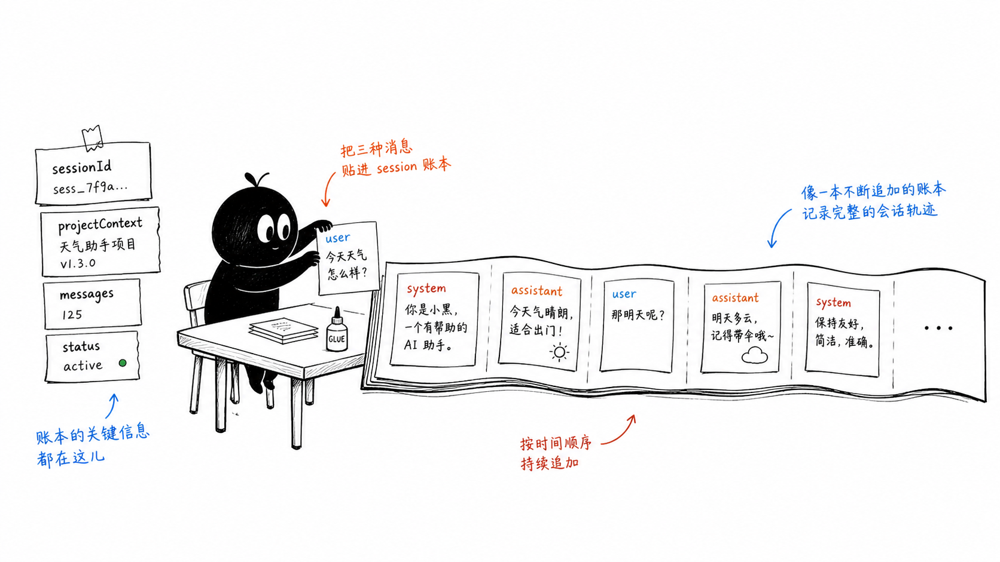
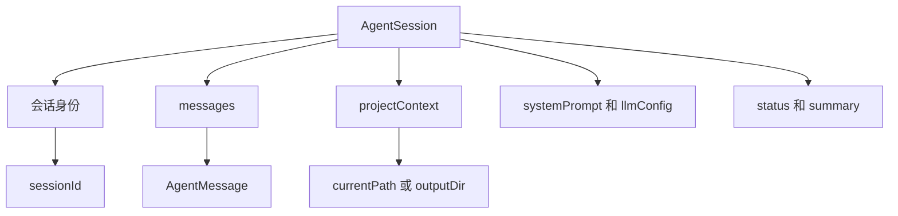
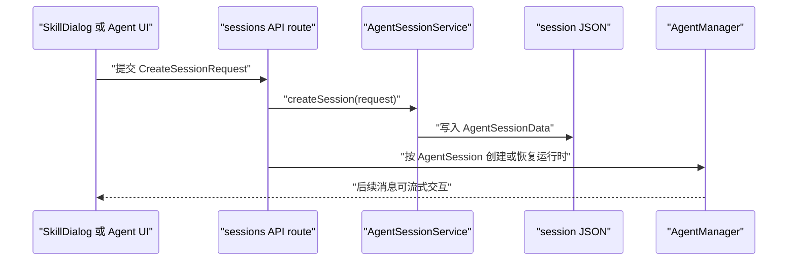

# F1. Agent 类型与会话数据模型

> 类型：源码课
> 状态：正式课件
> 本节目标：把“一个 Agent 聊天窗口”还原为可持久化、可恢复、可路由的 `AgentSession` 数据对象。

## 问题

用户在窗口里发出一句话，系统究竟要保存什么？答案不只是消息文本。它还要保存这是谁的会话、从哪个项目或技能入口来、允许在哪个目录工作、运行时应使用什么 LLM 配置，以及当前会话是否仍可继续。

`AgentSession` 是这份长期契约；浏览器 UI、API route、文件存储和 `OriginOSAgent` 都围绕它协作。理解它后，后续 F2 到 F10 才不会变成零散的文件阅读。

小黑在图里不是“保存按钮”的装饰：它把消息、上下文与配置放入同一个档案盒。少一件，恢复后的 Agent 就可能说得出历史，却不知道自己在哪里工作。

## 图解

这不是数据库表关系，而是一份会话 JSON 的心智模型。`messages` 是事实记录，`projectContext` 是工作场景，`systemPrompt` 和 `llmConfig` 是启动运行时所需条件。不要把它们混成一段 prompt 文本。

## 源码入口

- [Agent 类型、消息与会话定义（第 7 行）](../../../../packages/core/src/types/agent.ts#L7)
- [AgentTypeInfo 与展示元数据（第 29 行）](../../../../packages/core/src/types/agent.ts#L29)
- [AgentMessage（第 163 行）](../../../../packages/core/src/types/agent.ts#L163)
- [SessionProjectContext（第 181 行）](../../../../packages/core/src/types/agent.ts#L181)
- [AgentSession（第 207 行）](../../../../packages/core/src/types/agent.ts#L207)
- [创建请求 CreateSessionRequest（第 245 行）](../../../../packages/core/src/types/agent.ts#L245)

先只读这一个类型文件。它刻意位于 `packages/core/src/types`：这是最底层的公共契约，不能反向依赖 Web 页面或 Electron。

## 调用链

这里有一个容易混淆的边界：`AgentSession` 是可持久化状态，不等于内存中的 `OriginOSAgent` 实例。服务器重启后实例会消失，session 文件仍在；恢复时用 session 的 `systemPrompt`、`messages`、`projectContext` 重建实例。

## 关键类型

### `AgentType` 与 `AgentTypeInfo`

`AgentType` 枚举在 [agent.ts（第 7 行）](../../../../packages/core/src/types/agent.ts#L7) 列出 `architect`、`developer`、`qa-engineer`、`ux-designer`、`pm`、`project-initializer` 等身份。`AgentTypeInfo` 则提供名称、图标、颜色、能力等展示/配置元数据。

要分清：枚举回答“它属于哪一种”，信息表回答“这类对象如何被展示和描述”。不要用显示名充当业务 ID；显示文案可改，枚举值才适合逻辑判断。

### `AgentMessage`

`AgentMessage.role` 不只允许 `user` 和 `assistant`，还包含 `system`、`tool`、`toolResult`。这说明消息历史既是聊天记录，也是 Agent 执行轨迹。`thinking` 和 `metadata` 为扩展保留空间；`toolResults` 把一次工具执行的结果附在相应消息上。

阅读时问自己：为什么工具结果不是普通 assistant 文本？因为模型下一轮需要区分“模型说的话”和“外部工具返回的事实”。角色丢失，工具循环就会失真。

### `SessionProjectContext`

它描述会话的归属和工作环境：`projectId` / `projectName`，入口类型 `entryType`，入口 ID `entryId`，以及 `currentPath`、`outputDir`、`phase` 等。它不是项目完整实体，只是让本次会话知道“我从哪里来、能在哪里工作”。

`currentPath` 与 `outputDir` 不必相同：前者是工作目录语义，后者是产物目录语义。F7 会专门解释为什么混用这两个字段会把文件写到错误位置。

### `AgentSession` 与 `AgentSessionData`

`AgentSession` 是业务对象：有 `status`、`messages`、`projectContext`、`summary` 和 LLM 参数。`AgentSessionData` 则是文件封套，提供 `version`、`createdAt`、`updatedAt`、`data`。这符合 [AGENTS.md 的 JSON 数据格式规约（第 421 行）](../../../../AGENTS.md#L421)：文件格式版本与真实业务数据分离，便于迁移和审计。

## 逐行精读

### 创建请求为什么允许可选字段

在 [CreateSessionRequest（第 245 行）](../../../../packages/core/src/types/agent.ts#L245) 中，调用方可传 `sessionId`、`projectContext`、`llmConfig`，但不应传 `messages` 或 `status` 作为可信初始事实。服务层负责初始化状态和时间戳，避免前端伪造“已完成”会话或篡改历史。

## 深度拆解

从类型演化看，`projectContext` 是扩展风险最高的字段。它既服务 UI 的项目标识，也服务工具 CWD、Role/Project Agent 启动和后续归档。新增可选字段时要先问：它是“可由旧会话缺省”的展示信息，还是“缺失就不能安全恢复”的执行条件？后者不应只做可选字段，而应有迁移/默认策略和恢复失败路径。

## 测试入口

本类型文件没有独立的纯类型测试；它的行为由下游会话存储与 API 测试间接验证：

- [Pi Agent SessionStore 测试（第 61 行）](../../../../packages/core/src/lib/integrations/pi-agent/__tests__/session-store.test.ts#L61)
- [会话消息 API route（第 51 行）](../../../../packages/web/src/app/api/agent/sessions/[sessionId]/messages/route.ts#L51)

这是一个测试缺口提示：类型本身靠 TypeScript 编译约束，关键风险应放在“创建、保存、恢复后字段未丢失”的行为测试中。

## 常见故障

| 现象 | 首先确认 | 深层原因 |
| --- | --- | --- |
| 恢复后 Agent 没有工作目录 | `projectContext.currentPath` | 把运行时配置当成纯 UI 数据 |
| 历史消息看似正常却工具失败 | `role` 与 `toolResults` | 丢失了工具消息角色语义 |
| 会话状态莫名 completed | 创建接口允许客户端传状态 | 业务初态没有在服务端收口 |

## 改动场景判断

若只是给列表增加头像/标题，优先扩展 `AgentTypeInfo` 或显示层；若要让 Agent 获得新的运行能力，先判断它是否属于 `AgentSessionConfig`、`llmConfig` 或 `projectContext`。不要把任何新字段都塞进 `metadata`，那会绕开类型约束、迁移和测试。

## 源码追问清单

1. 这个字段要跨重启保留吗？若要，是否在 `AgentSession` 而非仅内存实例中？
2. 谁能写它，客户端还是服务端？
3. 旧 session 缺它时如何恢复？
4. 它会影响工具目录或权限吗？

## 练习

1. 在 [agent.ts（第 163 行）](../../../../packages/core/src/types/agent.ts#L163) 找出所有合法 `role`，写出每个角色出现的时机。
2. 假设新增 `entryType: 'schedule'`。列出至少三处随后必须审查的位置：类型、入口路由/启动器、工具或工作目录策略。
3. 用自己的话区分 `AgentObject`、`AgentSession`、`OriginOSAgent`：它们分别是目录中的“名片”、磁盘上的“档案”、内存中的“执行者”。

## 验收

完成本节后，你应该能：

- 画出 `AgentSession` 的五类字段：身份、历史、上下文、运行配置、状态；
- 解释为什么 session 文件存在不代表内存 Agent 还存在；
- 解释 `currentPath` 与 `outputDir` 的语义差异；
- 从 `CreateSessionRequest` 追到后续 F2 的创建与落盘逻辑；
- 不把 `AgentType` 的稳定 ID 和可变展示信息混用。
