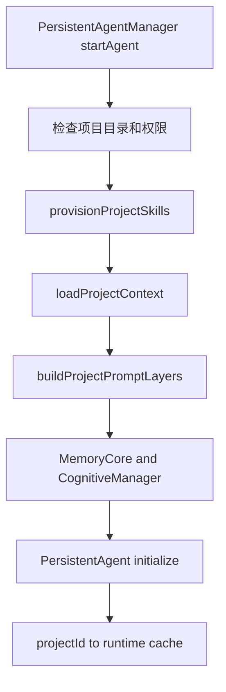
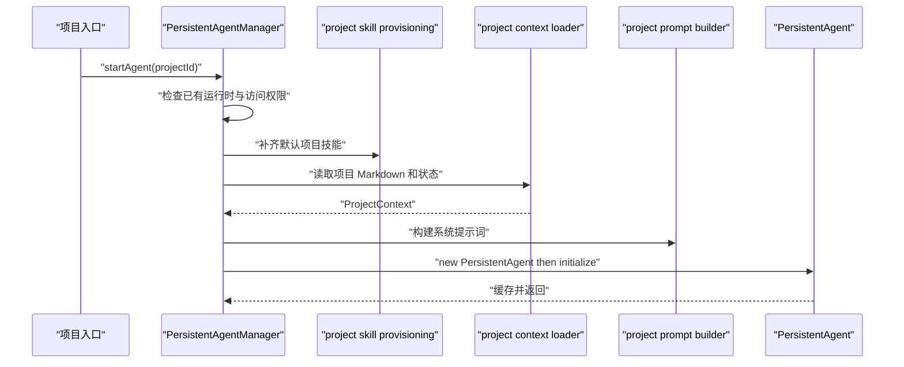

# F10. ProjectAgent：项目文件、阶段技能与持久运行时

> 类型：源码课
> 状态：正式课件
> 本节目标：从 `startAgent()` 追到项目上下文、技能供给、分层 prompt、Memory Core 与 PersistentAgent，理解项目 Agent 与 RoleAgent 的共性和不同。

## 问题

ProjectAgent 面向项目访谈和业务模型演进。它既要有 Agent 身份和记忆，又要读项目状态、按阶段启用 workflow skills，并让知识/模式快照在一次运行中保持稳定。普通“创建 Agent 再塞 prompt”的模式不足以保证这些项目级规则。

这张图强调两个输入：项目文件告诉 Agent 当前事实，阶段技能告诉 Agent 下一步怎么做。二者缺一不可，也不应该由 UI 临时拼装。

## 图解

## 源码入口

- [ProjectContext 与加载器（第 16 行）](../../../../packages/core/src/lib/integrations/pi-agent/project-agent/project-context.ts#L16)
- [loadProjectContext（第 93 行）](../../../../packages/core/src/lib/integrations/pi-agent/project-agent/project-context.ts#L93)
- [Project prompt layers（第 34 行）](../../../../packages/core/src/lib/integrations/pi-agent/project-agent/project-prompt.ts#L34)
- [buildProjectPromptLayers（第 54 行）](../../../../packages/core/src/lib/integrations/pi-agent/project-agent/project-prompt.ts#L54)
- [按阶段读取技能（第 156 行）](../../../../packages/core/src/lib/integrations/pi-agent/project-agent/project-prompt.ts#L156)
- [项目默认技能与复制策略（第 7 行）](../../../../packages/core/src/lib/integrations/pi-agent/project-agent/project-skill-provisioning.ts#L7)
- [PersistentAgentManager（第 41 行）](../../../../packages/core/src/lib/integrations/pi-agent/persistent-agent-manager.ts#L41)
- [startAgent（第 54 行）](../../../../packages/core/src/lib/integrations/pi-agent/persistent-agent-manager.ts#L54)

## 调用链

与 F5 的 session 级 `AgentManager` 对照：这里的管理对象是项目持久 Agent，入口是 `startAgent()`；它负责项目目录权限、技能供给和项目级认知初始化。二者都管理内存 runtime，但拥有不同的生命周期和上下文来源。

## 关键类型

### `ProjectContext`：项目目录的结构化快照

[ProjectContext（第 16 行）](../../../../packages/core/src/lib/integrations/pi-agent/project-agent/project-context.ts#L16) 包含 `Agent.md`、`Tool.md`、`Taste.md`、`Memory.md`、`Knowledge.md`、`Patterns.md`、工具允许集合、安装技能、工作目录和项目 ID。它在结构上接近 RoleContext，但不包含 RoleAgent 的 `Role.md` 状态机。

项目 Agent 还会读取 `project-collaboration-context.json`。这说明项目上下文不只是 Markdown 人类文档，也包含与协作/本体关联的机器数据。

### 提示词层数与源码/规约不一致要如实面对

AGENTS 描述 ProjectAgent 的七层 prompt；但 [ProjectPromptLayers（第 34 行）](../../../../packages/core/src/lib/integrations/pi-agent/project-agent/project-prompt.ts#L34) 当前字段是 identity、stateMemory、thinkingLoop、toolbox、style、permissions 六层，文件注释也标为六层。学习和改动时应把它记录为“规约与实现需对齐”的事实，不能把文档中的第七层安全约束当作已经被此文件注入。

这不是吹毛求疵。安全约束若只存在于文档、不存在于真实 system prompt，就不是运行时保护。

### Frozen Snapshot

[buildProjectPromptLayers（第 54 行）](../../../../packages/core/src/lib/integrations/pi-agent/project-agent/project-prompt.ts#L54) 将 Knowledge/Patterns 作为启动快照组织进提示词；知识或模式在运行中写盘时，并不要求即时改写模型 prefix。这样可降低 prompt 频繁变化对缓存与行为稳定性的影响。

代价是“刚学到的东西”可能下次启动才进入基础上下文。它不是遗漏，而是稳定性与即时性的取舍；紧急事实可通过当前 turn 消息或专用读取工具补充。

### 项目技能供给不覆盖用户修改

[copyMissingTree（第 28 行）](../../../../packages/core/src/lib/integrations/pi-agent/project-agent/project-skill-provisioning.ts#L28) 只复制缺失文件，并跳过 `.git`、缓存和系统垃圾文件。[provisionProjectSkills（第 94 行）](../../../../packages/core/src/lib/integrations/pi-agent/project-agent/project-skill-provisioning.ts#L94) 逐个补齐默认技能。

这体现迁移/初始化的核心策略：补齐基础能力，但不覆盖项目中已有的人工修改。若改成每次全量复制，项目内定制 Skill 会被启动过程静默抹掉。

### `PersistentAgentManager.startAgent` 的启动顺序

[startAgent（第 54 行）](../../../../packages/core/src/lib/integrations/pi-agent/persistent-agent-manager.ts#L54) 先检查已有实例与访问权限，再供给技能、加载定义/上下文、构建 prompt、注入 `CognitiveManager` 与 `MemoryCore`，最后初始化 `PersistentAgent` 并缓存。每一步都是前一步的前置条件：没有项目目录不能供给 skill；没有 context 不应构建 prompt；没有 prompt/tool/memory 组合就不应启动 runtime。

## 测试入口

- [项目技能供给测试（第 23 行）](../../../../packages/core/src/lib/integrations/pi-agent/project-agent/__tests__/project-skill-provisioning.test.ts#L23)
- [复制支持文件测试（第 24 行）](../../../../packages/core/src/lib/integrations/pi-agent/project-agent/__tests__/project-skill-provisioning.test.ts#L24)
- [保留项目修改并补齐缺失项（第 36 行）](../../../../packages/core/src/lib/integrations/pi-agent/project-agent/__tests__/project-skill-provisioning.test.ts#L36)
- [同名文件冲突测试（第 51 行）](../../../../packages/core/src/lib/integrations/pi-agent/project-agent/__tests__/project-skill-provisioning.test.ts#L51)

尚应补充：缺少 `Agent.md` 的启动失败、prompt 层顺序、Frozen Snapshot 不会被运行中写盘修改、权限拒绝不创建 runtime、重复 `startAgent` 复用已存在实例。

## 逐行精读

1. [readProjectMemoryFile（第 57 行）](../../../../packages/core/src/lib/integrations/pi-agent/project-agent/project-context.ts#L57)：它兼容 `Memory.md` / `MEMORY.md`，但其他文件名不要想当然具备同样兼容。
2. [buildPatternsLazySection（第 96 行）](../../../../packages/core/src/lib/integrations/pi-agent/project-agent/project-prompt.ts#L96)：理解“提示模型按需 read_file”与直接注入全文的取舍。
3. [阶段技能选择（第 156 行）](../../../../packages/core/src/lib/integrations/pi-agent/project-agent/project-prompt.ts#L156)：观察 `domain-discovery`、`business-refinement`、`model-review` 如何关联阶段。
4. [访问检查（第 80 行）](../../../../packages/core/src/lib/integrations/pi-agent/persistent-agent-manager.ts#L80)：确保未授权项目不会进入启动后半程。
5. [injectMemoryTools（第 273 行）](../../../../packages/core/src/lib/integrations/pi-agent/persistent-agent-manager.ts#L273)：把长期记忆能力接进持久 Agent。

## 深度拆解

ProjectAgent 的“持久”不是说一个 Node 对象永远活着，而是项目目录提供足够的可重建输入：Agent 定义、工具定义、技能、记忆、知识/模式快照、业务模型。内存实例只是这些文件在某次进程中的执行形态。这样设计才能在重启、部署和故障后恢复，而不把关键项目状态困在 manager cache。

## 常见故障

| 症状 | 优先检查 | 根因方向 |
| --- | --- | --- |
| 项目 Agent 没有阶段技能 | provision 结果、项目 skills 目录 | 只构建 prompt，未执行供给 |
| 项目自定义 skill 被覆盖 | `copyMissingTree` | 初始化策略被改为强制覆盖 |
| 新知识本轮不可见 | Frozen Snapshot 语义 | 误以为写盘会即时改 prompt |
| 规约写七层但行为像六层 | `project-prompt.ts` | 文档与源码没有同步 |
| 多次启动产生多个 runtime | startAgent cache | 已有实例分支没有及时返回 |

## 改动场景判断

若要补“第七层安全约束”，先让 `ProjectPromptLayers` 有明确字段和组装顺序，再添加固定内容、单测和文档同步；不要仅在某个调用点字符串拼接。若要让本轮新知识立即影响模型，优先评估按需工具读取或显式上下文消息，避免破坏 Frozen Snapshot 的缓存收益。

## 源码追问清单

1. 哪些项目文件是启动必需，哪些允许缺省？
2. 为什么 provisioning 只能补齐而不能覆盖？
3. 启动期间生成的新知识何时成为下一次 prompt 快照？
4. AGENTS 规约与 `ProjectPromptLayers` 实现是否仍一致？

## 练习

1. 用表格比较 RoleAgent 与 ProjectAgent：上下文文件、状态机、启动器、缓存键、技能供给。
2. 设计一个“项目已有 `domain-discovery` 自定义文件”的测试，证明启动不会覆盖它但会补齐缺失支持文件。
3. 若要补第七层安全约束，列出需要同步的源码、测试、AGENTS/Story 文档，而不是只改一段 prompt 文本。

## 验收

你应能：

- 从 `startAgent()` 追到项目技能、上下文、prompt、认知与 runtime；
- 区分 ProjectAgent 和 RoleAgent 的共享模式与不同生命周期；
- 解释 Frozen Snapshot 的稳定性收益和即时性代价；
- 说明项目技能供给为什么只能补齐不能覆盖；
- 发现并表述“规约七层、当前源码六层”的真实对齐风险。
