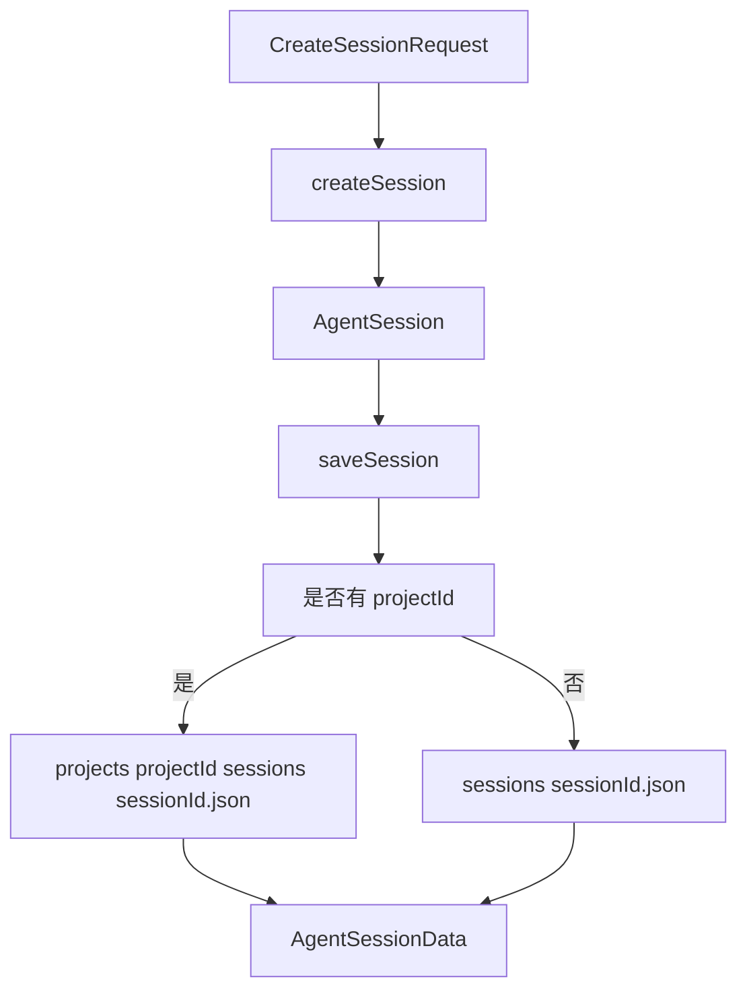
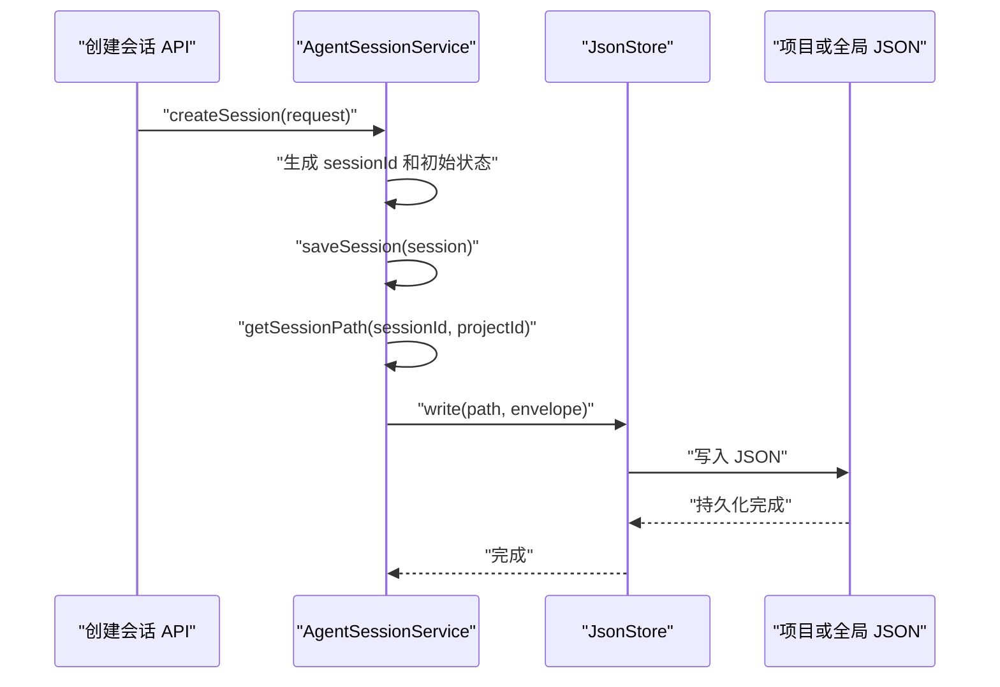

# F2. AgentSessionService：会话如何落盘、更新与恢复

> 类型：源码课
> 状态：正式课件
> 本节目标：沿着真实方法调用，理解一条会话如何从创建请求变成项目目录中的 JSON 文件，又如何被安全地读回。

## 问题

F1 定义了 `AgentSession` 长什么样；本节回答它如何活在磁盘上。OriginOS MVP 不使用数据库，会话服务负责把业务对象包装为带版本和时间戳的数据文件，并根据是否有 `projectId` 选择全局或项目级路径。

关键判断是“会话属于哪个项目”，而不是“当前网页在哪个路由”。路径必须由持久化数据决定，不能由 UI 猜测。

## 图解

目录分流来自服务层的 `getSessionPath`，对应 [AGENTS.md 的存储规约（第 347 行）](../../../../AGENTS.md#L347)。因此，项目会话不应被悄悄写进全局 `sessions` 目录。

## 源码入口

- [会话服务常量与路径函数（第 22 行）](../../../../packages/core/src/lib/features/agent/session-service.ts#L22)
- [AgentSessionService（第 48 行）](../../../../packages/core/src/lib/features/agent/session-service.ts#L48)
- [createSession（第 54 行）](../../../../packages/core/src/lib/features/agent/session-service.ts#L54)
- [saveSession（第 88 行）](../../../../packages/core/src/lib/features/agent/session-service.ts#L88)
- [getSession 与 updateSession（第 105 行）](../../../../packages/core/src/lib/features/agent/session-service.ts#L105)
- [addMessage（第 156 行）](../../../../packages/core/src/lib/features/agent/session-service.ts#L156)
- [listSessions（第 190 行）](../../../../packages/core/src/lib/features/agent/session-service.ts#L190)
- [getSessionPath（第 346 行）](../../../../packages/core/src/lib/features/agent/session-service.ts#L346)

还有一个名字相近但职责不同的类：[Pi Agent SessionStore（第 49 行）](../../../../packages/core/src/lib/integrations/pi-agent/session-store.ts#L49)。它维护 `data/sessions/sessions.json` 的会话列表，不应与 feature 层按文件存储的 `AgentSessionService` 混为一谈。

## 调用链

更新消息也走这条链：`addMessage` 先 `getSession`，构造带 UUID 和时间戳的 `AgentMessage`，追加后再调用 `saveSession`。它不是“直接对文件 append 文本”，因为 session 是一个结构化整体。

## 关键类型

### 创建：服务层补齐不可信字段

[createSession（第 54 行）](../../../../packages/core/src/lib/features/agent/session-service.ts#L54) 生成 `sessionId`，把状态设为 `active`，初始化 `messages: []`，并填入时间戳。这样 UI 只描述想创建什么，服务层才决定新对象的合法初态。

`projectContext` 采用合并策略：请求可能只提供部分上下文，但后续路径选择依赖 `projectId`。新增字段时要检查默认值是否会让项目会话错误地降级为全局会话。

### 保存：封套与业务对象分离

[saveSession（第 88 行）](../../../../packages/core/src/lib/features/agent/session-service.ts#L88) 更新 `updatedAt`，再写入 `AgentSessionData`。外层版本号属于文件格式，内层 `session` 才是业务内容。迁移数据格式时，应先看封套版本，而不是从每个业务字段猜版本。

源码这里使用了 `as any` 通过存储类型边界。这与 AGENTS 的“严格模式、禁止 any”目标存在张力；学习时把它记为需收敛的技术债，而不是照抄的模式。

### 读取与更新：先读，再做最小变化，再保存

[updateSession（第 118 行）](../../../../packages/core/src/lib/features/agent/session-service.ts#L118) 只合并允许更新的字段。相比 `Object.assign(session, updates)`，白名单能减少未知字段进入持久化格式的风险。

`listSessions` 还会过滤无效 session ID、按项目归属筛选并按更新时间倒序。它处理的是目录里“可能不干净”的现实，而不假设每个 JSON 都可信。

## 测试入口

- [SessionStore 创建与保存测试（第 61 行）](../../../../packages/core/src/lib/integrations/pi-agent/__tests__/session-store.test.ts#L61)
- [保存后加载测试（第 108 行）](../../../../packages/core/src/lib/integrations/pi-agent/__tests__/session-store.test.ts#L108)
- [列表与当前会话测试（第 157 行）](../../../../packages/core/src/lib/integrations/pi-agent/__tests__/session-store.test.ts#L157)

这些测试覆盖同类“文件会话存储”的基本动作，但不是 `AgentSessionService` 的直接单测。若你改本文件，应补充项目路径与全局路径分流、消息追加、损坏文件跳过的专门测试。

## 逐行精读

1. 读 [getProjectSessionsDir（第 27 行）](../../../../packages/core/src/lib/features/agent/session-service.ts#L27)，确认路径段是 `projects/{id}/sessions`。
2. 读 [isValidSessionId（第 36 行）](../../../../packages/core/src/lib/features/agent/session-service.ts#L36)，理解列表读取为何先做 ID 过滤。
3. 跟进 [addMessage（第 156 行）](../../../../packages/core/src/lib/features/agent/session-service.ts#L156)：消息 ID 和 timestamp 由服务生成，而非浏览器提供。
4. 最后回到 [getSessionPath（第 346 行）](../../../../packages/core/src/lib/features/agent/session-service.ts#L346)，把所有读写统一到唯一决策点。

## 深度拆解

这里的“读-改-写”并不是事务。两个请求同时读取同一 session、各自追加 message，再各自保存，后写入者可能覆盖前者的变化。当前文件存储 MVP 的简单性有价值，但一旦允许同一 session 并发发送，就需要串行队列、乐观版本号或原子写入策略；不能只增加一个 `await` 就声称解决并发。

## 常见故障

| 现象 | 应先检查 | 根因方向 |
| --- | --- | --- |
| 项目会话列表为空 | `projectContext.projectId`、`getSessionPath` | 写入与列表筛选不在同一项目 ID 下 |
| 重启后找不到聊天 | session 路径、文件封套 | 写到全局/项目的错误目录或写入失败 |
| 一条消息重复 | API 是否同时调用 `addMessage` 与其他保存逻辑 | 一个用户动作被记录两次 |
| 会话排序错乱 | `updatedAt` 是否每次 save 更新 | 直接改内存对象而未走服务 |

## 改动场景判断

要增加“删除会话”时，先分清软删除与物理删除：软删除可复用 `status: 'archived'` 并保留审计；物理删除会影响文件版本追溯、列表和恢复语义。要改路径格式时，先设计旧路径回退读取和数据迁移，不能只改 `getSessionPath`。

## 源码追问清单

1. `projectId` 是否可信，是否需要由服务端校验归属？
2. `JsonStore.write` 是否原子写入，失败会留下半文件吗？
3. `listSessions` 遇到损坏 JSON 如何表现？
4. 更新请求的白名单是否覆盖所有合法可变字段？

## 练习

1. 用纸画出 `projectId` 存在与不存在时的两个绝对相对路径。
2. 设计一个 `archiveSession(sessionId)`：它至少要读取、改状态、更新时间、保存；不能只从列表中隐藏。
3. 为 `AgentSessionService` 写三条测试标题：项目路径、全局路径、`addMessage` 产生 UUID 与 timestamp。

## 验收

你现在应能：

- 解释为什么 F1 的数据模型需要 `AgentSessionData` 封套；
- 从 `createSession` 追到唯一的路径决策函数；
- 区分 `AgentSessionService` 与 Pi Agent 的 `SessionStore`；
- 说出会话写错目录时最先应查看的字段和方法；
- 为这项文件持久化逻辑提出有价值的缺失测试。
