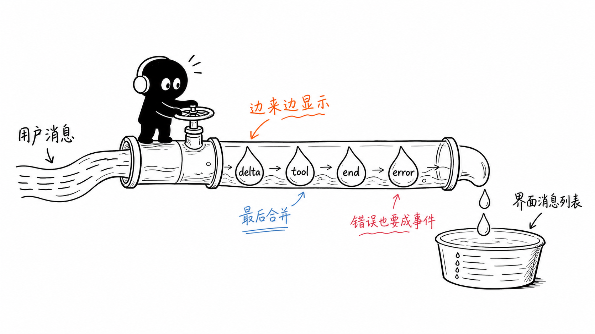
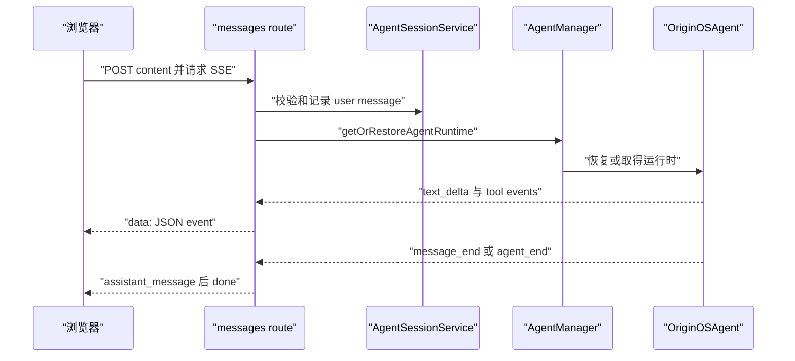
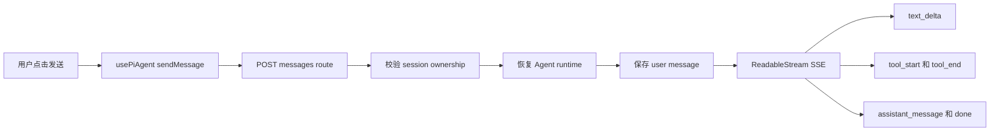

# F3. 一条消息如何变成 SSE 流

> 类型：源码课
> 状态：正式课件
> 本节目标：从浏览器 `POST` 请求追到服务器发送 `text_delta`、工具事件、最终消息和 `done` 的完整流式协议。

## 问题

为什么 Agent 的回答能一个字一个字出现在界面上，同时又能展示工具开始、工具结束和最终答案？这不是多次普通 HTTP 响应，而是一条 Server-Sent Events（SSE）连接：服务器持续写出符合协议的事件，浏览器持续解析。



图里的传送带强调一个关键事实：增量、完整消息、工具状态不是三份无关数据，它们必须被同一个 session 的协议顺序协调，否则 UI 会重复文本或永远不结束加载。

## 图解



## 源码入口

- [消息 API 的事件协议 StreamMessage（第 29 行）](../../../../packages/web/src/app/api/agent/sessions/[sessionId]/messages/route.ts#L29)
- [POST 入口（第 51 行）](../../../../packages/web/src/app/api/agent/sessions/[sessionId]/messages/route.ts#L51)
- [会话归属校验（第 91 行）](../../../../packages/web/src/app/api/agent/sessions/[sessionId]/messages/route.ts#L91)
- [运行时恢复与用户消息持久化（第 114 行）](../../../../packages/web/src/app/api/agent/sessions/[sessionId]/messages/route.ts#L114)
- [SSE Response 分支（第 145 行）](../../../../packages/web/src/app/api/agent/sessions/[sessionId]/messages/route.ts#L145)
- [Runtime bridge 流（第 336 行）](../../../../packages/web/src/app/api/agent/sessions/[sessionId]/messages/route.ts#L336)
- [in-process 流（第 525 行）](../../../../packages/web/src/app/api/agent/sessions/[sessionId]/messages/route.ts#L525)
- [客户端 Hook 的发送入口（第 511 行）](../../../../packages/core/src/lib/integrations/pi-agent/client-hooks.ts#L511)

注意目录边界：route 文件只做参数、鉴权/环境拼装、服务调用和响应映射，业务运行时仍下沉到 core。这正是 [AGENTS.md 对 app route 的要求（第 116 行）](../../../../AGENTS.md#L116)。

## 调用链



顺序很重要：route 在启动执行前先恢复运行时、再持久化用户消息。这样无论选择 runtime bridge 还是进程内 `OriginOSAgent`，同一请求都有可追溯的 session 历史。

## 关键类型

### `StreamMessage` 是网络协议，不是 `AgentMessage`

[StreamMessage（第 29 行）](../../../../packages/web/src/app/api/agent/sessions/[sessionId]/messages/route.ts#L29) 的 `type` 包括 `user_message`、`assistant_message`、`text_delta`、`tool_start`、`tool_end`、`error`、`done`。`AgentMessage` 是完整持久化对象；`StreamMessage` 是传输过程中的小事件。把二者混用会导致浏览器试图把每个 delta 当成一条新聊天记录。

### SSE 的最小线格式

在 [in-process send（第 539 行）](../../../../packages/web/src/app/api/agent/sessions/[sessionId]/messages/route.ts#L539)，服务端写入：

```text
data: {"type":"text_delta","data":{"delta":"你"}}

```

两个换行表示一个 SSE event 的结束。客户端不能按普通 JSON body 一次性 `await response.json()`；它必须持续读取流、按事件边界解析。

### 去重与最终对账

运行时桥接路径在 [eventInterceptor（第 372 行）](../../../../packages/web/src/app/api/agent/sessions/[sessionId]/messages/route.ts#L372) 处理 `MESSAGE_SENT` 与 `AGENT_COMPLETE_TASK`。它通过累积器、`getVisibleStreamDelta` 和 `reconcileFinalStreamContent` 避免“已显示的 delta 又被最终消息重复显示”。

这段逻辑的目的不是美化文本，而是维持协议不变量：用户看到的流式内容加上末尾补齐，应与最终持久化 assistant 消息一致。

## 测试入口

本 route 当前未见同目录专门的测试文件，阅读时应把它标记为集成测试需求，而不是假设手工页面验证足够。可以从下列边界设计测试：

- [SessionStore 行为测试（第 108 行）](../../../../packages/core/src/lib/integrations/pi-agent/__tests__/session-store.test.ts#L108)
- [OriginOSAgent 事件发射入口（第 947 行）](../../../../packages/core/src/lib/integrations/pi-agent/core/agent.ts#L947)
- [client hooks 初始化入口（第 303 行）](../../../../packages/core/src/lib/integrations/pi-agent/client-hooks.ts#L303)

至少应覆盖：非法 content 返回 400、无权 session 返回拒绝、顺序接收 `user_message -> text_delta -> assistant_message -> done`、工具事件夹在 delta 中、异常后仍能关闭流。

## 逐行精读

1. 读 [POST 参数检查（第 56 行）](../../../../packages/web/src/app/api/agent/sessions/[sessionId]/messages/route.ts#L56) 到 [内容校验（第 61 行）](../../../../packages/web/src/app/api/agent/sessions/[sessionId]/messages/route.ts#L61)：不要让空内容进入 Agent。
2. 读 [restore（第 114 行）](../../../../packages/web/src/app/api/agent/sessions/[sessionId]/messages/route.ts#L114) 和 [addMessage（第 117 行）](../../../../packages/web/src/app/api/agent/sessions/[sessionId]/messages/route.ts#L117)：这是恢复与持久化的交界。
3. 读 [SSE headers（第 149 行）](../../../../packages/web/src/app/api/agent/sessions/[sessionId]/messages/route.ts#L149)：它们告诉浏览器不要缓存并保持 event stream。
4. 读 [queue delivery（第 483 行）](../../../../packages/web/src/app/api/agent/sessions/[sessionId]/messages/route.ts#L483)：先消费队列、最后发送 `done` 并关闭 controller。

## 深度拆解

SSE 的难点不是“能持续写”，而是终态唯一性。一个执行链可能既有最终 assistant message，又有 `agent_end`，还可能在异常中进入 catch。协议必须保证：成功只发一次最终内容与一次 `done`；失败只发一次 error 并关闭；客户端无论网络断开还是服务端错误都能停止 loading。F3 中的 `assistantMessageSent`、队列和 `completed` 都是在守这个不变量。

## 常见故障

| 现象 | 优先排查 | 常见原因 |
| --- | --- | --- |
| UI 一直转圈 | 是否收到 `done`，controller 是否关闭 | 异常路径未结束流 |
| 文本重复 | delta 累积器与最终消息对账 | 把增量和完整消息同时 append |
| 工具卡片没有结束 | `tool_end` 事件映射 | tool result 事件未转成协议事件 |
| 重启后第一句上下文丢失 | `getOrRestoreAgentRuntime` | 只创建内存 Agent，没有回放 session |

## 改动场景判断

若要新增 `reasoning_delta`，先定义它是否给用户展示、是否可持久化、是否会泄露敏感推理。若只是调试信息，应使用受控日志或 metadata，不应默认混进聊天正文。若要从 SSE 改 WebSocket，则需要重新设计断线重连、事件 ID 和背压，不能只替换 response header。

## 源码追问清单

1. 一次请求的唯一完成事件是什么？
2. 浏览器断开连接时，Agent 是否应 abort，还是继续完成并持久化？
3. `text_delta` 乱序/重复时客户端如何防御？
4. 工具结果是否可能包含不应直接显示给用户的内容？

## 练习

1. 把 `StreamMessage` 的事件分成“内容”“执行状态”“终止/错误”三组。
2. 为 SSE route 写一个伪代码断言：收到 `done` 前不关闭读取器；收到 `error` 后不能继续发送新的 delta。
3. 解释为什么 UI 应把 `text_delta` 追加到当前 assistant 气泡，而不是直接调用 `addMessage`。

## 验收

完成本节后，你应该能：

- 从浏览器提交追到 route，再追到 Agent runtime；
- 区分持久化 `AgentMessage` 和传输 `StreamMessage`；
- 解释 SSE 的 `data:` 与双换行边界；
- 说清为什么必须做 delta 与最终文本的去重对账；
- 为这个关键用户链路列出最少五项集成测试。
