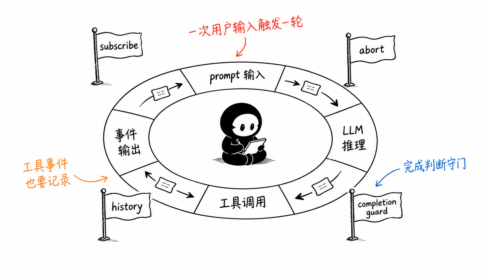
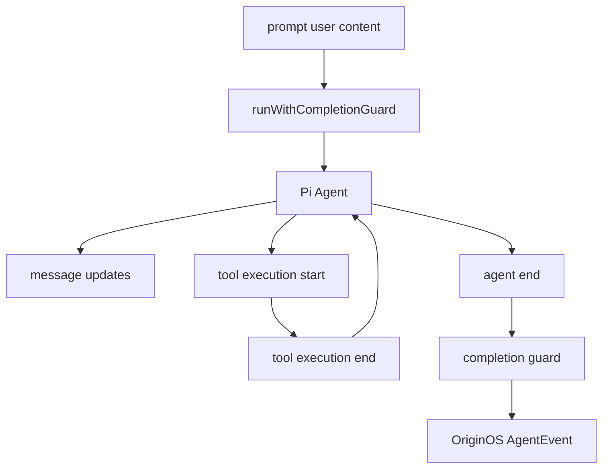
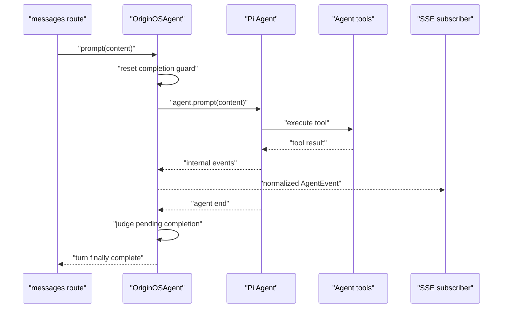

# F4. OriginOSAgent：模型循环、事件翻译与完成守卫

> 类型：源码课
> 状态：正式课件
> 本节目标：理解 `OriginOSAgent` 为什么不是“调一次 LLM”的包装，而是把 Pi Agent 的事件、工具循环和系统级保护转换成 OriginOS 运行时。

## 问题

模型回答一次问题时，可能先输出文字、调用工具、接收工具结果、继续推理，再结束。OriginOS 不能把 Pi Agent 的内部事件直接丢给 UI，因为 UI 需要稳定的消息事件、工具状态和可恢复的会话状态。

`OriginOSAgent` 正是适配层：它创建底层 `Agent`，注入 prompt/model/tools，把内部事件翻译为 `AgentEvent`，并对循环、完成信号和健康状态增加系统保护。

图中的小黑负责开关，而不是乘客。它对应完成守卫：模型说“结束”不一定表示整个多轮工具循环真的安全结束。

## 图解

## 源码入口

- [OriginOSAgent 类（第 235 行）](../../../../packages/core/src/lib/integrations/pi-agent/core/agent.ts#L235)
- [构造、初始化与历史转换（第 291 行）](../../../../packages/core/src/lib/integrations/pi-agent/core/agent.ts#L291)
- [底层 Pi Agent 创建（第 492 行）](../../../../packages/core/src/lib/integrations/pi-agent/core/agent.ts#L492)
- [事件路由（第 525 行）](../../../../packages/core/src/lib/integrations/pi-agent/core/agent.ts#L525)
- [完成守卫（第 650 行）](../../../../packages/core/src/lib/integrations/pi-agent/core/agent.ts#L650)
- [事件翻译（第 947 行）](../../../../packages/core/src/lib/integrations/pi-agent/core/agent.ts#L947)
- [循环保护（第 1168 行）](../../../../packages/core/src/lib/integrations/pi-agent/core/agent.ts#L1168)
- [发送、订阅、销毁（第 1228 行）](../../../../packages/core/src/lib/integrations/pi-agent/core/agent.ts#L1228)

## 调用链

F3 只看到了 SSE 事件；本节看到它们的上游。`agent.subscribe` 接到的底层事件先被 `handleAgentEvent` 归一化，订阅者不用了解 Pi Agent 的内部细节。

## 关键类型

### 三层状态不要混

| 层 | 对象 | 生命周期 |
| --- | --- | --- |
| 持久化层 | `AgentSession` | 磁盘，可跨进程恢复 |
| OriginOS 适配层 | `OriginOSAgent` | 内存，按 session 管理 |
| Provider 层 | Pi `Agent` | 内存，具体模型和工具循环 |

`OriginOSAgent` 持有底层 agent，但不应该把 Pi 的类型泄漏给 Web API。这个隔离让以后替换模型提供方时，session/API/UI 契约不必整体重写。

### 消息历史为什么要转换

[convertToLlm（第 327 行）](../../../../packages/core/src/lib/integrations/pi-agent/core/agent.ts#L327) 对 session 消息进行角色筛选、token 预算和截断，再生成模型可读历史。持久化历史可能含有 UI 元数据、工具对象或过长内容；模型输入必须是受控的上下文窗口，而不是原样复制 JSON。

这是一条重要原则：**持久化真实性** 与 **模型上下文适配性** 是两项不同要求。为了省 token 而改写原始聊天记录，会破坏审计；为了保留所有记录而无预算地塞给模型，会破坏可用性。

### 完成守卫与循环保护

[runWithCompletionGuard（第 827 行）](../../../../packages/core/src/lib/integrations/pi-agent/core/agent.ts#L827) 和 [judgePendingCompletion（第 650 行）](../../../../packages/core/src/lib/integrations/pi-agent/core/agent.ts#L650) 防止在工具或后续 turn 尚未完成时过早广播完成。[applyLoopProtection（第 1168 行）](../../../../packages/core/src/lib/integrations/pi-agent/core/agent.ts#L1168) 则针对重复工具轨迹、异常循环等风险做限制。

这两者的差别：完成守卫解决“太早结束”，循环保护解决“永远不结束”。

### 事件的可见性

`getVisibleMessages` 与 `replacePersistedMessages` 分别服务不同视角。前者面向 UI，需要隐藏内部控制消息；后者用于从 session 恢复真实持久化历史。不要用“当前屏幕看到的内容”直接覆盖完整历史。

## 测试入口

该文件中包含较多运行时分支，源码附近未见同名独立单测目录。验证应沿边界做：

- [消息 SSE 映射（第 525 行）](../../../../packages/web/src/app/api/agent/sessions/[sessionId]/messages/route.ts#L525)
- [工具 shell 行为测试（第 22 行）](../../../../packages/core/src/lib/integrations/pi-agent/tools/__tests__/bash-tools-shell.test.ts#L22)
- [会话恢复入口（第 201 行）](../../../../packages/core/src/lib/integrations/pi-agent/agent-manager.ts#L201)

建议新增 fake Pi Agent 的单元测试：文字增量顺序、一次工具成功/失败、`abort()`、底层提前 `agent_end`、循环阈值触发。

## 逐行精读

1. [constructor（第 291 行）](../../../../packages/core/src/lib/integrations/pi-agent/core/agent.ts#L291)：先认清注入的是 session、上下文和配置，而不是 Web Request。
2. [new Agent（第 492 行）](../../../../packages/core/src/lib/integrations/pi-agent/core/agent.ts#L492)：找 system prompt、model、thinking level、tools 四类初始化输入。
3. [tool_execution_end（第 1026 行）](../../../../packages/core/src/lib/integrations/pi-agent/core/agent.ts#L1026)：观察工具轨迹怎样进入完成判断。
4. [prompt（第 1228 行）](../../../../packages/core/src/lib/integrations/pi-agent/core/agent.ts#L1228)：它是 F3 API 最终驱动的公开方法。
5. [destroy（第 1495 行）](../../../../packages/core/src/lib/integrations/pi-agent/core/agent.ts#L1495)：销毁应解除订阅和运行态，而不是删除 session 文件。

## 深度拆解

适配器真正的价值在于“把不稳定的 provider 事件变成稳定的产品事件”。如果 Web route 直接订阅 Pi Agent，任何 provider 升级都会穿透到 API、UI 和测试。`OriginOSAgent` 应是唯一知道 `streamSimple`、Pi 消息格式、底层事件名的地方；上层只依赖 OriginOS 的 `AgentEvent` 契约。

## 常见故障

| 症状 | 先查哪里 | 典型原因 |
| --- | --- | --- |
| UI 收不到工具状态 | `handleAgentEvent` 到 SSE 映射 | 内部事件名没有被翻译 |
| 模型重复调用同一工具 | `applyLoopProtection`、工具结果 | 结果未进入下一轮上下文 |
| UI 过早显示完成 | completion guard | `agent_end` 被直接当最终完成 |
| 恢复后历史不完整 | `replacePersistedMessages` | 用可见消息替代完整持久化消息 |

## 改动场景判断

若换模型提供方，优先实现/替换 `streamFnWithToolChoice` 与 provider 初始化，保持 `prompt`、事件和 session 契约稳定。若增加新工具，不要先改这里的循环；优先走 F6 registry 和 F7 context。若调整 token 策略，要同时验证模型输入截断与 session 持久化记录没有互相污染。

## 源码追问清单

1. 哪些事件来自 provider，哪些是 OriginOS 自己合成的？
2. 何时可安全把 `agent_end` 交给 UI？
3. abort 后是否还可能收到迟到事件？
4. 截断策略是否可观测、可解释、可测试？

## 练习

1. 画出一次“模型调用文件工具后继续回答”的事件序列，标出 `tool_execution_start` 和 `tool_execution_end`。
2. 分别用一句话解释完成守卫和循环保护解决的反向问题。
3. 假设增加 provider 事件 `reasoning_delta`：你会把映射加在什么方法，如何避免 Web route 直接依赖 provider 类型？

## 验收

你应能：

- 说清 `OriginOSAgent` 与 Pi Agent、`AgentSession` 的边界；
- 从 `prompt()` 追到工具循环、事件转换和 SSE；
- 解释 token 截断不能破坏原始会话档案；
- 区分过早完成与无限循环两种保护；
- 为核心运行时提出可替身（fake）驱动的测试方案。
