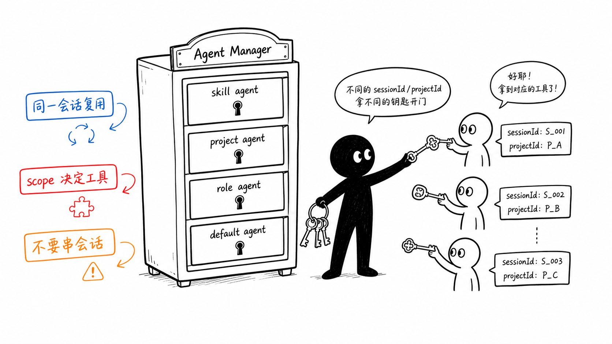
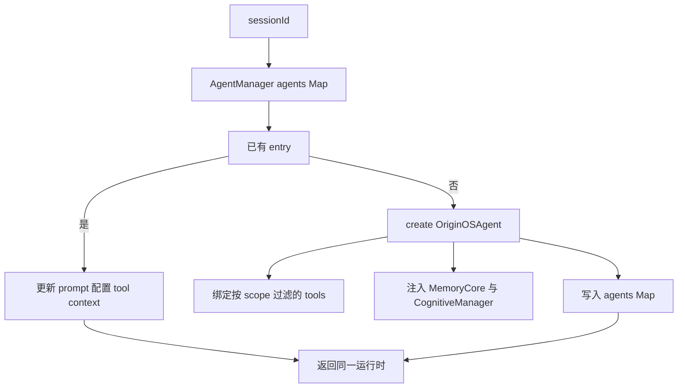
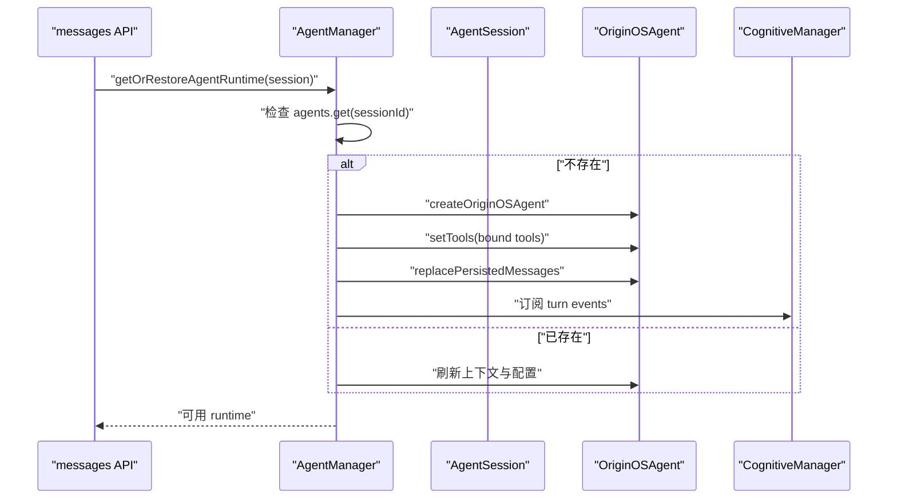

# F5. AgentManager：用 sessionId 管理运行时与认知生命周期

> 类型：源码课
> 状态：正式课件
> 本节目标：掌握 `AgentManager` 如何把“持久化会话”变成“唯一的内存 Agent”，并在工具、记忆、清理和 HMR 之间保持边界。

## 问题

每次发消息都新建 Agent，会丢失内存状态、重复注册工具；只靠全局单例，又会让不同会话串线。`AgentManager` 以 `sessionId` 为键管理运行时实例，保证同一会话复用、不同会话隔离，并在恢复时回放 session 历史。

小黑拿的不是“用户 ID 钥匙”，而是 `sessionId` 钥匙。一个用户可有多个 session；一个项目也可有多个 session。实例隔离的最小正确单位是会话。

## 图解

## 源码入口

- [AgentEntry 和配置类型（第 25 行）](../../../../packages/core/src/lib/integrations/pi-agent/agent-manager.ts#L25)
- [AgentManager 与 agents Map（第 81 行）](../../../../packages/core/src/lib/integrations/pi-agent/agent-manager.ts#L81)
- [getOrCreateAgent（第 102 行）](../../../../packages/core/src/lib/integrations/pi-agent/agent-manager.ts#L102)
- [restoreAgentRuntime（第 201 行）](../../../../packages/core/src/lib/integrations/pi-agent/agent-manager.ts#L201)
- [创建与工具绑定（第 282 行）](../../../../packages/core/src/lib/integrations/pi-agent/agent-manager.ts#L282)
- [Memory Core 注入（第 307 行）](../../../../packages/core/src/lib/integrations/pi-agent/agent-manager.ts#L307)
- [认知事件订阅（第 390 行）](../../../../packages/core/src/lib/integrations/pi-agent/agent-manager.ts#L390)
- [移除、会话结束、清理（第 525 行）](../../../../packages/core/src/lib/integrations/pi-agent/agent-manager.ts#L525)
- [globalThis 单例（第 674 行）](../../../../packages/core/src/lib/integrations/pi-agent/agent-manager.ts#L674)

## 调用链

恢复的关键不是“读取 session 后返回它”，而是 [restoreAgentRuntimeOnce（第 218 行）](../../../../packages/core/src/lib/integrations/pi-agent/agent-manager.ts#L218) 创建/取得内存 Agent，再 [replacePersistedMessages（第 240 行）](../../../../packages/core/src/lib/integrations/pi-agent/agent-manager.ts#L240) 回放历史。

## 关键类型

### `Map<sessionId, AgentEntry>`

`AgentEntry` 不只保存 agent，还保存 `createdAt`、`lastAccessedAt`、`isWindowBound`、工具上下文和认知管理器等生命周期数据。`lastAccessedAt` 让 `cleanup()` 可以回收闲置实例；`isWindowBound` 避免窗口绑定的 Agent 被通用清理错误销毁。

### 一次性恢复 Promise

`restorePromises` 用于让同一 session 并发到达的恢复请求共享同一 Promise。否则两个 API 请求可能同时发现“还没有 agent”，各建一个实例，再由后写入者覆盖 Map。这是典型的异步竞态，不是 Map 自身能自动避免的。

### 工具按 scope 过滤

[getAgentToolsForScope（第 299 行）](../../../../packages/core/src/lib/integrations/pi-agent/agent-manager.ts#L299) 取得工具后，[bindToolsToSession（第 300 行）](../../../../packages/core/src/lib/integrations/pi-agent/agent-manager.ts#L300) 把它们绑定到 session 的工作目录。worker/skill 场景还会排除 `ask_user_question`。这表明“注册存在”不等于“当前 Agent 能调用”。

### 认知生命周期

本类注入 `MemoryCore`、`CognitiveManager`、`PracticeLogger`，并在消息事件后记录实践，在 [finalizeAndRemoveAgent（第 549 行）](../../../../packages/core/src/lib/integrations/pi-agent/agent-manager.ts#L549) 先触发 `on_session_end`，再销毁。先 flush 再删除是关键顺序；反过来，认知层将拿不到 session messages。

## 测试入口

当前文件未见同名单元测试，重点应覆盖它的生命周期契约：

- [会话 API 的运行时恢复调用（第 114 行）](../../../../packages/web/src/app/api/agent/sessions/[sessionId]/messages/route.ts#L114)
- [工作目录端到端测试（第 214 行）](../../../../packages/core/src/lib/integrations/pi-agent/tools/__tests__/working-directory.test.ts#L214)
- [MemoryTracker 的持久化测试（第 21 行）](../../../../packages/core/src/lib/integrations/pi-agent/role-agent/__tests__/memory-tracker.test.ts#L21)

建议建立 fake AgentManager 测试：同一 session 并发恢复只创建一次；不同 session 不共享 messages；`finalizeAndRemoveAgent` 先 `on_session_end` 后 `destroy`；闲置清理跳过 window-bound entry。

## 逐行精读

1. [getOrCreateAgent（第 102 行）](../../../../packages/core/src/lib/integrations/pi-agent/agent-manager.ts#L102)：先看已有实例分支如何刷新而不是重建。
2. [restoreAgentRuntime（第 201 行）](../../../../packages/core/src/lib/integrations/pi-agent/agent-manager.ts#L201)：理解并发恢复的 Promise 去重。
3. [MemoryCore 注入（第 320 行）](../../../../packages/core/src/lib/integrations/pi-agent/agent-manager.ts#L320)：它向工具暴露 archival memory 能力。
4. [removeAgent（第 525 行）](../../../../packages/core/src/lib/integrations/pi-agent/agent-manager.ts#L525)：确认销毁时同时移除工具上下文。
5. [getGlobalAgentManager（第 683 行）](../../../../packages/core/src/lib/integrations/pi-agent/agent-manager.ts#L683)：理解为什么开发期 HMR 用 `globalThis` 复用实例。

## 深度拆解

`AgentManager` 同时是缓存、装配器和生命周期协调器，因此最危险的改动是“为了方便多加一个全局状态”。例如把用户级 CWD、当前工具或最后消息做成 manager 的裸字段，会绕过 `AgentEntry` 和 session 键，立即引入串会话风险。新增运行态信息优先附着在 entry 或明确的 session context 中。

## 常见故障

| 症状 | 优先检查 | 原因 |
| --- | --- | --- |
| 同一会话上下文偶发丢失 | restore promise、sessionId | 并发恢复创建了两个实例 |
| A 会话工具写到 B 目录 | `bindToolsToSession`、remove | 默认工具上下文被串用或未清理 |
| 关闭窗口后经验没沉淀 | `finalizeAndRemoveAgent` | 只调用 `removeAgent`，跳过 session-end flush |
| 热更新后订阅失效 | globalThis manager | 产生了新的 manager 而旧实例仍被引用 |

## 改动场景判断

需要“登出后清理所有会话运行态”时，应走逐项 `finalizeAndRemoveAgent` 或定义批量异步 finalize，不能调用 `destroyAll()` 后假设认知 flush 已完成。需要限制资源时，先审查 `isWindowBound`、闲置时长和最大空闲数的交互，再改变 cleanup 阈值。

## 源码追问清单

1. 缓存键为何不是 userId 或 projectId？
2. 同一 session 的并发恢复会创建几次底层 Agent？
3. 运行时删除前有哪些必须 flush 的持久副作用？
4. HMR 复用单例会不会保留过期配置，如何测试？

## 练习

1. 用文字写出“同一 session 两个并发请求”的竞态，并说明 `restorePromises` 如何消除它。
2. 解释为什么 cleanup 不能直接调用 `Map.clear()`。
3. 找到一个需要 sessionId，而不能用 projectId 的位置并说明理由。

## 验收

你应能：

- 说明 AgentManager 的缓存键必须是 `sessionId`；
- 追出 session 恢复、工具绑定、历史回放和认知订阅的顺序；
- 解释并发恢复为什么需要 Promise 去重；
- 说清 destroy、remove、finalize 的责任差异；
- 为运行时缓存生命周期写出可执行的测试清单。
