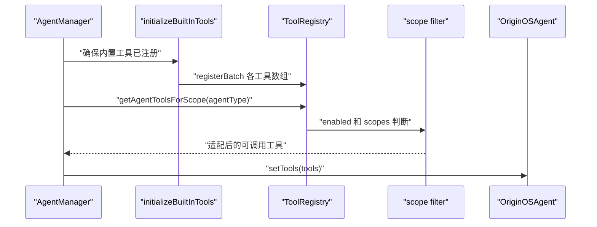

# F6. ToolRegistry：注册所有工具，不等于授权所有工具

> 类型：源码课
> 状态：正式课件
> 本节目标：从工具定义集合到当前 Agent 可调用集合，理解初始化、分类、scope 过滤与 Pi Agent 适配。

## 问题

OriginOS 的 Agent 需要文件、命令、技能、本体、URL、提问等工具。把所有工具硬编码在每个 Agent 构造函数里，会让扩展和权限控制失控。`ToolRegistry` 提供统一注册表，但真正给某个 Agent 的是按启用状态和 scope 过滤后的工具子集。

小黑的动作是“分发”，不是“收藏”。注册表像仓库；每次 Agent 启动时的授权列表像领料单。两者绝不能等同。

## 图解

## 源码入口

- [ToolRegistry 类（第 24 行）](../../../../packages/core/src/lib/integrations/pi-agent/tools/registry.ts#L24)
- [scope 过滤（第 95 行）](../../../../packages/core/src/lib/integrations/pi-agent/tools/registry.ts#L95)
- [转换为 Agent tools（第 169 行）](../../../../packages/core/src/lib/integrations/pi-agent/tools/registry.ts#L169)
- [全局 registry 公共函数（第 200 行）](../../../../packages/core/src/lib/integrations/pi-agent/tools/registry.ts#L200)
- [内置工具初始化（第 41 行）](../../../../packages/core/src/lib/integrations/pi-agent/tools/index.ts#L41)
- [工具类别出口（第 1 行）](../../../../packages/core/src/lib/integrations/pi-agent/tools/index.ts#L1)
- [AgentManager 取得 scope 工具（第 299 行）](../../../../packages/core/src/lib/integrations/pi-agent/agent-manager.ts#L299)

## 调用链

## 关键类型

### `ToolRegistry` 的 Map 与覆盖规则

`tools: Map<string, ToolDefinition>` 以稳定工具名作为 key。[register（第 30 行）](../../../../packages/core/src/lib/integrations/pi-agent/tools/registry.ts#L30) 在重复名时会警告并覆盖。覆盖是允许的扩展机制，但也是风险点：若两处注册同名工具，后注册者改变全局行为。生产改动应明确记录覆盖意图并写测试。

### 启用状态、分类、scope 是三条独立轴

- `enabled`：这个工具总体是否可用；
- `category`：文件、系统、技能等归类，便于 prompt/UI 组织；
- `scopes`：哪些 Agent 类型可用。

[getEnabledForScope（第 95 行）](../../../../packages/core/src/lib/integrations/pi-agent/tools/registry.ts#L95) 体现了这三层过滤。不要用 category 代替权限；“属于系统工具”不意味着每个 Agent 都有系统级能力。

### `toAgentTools` 是适配边界

[toAgentTools（第 169 行）](../../../../packages/core/src/lib/integrations/pi-agent/tools/registry.ts#L169) 把 OriginOS 工具定义转换为底层 Agent 认识的格式。这个边界是将来切换 provider 或升级 Pi Agent 时最重要的隔离层之一。

### 初始化幂等性

[initializeBuiltInTools（第 43 行）](../../../../packages/core/src/lib/integrations/pi-agent/tools/index.ts#L43) 通过 `isInitialized` 防止重复注册。没有幂等保护，开发期 HMR、多个 API 请求或多个窗口都可能不断覆盖同名工具、制造难以重现的行为。

## 测试入口

注册表当前未见同目录专门单测。可从真实工具行为验证最小边界：

- [shell 工具解析与缓冲测试（第 22 行）](../../../../packages/core/src/lib/integrations/pi-agent/tools/__tests__/bash-tools-shell.test.ts#L22)
- [工作目录工具上下文测试（第 141 行）](../../../../packages/core/src/lib/integrations/pi-agent/tools/__tests__/working-directory.test.ts#L141)

建议补 `registry.test.ts`：重复注册告警、disabled 不返回、无 scope 的通用工具返回、指定 scope 不泄漏、`toAgentTools` 保留 name/schema/execute。

## 逐行精读

1. 读 [registerBatch（第 43 行）](../../../../packages/core/src/lib/integrations/pi-agent/tools/registry.ts#L43)：看批量注册如何复用单工具规则。
2. 读 [enable/disable（第 117 行）](../../../../packages/core/src/lib/integrations/pi-agent/tools/registry.ts#L117)：确认运行时切换操作影响的是 registry 状态。
3. 读 [getAgentToolsForScope（第 238 行）](../../../../packages/core/src/lib/integrations/pi-agent/tools/registry.ts#L238)：观察 worker/skill 对 `ask_user_question` 的额外限制。
4. 回到 [AgentManager（第 299 行）](../../../../packages/core/src/lib/integrations/pi-agent/agent-manager.ts#L299)：确认过滤结果何时真正注入运行时。

## 深度拆解

registry 是能力目录，不是安全策略的唯一来源。真正的安全还需要工具内部参数验证、CWD 限制、命令风险检查和 API 权限校验。即使 `scopes` 漏配导致工具可见，工具实现也不应无条件执行危险操作；反过来，工具内部很安全也不能成为把它无差别暴露给所有 Agent 的理由。

## 常见故障

| 症状 | 排查点 | 根因 |
| --- | --- | --- |
| 模型说要调用工具却没有工具 | 是否初始化、scope 是否匹配 | registry 空或被过滤 |
| 不该出现的工具出现在 prompt | scope 或 enabled 标记 | 把全量 registry 直接暴露 |
| 开发中工具行为忽然变化 | 重复注册警告、HMR | 同名定义被后注册覆盖 |
| 增加工具但底层不可用 | `toAgentTools` | 只注册定义，没完成 provider 适配 |

## 改动场景判断

新增工具时按顺序改：工具实现与 schema，定义的 category/scopes，内置注册，Agent 适配测试，相关 prompt 描述。只在 `index.ts` export 而不注册，或只注册却不在允许 scope，都会造成“源码存在但模型永远用不到”。

## 源码追问清单

1. 工具名是否稳定且不会与现有工具冲突？
2. scope 是允许列表还是空数组代表通用？
3. disabled 状态是全局运行态还是配置持久化？
4. provider schema 是否能表达所有参数约束？

## 练习

1. 为一个 `read_calendar` 工具设计 name、category、enabled、scopes；说明为什么不该默认给 skill worker。
2. 用伪代码写 `getEnabledForScope('role-agent')` 的三个过滤条件。
3. 解释“注册成功”与“本 session 可执行”之间还缺哪两步。

## 验收

你应能：

- 画出内置工具从数组到运行时 Agent 的调用链；
- 区分注册、启用、分类、scope 授权；
- 指出 `toAgentTools` 的架构价值；
- 解释幂等初始化为何与 HMR 有关；
- 为工具权限回归设计至少五条单元测试。
