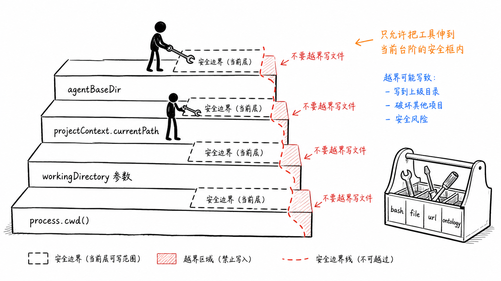
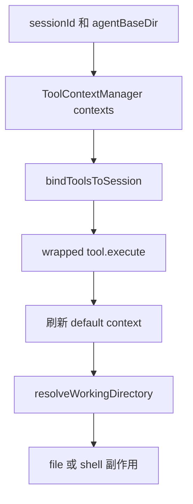
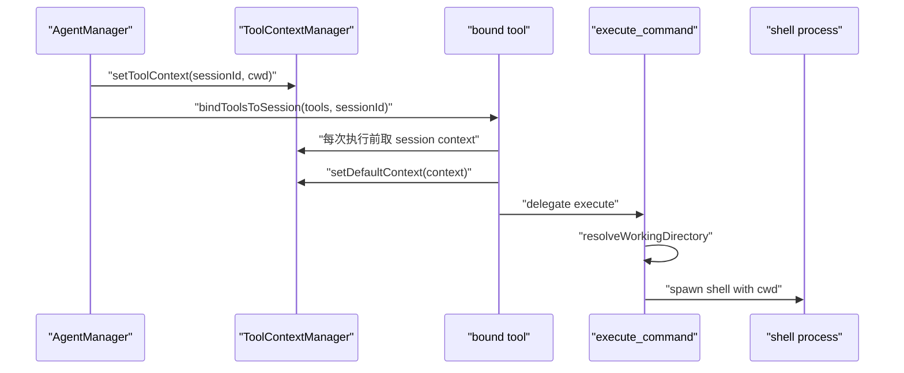

# F7. 工具 CWD：多会话系统最容易被忽略的边界

> 类型：源码课
> 状态：正式课件
> 本节目标：理解 session 工作目录如何传给无 sessionId 参数的工具，并认识 CWD、路径解析、危险命令控制各自解决什么问题。

## 问题

Agent 调用 `write_file` 或 `execute_command` 时，“相对路径”到底相对哪里？如果两个会话同时运行，一个在项目 A，一个在项目 B，而工具执行函数本身没有 `sessionId` 参数，默认工作目录就可能串线，最终把文件写到错误项目。

工具 CWD 是会话隔离的一部分，不是方便参数。它同时关系到产物目录规约、读写正确性和命令执行安全。

图中小黑每次拿工具前都换工作台。这对应 `bindToolsToSession` 在每次 execute 前刷新默认上下文，而不是仅在 Agent 创建时设置一次全局值。

## 图解

## 源码入口

- [ToolExecutionContext 与 ToolContextManager（第 12 行）](../../../../packages/core/src/lib/integrations/pi-agent/tools/context.ts#L12)
- [session 工具绑定器（第 1 行）](../../../../packages/core/src/lib/integrations/pi-agent/tools/bind-session.ts#L1)
- [bindToolsToSession（第 22 行）](../../../../packages/core/src/lib/integrations/pi-agent/tools/bind-session.ts#L22)
- [bash 工作目录解析（第 279 行）](../../../../packages/core/src/lib/integrations/pi-agent/tools/bash-tools.ts#L279)
- [危险命令规则（第 484 行）](../../../../packages/core/src/lib/integrations/pi-agent/tools/bash-tools.ts#L484)
- [ExecuteCommandTool（第 550 行）](../../../../packages/core/src/lib/integrations/pi-agent/tools/bash-tools.ts#L550)
- [AgentManager 绑定工具（第 299 行）](../../../../packages/core/src/lib/integrations/pi-agent/agent-manager.ts#L299)

## 调用链

为什么不能让工具 `execute(toolCallId, params)` 新增一个 sessionId 参数？可以，但会改变底层 provider 工具契约，影响所有工具。本实现用包装器适配现有签名，因此必须特别重视默认上下文刷新和清理。

## 关键类型

### `ToolExecutionContext` 只保留工具真正需要的信息

[ToolExecutionContext（第 12 行）](../../../../packages/core/src/lib/integrations/pi-agent/tools/context.ts#L12) 有 `sessionId` 和可选 `workingDirectory`。它没有 `ProjectContext`、用户对象、页面路由等上层概念。这符合依赖分层：工具层只接受足以执行副作用的最小上下文。

### session context 与 default context

`contexts` Map 保存每个 session 的上下文；`defaultContext` 是旧工具 API 执行时可读取的即时上下文。由于工具 execute 不带 sessionId，绑定器每一次调用都把当前 session context 放入 default，调用后由下一个绑定执行再次刷新。

这不是完美的并发模型。若未来工具执行真正并行且共享全局 default，就需要改为显式上下文传递或 async-local storage。当前设计依赖“包装器在调用边界及时刷新”的纪律。

### CWD 优先级与路径语义

[resolveWorkingDirectory（第 279 行）](../../../../packages/core/src/lib/integrations/pi-agent/tools/bash-tools.ts#L279) 优先使用工具上下文 `workingDirectory`，再看调用参数，再处理绝对/相对路径和 data root 回退。AGENTS 的产品规约把 `agentBaseDir` / `projectContext.currentPath` / 工具参数 / `process.cwd()` 列为从高到低的来源；代码实现中的 tool context 正是前两项向工具层压缩后的结果。

不要把 `CLAUDE_SKILL_DIR` 当 CWD。前者是只读技能源目录；工作目录才是产物和相对文件路径的语义根。

### 安全边界不是目录边界

[DANGEROUS_COMMANDS（第 484 行）](../../../../packages/core/src/lib/integrations/pi-agent/tools/bash-tools.ts#L484) 与 [isCommandSafe（第 511 行）](../../../../packages/core/src/lib/integrations/pi-agent/tools/bash-tools.ts#L511) 对命令文本做风险阻断；[BoundedTextBuffer（第 615 行）](../../../../packages/core/src/lib/integrations/pi-agent/tools/bash-tools.ts#L615) 限制输出体积并保留长度/哈希摘要。

它们分别降低“执行什么”和“返回多少”的风险，但不能证明命令完全安全。CWD 正确也不等于命令安全；命令通过检查也不等于不会写错目录。

## 测试入口

- [跨 Agent/Skill CWD 规则测试（第 1 行）](../../../../packages/core/src/lib/integrations/pi-agent/tools/__tests__/working-directory.test.ts#L1)
- [工具上下文管理用例（第 141 行）](../../../../packages/core/src/lib/integrations/pi-agent/tools/__tests__/working-directory.test.ts#L141)
- [端到端路径模拟（第 214 行）](../../../../packages/core/src/lib/integrations/pi-agent/tools/__tests__/working-directory.test.ts#L214)
- [shell 选择、输出截断、脱敏测试（第 22 行）](../../../../packages/core/src/lib/integrations/pi-agent/tools/__tests__/bash-tools-shell.test.ts#L22)

这些测试很有教学价值：它们不是只测一个函数，而是模拟系统技能、用户技能、RoleAgent 的工作目录语义，防止 `.claude/skills` 被误当成产物目录。

## 逐行精读

1. 读 [bind-session 文件注释（第 1 行）](../../../../packages/core/src/lib/integrations/pi-agent/tools/bind-session.ts#L1)：先理解“为什么需要包装器”。
2. 读 [getContext（第 36 行）](../../../../packages/core/src/lib/integrations/pi-agent/tools/context.ts#L36)：注意没有 session 时会返回 default。
3. 读 [resolveWorkingDirectory（第 279 行）](../../../../packages/core/src/lib/integrations/pi-agent/tools/bash-tools.ts#L279)：逐个代入 session CWD、参数 CWD、相对路径。
4. 读 [spawn（第 607 行）](../../../../packages/core/src/lib/integrations/pi-agent/tools/bash-tools.ts#L607)：确认真正把 `cwd` 传给系统进程。

## 深度拆解

当前设计将 session context 压进一个默认上下文，换来了对既有工具签名的兼容，也留下并发语义压力。真正要支持多个异步工具并发执行时，更强的方案是把 execution context 显式作为 execute 参数，或用 Node 的 `AsyncLocalStorage` 绑定异步调用链。那是跨工具契约的架构改动，需要 OpenSpec/Story 与完整回归，而不是局部替换一个 Map。

## 常见故障

| 症状 | 优先检查 | 根因方向 |
| --- | --- | --- |
| 生成文件跑进 `.claude/skills` | SkillDialog 的工作目录、tool context | 把技能源目录当输出目录 |
| 两会话文件串线 | `bindToolsToSession` | 使用全局 default 时没有按调用刷新 |
| Windows 下路径变成 `/workspace` | 绝对路径判断 | 平台路径被误判为相对路径 |
| 命令日志太大或含 token | BoundedTextBuffer、redaction | 返回完整 stdout 或预览未脱敏 |

## 改动场景判断

如果只是新增 file 工具，不要复制 bash 的路径逻辑；应复用 ToolContextManager 的工作目录语义。若要提高 shell 权限，先定义允许的命令、参数、目录和审计方式；单纯移除 `DANGEROUS_PATTERNS` 是扩大风险，不能视为功能修复。

## 源码追问清单

1. 工具是否真的在每次 execute 前绑定当前 session？
2. 相对路径在 macOS/Windows 下是否都正确？
3. shell process 的 cwd 与工具参数描述是否一致？
4. 命令预览、输出、错误信息是否都脱敏并截断？

## 练习

1. 对“系统内置 skill 创建 Agent”和“项目内 skill 写产物”分别写出工作目录与输出目录。
2. 解释为什么只在 `getOrCreateAgent` 时调用一次 `setDefaultContext` 不可靠。
3. 设计一个并发测试：两个 session 交替执行 `pwd`，断言各自结果不串。

## 验收

你应能：

- 追出 sessionId 如何最终成为 shell 的 `cwd`；
- 解释 `contexts` Map 与 `defaultContext` 的区别和限制；
- 区分工作目录、输出目录、技能源目录；
- 说明命令安全、路径隔离、输出限制三种保护不是同一件事；
- 根据现有测试判断一条路径路由是否符合规约。
