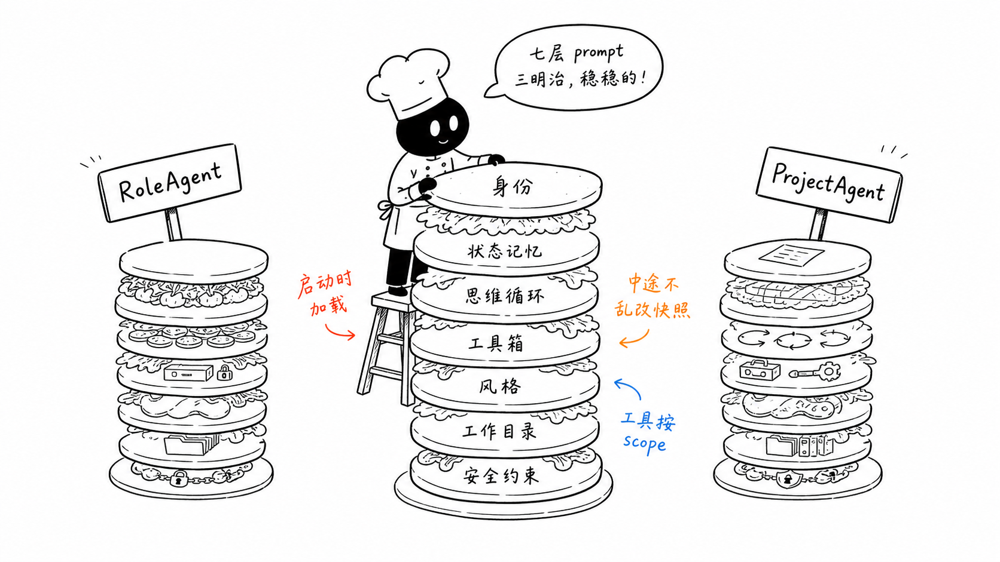
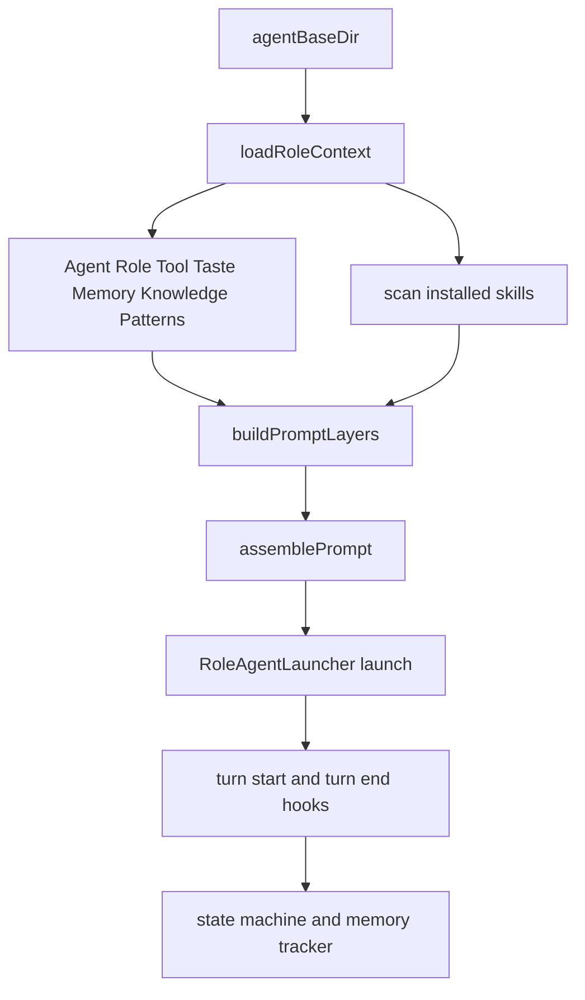
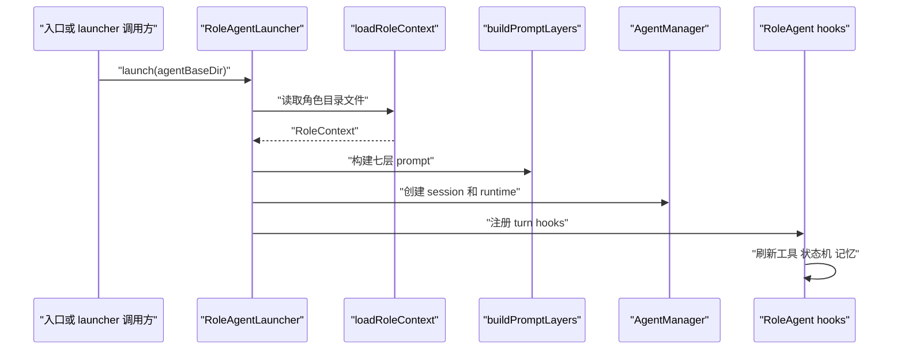

# F8. RoleAgent：把一个目录编译成七层角色提示词

> 类型：源码课
> 状态：正式课件
> 本节目标：理解 RoleAgent 的文件约定、状态机和提示词分层，以及为什么它必须走专用 launcher 而不是普通 Agent 入口。

## 问题

普通 Skill 的 prompt 往往是一份说明；RoleAgent 是一个持续工作的角色，需要身份、阶段、记忆、技能、工具权限和安全约束共同决定行为。把所有内容拼成一段长字符串，会无法解释“哪个文件影响了哪种行为”。

RoleAgent 先加载工作目录里的 Markdown 文件，再把它们组织成七层 system prompt，并在 turn hooks 中推进状态和记忆。

小黑在机器里逐层装入纸片，表达的是“每层有来源和职责”，而不是“文件越多模型越聪明”。缺失文件、权限错误、状态机语法错都会改变运行结果。

## 图解

## 源码入口

- [RoleContext 定义（第 31 行）](../../../../packages/core/src/lib/integrations/pi-agent/role-agent/role-context.ts#L31)
- [loadRoleContext（第 143 行）](../../../../packages/core/src/lib/integrations/pi-agent/role-agent/role-context.ts#L143)
- [七层 Prompt 类型与组装（第 33 行）](../../../../packages/core/src/lib/integrations/pi-agent/role-agent/system-prompt.ts#L33)
- [buildRoleSystemPrompt（第 59 行）](../../../../packages/core/src/lib/integrations/pi-agent/role-agent/system-prompt.ts#L59)
- [状态机解析与推进（第 44 行）](../../../../packages/core/src/lib/integrations/pi-agent/role-agent/state-machine.ts#L44)
- [RoleAgent launcher（第 251 行）](../../../../packages/core/src/lib/features/services/launcher/role-agent.ts#L251)
- [turn start hook（第 94 行）](../../../../packages/core/src/lib/features/services/launcher/role-agent.ts#L94)
- [turn end hook（第 162 行）](../../../../packages/core/src/lib/features/services/launcher/role-agent.ts#L162)

## 调用链

## 关键类型

### `RoleContext` 是文件加载结果，不是 prompt

[RoleContext（第 31 行）](../../../../packages/core/src/lib/integrations/pi-agent/role-agent/role-context.ts#L31) 同时含原始 Markdown、`memoryBlocks`、`currentPhase`、安装的 skills、`allowedTools` 和 `agentBaseDir`。它保留结构，后续层才决定哪些内容进入 prompt、以什么方式进入。

`Agent.md` 是必需文件；[loadRoleContext（第 143 行）](../../../../packages/core/src/lib/integrations/pi-agent/role-agent/role-context.ts#L143) 的失败应被当作“角色定义不完整”，不能降级成匿名通用 Agent 悄悄运行。

### 七层不是七份平铺文本

`buildPromptLayers` 分出：身份、状态与记忆、思维循环、工具箱、风格、权限、安全。其价值是可定位性：

| 层 | 主要来源 | 回答的问题 |
| --- | --- | --- |
| 身份 | `Agent.md` | 我是谁 |
| 状态与记忆 | Role/Memory/Knowledge/Patterns | 我现在处于什么情境 |
| 思维循环 | 固定规则 | 我应如何推进任务 |
| 工具箱 | skills + registry | 我能做什么 |
| 风格 | `Taste.md` | 我该怎样表达 |
| 权限 | 工作目录与授权 | 我可在哪里操作 |
| 安全 | 固定约束 | 我绝不能做什么 |

### 状态机是显式文本协议

[checkTransition（第 126 行）](../../../../packages/core/src/lib/integrations/pi-agent/role-agent/state-machine.ts#L126) 识别类似 `[PHASE:xxx]` 的输出标记，再由 [applyTransition（第 160 行）](../../../../packages/core/src/lib/integrations/pi-agent/role-agent/state-machine.ts#L160) 更新状态。模型不能凭“我感觉任务进入下一阶段”隐式改变持久状态；需要机器可识别的协议和可追踪的转移规则。

### 启动时的角色会话映射需要核验

[launch（第 254 行）](../../../../packages/core/src/lib/features/services/launcher/role-agent.ts#L254) 建立 role session 状态，hooks 则按 `sessionId` 查找。阅读或修改这里时，应核验保存 Map 的 key 与 hook 查询 key 是否始终一致；若一个用 `entryId`、一个用 `sessionId`，阶段/记忆 hook 可能静默失效。这是源码审查点，不是已经证实的运行时缺陷。

## 测试入口

RoleAgent 的状态和记忆直接测试集中在：

- [MemoryTracker 测试（第 21 行）](../../../../packages/core/src/lib/integrations/pi-agent/role-agent/__tests__/memory-tracker.test.ts#L21)
- [Dream 测试（第 22 行）](../../../../packages/core/src/lib/integrations/pi-agent/role-agent/__tests__/dream.test.ts#L22)
- [工作目录路由测试（第 214 行）](../../../../packages/core/src/lib/integrations/pi-agent/tools/__tests__/working-directory.test.ts#L214)

尚应补：缺少 `Agent.md` 时失败、Tool.md allowedTools 解析、七层顺序稳定、状态机合法/非法转换、launch 后 hook 能用 sessionId 找到正确状态。

## 逐行精读

1. [readMdFile（第 63 行）](../../../../packages/core/src/lib/integrations/pi-agent/role-agent/role-context.ts#L63)：区分“可选空内容”和“必需文件缺失”。
2. [parseToolMdTools（第 91 行）](../../../../packages/core/src/lib/integrations/pi-agent/role-agent/role-context.ts#L91)：看声明文件如何变成允许工具集合。
3. [Layer 2（第 102 行）](../../../../packages/core/src/lib/integrations/pi-agent/role-agent/system-prompt.ts#L102)：这里汇聚状态、记忆与知识快照。
4. [Layer 4（第 152 行）](../../../../packages/core/src/lib/integrations/pi-agent/role-agent/system-prompt.ts#L152)：它取 registry 的 role-agent scope 工具，而不是硬编码清单。
5. [turn hook（第 162 行）](../../../../packages/core/src/lib/features/services/launcher/role-agent.ts#L162)：追状态机和 `MemoryTracker.recordTurn`。

## 深度拆解

分层 prompt 不是把所有文件“更完整地塞给模型”。它同时建立了可变性边界：身份与安全应稳定，状态/记忆可周期更新，工具箱可因安装技能改变，风格可选。若每轮都重建并替换完整 prompt，可能破坏 provider prefix cache，也让排错变困难；因此要区分启动时构建、turn-start 局部刷新与下一会话刷新。

## 常见故障

| 症状 | 排查点 | 原因方向 |
| --- | --- | --- |
| 角色像通用助手 | `Agent.md`、Layer 1 | 身份文件缺失或 prompt 未注入 |
| 工具权限不生效 | `Tool.md`、registry scope | 文件声明和注册表授权混淆 |
| 阶段永远不变 | 状态机标记、Map key、turn hook | 输出协议不匹配或 hook 找不到会话 |
| 修改技能后不生效 | turn-start 的工具刷新 | tool cache 未重建 |

## 改动场景判断

新增一个角色文件时，先决定它是身份、状态、风格、知识还是权限来源，再把它放入相应 `RoleContext` 与 prompt layer。不要因为“方便”把权限规则写进 `Taste.md` 或把状态写进 `Agent.md`；文件职责混乱后，自动更新和人工维护会互相覆盖。

## 源码追问清单

1. 这个文件缺失时该失败还是降级为空？
2. 它属于稳定前缀还是可动态刷新内容？
3. 输出中的哪种标记能真正改变状态机？
4. session 状态映射的 key 与 hook 查询 key 是否一致？

## 练习

1. 为“研究助理”写出七层各应提供的一个最小信息片段。
2. 把“用户说任务完成”与 `[PHASE:review]` 比较，解释为何只有后者可驱动状态机。
3. 设计一个测试，证明 `Taste.md` 缺失时不会阻止启动，而 `Agent.md` 缺失会阻止启动。

## 验收

你应能：

- 从角色目录追到最终 system prompt；
- 解释七层的来源、责任和不可替代性；
- 区分文件上下文、prompt layers、内存 runtime；
- 说明状态机为何需要显式输出协议；
- 指出 launcher/hook key 一致性是必须验证的集成契约。
