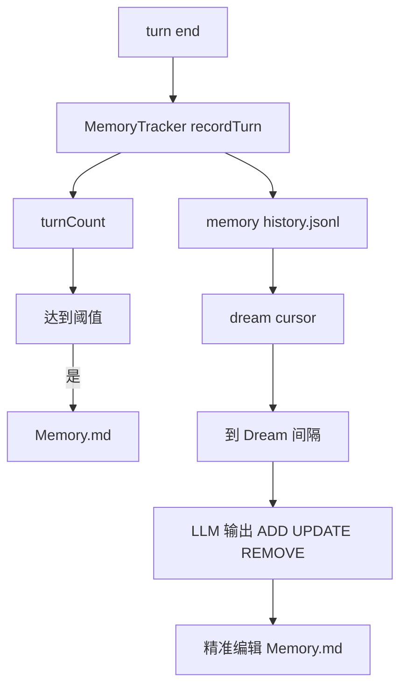
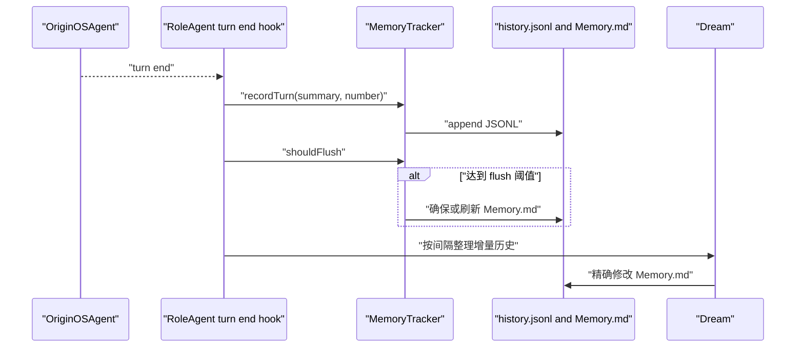

# F9. RoleAgent 记忆与 Dream：记录、落盘、整理不是一件事

> 类型：源码课
> 状态：正式课件
> 本节目标：区分运行时消息、JSONL 历史、Memory.md 摘要与 Dream 编辑，理解为什么“有记忆”必须有增量、阈值和可测试的文件语义。

## 问题

如果把完整对话永远塞进模型上下文，token 会无限增长；如果只保留短摘要，重要事实会丢失。RoleAgent 使用分层记忆：运行时消息支持当前对话，JSONL 保存逐轮历史，`Memory.md` 提供长期可读摘要，Dream 再定期做增量整理。

小黑记录的是原始流水，整理的是长期摘要。这两件事故意分开：整理失败时，原始 JSONL 仍能作为回溯依据。

## 图解

## 源码入口

- [MemoryEntry 与状态类型（第 20 行）](../../../../packages/core/src/lib/integrations/pi-agent/role-agent/memory-tracker.ts#L20)
- [MemoryTracker（第 34 行）](../../../../packages/core/src/lib/integrations/pi-agent/role-agent/memory-tracker.ts#L34)
- [recordTurn（第 60 行）](../../../../packages/core/src/lib/integrations/pi-agent/role-agent/memory-tracker.ts#L60)
- [flush 与 cursor（第 86 行）](../../../../packages/core/src/lib/integrations/pi-agent/role-agent/memory-tracker.ts#L86)
- [MemoryBlockManager（第 206 行）](../../../../packages/core/src/lib/integrations/pi-agent/role-agent/memory-tracker.ts#L206)
- [Dream 配置与指令模板（第 17 行）](../../../../packages/core/src/lib/integrations/pi-agent/role-agent/dream.ts#L17)
- [Dream.run（第 87 行）](../../../../packages/core/src/lib/integrations/pi-agent/role-agent/dream.ts#L87)
- [RoleAgent turn hook（第 162 行）](../../../../packages/core/src/lib/features/services/launcher/role-agent.ts#L162)

## 调用链

注意：当前 `Dream.run` 接收的是外部已得到的 LLM 输出，再解析其中的指令。它本身不在该方法内直接调用模型。这样 Phase 1（分析）和 Phase 2（文件编辑）可分别测试。

## 关键类型

### 四种“记忆”有不同责任

| 载体 | 责任 | 是否适合直接喂给模型 |
| --- | --- | --- |
| Pi Agent messages | 当前会话运行态 | 需要预算与转换 |
| `history.jsonl` | 逐轮可追溯流水 | 不应整文件无选择注入 |
| `Memory.md` | 人与模型都可读的长期摘要 | 可以作为 prompt 的稳定片段 |
| Memory blocks | 可定位、可替换的小块记忆 | 按需要读写 |

把 JSONL 和 `Memory.md` 都称为“记忆”会掩盖它们的不同失败策略：JSONL 追求追加与不丢失，`Memory.md` 追求可读、去重和当前性。

### `recordTurn` 与 flush

[recordTurn（第 60 行）](../../../../packages/core/src/lib/integrations/pi-agent/role-agent/memory-tracker.ts#L60) 将摘要、关键内容、轮次等写成一行 JSON。JSONL 的优点是追加廉价，单行损坏不会让整个文件无法读取。

`shouldFlush` 与 `flushMemory` 管理阈值；默认阈值是 50。阈值不是“50 轮就丢掉旧历史”，而是决定何时处理内存中待刷新的条目。原始 history 仍可保留。

### Dream 的两阶段协议

`DREAM_PHASE1_PROMPT` 要求模型输出 `[ADD]`、`[UPDATE]`、`[REMOVE]`、`[SKILL]`、`[SKIP]`。`Dream.run` 解析并执行文件级变更：

- `ADD`：加入长期记忆；
- `UPDATE`：寻找并替换，找不到时降级追加；
- `REMOVE`：删除匹配行；
- `SKILL`：作为建议记录，不直接修改记忆文件；
- `SKIP`：不做变更。

指令化输出不保证 LLM 永远正确，但把“自由文本总结”收束为可验证的编辑集合。测试可以明确断言每个操作的文件结果。

### cursor 是增量边界

`.dream_cursor` 记录已经被 Dream 消化的 JSONL 条目数。[readRecentHistory（第 139 行）](../../../../packages/core/src/lib/integrations/pi-agent/role-agent/memory-tracker.ts#L139) 从 cursor 后读取历史。没有 cursor，每次整理都会重复分析整段历史，造成成本增加和重复记忆。

## 测试入口

- [JSONL 与 cursor 测试（第 21 行）](../../../../packages/core/src/lib/integrations/pi-agent/role-agent/__tests__/memory-tracker.test.ts#L21)
- [flush 与状态兼容测试（第 92 行）](../../../../packages/core/src/lib/integrations/pi-agent/role-agent/__tests__/memory-tracker.test.ts#L92)
- [Dream 指令模板测试（第 22 行）](../../../../packages/core/src/lib/integrations/pi-agent/role-agent/__tests__/dream.test.ts#L22)
- [ADD/REMOVE/UPDATE/SKIP 测试（第 52 行）](../../../../packages/core/src/lib/integrations/pi-agent/role-agent/__tests__/dream.test.ts#L52)

这些测试比“问模型一次看起来有没有记住”可靠：它们验证确定的文件协议。仍需补充的集成测试是 turn hook 何时真正触发 Dream，以及 cursor 在异常后是否只在成功编辑后推进。

## 逐行精读

1. [构造函数（第 34 行）](../../../../packages/core/src/lib/integrations/pi-agent/role-agent/memory-tracker.ts#L34)：找 `history.jsonl` 和 `.dream_cursor` 的路径。
2. [appendHistoryEntry（第 125 行）](../../../../packages/core/src/lib/integrations/pi-agent/role-agent/memory-tracker.ts#L125)：理解 JSONL 的“一项一行”。
3. [getDreamCursor/setDreamCursor（第 160 行）](../../../../packages/core/src/lib/integrations/pi-agent/role-agent/memory-tracker.ts#L160)：确认它是持久化 cursor。
4. [Dream.run（第 87 行）](../../../../packages/core/src/lib/integrations/pi-agent/role-agent/dream.ts#L87)：读解析、写 Memory.md、生成 `changes` 三步。

## 深度拆解

记忆系统最重要的不是“记得更多”，而是每一层都能解释失败。JSONL 是事实流水，可用于重算；`Memory.md` 是可编辑投影，可被 Dream 修正；cursor 是处理位置；运行时消息是短期工作集。若 Dream 输出有误，应该能回看 history、审阅 changes、重算摘要，而不是只能接受一份不可解释的覆盖文件。

## 常见故障

| 症状 | 先查哪里 | 原因方向 |
| --- | --- | --- |
| Dream 每次重复添加同一事实 | `.dream_cursor`、增量读取 | cursor 未写入或写入时机错误 |
| `Memory.md` 变得很长 | Phase 1 指令、REMOVE/UPDATE | 只追加，没有整理策略 |
| 记忆突然丢失 | `history.jsonl`、Dream changes | 把摘要覆盖当作流水记录 |
| 测试偶尔互相影响 | tempDir、afterEach | 文件测试没有隔离临时目录 |

## 改动场景判断

要把 Dream 间隔从 20 改为 5，不只是改默认值：还要评估 LLM 成本、重复整理、cursor 更新和失败重试。要增加一种指令，先定义解析失败时的行为，再为成功、未知指令、混合指令、文件不存在四类情况写测试。

## 源码追问清单

1. 哪一层保存原始事实，哪一层保存总结？
2. cursor 何时写入才能避免重复或丢失？
3. Dream 的 Phase 1 和 Phase 2 哪个依赖 LLM，哪个可纯单测？
4. `Memory.md` 被人工修改后，Dream 如何避免粗暴覆盖？

## 练习

1. 给出三条对话历史，设计 Dream 输出：一条新增、一条更新、一条删除。
2. 解释为什么 cursor 应代表“已成功处理的条目”，而不是“尝试过的条目”。
3. 写一个测试标题：`[UPDATE]` 找不到旧行时应降级为 `ADD`。

## 验收

你应能：

- 明确区分消息历史、JSONL、Memory.md、memory block；
- 画出 turn end 到 Dream 精准编辑的链路；
- 解释 JSONL 与 cursor 如何支持增量处理；
- 说清 Dream 解析指令和直接调用 LLM 的边界；
- 读懂并扩展现有的 MemoryTracker/Dream 文件测试。
