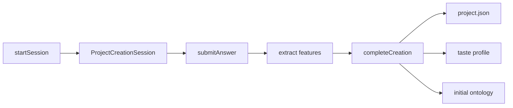
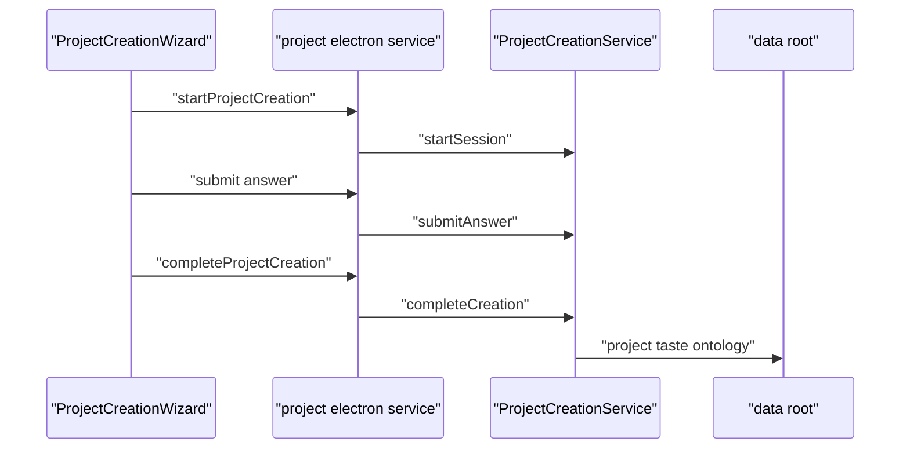

# G1. ProjectCreationService：把向导回答变成项目资产

> 类型：源码课  
> 状态：正式课件

## 问题

“创建项目”不是单纯写一份 `project.json`。它先建立一个可中断的创建 session，逐步收集背景、优先级与协作方式，提取初始特征，最后一次性产出项目元数据、TASTE profile 和初始 ontology。

这张图表达创建流程的核心：回答是输入材料，项目文件只是多个落盘结果之一。

## 图解

## 源码入口

- [ProjectCreationService（第 58 行）](../../../../packages/core/src/lib/features/project/project-creation-service.ts#L58)
- [startSession（第 68 行）](../../../../packages/core/src/lib/features/project/project-creation-service.ts#L68)
- [submitAnswer（第 142 行）](../../../../packages/core/src/lib/features/project/project-creation-service.ts#L142)
- [processAnswer（第 179 行）](../../../../packages/core/src/lib/features/project/project-creation-service.ts#L179)
- [completeCreation（第 237 行）](../../../../packages/core/src/lib/features/project/project-creation-service.ts#L237)
- [向导 UI（第 55 行）](../../../../packages/web/src/components/project/ProjectCreationWizard.tsx#L55)

## 调用链

Web 向导通过 [ProjectCreationWizard 导入（第 12 行）](../../../../packages/web/src/components/project/ProjectCreationWizard.tsx#L12) 的 Electron 服务适配调用。UI 负责本地步骤状态和展示；创建语义、ID、文件写入属于 core service。

## 关键类型

`ProjectCreationSession` 是创建过程中的暂存状态，不能当作最终项目。`sessionId` 以 `pc_` 开头，`projectId` 以 `proj_` 开头，二者在 [ID 生成（第 47 行）](../../../../packages/core/src/lib/features/project/project-creation-service.ts#L47) 就被区分。

`submitAnswer` 要求 session 是 `active`，且 request step 必须等于 `currentStep`。这阻止浏览器跳步骤覆盖数据。`processAnswer` 依步骤写入背景/优先级/工作模式，并提取技术栈、领域、协作边界等派生数据。

`completeCreation` 的四个副作用依次是：建立项目目录和 `project.json`，写 TASTE profile，写初始 ontology，最后把创建 session 标为 `completed`。最后一步必须在前三步成功后执行，否则“完成”会谎报部分失败的创建。

## 测试入口

此 service 当前未见同目录直接单测，是一个测试缺口。应该至少覆盖：未知 session、非 active session、错误 step、回答提取、任一落盘失败时不标完成，以及三个产物路径。

向导层相关行为可从 [ProjectCreationWizard（第 92 行）](../../../../packages/web/src/components/project/ProjectCreationWizard.tsx#L92) 和 [完成调用（第 169 行）](../../../../packages/web/src/components/project/ProjectCreationWizard.tsx#L169) 建立集成测试。

## 逐行精读

1. [saveSession（第 125 行）](../../../../packages/core/src/lib/features/project/project-creation-service.ts#L125) 每次更新 `updatedAt` 后写 JSON。
2. [step 校验（第 149 行）](../../../../packages/core/src/lib/features/project/project-creation-service.ts#L149) 解释为什么不能相信客户端 currentStep。
3. [project.json（第 271 行）](../../../../packages/core/src/lib/features/project/project-creation-service.ts#L271) 区分用户回答与提取出的 metadata。

## 深度拆解

这里有两种本体输出路径：本 service 直接写 `data/ontologies/{projectId}/ontology.json`，而 G4 的 `OntologyService` 使用 `jsonStore`。学习时不要假设“项目所有本体都必然只经一个存储实现”；路径/ID 约定需要被集成测试固定，否则不同入口会读写不同位置。

## 常见故障

| 现象 | 首查 | 原因方向 |
| --- | --- | --- |
| 用户提交后提示 step 无效 | `currentStep` 与 request.step | UI 重复点击或状态过期 |
| 项目存在但没有本体 | `completeCreation` 的落盘顺序 | 中途写入失败未被补偿 |
| 项目领域不准确 | `extractContextFeatures` | 规则式关键词提取的覆盖有限 |

## 改动场景判断

新增问题先改项目创建类型/问题定义和 `processAnswer`，再决定是否影响 `project.json`、TASTE、ontology。只改 UI 步骤不会使核心服务认识新答案；只改 service 又会让向导无法收集它。

## 源码追问清单

1. 这个字段是原始回答还是派生特征？
2. 哪些副作用应当具备失败补偿？
3. 创建重试会产生新项目还是复用旧 session？

## 练习

为“预算范围”增加一个步骤，列出至少四个必须修改/测试的位置，并说明它应进入原始 `data` 还是 `metadata`。

## 验收

你能从向导操作追到创建 session、step 校验、三类产物落盘，并能解释项目 ID 与创建 session ID 的区别。
