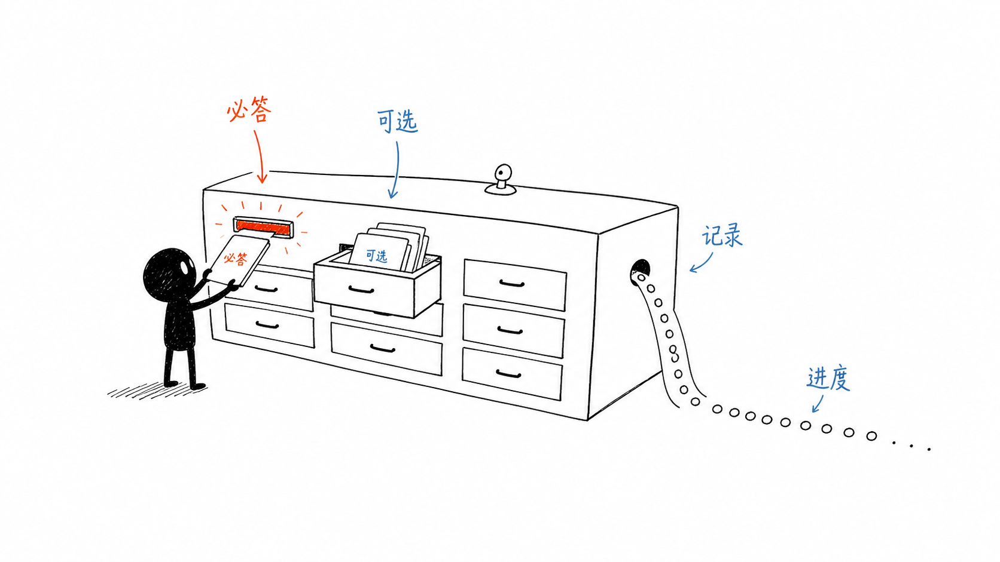
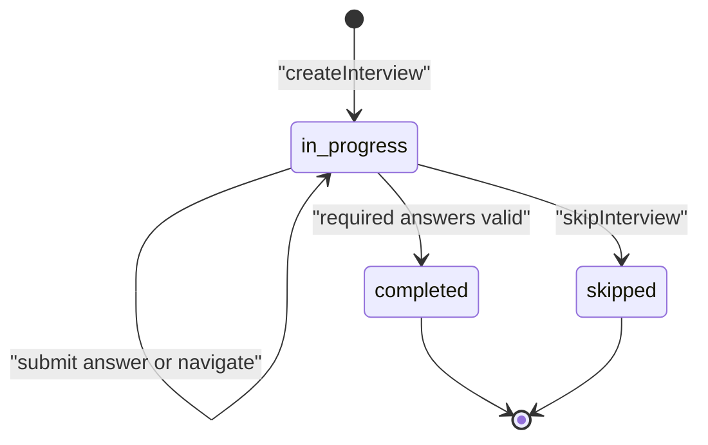
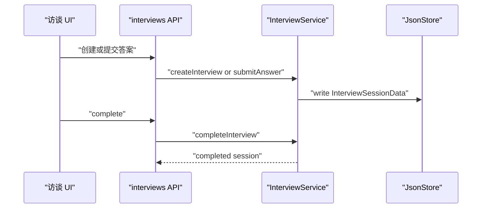

# G2. InterviewService：独立访谈 session 的状态机

> 类型：源码课  
> 状态：正式课件

## 问题

项目创建向导之外，OriginOS 还有独立的 InterviewService。它服务“为一个项目收集结构化回答并生成本体”的流程，状态是 `not_started`、`in_progress`、`completed`、`skipped`，持久化格式遵循 JSON 封套。

“可选”不等于“不保存”；它表示完成校验时可以缺失，而答案一旦提交仍是访谈记录的一部分。

## 图解

## 源码入口

- [Interview 类型与问题集（第 9 行）](../../../../packages/core/src/lib/features/ontology/types.ts#L9)
- [InterviewService（第 21 行）](../../../../packages/core/src/lib/features/ontology/interview.ts#L21)
- [createInterview（第 27 行）](../../../../packages/core/src/lib/features/ontology/interview.ts#L27)
- [submitAnswer（第 95 行）](../../../../packages/core/src/lib/features/ontology/interview.ts#L95)
- [completeInterview（第 196 行）](../../../../packages/core/src/lib/features/ontology/interview.ts#L196)
- [访谈 API（第 9 行）](../../../../packages/web/src/app/api/interviews/route.ts#L9)
- [回答 API（第 9 行）](../../../../packages/web/src/app/api/interviews/[id]/answers/route.ts#L9)

## 调用链

## 关键类型

`InterviewQuestion` 有 `type`、`options`、`required`、提示信息；`QuestionAnswer` 保存 answer 和毫秒时间戳；`InterviewSession` 保存项目归属、所有问题、回答字典和当前位置。

在 [createInterview（第 31 行）](../../../../packages/core/src/lib/features/ontology/interview.ts#L31)，`skipOptional` 决定使用 `getCoreQuestions` 还是全部问题，而不是先创建全部问题再删除。`InterviewSessionData` 用 version/timestamps/data 封套，和 F1/F2 的持久化模式一致。

完成校验在 [completeInterview（第 202 行）](../../../../packages/core/src/lib/features/ontology/interview.ts#L202)：只过滤 `required` 问题，任意必答无答案就拒绝完成。`skipInterview` 是显式终态，不是把完成状态伪装成没有回答。

## 测试入口

当前未发现 InterviewService 的直接单测。应补：核心问题/全部问题选择、必答漏答拒绝、可选漏答可完成、提交不存在问题拒绝、skip 后不能继续提交。

本体生成 API 的前置条件可读 [generate route（第 90 行）](../../../../packages/web/src/app/api/ontology/generate/route.ts#L90)：它读取指定访谈再调用 ontology service。

## 逐行精读

1. [getProjectInterviews（第 74 行）](../../../../packages/core/src/lib/features/ontology/interview.ts#L74) 是读取目录后按 projectId 过滤的实现。
2. [submitAnswers（第 132 行）](../../../../packages/core/src/lib/features/ontology/interview.ts#L132) 说明批量写入如何一次更新进度。
3. [getNextQuestionIndex（第 306 行）](../../../../packages/core/src/lib/features/ontology/interview.ts#L306) 返回第一个未答问题，而非简单加一。

## 深度拆解

`shouldAdvanceQuestion` 当前实现最终总是返回 true；注释看似表达可选题跳过，实际没有额外阻塞规则。读源码时必须以返回值为准，不能只相信注释。若未来加入条件题，进度模型需要明确“跳过”“未答”“不可见”三种不同状态。

## 常见故障

| 现象 | 首查 | 原因方向 |
| --- | --- | --- |
| 完成被拒绝 | required questions 与 answers | 空字符串/空数组不算回答 |
| 项目列表找不到访谈 | projectId | 读取后过滤归属不一致 |
| UI 题目跳回前面 | getNextQuestionIndex | 批量答案中仍有未答题 |

## 改动场景判断

新增问题要判断它是否 required、是否应进入 `getCoreQuestions`。改变 question ID 是破坏性变更：旧 answers 的 key 不会自动迁移。

## 源码追问清单

1. `skipped` 后能否重新开启，谁负责迁移状态？
2. answer 是否需要更严格的类型/长度验证？
3. 哪个 API 负责把访谈变成本体？

## 练习

设计一条“团队规模”为可选题的测试：空答可以 complete，填写后必须保留时间戳。

## 验收

你能区分 ProjectCreationSession 与 InterviewSession，画出访谈四态，并解释完成校验不等于所有问题都有回答。
