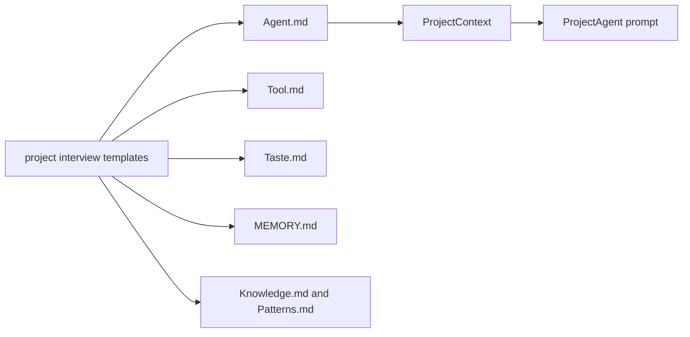
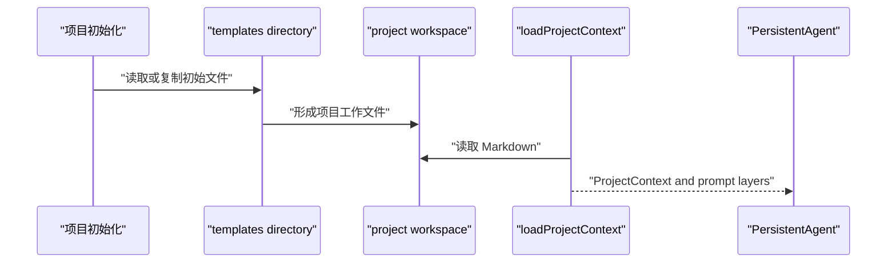

# G3. project-interview 模板：项目 Agent 的初始工作记忆

> 类型：源码课  
> 状态：正式课件

## 问题

模板不是文档附件。`templates/project-interview` 定义了项目访谈助手初始具有什么身份、可调用什么工具、如何表达、如何保存记忆和经验。它会成为 ProjectAgent 工作目录中文件的起点。

## 图解

## 源码入口

- [Agent 身份模板（第 1 行）](../../../../templates/project-interview/Agent.md#L1)
- [工具模板（第 1 行）](../../../../templates/project-interview/Tool.md#L1)
- [风格模板（第 1 行）](../../../../templates/project-interview/Taste.md#L1)
- [记忆模板（第 1 行）](../../../../templates/project-interview/MEMORY.md#L1)
- [知识模板（第 1 行）](../../../../templates/project-interview/Knowledge.md#L1)
- [模式模板（第 1 行）](../../../../templates/project-interview/Patterns.md#L1)
- [ProjectContext 加载器（第 93 行）](../../../../packages/core/src/lib/integrations/pi-agent/project-agent/project-context.ts#L93)

## 调用链

模板与运行时加载器的文件名必须对齐。当前 loader 对记忆文件兼容 `Memory.md`/`MEMORY.md`，见 [readProjectMemoryFile（第 57 行）](../../../../packages/core/src/lib/integrations/pi-agent/project-agent/project-context.ts#L57)；不要据此假设所有模板文件都大小写兼容。

## 关键类型

`Agent.md` 提供身份、职责、阶段判断和对话原则；`Tool.md` 的 frontmatter/内容描述允许工具；`Taste.md` 约束语言与协作风格；`MEMORY.md` 预留项目事实、实体、关系、决策、待确认项；Knowledge/Patterns 为认知快照入口。

模板内容不是强制权限的唯一来源。真正的工具可用性仍需经过 F6 的 ToolRegistry scope 与 F7 的工作目录绑定。换句话说，Tool.md 是“角色被告知可怎样工作”，registry 是“运行时实际给了什么能力”。

## 测试入口

模板目录本身没有直接测试。应写集成测试：从模板建目录后 `loadProjectContext` 成功；缺 `Agent.md` 失败；`MEMORY.md` 可被加载；Tool.md 声明不会绕过 registry 授权。

## 逐行精读

1. 读 [Agent.md 阶段判断（第 97 行）](../../../../templates/project-interview/Agent.md#L97)：区分自然语言指导与程序状态机。
2. 读 [Tool.md 文件工具（第 10 行）](../../../../templates/project-interview/Tool.md#L10)：它描述工具，不实现工具。
3. 读 [MEMORY.md 待确认问题（第 21 行）](../../../../templates/project-interview/MEMORY.md#L21)：它让访谈不把不确定信息伪装成事实。

## 深度拆解

模板是初始条件，不是 immutable source。项目运行后会写记忆、知识、模式；因此升级模板不能无条件覆盖已存在项目文件。G10 的 skill provisioning “只补缺失”同样适用于模板迁移：需要明确新文件、缺失段落、用户自定义内容的兼容策略。

## 常见故障

| 现象 | 首查 | 原因方向 |
| --- | --- | --- |
| Agent 没有访谈身份 | Agent.md 是否进入项目目录 | 只保留模板，未初始化工作区 |
| 声明工具却不能调用 | Tool.md 与 registry | 误把说明文件当授权系统 |
| 重启后记忆没加载 | 文件名/路径 | Memory 大小写或目录不一致 |

## 改动场景判断

改对话文案通常只影响模板；改工具权限必须同时审查 `Tool.md`、registry scope、prompt layer 和测试。新增持续记忆区块要考虑 Dream/MemoryCore 是否会读写同一文件，避免两个系统互相覆盖。

## 源码追问清单

1. 此文件由谁创建、谁更新、谁读取？
2. 缺失时应失败还是生成默认内容？
3. 它是说明性文本还是可执行配置？

## 练习

为“风险登记”设计一个模板区块，并说明它应放入 Memory、Knowledge 还是 Patterns。

## 验收

你能说出六份模板文件的职责，并能解释模板说明、运行时权限和持久记忆的边界。
