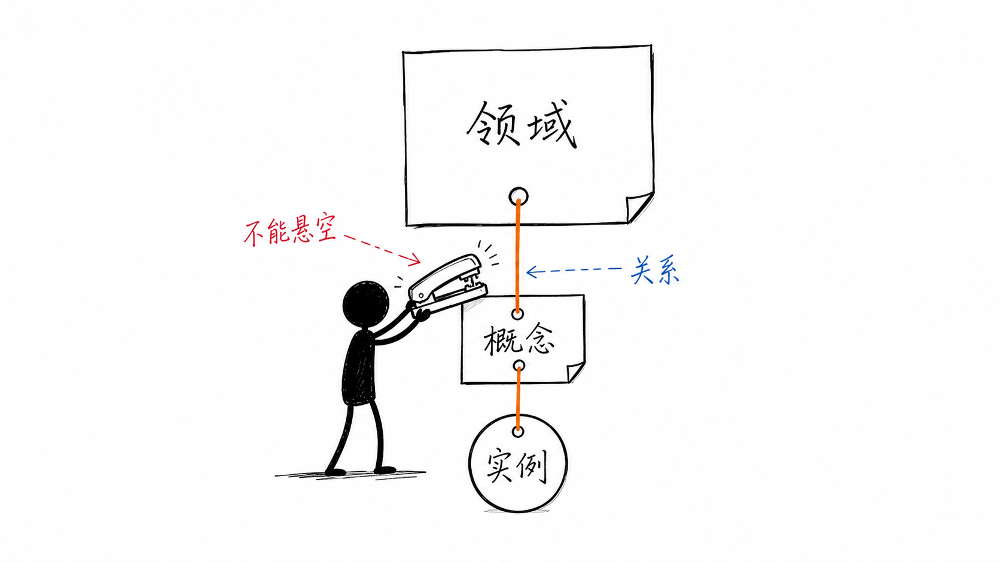
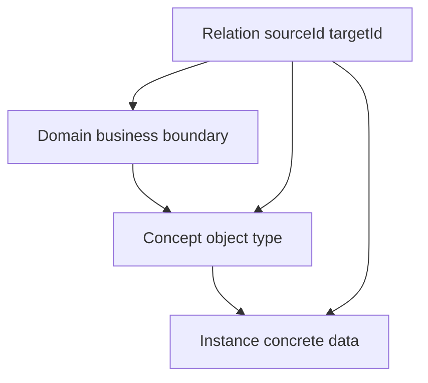
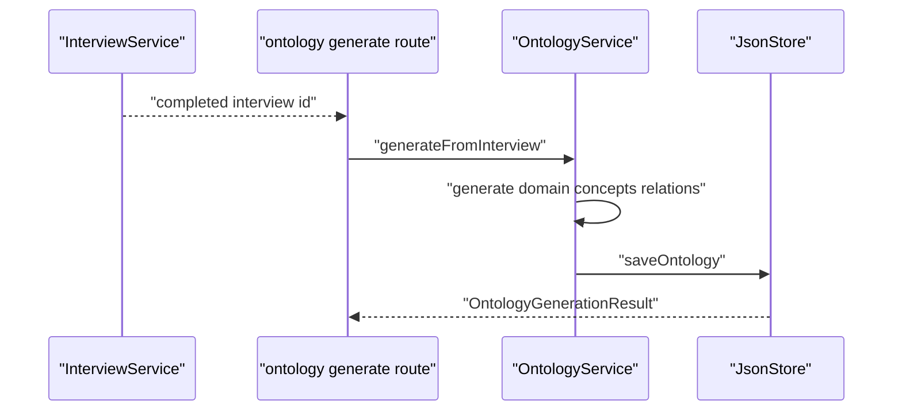

# G4. OntologyService：领域、概念、实例、关系的业务模型

> 类型：源码课  
> 状态：正式课件

## 问题

本体不是“画几个节点”。它用 Domain 表达业务边界，用 Concept 表达可分类对象，用 Instance 表达具体数据，用 Relation 表达实体间关系。访谈结果被 OntologyService 转成第一版结构，之后编辑操作要维持这些引用关系。

## 图解

## 源码入口

- [本体公共类型（第 1 行）](../../../../packages/core/src/types/ontology.ts#L1)
- [OntologyService（第 25 行）](../../../../packages/core/src/lib/features/ontology/ontology-builder.ts#L25)
- [generateFromInterview（第 31 行）](../../../../packages/core/src/lib/features/ontology/ontology-builder.ts#L31)
- [applyEdits（第 143 行）](../../../../packages/core/src/lib/features/ontology/ontology-builder.ts#L143)
- [domain 编辑（第 211 行）](../../../../packages/core/src/lib/features/ontology/ontology-builder.ts#L211)
- [访谈转本体 API（第 90 行）](../../../../packages/web/src/app/api/ontology/generate/route.ts#L90)

## 调用链

## 关键类型

`Ontology` 聚合 domains、concepts、instances、relations 与版本/时间；Concept 用 `domainId` 归属 Domain；Relation 使用 `sourceId`、`targetId` 和 type。真正的难点不是定义数组，而是保持引用不悬空。

[generateFromInterview（第 39 行）](../../../../packages/core/src/lib/features/ontology/ontology-builder.ts#L39) 从 work domain、mode、tasks、tools、goals 提取初始结构。它是规则式生成，不是“理解全部业务”的 LLM；结果应被视为可编辑起点。

[applyEdits（第 143 行）](../../../../packages/core/src/lib/features/ontology/ontology-builder.ts#L143) 逐个应用操作并累计 errors，最后仍保存 ontology。若部分操作失败，返回 `success: false` 但携带更新后的对象，调用者必须检查 errors，不能只看是否拿到 ontology。

## 测试入口

当前未见 OntologyService 直接单测。应覆盖：访谈生成至少一个 domain/多个 concept、概念引用不存在 domain 的拒绝、删除 domain 后清理相关 concept/relation、relation source/target 缺失拒绝，以及部分批量编辑的返回语义。

## 逐行精读

1. [saveOntology（第 121 行）](../../../../packages/core/src/lib/features/ontology/ontology-builder.ts#L121) 写入 version/timestamps/data 封套。
2. [operation 分派（第 184 行）](../../../../packages/core/src/lib/features/ontology/ontology-builder.ts#L184) 按 entityType 进入四种编辑器。
3. [删除 domain（第 246 行）](../../../../packages/core/src/lib/features/ontology/ontology-builder.ts#L246) 显示级联清理的必要性。

## 深度拆解

AGENTS 规定三层模型，但 relation 可以连接不同层的 ID。删除策略必须写清：删 Domain 是否删 Concept/Instance，删 Concept 是否删 Instance，删 Instance 如何处理 relation。当前 Domain 删除清理 concept/relation 的语义与其他层是否一致，需要专门测试，不应靠直觉推断。

## 常见故障

| 现象 | 首查 | 原因方向 |
| --- | --- | --- |
| 图上出现孤儿节点 | 删除操作 | 未级联清理引用 |
| 生成本体很空 | interview answers | 必答信息不足或规则覆盖不到 |
| 编辑返回对象却实际失败 | `errors` | 忽略批量操作的部分失败 |

## 改动场景判断

新增实体种类时要同时改类型、operation 分派、生成逻辑、存储/展示和测试。只在 UI 放一个新节点类型不会让 builder 知道如何验证和保存它。

## 源码追问清单

1. 每类 ID 的所有权和删除策略是什么？
2. 初始生成与人工编辑是否使用同一存储格式？
3. 批量操作是原子的吗？

## 练习

为“客户属于企业”设计 Domain、两个 Concept、两个 Instance 和一条 Relation，并说明删除企业时应如何处理客户。

## 验收

你能区分四个本体对象，追出访谈到初始本体的调用链，并能识别级联删除与部分编辑失败风险。
