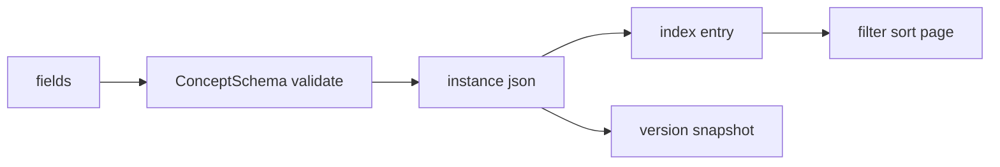
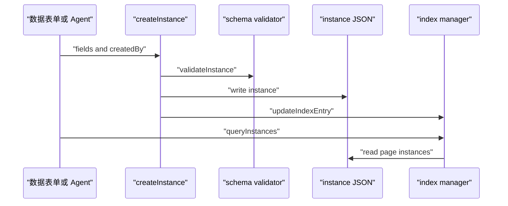

# G5. Ontology Data Store：实例 JSON、索引、查询与版本

> 类型：源码课  
> 状态：正式课件

## 问题

G4 的本体模型描述“有什么”；数据存储解决“每个 Concept 下大量 Instance 怎么安全存、校验、查和回溯”。这里不是一个大 JSON 文件，而是实例文件、概念 schema、索引和版本快照协作。

## 图解

## 源码入口

- [InstanceData 与 ConceptSchema（第 11 行）](../../../../packages/core/src/lib/features/ontology-data-store/types.ts#L11)
- [createInstance（第 28 行）](../../../../packages/core/src/lib/features/ontology-data-store/store.ts#L28)
- [update/delete（第 108 行）](../../../../packages/core/src/lib/features/ontology-data-store/store.ts#L108)
- [queryInstances（第 9 行）](../../../../packages/core/src/lib/features/ontology-data-store/query-engine.ts#L9)
- [路径配置测试（第 6 行）](../../../../packages/core/src/lib/features/ontology-data-store/__tests__/config.test.ts#L6)
- [数据存储测试（第 115 行）](../../../../packages/core/src/lib/features/ontology-data-store/__tests__/ontology-data-store.test.ts#L115)

## 调用链

## 关键类型

`InstanceData` 把 identity、concept/domain/ontology 归属、`fields` 和 `meta` 分开。`meta.version` 是单实例版本，不要与文件格式的版本或 ontology 整体版本混淆。

[createInstance（第 35 行）](../../../../packages/core/src/lib/features/ontology-data-store/store.ts#L35) 先检查 ID，防路径穿越；再加载 schema、自动填充 `autoGenerated` 字段、校验 fields，最后写实例和索引。写实例成功但索引失败会造成“文件存在、查询不可见”的一致性风险，应该在生产改动中考虑补偿/重建索引。

查询不会扫全量实例：[queryInstances（第 14 行）](../../../../packages/core/src/lib/features/ontology-data-store/query-engine.ts#L14) 先对索引摘要过滤、排序、分页，最后只读取当前页实例。这是本地 JSON 存储仍能做基础查询的关键。

## 测试入口

[ontology-data-store.test.ts（第 4 行）](../../../../packages/core/src/lib/features/ontology-data-store/__tests__/ontology-data-store.test.ts#L4) 覆盖 ID、防穿越、索引、schema、CRUD、查询和版本。特别读：路径穿越拒绝 [第 127 行](../../../../packages/core/src/lib/features/ontology-data-store/__tests__/ontology-data-store.test.ts#L127)、必填字段 [第 248 行](../../../../packages/core/src/lib/features/ontology-data-store/__tests__/ontology-data-store.test.ts#L248)、创建写文件并更新索引 [第 293 行](../../../../packages/core/src/lib/features/ontology-data-store/__tests__/ontology-data-store.test.ts#L293)。

## 逐行精读

1. [autoGenerated 注入（第 41 行）](../../../../packages/core/src/lib/features/ontology-data-store/store.ts#L41)：系统字段不能要求上游手填。
2. [updateInstance（第 108 行）](../../../../packages/core/src/lib/features/ontology-data-store/store.ts#L108)：先合并、再全量校验、再 `version + 1`。
3. [listInstances（第 87 行）](../../../../packages/core/src/lib/features/ontology-data-store/store.ts#L87)：索引引用已删文件时选择跳过。

## 深度拆解

`domainId` 在 create 时目前写为 `""`，而 schema 有 domainId。读者应将其标为模型完整性审查点：若 Instance 需要稳定领域归属，就应从 schema 推导或显式传入，并用测试约束。不要因代码能写 JSON 就假定所有类型字段都已正确填充。

## 常见故障

| 现象 | 首查 | 原因方向 |
| --- | --- | --- |
| 创建后查询不到 | index manager | 实例/索引不一致 |
| 字段被拒绝 | ConceptSchema | required/type/enum 不匹配 |
| 老 ontology 找不到 schema | config id normalization | ontology ID 兼容路径不同 |

## 改动场景判断

新增字段类型要同步 types、schema-validator、导出和测试；只放进 `fields` 是无约束的隐式协议。改变 ID 规范要优先补兼容测试，见 config test 的 legacy/wrapped ID 用例。

## 源码追问清单

1. 实例写入和索引写入是否能原子化？
2. 索引损坏后如何重建？
3. version snapshot 与 update 的顺序是什么？

## 练习

为 `Customer.status` 设计 enum 校验，并写出 create、update、filter 三条测试。

## 验收

你能画出“schema 校验 -> 实例文件 -> 索引 -> 查询”的链路，并能说明 ID 安全、索引一致性和版本三种不同问题。
