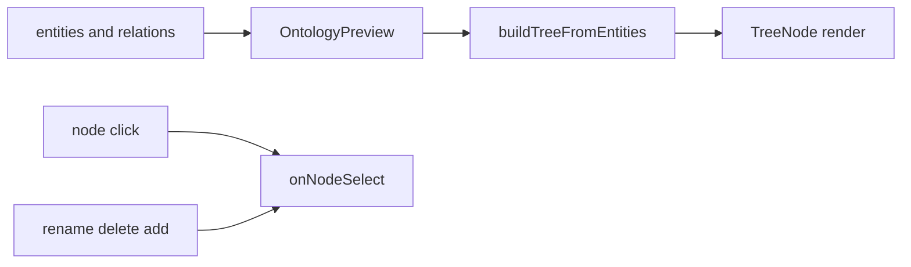
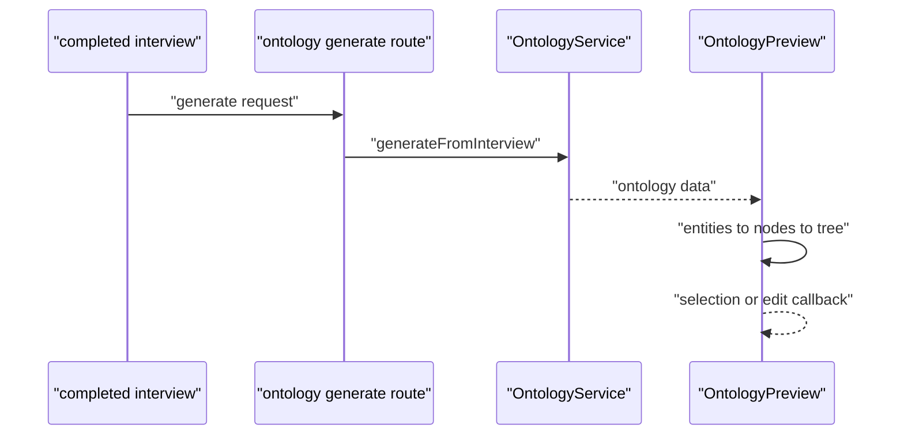

# G6. OntologyPreview：当前是可编辑树，不是真实关系图

> 类型：源码课  
> 状态：正式课件

## 问题

课程大纲最初写“图谱节点与关联高亮”，但必须以源码为准：当前 `OntologyPreview` 把 entities 转成层级树，relations 虽在 props 中出现，却没有被真正用于建图。它适合预览/编辑初始结构，但不能宣称已实现关系图谱。

## 图解

## 源码入口

- [OntologyPreview props/node（第 17 行）](../../../../packages/web/src/components/os/ontology-preview/OntologyPreview.tsx#L17)
- [buildTreeFromEntities（第 89 行）](../../../../packages/web/src/components/os/ontology-preview/OntologyPreview.tsx#L89)
- [关系未用于层级构建的注释（第 108 行）](../../../../packages/web/src/components/os/ontology-preview/OntologyPreview.tsx#L108)
- [生成 API（第 9 行）](../../../../packages/web/src/app/api/ontology/generate/route.ts#L9)
- [ProjectWorkspace 本体 Tab（第 15 行）](../../../../packages/web/src/components/os/workspace/ProjectWorkspace.tsx#L15)

## 调用链

## 关键类型

`OntologyPreviewProps.ontology` 接受 `entities` 和 `relations`，`OntologyNode` 则存 `children`、`relations`、level、parentId。类型上保留 relations 不等于实现已使用它。

[buildTreeFromEntities（第 89 行）](../../../../packages/web/src/components/os/ontology-preview/OntologyPreview.tsx#L89) 先建 node map，再根据 entity properties 中 `project` 或 `assignee` 字段推父子关系。没有这些属性就作为 root。它是业务属性驱动的简化树，不是通用 relation layout engine。

`onNodeSelect`、rename/delete/add 都是回调；组件本身不调用 OntologyService 保存编辑。这符合组件层职责，但也意味着父组件/API 必须负责持久化和失败反馈。

## 测试入口

当前未见 OntologyPreview 专门测试。应补：entities 转树、project/assignee 父子关系、无父属性为 root、点击 callback、编辑回调、不把 relations 误展示为已连接图。

## 逐行精读

1. [props state（第 29 行）](../../../../packages/web/src/components/os/ontology-preview/OntologyPreview.tsx#L29)：`generating` 到 `success` 是预览 UI 状态，不是 ontology 业务状态。
2. [node map（第 89 行）](../../../../packages/web/src/components/os/ontology-preview/OntologyPreview.tsx#L89)：先创建所有节点才能解决父节点在后出现。
3. [简化实现注释（第 108 行）](../../../../packages/web/src/components/os/ontology-preview/OntologyPreview.tsx#L108)：这是功能缺口的直接证据。

## 深度拆解

真实图谱至少需要 relation source/target 映射、布局算法、关联高亮、孤儿/循环处理和编辑一致性。把树组件改成图谱不是“补一条 SVG 线”，会改变数据转换、交互、性能与测试，应该走 Story/OpenSpec。

## 常见故障

| 现象 | 首查 | 原因方向 |
| --- | --- | --- |
| relation 数据存在但无连线 | 第 108 行 | 当前实现未使用 relations |
| 节点层级不符合预期 | `project`/`assignee` props | 数据模型不匹配树规则 |
| 改名 UI 成功但刷新丢失 | 父级 callback | 没有调用保存 API |

## 改动场景判断

若只是调整树展示，改组件与组件测试；若要求“点击关系高亮”，必须先定义 relation 映射和图形渲染边界。不要在当前 `buildTreeFromEntities` 中塞入大量图算法。

## 源码追问清单

1. relations 应由哪个字段映射到 source/target node？
2. 编辑回调最终在哪个 API 持久化？
3. 50+ 节点时如何满足 AGENTS 的图谱虚拟化规约？

## 练习

写一条测试证明：当前 relations 数组即使非空，也不会改变 `buildTreeFromEntities` 的父子结果。

## 验收

你能准确描述当前 UI 已实现的树能力和未实现的图谱能力，并不会把类型字段误当成功能证据。
