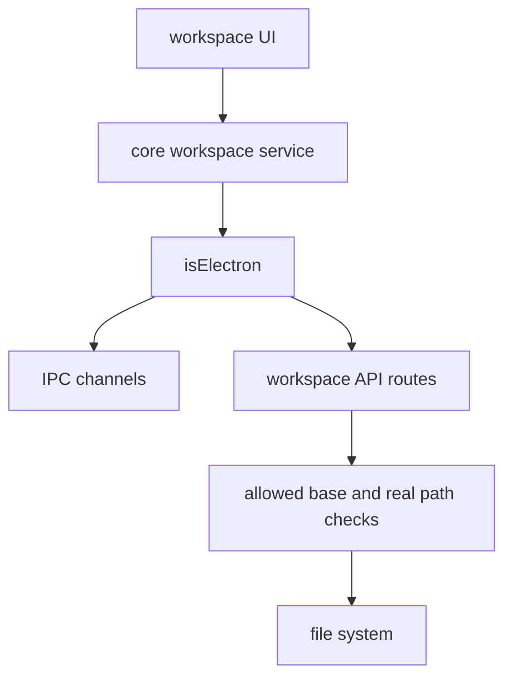
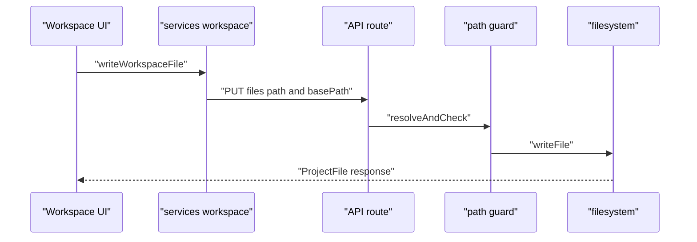

# G7. Workspace：同一文件操作在 Web 与 Electron 的双通道边界

> 类型：源码课  
> 状态：正式课件

## 问题

工作区要列文件、读写、删除、上传；Web 模式通过 API route，Electron 模式通过 IPC。上层 Hook 不能到处判断平台和拼绝对路径，因此 core workspace service 先选择传输通道，Web route 再执行路径安全检查。

## 图解

## 源码入口

- [workspace 服务分流（第 25 行）](../../../../packages/core/src/lib/integrations/electron/services/workspace.ts#L25)
- [Web files list route（第 57 行）](../../../../packages/web/src/app/api/workspace/files/route.ts#L57)
- [文件读写删除 route（第 76 行）](../../../../packages/web/src/app/api/workspace/files/[...filePath]/route.ts#L76)
- [workspace resolve route（第 46 行）](../../../../packages/web/src/app/api/workspace/resolve/route.ts#L46)
- [upload 安全检查（第 137 行）](../../../../packages/web/src/app/api/workspace/upload/route.ts#L137)
- [路径映射测试（第 4 行）](../../../../packages/core/src/lib/hooks/__tests__/use-workspace.test.ts#L4)

## 调用链

## 关键类型

`basePath` 是服务端已解析的工作区根，不是前端可随意传的任意绝对路径。[resolve route（第 2 行）](../../../../packages/web/src/app/api/workspace/resolve/route.ts#L2) 明确前端不构造路径；project/agent/role-agent/skill 各有 resolver。

files list route 通过 `ALLOWED_BASES` 限制 data、skills、tmp。文件 route 的 `resolveAndCheck` 将相对路径与 base 组合并检测越界。上传更严格：检查速率、真实路径、文件名、大小、MIME 类型，并将上传记录写进 agent 上下文。

`ProjectWorkspace` 的数据/本体/方案 tabs 只是项目工作区子视图；[方案 tab（第 41 行）](../../../../packages/web/src/components/os/workspace/ProjectWorkspace.tsx#L41) 仍是“即将推出”，不能把 UI 占位当作完整方案工作流。

## 测试入口

- [路径穿越与 CWD 相关测试（第 1 行）](../../../../packages/core/src/lib/integrations/electron/__tests__/workspace-paths.test.ts#L1)
- [Windows 路径归一化（第 4 行）](../../../../packages/core/src/lib/hooks/__tests__/use-workspace.test.ts#L4)
- [目录树补全测试（第 5 行）](../../../../packages/web/src/components/os/workspace/__tests__/DirectoryTree.test.ts#L5)

需补 API 集成测试：allowed base、`..` 拒绝、符号链接逃逸、读写删除权限、上传 rate limit/MIME/500MB 边界。

## 逐行精读

1. [isElectron 分流（第 25 行）](../../../../packages/core/src/lib/integrations/electron/services/workspace.ts#L25) 保持上层 API 一致。
2. [list assertAllowed（第 18 行）](../../../../packages/web/src/app/api/workspace/files/route.ts#L18) 是字符串规范化边界。
3. [upload realpath 校验（第 164 行）](../../../../packages/web/src/app/api/workspace/upload/route.ts#L164) 防止创建后通过链接逃逸。

## 深度拆解

仅用 `startsWith` 做路径限制不足以对抗符号链接，因此 upload route 又调用 `assertRealPathWithin`。不同 route 的安全强度不应被想当然视为相同；增补文件 API 时应复用 workspace-paths 的统一安全函数，而不是复制简化的字符串判断。

## 常见故障

| 现象 | 首查 | 原因方向 |
| --- | --- | --- |
| Web 可用 Electron 不可用 | service `isElectron` 分流 | IPC channel/handler 不一致 |
| 返回 403 | basePath/allowed bases | 前端直接拼了未授权路径 |
| Windows 树层级错 | path normalization | 反斜杠未转为 `/` |

## 改动场景判断

新增操作应先加 core service 的统一方法，再分别实现 API/IPC，最后让 Hook/UI 调用统一方法。直接在 React 组件 `fetch` 会绕开 Electron 兼容和测试边界。

## 源码追问清单

1. 这个操作在两种运行模式是否语义一致？
2. 文件路径经过了哪些规范化和真实路径检查？
3. 上传结果如何进入 Agent 可见上下文？

## 练习

为一个“重命名文件”能力列出 Web route、IPC、core service、路径安全、UI、测试六类改动。

## 验收

你能追出一次读写从 UI 到 API/IPC 再到文件系统，并能解释为什么 `basePath` 解析与路径安全是服务端责任。
