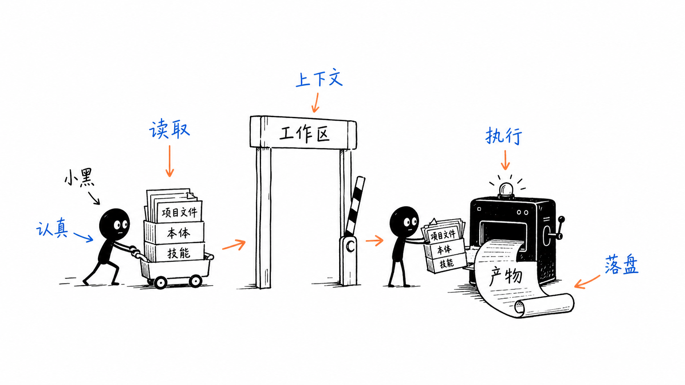
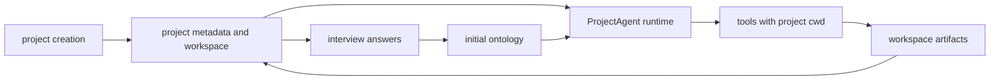
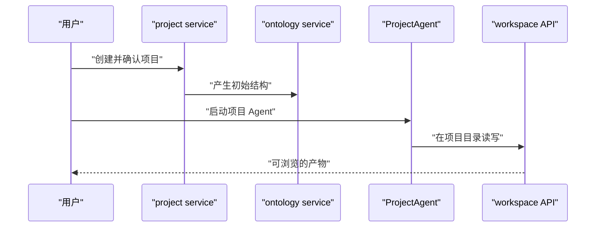

# G8. 项目到 Agent：从创建输入到可追溯产物的完整链路

> 类型：源码课  
> 状态：正式课件

## 问题

项目、访谈、本体、工作区和 Agent 不是五个独立功能。完整用户价值是：用户建立项目上下文，系统将其转为结构和文件，Agent 在明确 CWD 与工具边界内执行，产物写回项目工作区，下一轮再从该工作区恢复。

## 图解

## 源码入口

- [项目创建完成（第 237 行）](../../../../packages/core/src/lib/features/project/project-creation-service.ts#L237)
- [独立访谈创建（第 27 行）](../../../../packages/core/src/lib/features/ontology/interview.ts#L27)
- [本体生成（第 31 行）](../../../../packages/core/src/lib/features/ontology/ontology-builder.ts#L31)
- [ProjectAgent 启动（第 54 行）](../../../../packages/core/src/lib/integrations/pi-agent/persistent-agent-manager.ts#L54)
- [工作区解析（第 46 行）](../../../../packages/web/src/app/api/workspace/resolve/route.ts#L46)
- [工具 CWD 绑定（第 22 行）](../../../../packages/core/src/lib/integrations/pi-agent/tools/bind-session.ts#L22)

## 调用链

## 关键类型

链路中有三个 ID 不应混：项目 `projectId`，访谈 `interviewId`，会话 `sessionId`。项目是长期业务容器；访谈是一次信息收集；session 是一次 Agent 对话。用 projectId 恢复 Agent runtime 会把多个会话意外合并，用 sessionId 找项目文件又会失去稳定目录归属。

ProjectAgent 的 `ProjectContext` 读取项目目录文件并构建 prompt；工具层只接收 `workingDirectory`。这是跨层信息逐步收窄：上层有项目语义，底层只有执行所需 CWD，避免工具依赖 Web 页面或项目详情对象。

## 测试入口

本完整链路没有单一 E2E 测试入口，应拆为：项目创建 service 测试、Interview/Ontology 集成、ProjectAgent 启动测试、工具 CWD 测试、workspace API 与 UI 测试。F7 的 [工作目录端到端模拟（第 214 行）](../../../../packages/core/src/lib/integrations/pi-agent/tools/__tests__/working-directory.test.ts#L214) 是其中关键一段，不是全流程证明。

## 逐行精读

1. [completeCreation（第 266 行）](../../../../packages/core/src/lib/features/project/project-creation-service.ts#L266) 的落盘顺序。
2. [startAgent（第 54 行）](../../../../packages/core/src/lib/integrations/pi-agent/persistent-agent-manager.ts#L54) 的项目上下文装配。
3. [resolveProjectDir（第 18 行）](../../../../packages/web/src/app/api/workspace/resolve/route.ts#L18) 的项目目录兼容候选。

## 深度拆解

“生成了文件”不是闭环证据。闭环至少要求：文件落在项目目录、workspace 能安全列出、下次 Agent 启动能读到、用户能从 UI 查看。这四个边界分别由项目服务、workspace 安全、ProjectContext 和组件实现，任何一处绕开都会形成孤儿产物。

## 常见故障

| 现象 | 首查 | 原因方向 |
| --- | --- | --- |
| Agent 看不到刚生成的文件 | 工作目录/ProjectContext | 产物写入目录与启动目录不同 |
| UI 能列文件 Agent 不能读 | tool context | workspace basePath 没转成 Agent CWD |
| 一次访谈污染另一项目 | interview.projectId | ID/目录隔离丢失 |

## 改动场景判断

新增项目产物类型时，要同步它的生成点、目录规约、workspace 展示、Agent prompt/工具可读性与清理策略。只在 Agent prompt 写“请生成”不构成可交付流程。

## 源码追问清单

1. 每种 ID 由谁生成、在哪个目录作为主键使用？
2. 产物是否能在进程重启后被重新发现？
3. UI 和 Agent 是否使用同一项目根目录语义？

## 练习

把“上传客户资料后由 ProjectAgent 生成业务模型”画成调用序列，并列出至少一个失败/回滚点。

## 验收

你能完整讲清项目创建、访谈/本体、Agent 启动、工具 CWD、工作区产物如何串联，也能指出这条链路需要分层验证而非只跑一个单测。
