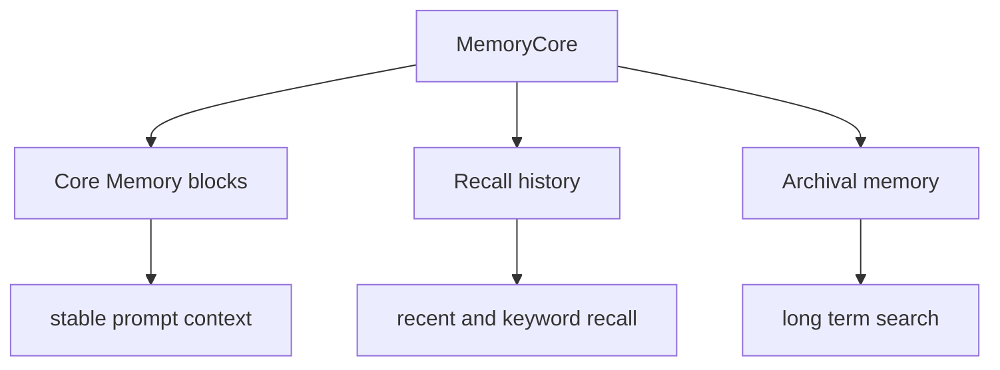
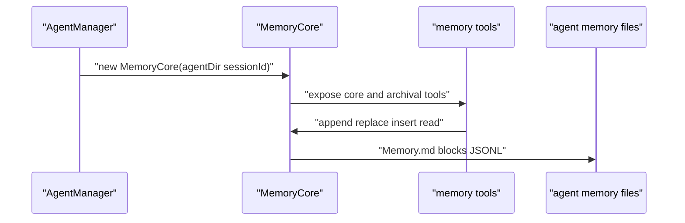

# H1. MemoryCore：三层记忆的统一门面

> 类型：源码课  
> 状态：正式课件

## 问题

Agent 需要“当前稳定事实”“可搜索的长期资料”“本会话对话回忆”，但三者的写入、读取、大小与生命周期不同。MemoryCore 不把它们混成一个 JSON，而是统一装配 Core、Archival、Recall 和记忆工具。

## 图解

## 源码入口

- [MemoryCore（第 14 行）](../../../../packages/core/src/modules/memory-core/core/memory-core.ts#L14)
- [Memory block CRUD（第 32 行）](../../../../packages/core/src/modules/memory-core/core/memory.ts#L32)
- [CoreMemoryTools（第 10 行）](../../../../packages/core/src/modules/memory-core/tools/core-memory-tools.ts#L10)
- [Recall 测试（第 12 行）](../../../../packages/core/src/modules/memory-core/__tests__/recall.test.ts#L12)
- [Archival 测试（第 13 行）](../../../../packages/core/src/modules/memory-core/__tests__/archival.test.ts#L13)

## 调用链

## 关键类型

[MemoryCore constructor（第 22 行）](../../../../packages/core/src/modules/memory-core/core/memory-core.ts#L22) 接受 `agentDir` 和 `sessionId`。前者隔离 Agent/项目记忆目录，后者隔离 Recall 的会话历史。它创建 `Memory`、`ArchivalMemory`、`RecallMemory` 以及两套工具；`shutdown` 才统一持久化 core/archival。

Core block 适合稳定、受长度约束的上下文；Recall 把 turn 追加 JSONL；Archival 支持长期插入和搜索。三层不要互相替代：把对话全塞 Core 会突破 block limit，把长期事实只放 Recall 又难以跨会话检索。

## 测试入口

- [默认 block、读写、限制测试（第 13 行）](../../../../packages/core/src/modules/memory-core/__tests__/memory.test.ts#L13)
- [Recall JSONL/cursor 测试（第 25 行）](../../../../packages/core/src/modules/memory-core/__tests__/recall.test.ts#L25)
- [Archival 插入、检索、持久化（第 26 行）](../../../../packages/core/src/modules/memory-core/__tests__/archival.test.ts#L26)

## 逐行精读

1. [shutdown（第 35 行）](../../../../packages/core/src/modules/memory-core/core/memory-core.ts#L35) 用并行保存结束生命周期。
2. [compile（第 143 行）](../../../../packages/core/src/modules/memory-core/core/memory.ts#L143) 可输出 markdown/xml，供 prompt 使用。
3. [block limit（第 53 行）](../../../../packages/core/src/modules/memory-core/core/memory.ts#L53) 是产品不变量而非 UI 提示。

## 深度拆解

`Memory.save()` 同时写 `Memory.md` 与 `blocks.json` 快照，并保留最后 10 个版本。前者便于人读，后者保留结构/版本回溯。修改序列化格式时必须同时考虑 parse、历史版本和人工编辑后的兼容。

## 常见故障

| 现象 | 首查 | 原因 |
| --- | --- | --- |
| 不同会话回忆混在一起 | Recall sessionId | 使用默认 sessionId |
| 记忆超限 | block limit | 把流水日志写入核心块 |
| 重启丢长期内容 | shutdown/persist | 只改内存未保存 |

## 改动场景判断

新增“记忆”前先判断它是稳定 prompt、可检索事实还是逐轮历史；对应的是 Core、Archival、Recall，不要先新增一个无语义的文件。

## 源码追问清单

1. 该信息要跨 session 吗？
2. 它需要进入每轮 prompt 吗？
3. 是否需要按语义/关键词检索？

## 练习

将“用户偏好中文”“上轮工具失败”“历史项目决策”分别放入三层，并解释理由。

## 验收

你能解释 MemoryCore 三层及其文件/会话边界，并能从 AgentManager 追到记忆工具注入。
