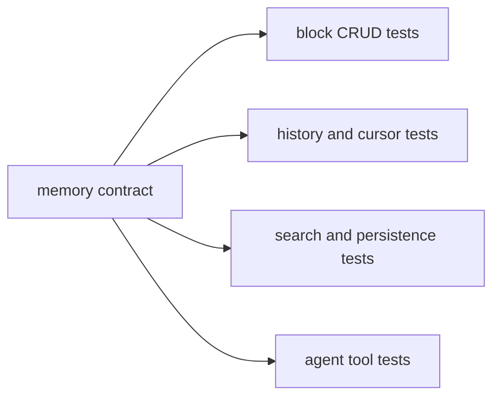
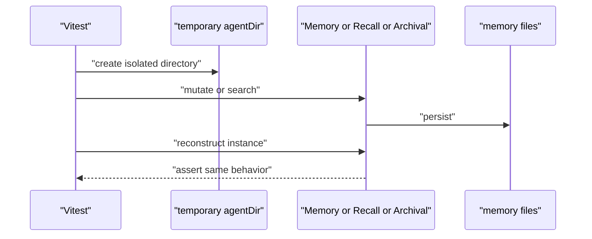

# H2. 用测试定义 MemoryCore 的真实边界

> 类型：源码课  
> 状态：正式课件

## 问题

记忆模块最危险的错误常在重启、超限、替换失败、检索阈值和版本回溯后出现。测试比注释更精确地定义这些行为。

## 图解

## 源码入口

- [Memory tests（第 13 行）](../../../../packages/core/src/modules/memory-core/__tests__/memory.test.ts#L13)
- [Recall tests（第 12 行）](../../../../packages/core/src/modules/memory-core/__tests__/recall.test.ts#L12)
- [Archival tests（第 13 行）](../../../../packages/core/src/modules/memory-core/__tests__/archival.test.ts#L13)
- [工具/provider 测试（第 1 行）](../../../../packages/core/src/modules/memory-core/__tests__/tools-provider.test.ts#L1)

## 调用链

## 关键类型

H2 的核心不是新类型，而是测试夹具：每个 suite 使用临时目录、`beforeEach` 创建对象、`afterEach` 删除目录。这保证测试验证的是文件持久化，而不是前一个测试遗留的内存状态。

[memory.test 初始化（第 26 行）](../../../../packages/core/src/modules/memory-core/__tests__/memory.test.ts#L26) 固定五个默认 block；[只保留十个快照（第 205 行）](../../../../packages/core/src/modules/memory-core/__tests__/memory.test.ts#L205) 固定版本保留策略；[Recall cursor（第 70 行）](../../../../packages/core/src/modules/memory-core/__tests__/recall.test.ts#L70) 固定增量读取语义。

## 测试入口

本课本身就是测试入口。建议执行 package 内对应 Vitest 命令，而不是把全部测试当作唯一证据。改 block 时跑 memory/block；改召回跑 recall；改向量/标签检索跑 archival；改 Agent 可调用工具跑 tools-provider。

## 逐行精读

1. [read-only 拒绝（第 66 行）](../../../../packages/core/src/modules/memory-core/__tests__/memory.test.ts#L66)：`temporal` 不是可写普通 block。
2. [replace 不命中（第 101 行）](../../../../packages/core/src/modules/memory-core/__tests__/memory.test.ts#L101)：返回 false 而非静默写入。
3. [Archival minScore（第 74 行）](../../../../packages/core/src/modules/memory-core/__tests__/archival.test.ts#L74)：检索结果可被阈值过滤。

## 深度拆解

测试覆盖“正确输入”远远不够。记忆系统更应固定负向行为：未知 block、read-only、超限、坏 JSON、重启、空检索、cursor 越界。否则一次看似 harmless 的重构可让模型持续拿到错误记忆却不报错。

## 常见故障

| 现象 | 缺少的测试 | 后果 |
| --- | --- | --- |
| 本地过、CI 偶发失败 | 临时目录隔离 | 文件互相污染 |
| 版本无限增长 | retention 测试 | 磁盘膨胀 |
| 搜索结果质量退化 | threshold/tag 测试 | 错误事实进入上下文 |

## 改动场景判断

改 Memory.md 格式前，先新增旧格式解析/新格式输出/重启恢复三个测试，再改实现；不要只 snapshot 一段漂亮输出。

## 源码追问清单

1. 此断言是在测行为还是实现细节？
2. 失败路径是否有独立测试？
3. 重启后仍成立吗？

## 练习

为“删除 archival 条目后不再检索到”写 Given/When/Then，并指出应该放入哪个测试文件。

## 验收

你能从 H2 测试反推出默认 block、限制、持久化、cursor 与检索阈值的真实契约。
