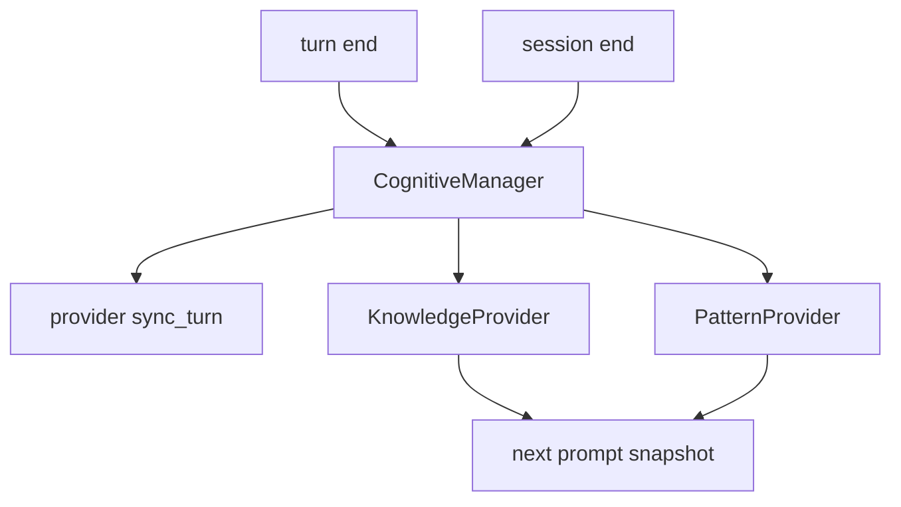
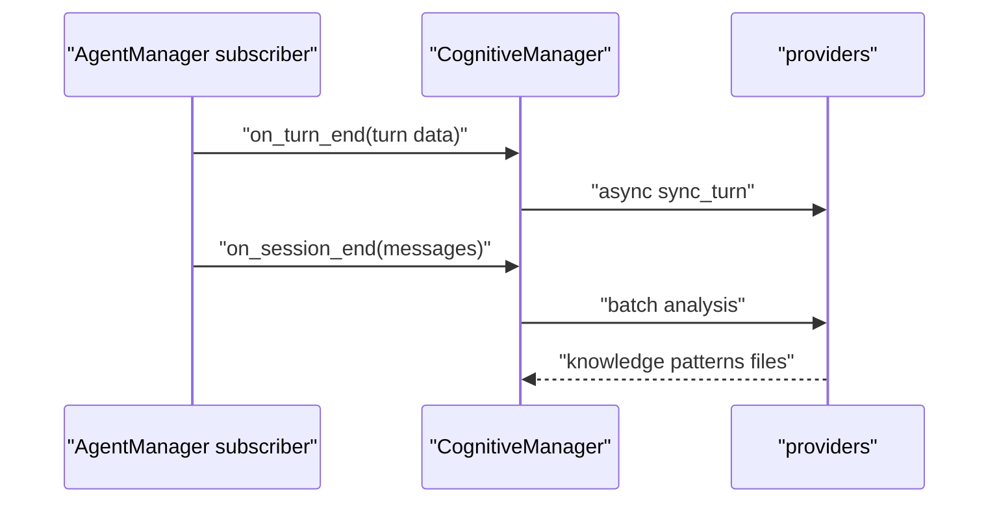

# H3. CognitiveManager：每轮记录与会话末沉淀的职责分离

> 类型：源码课  
> 状态：正式课件

## 问题

每轮都做 LLM 知识提炼会拖慢对话；只在结束时记录又会丢失执行事实。CognitiveManager 用 provider 插件将轻量 `on_turn_end` 和重量 `on_session_end` 分开。

## 图解

## 源码入口

- [CognitiveManager（第 13 行）](../../../../packages/core/src/lib/integrations/pi-agent/cognitive/manager.ts#L13)
- [turn hook（第 38 行）](../../../../packages/core/src/lib/integrations/pi-agent/cognitive/manager.ts#L38)
- [session hook（第 52 行）](../../../../packages/core/src/lib/integrations/pi-agent/cognitive/manager.ts#L52)
- [Frozen Snapshot（第 66 行）](../../../../packages/core/src/lib/integrations/pi-agent/cognitive/manager.ts#L66)
- [KnowledgeProvider tests（第 1 行）](../../../../packages/core/src/lib/integrations/pi-agent/cognitive/__tests__/knowledge-provider.test.ts#L1)
- [PatternProvider tests（第 1 行）](../../../../packages/core/src/lib/integrations/pi-agent/cognitive/__tests__/pattern-provider.test.ts#L1)

## 调用链

## 关键类型

Manager 用 `Map<string, CognitiveProvider>` 注册 provider；[register（第 24 行）](../../../../packages/core/src/lib/integrations/pi-agent/cognitive/manager.ts#L24) 记录名称和目录，避免模块硬编码对 Knowledge/Pattern 的直接依赖。

`on_turn_end` 使用 `setImmediate` 异步执行 `sync_turn`，所以不阻塞主响应；`on_session_end` 则 await provider 的批处理。`build_snapshot_prompt` 在启动时收集 `system_prompt_block`，形成 Frozen Snapshot：中途文件更新不自动改变本次模型前缀。

## 测试入口

- [Manager 与 AgentManager 集成（第 1 行）](../../../../packages/core/src/lib/integrations/pi-agent/cognitive/__tests__/agent-manager-cognitive.test.ts#L1)
- [KnowledgeProvider（第 1 行）](../../../../packages/core/src/lib/integrations/pi-agent/cognitive/__tests__/knowledge-provider.test.ts#L1)
- [PatternProvider（第 1 行）](../../../../packages/core/src/lib/integrations/pi-agent/cognitive/__tests__/pattern-provider.test.ts#L1)

## 逐行精读

1. [provider error catch（第 42 行）](../../../../packages/core/src/lib/integrations/pi-agent/cognitive/manager.ts#L42)：单 provider 失败不应中断聊天。
2. [session-end await（第 53 行）](../../../../packages/core/src/lib/integrations/pi-agent/cognitive/manager.ts#L53)：销毁前必须等待。
3. [snapshot build（第 66 行）](../../../../packages/core/src/lib/integrations/pi-agent/cognitive/manager.ts#L66)：解释 F10 的稳定 prompt。

## 深度拆解

异步 turn 记录意味着进程崩溃时最后少量实践日志可能未落盘；同步记录又会影响延迟。这里是明确的可靠性/性能权衡，应通过 session-end flush、可重放日志和监控处理，而不是假装两者都免费。

## 常见故障

| 现象 | 首查 | 原因 |
| --- | --- | --- |
| 新知识本轮不可见 | Frozen Snapshot | 误以为写盘即改 prompt |
| 关闭后模式未生成 | finalize session-end | 销毁前未 await |
| 聊天变慢 | provider sync_turn | 重量计算误放每轮 |

## 改动场景判断

新增 provider 时，实现 `sync_turn`、`system_prompt_block` 和可选 `on_session_end`，再注册并为单 provider 失败隔离写测试；不要在 AgentManager 复制认知逻辑。

## 源码追问清单

1. 这是每轮轻量操作还是会话末批处理？
2. 失败是否影响用户回答？
3. 新结果何时进入 prompt？

## 练习

为“工具失败统计 provider”设计它的 turn 数据、session-end 输出和 prompt snapshot。

## 验收

你能区分 `on_turn_end`、`on_session_end` 与 Frozen Snapshot，并能说明它们在性能和一致性上的取舍。
