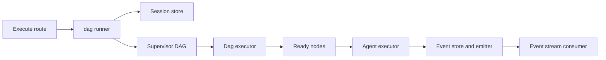
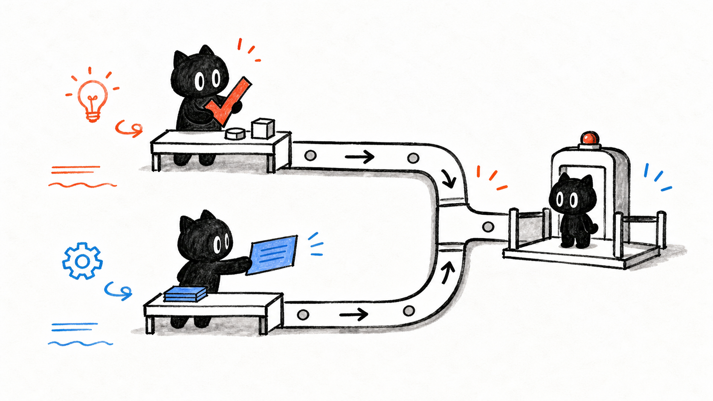
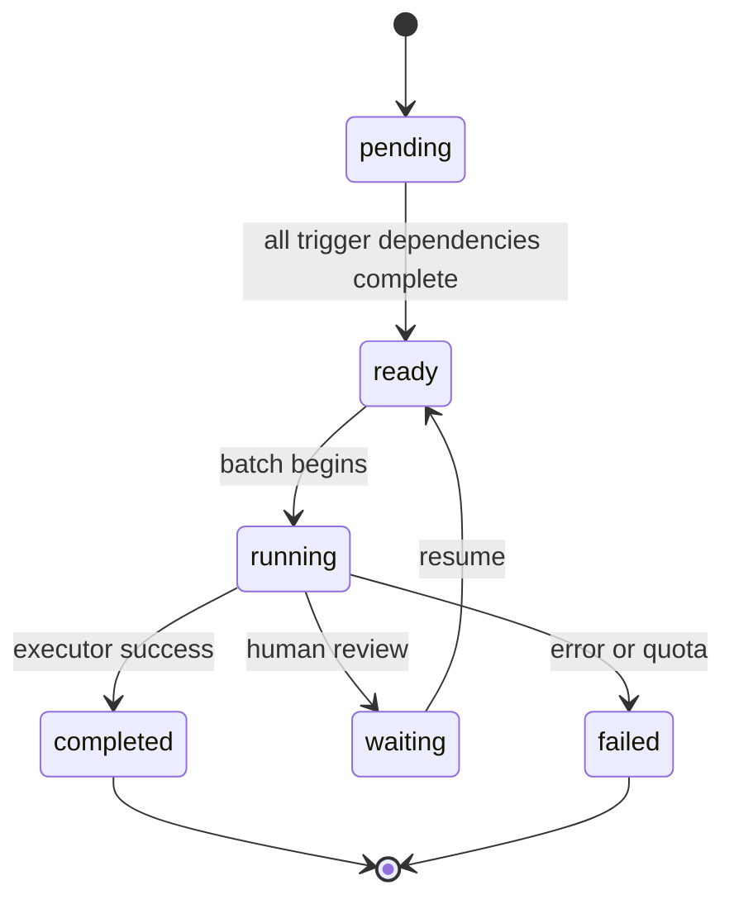

# H4. Collaboration Runtime：把多 Agent 拓扑真正跑起来

> 范围：`collaboration-runtime/engine/` 与运行门面。目标不是背诵术语，而是能沿着一次会话启动，解释每个 Agent 为什么此刻能或不能执行。

## 问题

一个多 Agent 方案只是若干节点和边。运行时必须把它变成可观察的执行：先执行没有前置条件的节点；上游成功后释放下游；相互独立的节点并行；出现超时、配额、失败或人工审核时仍能给出确定结果。这里的核心问题是：**谁保存会话，谁决定节点就绪，谁真正调用 Agent？**

## 图解







第一张图是层次图，不是函数调用的逐行事实：HTTP route 交给 facade，facade 保证会话依赖恢复并启动 supervisor；DAG executor 在更内层处理拓扑。第二张图对应 executor 中的 `node.status` 迁移，尤其说明 `waiting` 不是失败。

## 源码入口

- [DAG 执行器定义（第 78 行）](../../../../packages/core/src/modules/collaboration-runtime/engine/dag-executor.ts#L78)：节点状态表和主循环。
- [执行主循环（第 125 行）](../../../../packages/core/src/modules/collaboration-runtime/engine/dag-executor.ts#L125)：超时、迭代、反压、就绪集和结束判断。
- [批量执行（第 286 行）](../../../../packages/core/src/modules/collaboration-runtime/engine/dag-executor.ts#L286)：并行调用每个 Agent，并写入结果。
- [会话门面 `executeSession`（第 34 行）](../../../../packages/core/src/modules/collaboration-runtime/facade/dag-runner.ts#L34)：恢复内存依赖、欢迎模式与启动分流。
- [后台启动 supervisor（第 80 行）](../../../../packages/core/src/modules/collaboration-runtime/facade/dag-runner.ts#L80)：不阻塞 HTTP 响应。
- [supervisor DAG 导出边界](../../../../packages/core/src/modules/collaboration-runtime/engine/index.ts#L1)：`executeSupervisorDag` 是门面接入的更高层编排实现。

先读 `dag-runner.ts`：它回答“会话如何开始”。再读 `dag-executor.ts`：它回答“一个已给定的拓扑如何推进”。不要把 `DagExecutor` 误认为完整的 LLM 任务分解器，它接收的是已经存在的 `CollaborationTopology`。

## 调用链

```text
POST sessions/{id}/execute
  -> executeSession(id)
  -> loadPersistedSessions(); restore FsEventStore and Blackboard if needed
  -> startDag(session, store, id)
  -> void executeSupervisorDag(...)
  -> DagExecutor.execute(topology)
  -> buildDag -> getReadyNodes -> executeBatch
  -> agentExecutor(agentId) -> RuntimeEvent and blackboard output
```

`executeSession` 在 [第 41-50 行](../../../../packages/core/src/modules/collaboration-runtime/facade/dag-runner.ts#L41) 特别处理热更新后内存 Map 丢失的情况：从项目目录重新创建 `FsEventStore` 和 `Blackboard`。没有 `globalGoal` 时，它并不硬跑 DAG，而是转为 `greeting` 并先持久化欢迎事件（[第 52-74 行](../../../../packages/core/src/modules/collaboration-runtime/facade/dag-runner.ts#L52)）。

真正开始后 `startDag` 先把 session 标成 `running` 并保存，随后用 `void executeSupervisorDag(...)` 让 HTTP 立即返回 `running`（[第 111-134 行](../../../../packages/core/src/modules/collaboration-runtime/facade/dag-runner.ts#L111)）。这有意支持长时间 HITL；它也意味着调用方不能把 HTTP 返回当作“任务已经完成”。

## 关键类型

| 类型 | 作用 | 学习时要抓住的字段 |
| --- | --- | --- |
| `CollaborationTopology` | 静态协作图 | `agents`、`edges`；只有 `trigger` 边参与 DAG 依赖。
| `DagExecutorConfig` | 执行约束 | `timeoutMs`、`maxIterations`、`backPressureThreshold` 与可选 cost controller。
| `DagResult` | 主循环的终点 | 区分 `completed`、`aborted`、`timed_out`、`failed`，别只看布尔值。
| `CollaborationSession` | 持久会话元数据 | `globalGoal` 与 `status` 决定欢迎或执行分支。
| `RuntimeEvent` | 对外可观察事实 | 事件先写 store 再推 UI，才能支持重连后的回放。

这些类型可从 [session 类型文件（第 296 行）](../../../../packages/core/src/modules/collaboration-runtime/session/types.ts#L296) 和 [执行器配置（第 30 行）](../../../../packages/core/src/modules/collaboration-runtime/engine/dag-executor.ts#L30) 开始追。`trigger` 与 `notify` 语义不同：前者阻塞下游就绪，后者只传播通知，因此不能仅凭画了一条边就认为它会影响执行顺序。

## 测试入口

- [DAG 线性、并行、失败和 HITL 测试](../../../../packages/core/src/modules/collaboration-runtime/engine/__tests__/dag-executor.test.ts#L1)
- [supervisor DAG 的人工审核测试](../../../../packages/core/src/modules/collaboration-runtime/engine/__tests__/supervisor-dag-hitl.test.ts#L1)
- [门面 session store 测试](../../../../packages/core/src/modules/collaboration-runtime/facade/__tests__/session-store.test.ts#L1)

先读 DAG 测试的拓扑构造，再看断言的 event 序列。它比直接读完整 supervisor 更适合作为首次验证：你能在最小拓扑里看清“依赖满足”这一条不变量。

## 逐行精读

1. `execute()` 一开始清空上次的 `nodes`、`events` 并复位 `aborted`（[第 125-130 行](../../../../packages/core/src/modules/collaboration-runtime/engine/dag-executor.ts#L125)），因此一个 executor 实例的每次执行从干净运行态开始。
2. `buildDag()` 先为所有 agent 建 `pending` 节点，再只读取 `trigger` 边写入 `dependencies` / `dependents`（[第 240-269 行](../../../../packages/core/src/modules/collaboration-runtime/engine/dag-executor.ts#L240)）。无依赖节点立即是 `ready`。
3. 每轮先检查 `aborted`、deadline、最大迭代数（[第 137-150 行](../../../../packages/core/src/modules/collaboration-runtime/engine/dag-executor.ts#L137)）。这三者是不同的终止原因，运维日志必须区分。
4. 反压不是报错：运行节点数达到阈值时发出 `AGENT_THINKING`，睡眠后重试（[第 155-165 行](../../../../packages/core/src/modules/collaboration-runtime/engine/dag-executor.ts#L155)）。
5. `executeBatch` 用 `map` 生成 promises 并等待它们（[第 286-305 行](../../../../packages/core/src/modules/collaboration-runtime/engine/dag-executor.ts#L286)），所以同一批就绪节点可并行；是否真的并行还取决于 `agentExecutor` 的实现和外部资源。
6. 完成时写 output、发事件、尝试释放 dependents，并分发 `notify` 边（[第 307-317 行](../../../../packages/core/src/modules/collaboration-runtime/engine/dag-executor.ts#L307)）。这证明触发与通知是两套动作。
7. `waiting` 不释放下游；`resumeNode()` 才把节点放回 `ready`，并把用户回答写进 blackboard（[第 318-332 行](../../../../packages/core/src/modules/collaboration-runtime/engine/dag-executor.ts#L318)、[第 223-233 行](../../../../packages/core/src/modules/collaboration-runtime/engine/dag-executor.ts#L223)）。

## 深度拆解

**DAG 不等于无限等待。** 如果没有 ready 节点却仍有未完成节点，执行器将这些节点标成 `failed`，原因是 `blocked_by_failed_dependency`（[第 186-197 行](../../../../packages/core/src/modules/collaboration-runtime/engine/dag-executor.ts#L186)）。这是把“上游无法完成”显式化，避免一个 UI 永远显示加载中。

**状态有两层。** session 的 `running` 代表 supervisor 服务仍可接受后续消息；node 的 `completed` 是本轮 DAG 的局部完成。`startDag` 在 DAG Promise 成功后仍保留 session 的 `running`（[第 123-126 行](../../../../packages/core/src/modules/collaboration-runtime/facade/dag-runner.ts#L123)）。如果产品要展示“本轮完成”，应读取事件/执行结果，不能只拿 session status。

**公平和成本属于调度策略。** `applyAging()` 为等待节点提升优先级，cost controller 可在启动节点前拒绝超额任务（[第 152-157 行](../../../../packages/core/src/modules/collaboration-runtime/engine/dag-executor.ts#L152)、[第 287-294 行](../../../../packages/core/src/modules/collaboration-runtime/engine/dag-executor.ts#L287)）。这两项都不改变依赖正确性，却改变系统在压力下的体验和费用。

## 常见故障

| 现象 | 先查哪里 | 可能原因 |
| --- | --- | --- |
| HTTP 已返回但看不到最终结果 | event store / events route | 这是后台执行设计；需订阅或轮询事件。 |
| 下游永远不执行 | `edges` 的 `type` 与上游 status | 可能误用了 `notify`，或依赖节点失败。 |
| 所有任务被卡住 | `backPressureThreshold`、running 数 | 反压阈值过低或 worker 没有结束。 |
| 用户答复后仍等待 | `resumeNode`、HITL route | 节点 id 不匹配，或答复没有进入恢复分发器。 |
| 开发热更新后事件丢失 | `executeSession` 的恢复块 | session 目录、event store 或 blackboard 初始化失败。 |

## 改动场景判断

- **新增一种节点执行策略**：优先扩展 executor 注入的 `agentExecutor` 或 supervisor 层，不要让 API route 直接执行节点。
- **新增一条“完成即通知”的关系**：研究 `notify` 分发，而不是硬改 `getReadyNodes()`；否则会无意改变拓扑依赖。
- **修改并发数**：改 `DagExecutorConfig` 与测试，至少覆盖反压和多个 ready 节点；不要把 `Promise.all` 换成串行循环来“解决”资源问题。
- **增加 UI 进度字段**：先定义/扩展 `RuntimeEvent`，让 event store 成为事实源；不要只在组件内猜 status。

## 源码追问清单

1. `maybeMarkReady()` 对“所有依赖完成”的判断是什么？它是否接受失败依赖？
2. `executeSupervisorDag` 怎样把动态分解结果转换为 `CollaborationTopology`？
3. `abort()` 只改标志位时，正在运行的外部 Agent 如何被真正终止？
4. 重连客户端如何从 `FsEventStore` 获取错过的事件？
5. 当两个节点写同一份资源时，`checkConflicts()` 的处理边界是什么？

## 练习

手画一个三节点图：A 和 B 无依赖，C 依赖 A、B。用本课状态机写出两种执行时间线：一条 A/B 都成功；另一条 B 失败。然后指出 C 最终为什么是 `ready`、`failed` 或根本不该被调用。最后在测试中定位一个并行案例，确认事件顺序是否被断言为完全固定。

## 验收

- 能从 `execute` API 追到 `executeSession -> startDag -> executeSupervisorDag`，并说明 HTTP 为什么不等待最终结果。
- 能区分 `trigger`、`notify`、session `running` 和 node `running`。
- 能根据 `DagExecutor.execute` 解释超时、迭代上限、反压、阻塞依赖和 HITL 的不同出口。
- 能为“下游未执行”提出先看拓扑边类型、节点事件、失败依赖的排查顺序。
