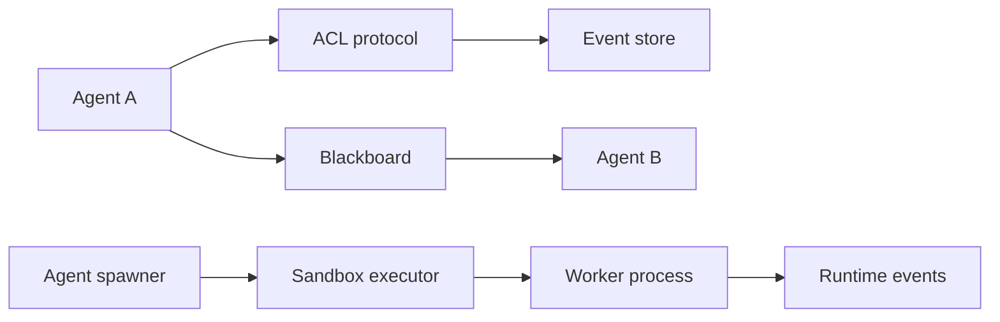
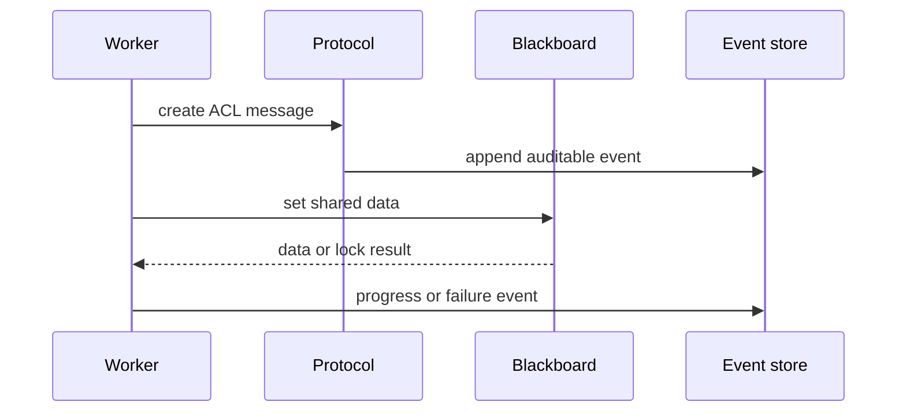

# H5. Collaboration Runtime：通信、共享状态与进程沙箱

> 范围：`protocol/`、`session/`、`sandbox/`。本课解决三个常被混淆的问题：消息能不能发、状态存在哪里、子进程能做什么。

## 问题

多 Agent 系统若让每个 worker 任意读写项目文件、直接互相调用，结果会不可审计、难恢复，也难限制权限。运行时因此分三层：协议把意图组织成消息；session 把事件与黑板保存成可回放状态；sandbox 把真正执行的进程约束在允许范围内。**协议不是权限，黑板不是数据库，沙箱也不是业务编排器。**

## 图解





协议帮助“说清楚发生了什么”，黑板帮助“交接当前事实”，事件存储帮助“事后还原”。三者可以互相引用，但不应由 UI 直接替代其中任何一个。

## 源码入口

- [运行时事件、拓扑与会话类型（第 14 行）](../../../../packages/core/src/modules/collaboration-runtime/session/types.ts#L14)
- [黑板实现（第 41 行）](../../../../packages/core/src/modules/collaboration-runtime/session/blackboard.ts#L41)
- [文件事件存储（第 40 行）](../../../../packages/core/src/modules/collaboration-runtime/session/fs-event-store.ts#L40)
- [ACL 协议（第 56 行）](../../../../packages/core/src/modules/collaboration-runtime/protocol/acl.ts#L56)
- [Contract Net 协议类型与实现（第 20 行）](../../../../packages/core/src/modules/collaboration-runtime/protocol/contract-net.ts#L20)
- [Node 沙箱执行器（第 133 行）](../../../../packages/core/src/modules/collaboration-runtime/sandbox/node-executor.ts#L133)
- [进程生成与全局 spawner](../../../../packages/core/src/modules/collaboration-runtime/sandbox/agent-spawner.ts#L138)

建议阅读顺序：先 `session/types.ts` 建词表，再读 blackboard / event store 的持久化边界，随后看 ACL 与 Contract Net 的消息约定，最后看 sandbox 如何将约束落在子进程上。

## 调用链

```text
supervisor or worker
  -> protocol creates message or task negotiation state
  -> append RuntimeEvent to FsEventStore
  -> Blackboard writes shared key, artifact, lock or provenance
  -> AgentSpawner / NodeSandboxExecutor wraps command
  -> child process emits stdout, progress or error
  -> runtime persists and forwards event
```

`FsEventStore` 是持久化事件的基础，而 `Blackboard` 是当前会话的协作状态。不要把二者视为重复：事件是时间序列，黑板是可查询/覆盖的当前共享上下文。一个好的调试问题是：“我要知道**现在值是什么**，还是**它如何变成这个值**？”前者先查 blackboard，后者先查 event store。

## 关键类型

| 类型 | 含义 | 不能误解为 |
| --- | --- | --- |
| `RuntimeEvent` | 一条带 `seq`、`type`、`payload`、source、timestamp 的运行事实 | 任意 UI 临时 state。 |
| `CollaborationSession` | 某次协作的 goal、配置、拓扑和状态 | 每个 worker 的私有内存。 |
| `BlackboardEntry` | 带来源、锁、artifact/provenance 信息的共享条目 | 无权限控制的全局对象。 |
| `ACLMessage` | Agent Communication Language 的消息表达 | OS 级网络隔离规则。 |
| `SandboxConfig` | agentId、命令、工作目录、超时和权限相关配置 | 实际执行的 command line 本身。 |
| `SandboxViolation` | 受控运行时观测到的越界记录 | 自动修复结果。 |

这些 session 类型集中在 [第 111-235 行](../../../../packages/core/src/modules/collaboration-runtime/session/types.ts#L111)，`SandboxConfig` 和 handle 接口位于 [第 30-75 行](../../../../packages/core/src/modules/collaboration-runtime/sandbox/node-executor.ts#L30)。先从数据结构理解职责，读实现才不会迷失在 I/O 细节中。

## 测试入口

- [ACL 协议测试](../../../../packages/core/src/modules/collaboration-runtime/protocol/__tests__/acl.test.ts#L1)
- [协议综合测试](../../../../packages/core/src/modules/collaboration-runtime/protocol/__tests__/protocol.test.ts#L1)
- [沙箱 node executor 测试](../../../../packages/core/src/modules/collaboration-runtime/sandbox/__tests__/node-executor.test.ts#L1)
- [Agent spawner 测试](../../../../packages/core/src/modules/collaboration-runtime/sandbox/__tests__/agent-spawner.test.ts#L1)
- [黑板来源信息测试](../../../../packages/core/src/modules/collaboration-runtime/session/__tests__/blackboard-provenance.test.ts#L1)

安全相关测试要特别区分两种断言：一类验证命令被正确包装/拒绝；另一类验证运行环境的真实 OS 隔离。前者是单元测试，后者通常需要平台集成验证，不能因看到 mock 通过就声称沙箱已被完全证明。

## 逐行精读

1. `NodeSandboxExecutor.initialize()` 构建默认网络和文件系统规则，再初始化 `SandboxManager`（[第 137-158 行](../../../../packages/core/src/modules/collaboration-runtime/sandbox/node-executor.ts#L137)）。默认结构不是最终的 per-Agent 策略。
2. `spawn()` 若未初始化会先初始化，然后通过 `buildSandboxRuntimeConfig` 将本 Agent 配置转成运行时配置（[第 169-188 行](../../../../packages/core/src/modules/collaboration-runtime/sandbox/node-executor.ts#L169)）。
3. `wrapWithSandbox()` 负责给命令添加平台对应包装；源码注释列出 macOS 的 `sandbox-exec` 与 Linux 的 `bwrap` 方向（[第 181-188 行](../../../../packages/core/src/modules/collaboration-runtime/sandbox/node-executor.ts#L181)）。
4. 子进程仍通过 Node `spawn(..., { shell: true, stdio: "pipe", cwd })` 创建（[第 190-205 行](../../../../packages/core/src/modules/collaboration-runtime/sandbox/node-executor.ts#L190)）。因此 command 拼接、工作目录和参数来源必须接受安全审查。
5. 违规记录从 `SandboxManager` 的 store 拉取，再转成模块自己的 `SandboxViolation`（[第 209-216 行](../../../../packages/core/src/modules/collaboration-runtime/sandbox/node-executor.ts#L209)）。它用于可见性，不代替终止策略。

## 深度拆解

**消息协议与拓扑是正交的。** `trigger` 边决定执行依赖；ACL 或 Contract Net 表达某次消息、协商或委托。若把“发了一条消息”当成“已完成依赖”，DAG 就会被偶发通信状态污染。协议层应产出可审计事件，执行器仍以节点状态推进。

**黑板的价值是带来源的共享。** `BlackboardEntry`、artifact、lock、provenance 和 correction 类型表明这里不只是 `Map<string, unknown>`。当下游用到上游输出时，未来应能追问“谁在何时写入，以什么依据修正”。这也是在同一 key 竞争时进行冲突治理的前提。

**沙箱边界必须贯穿配置和执行。** 仅限制 prompt 不够，必须在进程启动时把 `SandboxConfig` 转成真实 wrapper。反过来，wrapper 也不会自动验证业务权限，例如“此 Agent 是否应该写这份项目文档”仍需上层授权和路径策略配合。

## 常见故障

| 现象 | 排查顺序 | 关键判断 |
| --- | --- | --- |
| 刷新后协作历史不见 | session 文件、`FsEventStore`、加载逻辑 | 当前内存 Map 不是事实源。 |
| 下游拿到旧数据 | blackboard key、provenance、事件顺序 | 先分清是覆盖策略还是读错 session。 |
| 子进程未按预期受限 | `SandboxConfig`、包装命令、平台能力 | 单测 mock 不能替代平台实测。 |
| 只看到“失败”没有原因 | RuntimeEvent payload、stderr、violation store | 把执行失败与权限违规分开记录。 |
| Agent 互相消息重复 | 协议测试、事件幂等/seq | 不能只在 UI 去重。 |

## 改动场景判断

- **新增协商消息**：先扩展 protocol 类型和协议测试，再决定是否要投影成 `RuntimeEvent`；不要把协商状态塞进 UI。
- **新增共享产物**：为 blackboard 设计 key、来源和生命周期；需要跨重启保留时同步检查持久化语义。
- **提高 worker 权限**：在 `SandboxConfig` 与运行时 wrapper 同时审查，补一条拒绝路径测试；不能只改前端按钮。
- **新增平台支持**：从 `SandboxManager.wrapWithSandbox` 的适配能力入手，并做真实平台集成验证。

## 源码追问清单

1. `Blackboard` 如何处理同一 key 的锁与并发写入？
2. `FsEventStore` 如何分配或校验 `RuntimeEvent.seq`？
3. ACL 和 Contract Net 的状态是否都能回放？
4. `AgentSpawner` 怎样终止整个 session 的所有子进程？
5. `shell: true` 的参数构造是否存在转义/注入风险，哪些输入层已经限制它？

## 练习

为“研究 Agent 交给写作 Agent 一份资料”画出最少三条记录：一条 ACL 委托消息、一条 blackboard 资料条目、一条 `AGENT_COMPLETE_TASK` 事件。说明每条记录的读者、保存位置和重启后是否需要恢复。然后设计一条“写作 Agent 被禁止读取用户目录”的失败路径，标出应出现的 violation 与用户可见事件。

## 验收

- 能清楚区分协议、事件、黑板、沙箱四个概念及其数据所有权。
- 能从 `SandboxConfig` 追到 `wrapWithSandbox` 和 Node 子进程启动。
- 能说明为什么事件存储和黑板不能相互替代。
- 能为越权、旧数据和重启丢历史分别选择正确的源码入口与测试入口。
