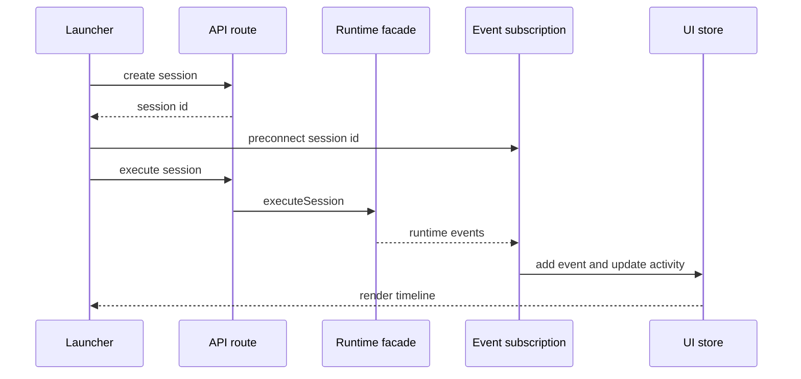
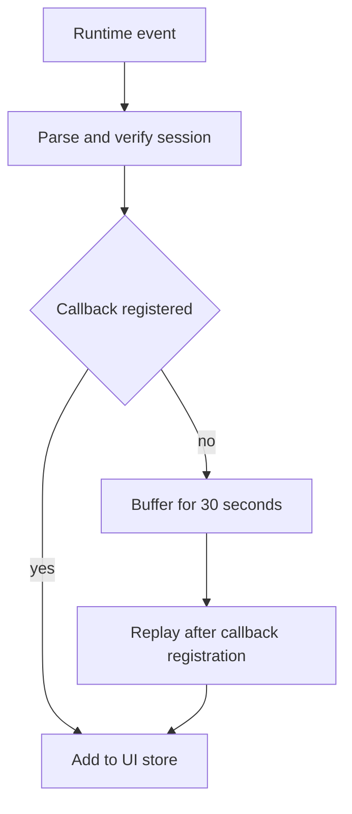

# H6. Collaboration UI：让后台协作变成可见时间线

> 范围：协作 API route、`MultiAgentLauncher`、SSE/IPC 订阅与 UI store。目标：追清一次会话如何从启动走到屏幕上的 Agent 状态。

## 问题

后台 DAG 在 HTTP 返回后仍会继续执行。若前端只等待 `POST /execute` 的响应，就只得到“已启动”而不是任务进度。UI 必须建立事件订阅，接收 `RuntimeEvent`，再将它投影成时间线和 Agent 活动状态。关键并发问题是：**事件会不会在 React 完成重渲前已经到达？**

## 图解





缓冲区不是服务器端可靠队列，而是浏览器内解决“preconnect 已收事件、组件回调尚未注册”的短暂竞态。断线后的可靠恢复仍依赖服务端事件存储与订阅协议。

## 源码入口

- [执行 API route（第 8 行）](../../../../packages/web/src/app/api/collaboration/sessions/[id]/execute/route.ts#L8)
- [多 Agent 启动器与 Props（第 1 行）](../../../../packages/core/src/modules/collaboration-runtime/ui/MultiAgentLauncher.tsx#L1)
- [自动创建、预连接、启动（第 399 行）](../../../../packages/core/src/modules/collaboration-runtime/ui/MultiAgentLauncher.tsx#L399)
- [事件连接池与缓冲（第 13 行）](../../../../packages/core/src/modules/collaboration-runtime/ui/use-sse.ts#L13)
- [事件转换为 UI 状态（第 91 行）](../../../../packages/core/src/modules/collaboration-runtime/ui/use-sse.ts#L91)
- [协作 sessions route](../../../../packages/web/src/app/api/collaboration/sessions/route.ts#L1)

注意 UI 源码位于 core module 的 `ui/`，而 API route 位于 web 的 `app/`。按 AGENTS 的严格分层，route 应保持边界薄，业务状态机不能复制进去。

## 调用链

```text
MultiAgentLauncher autoStart
  -> createCollaborationSession
  -> setSessionId and preconnect(sessionId)
  -> executeCollaborationSession
  -> POST sessions/{id}/execute
  -> executeSession(id) in facade
  -> EventSource or Electron IPC callback
  -> getOrCreateConnection -> addCallback
  -> UI store addEvent and updateAgentActivity
```

`autoStart` 创建成功后先设置 id、立即 `preconnect(sid)`，最后才执行会话（[第 405 行](../../../../packages/core/src/modules/collaboration-runtime/ui/MultiAgentLauncher.tsx#L405)）。它不等 state 更新和 `useEffect`，用来减少漏掉第一批事件的风险。route 只动态 import facade、调用 `executeSession(params.id)` 并映射 JSON（[第 8 行](../../../../packages/web/src/app/api/collaboration/sessions/[id]/execute/route.ts#L8)）。

## 关键类型

| 类型/状态 | 所在位置 | 作用 |
| --- | --- | --- |
| `MultiAgentLauncherProps` | launcher | 输入项目、UI 依赖和可选 LLM 配置。 |
| `Phase` | launcher 第 32 行 | 本地展示阶段，如 creating、greeting、running、error。 |
| `RuntimeEvent` | session types | 运行时事实，是 UI 投影输入。 |
| `AgentActivity` | UI store | 事件转换后的单 Agent 展示状态。 |
| unsubscribe | 全局连接池 | 一个 session 一条底层连接的释放句柄。 |

`Phase` 是 UI 局部状态，`CollaborationSession.status` 是运行时持久状态；不能互相当事实源。一个 session 仍为 `running` 时，UI 仍可根据最新事件显示“本轮完成”。

## 测试入口

- [Launcher 逻辑测试](../../../../packages/core/src/modules/collaboration-runtime/ui/__tests__/MultiAgentLauncher.logic.test.ts#L1)
- [消息 route 测试](../../../../packages/web/src/app/api/collaboration/sessions/[id]/messages/__tests__/route.test.ts#L1)
- [人工审核 route 测试](../../../../packages/web/src/app/api/collaboration/sessions/[id]/human-review/__tests__/route.test.ts#L1)
- [runtime event 测试](../../../../packages/core/src/modules/collaboration-runtime/engine/__tests__/dag-executor.test.ts#L1)

本次未发现浏览器级“创建后首个事件必达”的完整 E2E。改动 `preconnect` 或连接池时，应补真实浏览器或 Electron 环境验证。

## 逐行精读

1. `globalConnections` 按 session 保存取消订阅函数，`globalCallbacks` 支持一个 session 多组件订阅（[第 13 行](../../../../packages/core/src/modules/collaboration-runtime/ui/use-sse.ts#L13)）。
2. `bufferEvent` 为尚无 callback 的事件建最长 30 秒缓存（[第 19 行](../../../../packages/core/src/modules/collaboration-runtime/ui/use-sse.ts#L19)）。
3. `getOrCreateConnection` 先避免重复连接，再订阅平台适配函数并校验 `sessionId`（[第 42 行](../../../../packages/core/src/modules/collaboration-runtime/ui/use-sse.ts#L42)）。
4. `addCallback` 注册后立刻回放缓存（[第 66 行](../../../../packages/core/src/modules/collaboration-runtime/ui/use-sse.ts#L66)）。
5. hook 收事件后调用 `addEvent`，并以 `eventToAgentStatus` 更新活动状态（[第 116 行](../../../../packages/core/src/modules/collaboration-runtime/ui/use-sse.ts#L116)）。
6. 普通组件卸载只移除 callback；浏览器卸载才关闭全部连接（[第 135 行](../../../../packages/core/src/modules/collaboration-runtime/ui/use-sse.ts#L135)）。

## 深度拆解

**先订阅再执行只降低竞态，不保证全局顺序。** `preconnect` 和本地 buffer 弥补 React 回调注册窗口；跨刷新和跨设备的可靠恢复仍要由 event store 支持。

**UI 是投影层。** `formatWorkerEvents` 按 `RuntimeEvent.type` 生成文本和样式（[第 43 行](../../../../packages/core/src/modules/collaboration-runtime/ui/MultiAgentLauncher.tsx#L43)）。新增事件要先扩展 runtime 类型、发射点和测试，再补 UI mapping。

**平台差异应在适配层隐藏。** 源码注释说明 Web 用 EventSource、Electron 用 IPC（[第 3 行](../../../../packages/core/src/modules/collaboration-runtime/ui/use-sse.ts#L3)）。未来增加平台，应扩展 `subscribeCollaborationEvents`，而不是在组件中分支。

## 常见故障

| 现象 | 先查 | 原因 |
| --- | --- | --- |
| 创建后没有欢迎消息 | `preconnect`、events route、session id | 订阅晚于执行，或 id 错误。 |
| UI 显示 running 但 DAG 已结束 | event type 与 `Phase` | session 可故意保持 running。 |
| 两个组件重复显示事件 | connection pool、callback 清理 | callback 重复注册。 |
| 切换 session 后看见旧事件 | sessionId 校验、`removeCallback` | 旧 callback 未移除。 |
| route 返回 500 | facade、server log | route 没有业务兜底。 |

## 改动场景判断

- **新增 timeline 项**：确认已有 `RuntimeEvent.type`；没有则先扩展运行时类型和发射点。
- **新增协作 API**：route 只解析/校验并调用 facade，不复制 session Map 或 DAG 逻辑。
- **改连接行为**：同时考虑多订阅者、session 切换、缓冲过期和卸载；补不重复连接测试。
- **改展示阶段**：将“本轮完成”“等待审核”“会话存活”分开，别让局部 Phase 覆盖 runtime。

## 源码追问清单

1. `subscribeCollaborationEvents` 在 Web 与 Electron 分别怎样实现？
2. events route 如何支持重连和最后事件游标？
3. `useCollaborationUi.addEvent` 是否按 id 或 seq 去重？
4. 非页面卸载时 `preconnect` 建立的连接何时释放？
5. 未知 event type 在 timeline 中如何降级？

## 练习

假设新增 `AGENT_RETRYING`。列出必须修改的运行时类型、发射位置、事件存储、UI mapping、测试。再写一个手工验收：创建会话，确认连接先于 execute 建立，组件重渲后仍只保留一个底层订阅。

## 验收

- 能从 `autoStart` 追到 API 和 facade，而不把 route 当业务实现。
- 能解释 `preconnect + eventBuffer` 的竞态边界。
- 能区分 `RuntimeEvent`、UI `Phase`、AgentActivity 与持久 session status。
- 能为首事件丢失、旧 session 串线、重复显示分别提出排查路径。
