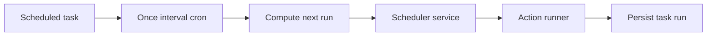
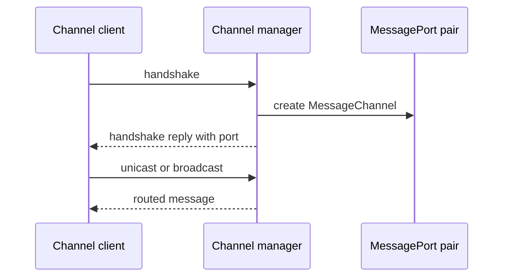

# H7. Core Modules：调度器与 Neural Channel 的边界

> 范围：`modules/scheduler/` 与 `modules/neural-channel/`。前者决定何时运行动作，后者在浏览器上下文建立消息通道。

## 问题

“每天九点提醒我”和“两个标签页上的组件如何通信”都像后台能力，却不能混成万能 service。调度器需要持久任务、计算下一次运行与记录结果；通道需要握手、端口、广播和断开。不要在 UI 定时器或随意的 `window.postMessage` 中埋不可恢复状态。

## 图解





## 源码入口

- [调度领域类型（第 1 行）](../../../../packages/core/src/modules/scheduler/types.ts#L1)
- [下一次运行计算（第 57 行）](../../../../packages/core/src/modules/scheduler/scheduler-service.ts#L57)
- [调度服务（第 93 行）](../../../../packages/core/src/modules/scheduler/scheduler-service.ts#L93)
- [默认动作 runner（第 5 行）](../../../../packages/core/src/modules/scheduler/action-runner.ts#L5)
- [通道主控管理器（第 8 行）](../../../../packages/core/src/modules/neural-channel/src/master/manager.ts#L8)
- [握手处理（第 145 行）](../../../../packages/core/src/modules/neural-channel/src/master/manager.ts#L145)

`neural-channel` 是较旧的浏览器模块，存在宽泛 `any` 与 window 扩展。记录它不等于认可它符合 AGENTS 的严格 TypeScript 约束；新功能不应继续复制这些模式。

## 调用链

```text
createTask(input)
  -> computeNextRunAt(trigger)
  -> ScheduleStore.saveTasks
  -> runDueTasks(referenceTime)
  -> runAndPersist -> SchedulerActionRunner.run
  -> appendRun and save advanced task
```

```text
channel client handshake
  -> MessageChannelManager.handleClientHandshake
  -> new MessageChannel
  -> register ports and groups
  -> dispatch handshake reply
  -> route unicast multicast broadcast
```

`runDueTasks` 是一次扫描方法（[第 160 行](../../../../packages/core/src/modules/scheduler/scheduler-service.ts#L160)），不是常驻时钟。谁周期调用它，是 desktop/server 宿主集成问题，不能从 service 名称推断已存在后台守护线程。

## 关键类型

| 类型 | 关键点 | 典型误解 |
| --- | --- | --- |
| `ScheduleTrigger` | once、interval、cron 判别联合 | 支持完整 cron 语法。 |
| `ScheduledAction` | agent、skill、system、system-tool | 每种都会真正启动 Agent。 |
| `ScheduledTaskRun` | 一次尝试的结果、时间、错误 | 任务状态本身。 |
| `SchedulerActionRunner` | 可注入动作边界 | 必须由 UI 直接调用。 |
| `MessageChannelManager` | 浏览器通道注册和路由 | 服务端网络总线。 |

`ScheduleTrigger` 和 `ScheduledAction` 的联合分支在 [第 3 行](../../../../packages/core/src/modules/scheduler/types.ts#L3) 定义；每个 `type` 都要显式穷尽处理。

## 测试入口

- [scheduler 源码入口](../../../../packages/core/src/modules/scheduler/scheduler-service.ts#L1)：本次逐文件检查未发现专属测试。
- [neural-channel 源码入口](../../../../packages/core/src/modules/neural-channel/src/master/manager.ts#L1)：本次模块检查未发现专属测试。

这是测试缺口。调度器至少应覆盖一次、间隔、cron 拒绝、runner 成功/失败、持久化；通道至少覆盖重复握手、断连、组播、来源校验。

## 逐行精读

1. `once` 拒绝过去时间（[第 57 行](../../../../packages/core/src/modules/scheduler/scheduler-service.ts#L57)）。
2. interval 最小 1000ms，且考虑 start/end（[第 66 行](../../../../packages/core/src/modules/scheduler/scheduler-service.ts#L66)）。
3. 当前 cron parser 只处理 minute 与 hour，且只接受数字或 `*`（[第 31 行](../../../../packages/core/src/modules/scheduler/scheduler-service.ts#L31)）。`*/5` 会报错。
4. `createTask` 先算 `nextRunAt` 再保存（[第 103 行](../../../../packages/core/src/modules/scheduler/scheduler-service.ts#L103)）。
5. runner 缺失时 run 被记为 `skipped`，不是成功（[第 173 行](../../../../packages/core/src/modules/scheduler/scheduler-service.ts#L173)）。
6. 默认 agent/skill runner 仅创建通知，提示“需要启动”，不直接运行 Agent（[第 26 行](../../../../packages/core/src/modules/scheduler/action-runner.ts#L26)）。
7. manager 的 `setup` 注册 window 监听并返回 cleanup（[第 30 行](../../../../packages/core/src/modules/neural-channel/src/master/manager.ts#L30)）。
8. 握手创建 `MessageChannel`、保存 ports、派发 reply（[第 145 行](../../../../packages/core/src/modules/neural-channel/src/master/manager.ts#L145)）。

## 深度拆解

**计算与动作执行是两个可替换边界。** `SchedulerService` constructor 注入 store 与 runner（[第 93 行](../../../../packages/core/src/modules/scheduler/scheduler-service.ts#L93)）。这样时间计算可以独立测试，真实执行可由 desktop/server adapter 接入。

**已调度不等于已执行。** `nextRunAt` 是计划，`ScheduledTaskRun` 是尝试记录，默认 agent/skill runner 是通知路径。若产品承诺定时运行 Agent，必须补受控 runner，并处理身份、CWD、权限、重试和幂等。

**同源消息仍需校验。** manager 会过滤重复消息和无 source 握手（[第 145 行](../../../../packages/core/src/modules/neural-channel/src/master/manager.ts#L145)），但接入新微应用时仍要审查 origin、channel id 和 schema。

## 常见故障

| 现象 | 先查 | 原因 |
| --- | --- | --- |
| 任务从未运行 | 宿主是否调用 `runDueTasks` | service 不是时钟。 |
| `*/5` 报错 | `parseCron` | 只接受数字或 `*`。 |
| agent 任务只出现通知 | 默认 runner | 尚未接真实 Agent runtime。 |
| 通道重复注册 | manager symbol | 多次设置 master。 |
| 消息到错目标 | channelId、group、source | 隔离命名或过滤不足。 |

## 改动场景判断

- **增加 cron 语法**：扩展 parser 并补时区/DST 测试，不能只放宽正则。
- **真实执行定时 Agent**：实现受控 runner，明确身份、工作目录、权限、结果持久化。
- **新增消息类型**：先定义 schema 和来源/目的验证，不要把 `any` 扩散。
- **增加后台 tick**：由 desktop/server 宿主调用 `runDueTasks`，不要依赖 React 组件。

## 源码追问清单

1. `ScheduleStore` 怎样处理并发写入？
2. timezone 为何未直接参与 `computeNextRunAt`？
3. 哪个宿主负责定期调用 `runDueTasks`？
4. client 如何从握手 reply 取回 `MessagePort`？
5. 哪些 `any` 和 origin 规则应优先改造？

## 练习

为“每小时第 15 分钟通知”写出 trigger/action 的对象形状，并判断当前 parser 是否接受。再设计 runner 成功一次、失败一次的测试，预测 run status 与下次任务状态。最后画出 client 断开后 manager 要清理的端口索引。

## 验收

- 能解释 scheduler 的计算、存储、触发、动作执行四个责任。
- 能指出 cron 支持范围与默认 agent/skill action 的真实完成度。
- 能从握手追到 MessageChannel、ports 注册和消息路由。
- 能提出至少两项 scheduler 与两项 channel 的缺失测试。
