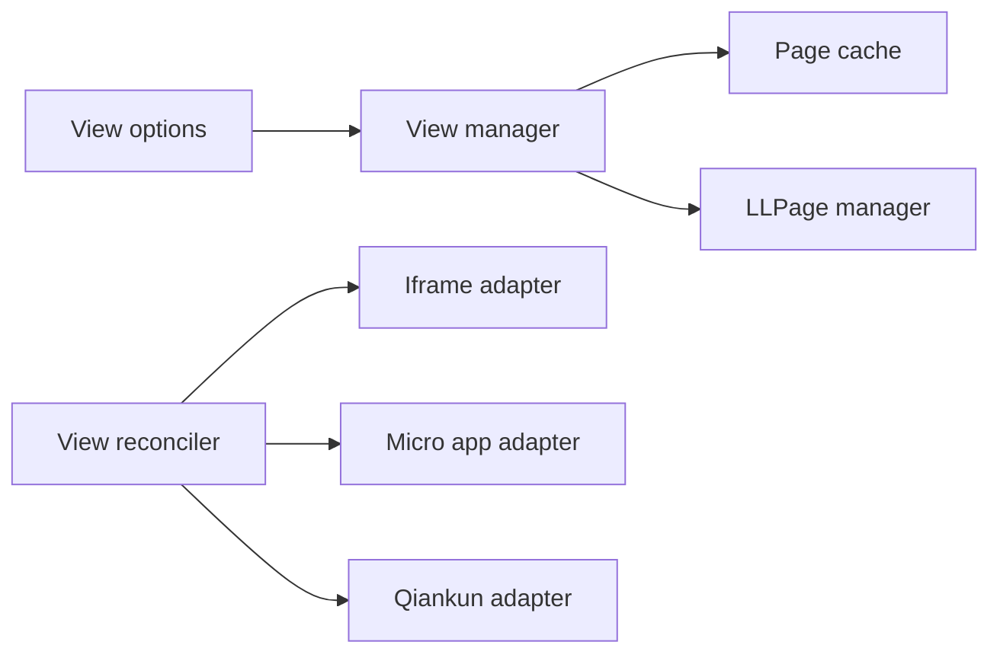
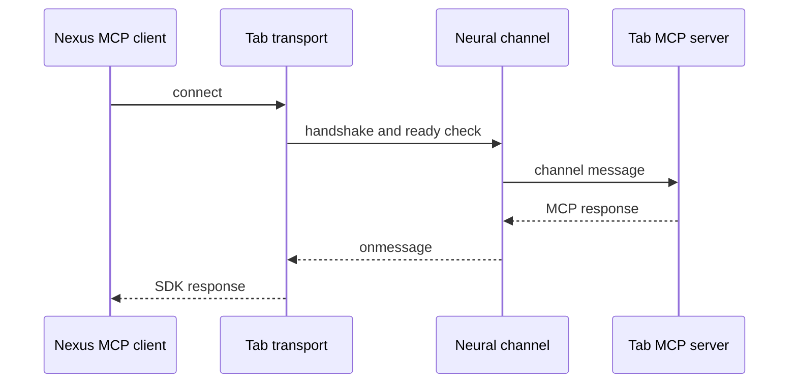

# H8. Core Modules：视图页签、嵌入适配与浏览器 MCP

> 范围：`view-manager`、`view-reconciler`、`mcp-in-browser`。这是三组独立能力：页签生命周期、外部应用宿主协调、浏览器内 MCP 客户端。

## 问题

把 iframe、微应用、qiankun 应用和普通页签随意塞进 React，会让打开、刷新、关闭、通信没有统一生命周期。浏览器内 MCP client 也不能假设存在网络 transport。本课的问题是：**谁拥有 Page 实例，谁适配外部应用，谁把 MCP SDK 接到标签页通道？**

## 图解





## 源码入口

- [ViewManager（第 4 行）](../../../../packages/core/src/modules/view-manager/src/manager.ts#L4)
- [view 输入和 page 类型（第 9 行）](../../../../packages/core/src/modules/view-manager/src/view.ts#L9)
- [reconciler 的公开导出（第 1 行）](../../../../packages/core/src/modules/view-reconciler/src/index.ts#L1)
- [基础生命周期接口（第 5 行）](../../../../packages/core/src/modules/view-reconciler/src/base/reconciler.ts#L5)
- [MCP client（第 6 行）](../../../../packages/core/src/modules/mcp-in-browser/src/client.ts#L6)
- [tab transport（第 10 行）](../../../../packages/core/src/modules/mcp-in-browser/src/transport/TabClientTransport.ts#L10)

目录和导出证明有 iframe、micro-app、qiankun 三类 reconciler；不代表它们已经被当前 Web 路由完整装配。学习时要区分“模块可导出”与“产品主链实际接入”。

## 调用链

```text
openPage(view options)
  -> find page by id in pageCache
  -> create View only when absent
  -> llpage.open(page)
  -> closePage / refreshPage / closeOtherPage
```

```text
new NexusMcpClient(name, version)
  -> connect()
  -> new TabClientTransport(channel id)
  -> SDK Client.connect(transport)
  -> transport.start -> neural-channel handshake
  -> listTools -> callTool
```

两个缓存不能混淆：`pageCache` 缓存 Page 对象；MCP client 的 `tools` 缓存发现到的服务端工具。它们都要配合真实生命周期清理。

## 关键类型

| 类型 | 责任 | 边界 |
| --- | --- | --- |
| `IViewOpts` | 打开视图所需输入 | id 决定缓存身份。 |
| `IPage` / `Page` | llpage 页实例 | 不是 Next.js route。 |
| `ILifecycle` | reconciler 生命周期约定 | 适配器负责外部视图挂载/卸载。 |
| `ToolDefinition` | MCP 工具前端投影 | 来自 SDK `listTools`。 |
| `TabClientTransport` | MCP SDK browser transport | 基于 neural-channel 而非 HTTP。 |

`TabClientTransport.onmessage` 很宽泛（[第 16 行](../../../../packages/core/src/modules/mcp-in-browser/src/transport/TabClientTransport.ts#L16)），MCP client 的工具映射也含 `any`（[第 40 行](../../../../packages/core/src/modules/mcp-in-browser/src/client.ts#L40)）。这些是应收敛到 SDK 边界的技术债。

## 测试入口

- [ViewManager 源码](../../../../packages/core/src/modules/view-manager/src/manager.ts#L1)：本次检查未发现本地专属测试。
- [View reconciler 公开模块](../../../../packages/core/src/modules/view-reconciler/src/index.ts#L1)：未发现本地专属测试。
- [MCP client 源码](../../../../packages/core/src/modules/mcp-in-browser/src/client.ts#L1)：未发现本地专属测试。

后续改动前应先建立：page cache 复用/close、每类 reconciler mount/unmount、MCP transport 握手/超时/关闭/工具 schema 测试。

## 逐行精读

1. constructor 同时创建 llpage manager 和 `pageCache`（[第 8 行](../../../../packages/core/src/modules/view-manager/src/manager.ts#L8)）。
2. `openPage` 复用已有 id；不存在时 `new View(view).page`，最后 `llpage.open`（[第 30 行](../../../../packages/core/src/modules/view-manager/src/manager.ts#L30)）。
3. `closePage` 同时关闭 llpage 和删除 cache（[第 25 行](../../../../packages/core/src/modules/view-manager/src/manager.ts#L25)）。
4. `closeOtherPage` 清空 cache 后仅回填目标 page（[第 52 行](../../../../packages/core/src/modules/view-manager/src/manager.ts#L52)）。
5. MCP `connect` 使用 `name-version` channel id，SDK connect 后读取工具（[第 22 行](../../../../packages/core/src/modules/mcp-in-browser/src/client.ts#L22)）。
6. transport `start` 创建 neural-channel Client、握手、等待 setup（[第 79 行](../../../../packages/core/src/modules/mcp-in-browser/src/transport/TabClientTransport.ts#L79)）。
7. transport 收消息时检查 channel 和 direction 才交给 SDK（[第 24 行](../../../../packages/core/src/modules/mcp-in-browser/src/transport/TabClientTransport.ts#L24)）。
8. `destroy` 关闭 transport 与 SDK client，并清空 tools（[第 34 行](../../../../packages/core/src/modules/mcp-in-browser/src/client.ts#L34)）。

## 深度拆解

**id 是页签身份，不是标题。** `openPage` 以 `view.id` 复用对象。不同业务对象若共用 id，会复用错误页面；每次随机 id 又失去复用并可能泄漏。先设计稳定身份键。

**reconciler 是外部 UI 生命周期翻译器。** iframe、微应用、qiankun 的 mount/unmount/refresh 不同，统一接口避免把适配细节散布在页面。它并不自动解决权限或安全隔离。

**MCP client 依赖 transport 契约。** SDK 不知道 tab 通信；transport 把 send/onmessage 转成 neural-channel 消息。channelId 与 direction 只做基础隔离，身份认证、调用权限和参数 schema 仍要在边界补强。

## 常见故障

| 现象 | 先查 | 根因 |
| --- | --- | --- |
| 新页复用旧内容 | `IViewOpts.id`、pageCache | identity 冲突。 |
| 关闭后资源还在 | adapter unmount、cache | Page 关闭不必然销毁外部 app。 |
| MCP connect 一直等待 | channel master、ready check | transport 依赖通道环境先就绪。 |
| 工具列表为空 | `listTools`、server 能力、日志 | catch 后会返回空数组。 |
| tab 消息串线 | channelId、direction、target | 命名或过滤不足。 |

## 改动场景判断

- **新增嵌入宿主**：实现新的 reconciler，定义生命周期并补资源测试；不要在每个页面加分支。
- **新增页签操作**：由 ViewManager 管理 cache 与 llpage，维持单一所有者。
- **增加 MCP 工具**：工具定义在 server；client 发现和调用。补 schema、授权、transport error。
- **收紧类型**：把 `any` 收敛在 SDK 边界，内部转换为 DTO 并配 fake transport 测试。

## 源码追问清单

1. `View` 如何将 `IViewOpts` 转成 llpage Page？
2. 三类 reconciler 的 mount/unmount 有何不同？
3. page refresh 由谁触发？
4. Tab MCP server 在哪里，怎样验证调用权限？
5. `listTools` 的 catch 会不会把连接失败误显示为空工具？

## 练习

设计一个项目 README 的稳定 `view.id`，说明为何不能只用标题。再写 MCP client 测试计划：fake transport 握手、两工具返回、structured content、destroy 后拒绝 send。最后列出 iframe 卸载应验证的三种资源。

## 验收

- 能从 `openPage` 追到 page cache 与 llpage，而不误认为 Next.js 路由。
- 能解释 reconciler 解决外部宿主差异，不是业务权限。
- 能从 MCP client 追到 tab transport 与 neural-channel 握手。
- 能指出测试缺口与严格 TypeScript 改造风险。
