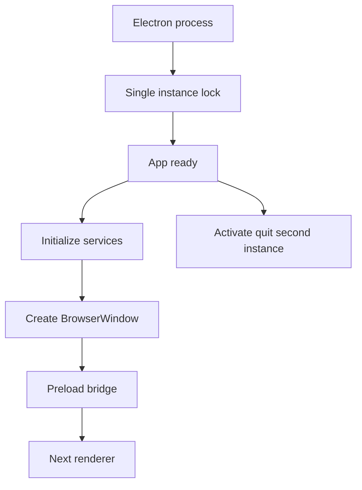
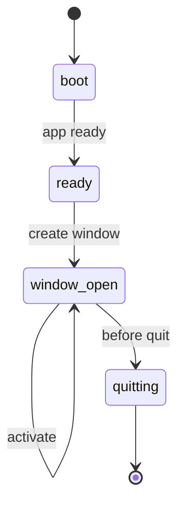

# I1. Electron Main：桌面应用如何真正启动

## 问题

Electron 有 main、renderer 两个进程：main 拥有系统窗口、文件与进程能力；renderer 是网页 UI。OriginOS 的 main 还要管理单实例、日志、服务注册、托盘、更新器和打包态 renderer。第一原则：**BrowserWindow 不是业务服务，main.ts 是组装根。**

## 图解






## 源码入口

- [main 进程入口（第 1 行）](../../../../packages/desktop/src/main/main.ts#L1)
- [单实例与开发 userData（第 34 行）](../../../../packages/desktop/src/main/main.ts#L34)
- [renderer URL 解析（第 162 行）](../../../../packages/desktop/src/main/main.ts#L162)
- [BrowserWindow 创建（第 339 行）](../../../../packages/desktop/src/main/main.ts#L339)
- [`whenReady` 装配（第 382 行）](../../../../packages/desktop/src/main/main.ts#L382)
- [窗口和退出生命周期（第 449 行）](../../../../packages/desktop/src/main/main.ts#L449)

## 调用链

```text
Electron executes main.ts
  -> setup data root
  -> request single instance lock
  -> app when ready
  -> initialize logs, services, tray, shortcuts, updater
  -> createWindow
  -> BrowserWindow loads renderer URL with preload
  -> renderer calls allowed IPC through preload bridge
```

开发态默认 URL 是 `http://localhost:3000`，打包态则要求 renderer URL 或启动 bundled renderer（[第 162 行](../../../../packages/desktop/src/main/main.ts#L162)）。网页可打开不等于桌面打包链正确。

## 关键类型

| 对象 | 所有权 | 作用 |
| --- | --- | --- |
| `app` | Electron main | 生命周期、路径、单实例锁。 |
| `BrowserWindow` | main | 原生窗口和 webContents。 |
| `ElectronWindowManager` | desktop main | 窗口业务适配。 |
| `ChildProcess` | Node main | renderer 或 worker 进程句柄。 |
| `ipcServices` | main | 已注册服务的生命周期容器。 |

## 测试入口

- [desktop Vitest 配置](../../../../packages/desktop/vitest.config.ts#L1)
- [桌面 services 目录示例](../../../../packages/desktop/src/main/services/project-service.ts#L1)

本次检查未发现 main 生命周期专属自动化测试。需要 Electron integration 测试覆盖单实例、开发/打包 URL、窗口关闭和 before-quit 清理。

## 逐行精读

1. 第 1 行先导入 `setup-data-root`，数据根必须早于服务创建确定。
2. 第 34-44 行设置应用名、开发 userData、单实例锁和 Windows AppUserModelId。
3. `resolveRendererUrl` 先看环境变量，再看命令行，只有开发态回落 localhost（[第 162 行](../../../../packages/desktop/src/main/main.ts#L162)）。
4. main 保存窗口、服务、renderer child process 引用（[第 46 行](../../../../packages/desktop/src/main/main.ts#L46)），它们都是进程级资源。
5. `whenReady` 是 Electron API 安全装配时机；`activate` 和 `window-all-closed` 是平台生命周期分支（[第 382 行](../../../../packages/desktop/src/main/main.ts#L382)）。

## 深度拆解

**main 是 composition root。** 它能导入 core 公共 API 和 desktop adapter，却不应复制项目、技能、本体的规则。服务实例化属于组装，业务规则应留在 core。

**单实例锁也是数据保护。** 两个 main 同时写同一 userData、拉起同一 agent worker，会产生会话和文件竞争。

**日志不是事实源。** main 捕获 console 与未处理异常（[第 111 行](../../../../packages/desktop/src/main/main.ts#L111)），用于诊断；可恢复状态仍须存入对应 store。

## 常见故障

| 现象 | 先查 | 原因 |
| --- | --- | --- |
| 双击无窗口 | 单实例锁、second-instance | 可能已有进程或激活逻辑失效。 |
| 打包白屏 | renderer URL、standalone、日志 | 开发 URL 不能用于 packaged。 |
| 关窗不退出 | tray、window-all-closed、before-quit | 可能设计为驻留。 |
| 开发数据污染 | userData 路径 | 环境路径未隔离。 |

## 改动场景判断

- **新增本地服务**：在 ready 组装和退出清理注册，业务先下沉 core。
- **改 renderer 加载**：同时验证 dev、packaged 与端口等待。
- **增加原生菜单/快捷键**：留在 main adapter，renderer 不直接碰 Electron API。
- **改退出**：覆盖窗口、tray、worker、日志 flush 的集成测试。

## 源码追问清单

1. `createWindow` 的 webPreferences 怎样配置 preload、contextIsolation、sandbox？
2. packaged renderer 如何由 `ensurePackagedRendererUrl` 启动？
3. `ipcServices` 在 before-quit 怎样释放？
4. second-instance 如何聚焦已有窗口？
5. agent worker 与 renderer child process 的故障能否分别观测？

## 练习

画开发态与打包态 renderer URL 两条路径，说明何时不允许回落 localhost。再为第二次启动写三步验收：新进程退出、旧窗口显示、会话不重复创建。

## 验收

- 能解释 main、preload、renderer 的权限差异。
- 能从启动追到 `whenReady -> createWindow -> renderer`。
- 能解释 renderer URL 和单实例锁。
- 能指出 main 只组装、不复制 core 业务的边界。
