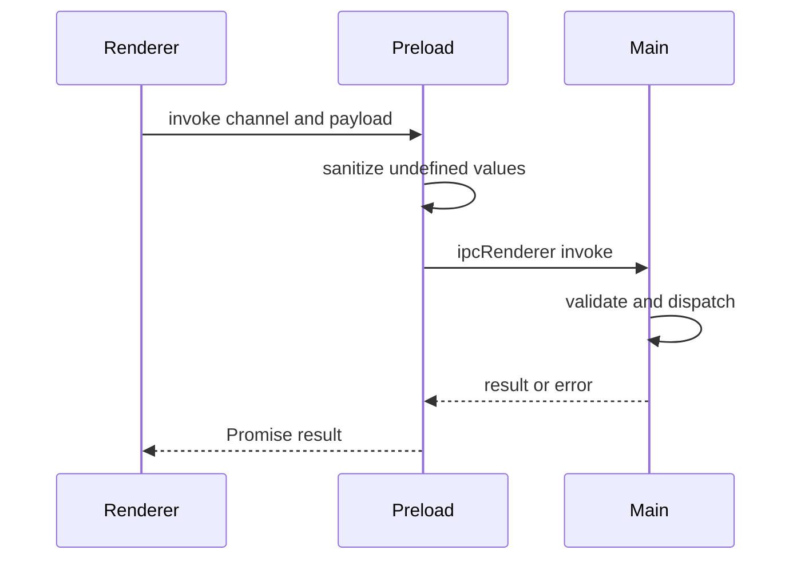

# I2. Preload 与 IPC：renderer 如何安全请求本地能力

## 问题

renderer 是不可信网页上下文，不能拥有 Node/Electron 全量权限。preload 在隔离上下文中将经过审查的最小 API 暴露给 `window.electron`；main 才注册具体 handler。IPC channel 是跨进程契约，不是任意字符串的快捷调用。

## 图解





## 源码入口

- [preload bridge（第 1 行）](../../../../packages/desktop/src/main/preload.ts#L1)
- [payload 清洗（第 5 行）](../../../../packages/desktop/src/main/preload.ts#L5)
- [公开 electron API（第 22 行）](../../../../packages/desktop/src/main/preload.ts#L22)
- [IPC channel 常量（第 1 行）](../../../../packages/desktop/src/main/ipc-protocol.ts#L1)
- [channel 联合类型（第 150 行）](../../../../packages/desktop/src/main/ipc-protocol.ts#L150)
- [main 进程服务装配](../../../../packages/desktop/src/main/main.ts#L382)

## 调用链

```text
renderer integration service
  -> window.electron.ipcRenderer.invoke(channel, args)
  -> preload sanitizeIpcArg
  -> Electron IPC boundary
  -> ipcMain handler registered by desktop service
  -> core public service or filesystem adapter
  -> Promise result back to renderer
```

`send` 是单向事件，`invoke` 是请求/响应，`on` 返回 unsubscribe（[第 25 行](../../../../packages/desktop/src/main/preload.ts#L25)）。选择错误语义会造成调用方永远等不到结果或监听器泄漏。

## 关键类型

| 类型 | 作用 | 约束 |
| --- | --- | --- |
| `IpcChannel` | 所有允许 channel 的联合 | 不应散落硬编码字符串。 |
| `IpcListener` | renderer 事件回调 | preload 隐去 Electron event 对象。 |
| `electronApi` | 暴露到 window 的能力表面 | 必须最小化、可审计。 |
| payload | 可结构化跨进程数据 | undefined 需规范化，不能传函数/句柄。 |

## 测试入口

- [IPC protocol 源码](../../../../packages/desktop/src/main/ipc-protocol.ts#L1)
- [workspace upload IPC 验证脚本](../../../../packages/desktop/scripts/verify-workspace-upload-ipc.js#L1)

本次没有发现 preload API 的专属单测。应补 channel 白名单、payload 清洗、unsubscribe、无 handler 错误、敏感 API 不暴露的测试。

## 逐行精读

1. `sanitizeIpcArg` 将 undefined 变 null，递归处理数组/对象，并丢弃对象内 undefined（[第 5 行](../../../../packages/desktop/src/main/preload.ts#L5)）。
2. `contextBridge.exposeInMainWorld` 是唯一公开入口（[第 48 行](../../../../packages/desktop/src/main/preload.ts#L48)）。
3. `on` 包装 listener，不把 Electron event 泄露给 renderer，且返回准确 removeListener 函数（[第 35 行](../../../../packages/desktop/src/main/preload.ts#L35)）。
4. `IPC_CHANNELS as const` 让字符串表推导为 literal union（[第 1 行](../../../../packages/desktop/src/main/ipc-protocol.ts#L1)）。

## 深度拆解

**preload 是能力防火墙，不是便利转发器。** 暴露通用 `invoke(channel: string)` 已经把 channel 选择交给 renderer；真正安全还要靠 main handler 对 channel、参数、项目路径和调用者语境再校验。

**协议应从“名字”升级为 DTO。** 当前 `IpcChannel` 约束的是名字，不自动把请求/响应类型与 channel 绑定。新高风险接口应定义 request/response schema，在 main 验证后才调用服务。

## 常见故障

| 现象 | 先查 | 原因 |
| --- | --- | --- |
| `window.electron` 不存在 | preload 路径、webPreferences | preload 未加载或隔离配置错误。 |
| invoke 一直失败 | channel、handler 注册、参数 schema | channel 有常量不等于已有 handler。 |
| 事件越收越多 | `on` 返回的 unsubscribe | 组件卸载未清理监听。 |
| undefined 丢失 | sanitize 规则 | 跨 IPC 后会变为 null/被省略。 |

## 改动场景判断

- **新增 IPC 能力**：先加 channel 与 request/response 类型，再在 desktop service 注册 handler，最后暴露最小 preload API。
- **涉及文件系统**：main 必须校验 base path，renderer 不可提供任意绝对路径。
- **流式事件**：使用 `on` 并明确 unsubscribe、会话 id、重连语义。
- **移除能力**：同步删除 preload 暴露、handler、UI 适配与测试，避免幽灵权限。

## 源码追问清单

1. main 中各 service 在何处注册 `ipcMain.handle`？
2. 哪些 channel 必须校验 projectId 与 allowed path？
3. IPC error 如何统一映射成 UI 错误？
4. renderer 类型声明如何描述 `window.electron`？
5. 哪些 channel 还缺 request/response schema？

## 练习

为“读取项目文件”设计一个 IPC DTO：只接收 projectId 和相对路径，main 解析并验证后读取。列出 preload、protocol、service、renderer 四处的改动，并写出目录穿越失败的验收用例。

## 验收

- 能解释 renderer 为什么不能直接调用 Node。
- 能追清 `renderer -> preload -> ipcMain -> service`。
- 能区分 send、invoke、on 及 listener 清理。
- 能提出一条 channel 名称之外的参数/权限校验。
