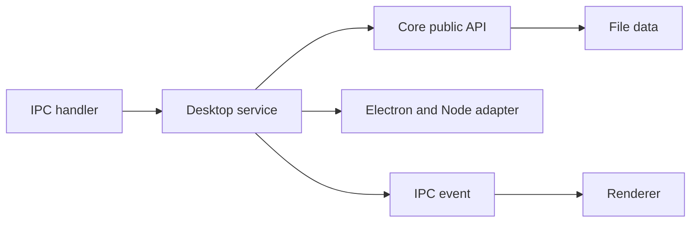
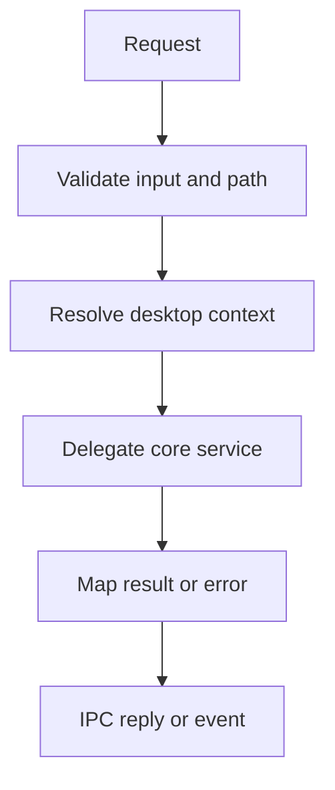

# I3. Desktop Services：桌面边界如何复用 Core

## 问题

桌面端需要 IPC、Electron 路径和原生通知，但项目、会话、工作区、本体等规则不能在 desktop 再写一份。desktop service 应该是“把 IPC/OS 输入翻译为 core 公共 API 调用”的适配层。判断服务是否健康的关键：**删除 Electron 后，核心规则还能否留在 core 独立测试？**

## 图解






## 源码入口

- [ProjectService（第 74 行）](../../../../packages/desktop/src/main/services/project-service.ts#L74)
- [AgentSessionService（第 64 行）](../../../../packages/desktop/src/main/services/agent-session-service.ts#L64)
- [WorkspaceService（第 89 行）](../../../../packages/desktop/src/main/services/workspace-service.ts#L89)
- [CollaborationService（第 40 行）](../../../../packages/desktop/src/main/services/collaboration-service.ts#L40)
- [DesktopSchedulerService（第 12 行）](../../../../packages/desktop/src/main/services/desktop-scheduler-service.ts#L12)
- [main 的服务导入与装配](../../../../packages/desktop/src/main/main.ts#L13)

服务目录很大，首次阅读不按字母顺序。先选一个完整 vertical slice，例如 workspace：IPC 输入、allowed path、core workspace API、结果回传。再把这套阅读方式应用到 agent、project、collaboration。

## 调用链

```text
renderer invokes workspace file action
  -> preload IPC bridge
  -> WorkspaceService handler
  -> assertAllowed and resolveProjectDir
  -> core workspace or Node filesystem operation
  -> structured result back through IPC
```

```text
desktop scheduler tick
  -> DesktopSchedulerService
  -> SchedulerService in core
  -> DesktopSchedulerActionRunner
  -> native notification or system tool adapter
```

## 关键类型

| 服务 | 桌面专属职责 | 应下沉/复用的职责 |
| --- | --- | --- |
| `ProjectService` | IPC 注册、桌面路径/事件 | 项目领域模型与持久化规则。 |
| `AgentSessionService` | 流事件桥接、进程语境 | Agent 会话生命周期。 |
| `WorkspaceService` | allowed path、上传 buffer | 文件工作区规则与 DTO。 |
| `CollaborationService` | Electron 事件转发 | 多 Agent runtime/DAG。 |
| `DesktopSchedulerService` | 宿主 tick/原生动作 | trigger 与任务状态机。 |

## 测试入口

- [desktop scheduler service](../../../../packages/desktop/src/main/services/desktop-scheduler-service.ts#L1)
- [workspace upload 验证脚本](../../../../packages/desktop/scripts/verify-workspace-upload-ipc.js#L1)
- [core workspace 路径测试](../../../../packages/core/src/lib/integrations/electron/__tests__/workspace-paths.test.ts#L1)

测试策略要拆开：core 规则优先用单元测试；desktop 适配要测 IPC 注册、路径拒绝、事件转发；真实 Electron 再做少量集成验证。不能只测 UI 或只测 core 后宣称 IPC 已安全。

## 逐行精读

1. `WorkspaceService` 前面的 `assertAllowed`（[第 30 行](../../../../packages/desktop/src/main/services/workspace-service.ts#L30)）说明路径验证是 desktop 安全边界。
2. `resolveProjectDir`（[第 40 行](../../../../packages/desktop/src/main/services/workspace-service.ts#L40)）将逻辑 entry id 映射为实际基目录，避免 renderer 给出任意磁盘路径。
3. `CollaborationService` 通过动态 `getFacade`（[第 11 行](../../../../packages/desktop/src/main/services/collaboration-service.ts#L11)）接入 core runtime，服务自身不是 DAG 实现。
4. `DesktopSchedulerService` 继承 core 默认 runner 的扩展点（[第 67 行](../../../../packages/desktop/src/main/services/desktop-scheduler-service.ts#L67)），体现宿主动作适配。

## 深度拆解

**“复用 core”不是直接 import 内部文件。** 按 AGENTS，跨 feature/包应通过公共 `index.ts` API；desktop 直接穿透 core 私有实现会让边界与测试替换失效。

**路径校验必须发生在有权限的一端。** renderer 即便做了输入限制，恶意/异常 IPC 仍可绕过；`WorkspaceService` 的 allowed path 是防线，解析与 realpath 规则要一起审查。

**流式服务还要管理背压与清理。** Agent/collaboration 事件不是一次 RPC 结果，必须考虑 listener 释放、session 终止、renderer 重连和异常转换。

## 常见故障

| 现象 | 先查 | 原因 |
| --- | --- | --- |
| Web 正常、desktop 失败 | IPC handler/service 注册 | core 不能自动变 IPC endpoint。 |
| 文件能读不该读的目录 | `assertAllowed`、解析顺序 | 只做字符串前缀判断。 |
| agent 流停止 | session service、事件 channel、worker | 进程/订阅任一层已断。 |
| 功能在 core/desktop 行为不同 | DTO mapping、默认值 | 适配层复制了业务判断。 |

## 改动场景判断

- **新增桌面功能**：先找 core 公共 API；缺失才在 core 建立，再加 desktop adapter。
- **新增文件操作**：定义相对路径 DTO，main 解析并校验，补穿越/符号链接测试。
- **新增流事件**：制定 channel、session id、取消和 unsubscribe 协议。
- **发现业务复制**：将纯规则提取到 core，desktop 仅保留 IPC/OS 代码。

## 源码追问清单

1. 每个 service 如何注册和释放 IPC handler？
2. Workspace 上传如何限制大小、编码、realpath？
3. collaboration event 怎样转发给多个 renderer 窗口？
4. 哪些 service 仍直接依赖 core 内部路径？
5. DesktopSchedulerService 的 tick 从何处启动和关闭？

## 练习

选 `WorkspaceService`，画出一次读文件的完整链路，并标记三个应验证的权限点。再选一个 service，列出其中“Electron 专属”和“应留在 core”的方法，给出重构边界。

## 验收

- 能说明 desktop service 是适配器而非第二套业务层。
- 能从 IPC 追到一个 service，再追到 core 或 OS 边界。
- 能解释路径校验为何必须在 main。
- 能为流事件指出订阅、取消、清理三个必要问题。
