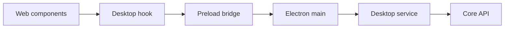
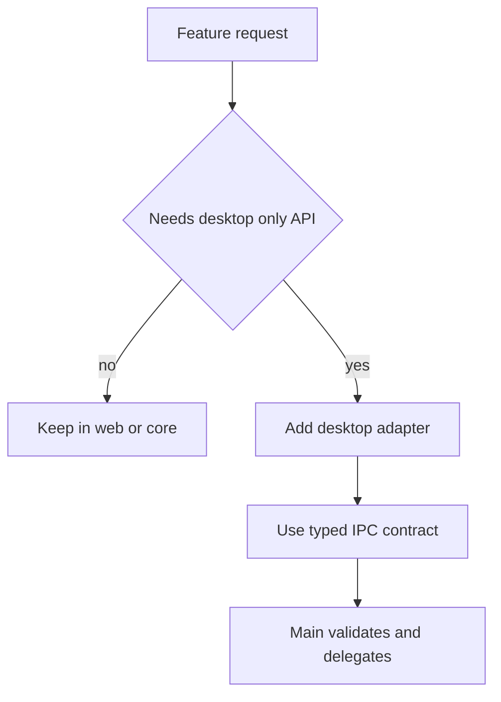
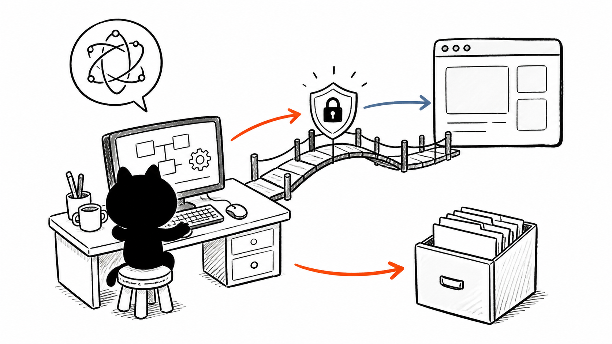

# I4. Desktop Lib / Renderer：适配层不要反向吞掉应用层

## 问题

`packages/desktop/src/lib/` 和 `renderer/` 容易变成“任何东西都放这里”的目录。正确角色是补足 desktop 平台差异：把 Electron IPC 表现为前端可用 service/hook，或提供 desktop renderer 专属 UI。它们不能反向依赖 main 私有实现，也不能替代 `packages/web` 的主 UI。

## 图解







## 源码入口

- [desktop workspace hook](../../../../packages/desktop/src/lib/hooks/use-workspace.ts#L1)
- [preload IPC bridge](../../../../packages/desktop/src/main/preload.ts#L22)
- [web workspace service adapter](../../../../packages/web/src/services/AppWindowManager.ts#L1)
- [core workspace hook tests](../../../../packages/core/src/lib/hooks/__tests__/use-workspace.test.ts#L1)

当前 desktop `renderer/` 目录在本次文件清单中未发现实际补充源码；不要假设目录规约等于已有实现。以实际 `rg --files` 为准，空目录不是学习对象。

## 调用链

```text
renderer component
  -> desktop lib hook or integration service
  -> window.electron IPC API
  -> main service
  -> core / filesystem result
  -> hook state update
```

Web 环境没有 `window.electron` 时，适配层需要明确降级/不可用策略；不能让业务组件到处探测平台。平台判断应集中，业务调用保持语义化，例如“列出工作区文件”而非“调用 ipc channel”。

## 关键类型

| 概念 | 责任 | 不应承担 |
| --- | --- | --- |
| desktop hook | 将 IPC 请求映射为 React 生命周期 | core 业务规则。 |
| integration service | 隐藏 Web/Electron transport 差异 | 页面布局和展示文案。 |
| preload API | 最小能力桥 | 任意 Node/Electron API。 |
| renderer supplement | desktop 特有显示适配 | main 进程服务实现。 |

## 测试入口

- [core workspace hook 测试](../../../../packages/core/src/lib/hooks/__tests__/use-workspace.test.ts#L1)
- [workspace paths 测试](../../../../packages/core/src/lib/integrations/electron/__tests__/workspace-paths.test.ts#L1)
- [desktop Vitest 配置](../../../../packages/desktop/vitest.config.ts#L1)

对 hook 至少测 loading/success/error/unmount；对 Electron adapter 用 mock preload API；关键一条再走真实 IPC。不能把 Node API mock 成成功就当预加载桥已验证。

## 逐行精读

1. 先从 [desktop workspace hook](../../../../packages/desktop/src/lib/hooks/use-workspace.ts#L1) 找它依赖的是 `window.electron`、core API，还是 web service。
2. 再反向定位 preload 暴露的 `invoke/on`（[第 22 行](../../../../packages/desktop/src/main/preload.ts#L22)），确认 hook 没有绕过桥。
3. 最后检查 main service 是否做参数/路径验证；hook 的“成功”只代表 UI 收到结果，不代表服务端授权正确。

## 深度拆解

**同一业务可有多 transport，不能有两套语义。** Web 可经 route，Electron 可经 IPC；两者都应映射到同一 core 用例和 DTO。若 desktop hook 自己补默认值或改状态机，跨端行为会漂移。

**客户端 platform detection 是体验分支，不是安全边界。** `isElectron` 只能决定是否展示功能或调用适配器；权限控制必须留在 main。

## 常见故障

| 现象 | 先查 | 原因 |
| --- | --- | --- |
| 浏览器版崩溃 | adapter 平台检测 | 直接访问 `window.electron`。 |
| desktop UI 与 Web 行为不同 | DTO 和 core 用例 | adapter 混入业务判断。 |
| 卸载后 state 更新 | hook cleanup | IPC promise/listener 未取消。 |
| 组件导入 main | import 路径 | 违反 renderer/main 隔离。 |

## 改动场景判断

- **新功能不依赖 native 能力**：留在 web/core，别为“统一”新建 IPC。
- **需要系统文件/通知**：在 adapter 调语义 API，在 main 验证并委托。
- **Web/Electron 共用 UI**：以 service interface 注入或平台适配替换 transport，不直接条件导入 main。
- **新 renderer 组件**：明确其是否真是 desktop 专属；否则归入 web components。

## 源码追问清单

1. desktop hook 如何识别和报告非 Electron 环境？
2. 哪些 web service 已抽象 Web/IPC 双 transport？
3. 是否有 renderer 直接依赖 Node 包的遗留代码？
4. hook 的取消/订阅释放怎样测试？
5. 空 renderer 目录是规划还是遗漏？

## 练习

挑一个“打开文件夹”功能，判断它应放在 web、desktop lib、main service、core 的哪一层。画出 browser 版本不可用时的 UI 状态和 desktop 版本的完整 IPC 链。

## 验收

- 能区分 desktop lib/hook、web service、main service 的责任。
- 能说明为什么 renderer 不能 import main 或 Node 特权 API。
- 能设计 Web 与 Electron 共享业务语义的适配边界。
- 能为 hook 写出 mock bridge 与真实 IPC 两层测试。
