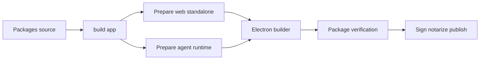
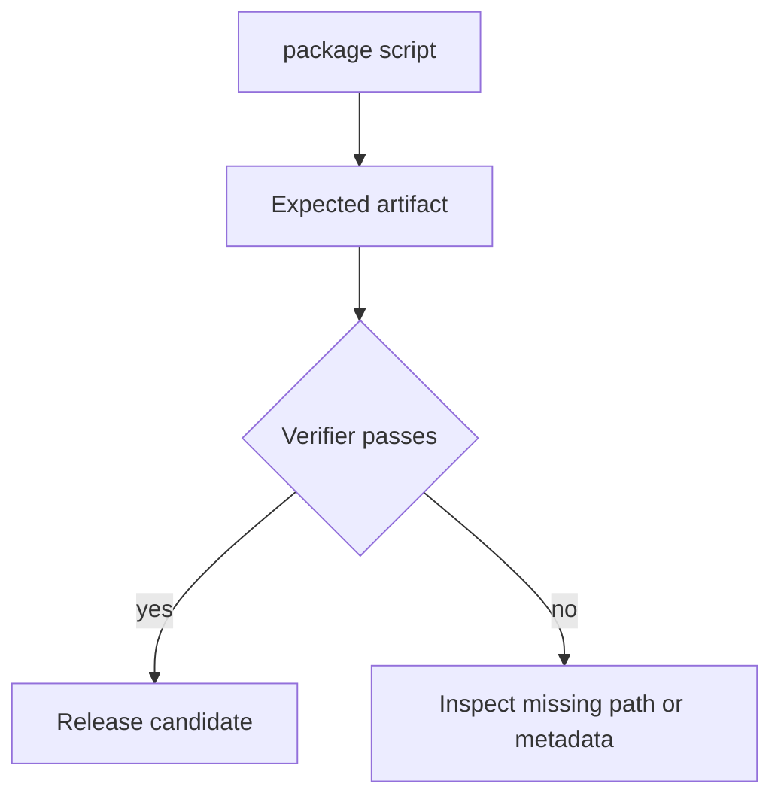
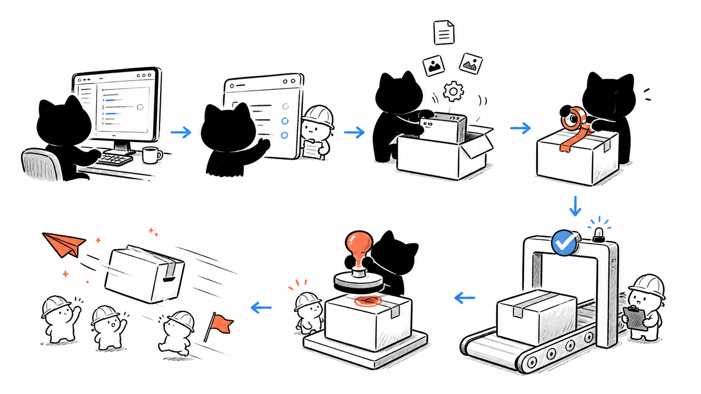

# I5. Desktop Build：从源码到可验证发布包

## 问题

桌面发布不是 `tsc` 成功就结束。它要同时带上 Electron main、预加载脚本、Next standalone renderer、core 运行时代码、agent worker、平台签名和更新元数据。每个脚本解决一种发布风险；跳过验证会产生“开发可跑、安装包白屏/worker 缺模块”的假成功。

## 图解







## 源码入口

- [desktop package scripts](../../../../packages/desktop/package.json#L1)
- [electron-builder 配置](../../../../packages/desktop/electron-builder.yml#L1)
- [准备 Web standalone](../../../../packages/desktop/scripts/prepare-web-standalone.js#L1)
- [验证 agent worker runtime](../../../../packages/desktop/scripts/verify-agent-worker-runtime.js#L1)
- [验证 mac package](../../../../packages/desktop/scripts/verify-mac-package.js#L1)
- [验证 Windows package](../../../../packages/desktop/scripts/verify-windows-package.js#L1)
- [验证发布产物](../../../../packages/desktop/scripts/verify-release-artifacts.js#L1)

## 调用链

```text
pnpm build:app
  -> build pi agent adapter
  -> build Next web
  -> prepare web standalone
  -> prepare AI runtime dependencies
  -> compile desktop TypeScript
  -> verify worker runtime and root artifacts
  -> stage dist-electron
  -> electron-builder uses electron-builder.yml
  -> platform verification and publish scripts
```

`dist-electron/` 是编译/暂存产物，不是源码入口；修复应回到 `packages/desktop/src`、`packages/core/src` 或 scripts。这个约束来自 AGENTS，也能避免“手改产物、下次构建丢失”。

## 关键类型

| 概念 | 含义 | 关注点 |
| --- | --- | --- |
| `build:app` | 组装前置构建流水线 | Web、adapter、runtime 与 main 都要完成。 |
| `extraResources` | 包外资源复制声明 | 路径必须和 packaged 运行时读取位置匹配。 |
| `asar` | 应用归档形式 | require/worker 相对路径需专门验证。 |
| signing/notarization | 平台信任流程 | mac 与 Windows 规则不同。 |
| update metadata | 自动更新索引 | 版本、文件名、发布渠道需一致。 |

## 测试入口

- [pi task runtime package 测试](../../../../packages/desktop/scripts/__tests__/verify-pi-task-runtime-package.test.mjs#L1)
- [mac package verifier](../../../../packages/desktop/scripts/verify-mac-package.js#L1)
- [asar relative require verifier](../../../../packages/desktop/scripts/verify-asar-relative-requires.js#L1)
- [update metadata verifier](../../../../packages/desktop/scripts/verify-update-metadata.js#L1)

这些是发布验证，不替代 core/web 功能测试；反过来，单元测试通过也不证明包内文件位置、签名与更新元数据正确。

## 逐行精读

1. `build:app` 先清理 `.next`/`dist-electron`，再构建 web/adapter、准备 standalone/runtime、编译 desktop、运行 worker 验证（[第 5 行](../../../../packages/desktop/package.json#L5)）。
2. `pack` 用 `--dir` 输出未安装目录，适合先检查；`dist` 生成平台分发产物（[第 7 行](../../../../packages/desktop/package.json#L7)）。
3. builder 的 `files` 复制 main/core/adapter，`extraResources` 把 standalone Web、templates、agent worker 放入 resources（[第 13 行](../../../../packages/desktop/electron-builder.yml#L13)）。
4. mac 配置声明 hardened runtime、签名及 arm64/x64；Windows 生成 nsis/zip（[第 68 行](../../../../packages/desktop/electron-builder.yml#L68)）。

## 深度拆解

**打包配置是运行时依赖图。** 每个 `from/to` 都必须和代码的 packaged path 相符。worker 能编译不代表 Electron Builder 会把它和依赖一起带走。

**验证脚本是可执行发布规格。** `verify-agent-worker-runtime`、`verify-asar-relative-requires` 不是多余检查，而是在防止动态 import、相对 require、资源路径等静态 TypeScript 不会发现的问题。

**发布需区分构建、签名、分发、更新。** 打出 DMG/NSIS 不代表可信；签名通过不代表 CDN metadata 正确；更新 metadata 正确也不代表首次安装包能启动。

## 常见故障

| 现象 | 先查 | 原因 |
| --- | --- | --- |
| 安装包白屏 | standalone Web、renderer URL、extraResources | 仅复制 main，未带 renderer。 |
| worker 找不到模块 | runtime prepare、worker verifier、asar paths | 动态依赖未复制。 |
| mac 无法打开 | signing/notarization/entitlements | 平台信任链失败。 |
| 自动更新不生效 | version、metadata、publish URL | 发布物与索引不一致。 |

## 改动场景判断

- **新增 runtime 依赖**：修改构建准备与 builder 复制规则，并增加包内验证。
- **改 worker import**：先跑 relative require/worker verifier，再试真实打包。
- **新增平台**：建立独立 build、签名、安装和 update 验收矩阵。
- **修复打包问题**：禁止改 `dist-electron`，回源代码或脚本。

## 源码追问清单

1. `prepare-web-standalone` 如何选择 Next 输出文件？
2. worker 的每个动态依赖怎样进入 asar/resources？
3. `verify-release-artifacts` 覆盖哪些文件名/版本约束？
4. mac notarize 脚本与 builder `notarize: false` 如何配合？
5. release workflow 在哪里触发这些脚本？

## 练习

选择 agent worker，画出它从 TS 源码到 packaged resource 的四步复制链。再为“新增一个 native Node 依赖”写出必须修改/验证的文件清单，并说明为何仅 `pnpm build` 不够。

## 验收

- 能解释 `build:app -> electron-builder -> verify -> sign/publish`。
- 能定位 standalone Web、agent worker、core runtime 在 builder 中的复制规则。
- 能区分单元测试、包验证、签名、更新 metadata 验证。
- 能说明为什么不能手改 `dist-electron`。
