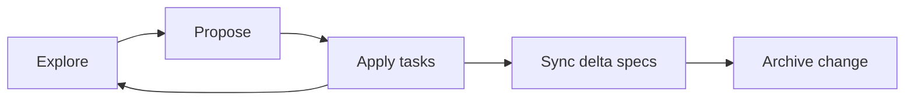
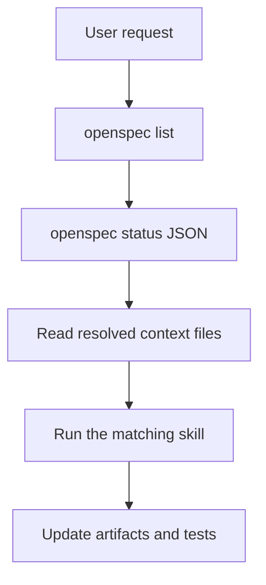
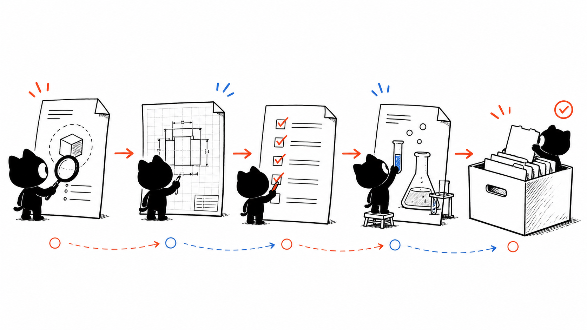

# J1. OpenSpec Skills：从探索到归档的受控变更

## 问题

需求讨论、设计、实施、规格同步和归档是不同工作，不该靠一句“帮我改一下”混在一起。OpenSpec skills 用 CLI 的 change 状态和 artifact graph 决定下一步。它不是自动写代码的魔法按钮；每个 skill 都有明确的输入、停止条件和权限边界。

## 图解







## 源码入口

- [explore skill](../../../../.codex/skills/openspec-explore/SKILL.md#L1)
- [propose skill](../../../../.codex/skills/openspec-propose/SKILL.md#L1)
- [apply skill](../../../../.codex/skills/openspec-apply-change/SKILL.md#L1)
- [sync specs skill](../../../../.codex/skills/openspec-sync-specs/SKILL.md#L1)
- [archive skill](../../../../.codex/skills/openspec-archive-change/SKILL.md#L1)

本次工作树中未发现 `openspec/` change artifacts；课程因此讲真实 skill 指令，而不伪造某个现存 change。实际操作时路径必须由 `openspec status --json` 返回，不能硬编码仓库目录。

## 调用链

```text
idea -> explore (read and clarify only)
  -> propose: openspec new change
  -> status: resolve schema and artifact paths
  -> apply: read contextFiles, implement unchecked tasks, update tasks
  -> sync: merge delta specs into main specs
  -> archive: verify artifacts/tasks, move completed change
```

## 关键类型

| 概念 | 用途 | 关键约束 |
| --- | --- | --- |
| change | 一个有名称的变更容器 | 不等于 Git branch。 |
| schema | artifact 的依赖和顺序 | 不能假定总是 proposal/design/tasks。 |
| artifact graph | 当前缺什么/可做什么 | 以 status JSON 为准。 |
| actionContext | 允许编辑的范围 | workspace-planning 可能禁止直接实现。 |
| delta spec | 对主规格的增量意图 | 必须智能合并，不整篇覆盖。 |

## 测试入口

- [apply 的完成与任务勾选规则](../../../../.codex/skills/openspec-apply-change/SKILL.md#L27)
- [archive 的 artifact/task 检查规则](../../../../.codex/skills/openspec-archive-change/SKILL.md#L27)

skill 本身不是项目业务测试。它要求实施时按 change 的任务与测试证据验证；OpenSpec 不能替代 `pnpm test`、集成测试或人工验收。

## 逐行精读

1. explore 明确允许读代码/创建规划 artifact，但禁止实现（[第 10 行](../../../../.codex/skills/openspec-explore/SKILL.md#L10)）。
2. propose 先 `openspec new change`，然后从 status 获取 schema、artifact 路径和 apply requirements（[第 22 行](../../../../.codex/skills/openspec-propose/SKILL.md#L22)）。
3. apply 先选 change、读取 status，再请求 apply instructions 返回的 `contextFiles`（[第 14 行](../../../../.codex/skills/openspec-apply-change/SKILL.md#L14)）。
4. apply 每完成一项立即勾选 tasks，遇到不清楚或设计问题暂停（[第 65 行](../../../../.codex/skills/openspec-apply-change/SKILL.md#L65)）。
5. sync 读取 delta 和 main spec，做 added/modified/removed/renamed 的幂等合并（[第 30 行](../../../../.codex/skills/openspec-sync-specs/SKILL.md#L30)）。
6. archive 先核对 artifact、任务和 spec sync，再移动整个 change（[第 27 行](../../../../.codex/skills/openspec-archive-change/SKILL.md#L27)）。

## 深度拆解

**状态 CLI 是事实源。** 文件名、路径、schema 都可变；skills 一再要求读 status/instructions JSON，正是为了避免 agent 把旧模板当当前规则。

**探索与实施刻意分离。** explore 的价值是允许发现风险而不产生半成品代码；apply 的价值是把已批准意图落成可追踪任务。需求没清楚时直接 apply，最终只会让 tasks 和实现一起漂移。

## 常见故障

| 现象 | 先查 | 原因 |
| --- | --- | --- |
| 不知道改哪个 change | `openspec list --json` | 不能猜名称。 |
| apply 缺少上下文 | status/instructions 的 contextFiles | 只读 tasks，没有读设计/spec。 |
| 任务已写但未验证 | tasks 与真实测试证据 | 勾选不等于通过。 |
| archive 后规格缺失 | sync assessment | 忘记合并 delta spec。 |

## 改动场景判断

- **只有模糊想法**：explore。
- **已有明确目标、要生成变更材料**：propose。
- **有 ready tasks、要改代码**：apply。
- **实现后要让主规格反映变化**：sync。
- **所有 artifacts/tasks/验证完成**：archive。

## 源码追问清单

1. 当前 CLI 返回的 schema 和 `applyRequires` 是什么？
2. actionContext 是否允许编辑此 workspace？
3. change 的 contextFiles 有哪些，是否都读过？
4. delta spec 哪些内容尚未同步？
5. 哪项测试证据支持每个已勾选 task？

## 练习

把“给工作区增加导出”分别写成 explore、propose、apply 三个阶段要做的事。再解释为什么 archive 前要检查 task checkbox 和 delta spec，而不能只看 Git diff。

## 验收

- 能为一个请求选择正确的 OpenSpec skill。
- 能解释为什么 status/instructions JSON 比猜目录可靠。
- 能区分 change、artifact、task、delta spec。
- 能说出 archive 前的三类检查。
