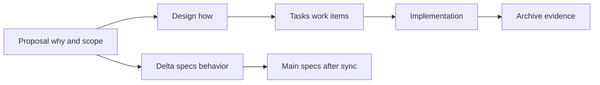
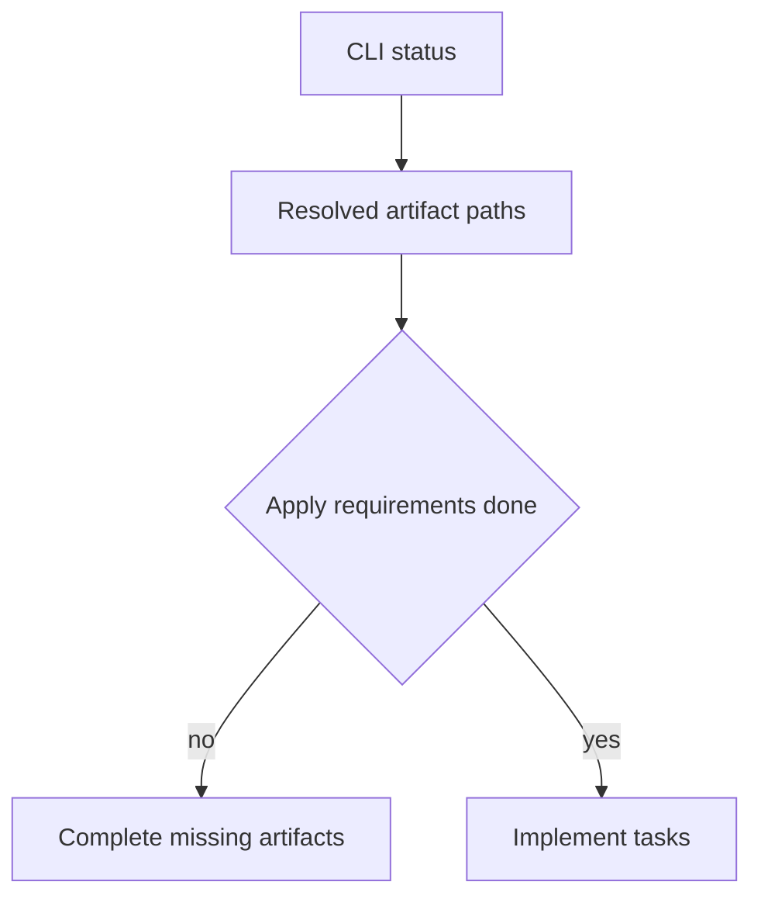

# J2. OpenSpec Artifacts：变更意图如何留下可追溯证据

## 问题

代码 diff 只能说明“改了什么文本”，不能完整说明为什么改、哪些需求改变、如何验证。OpenSpec 将一次变更拆为 proposal、design、tasks 与 specs/delta specs，让意图、方案、工作清单和长期规格各有归属。

## 图解






## 源码入口

- [propose 生成 proposal/design/tasks 的约定](../../../../.codex/skills/openspec-propose/SKILL.md#L10)
- [apply 读取 resolved context files](../../../../.codex/skills/openspec-apply-change/SKILL.md#L48)
- [sync 的 delta spec 格式](../../../../.codex/skills/openspec-sync-specs/SKILL.md#L30)
- [archive 的完成性检查](../../../../.codex/skills/openspec-archive-change/SKILL.md#L27)

当前仓库未发现本地 `openspec/changes` 或 `openspec/specs`；这不是说工作流不存在，而是说明不能把教程中的通用目录当本仓库已验证的具体文件。实际路径由 CLI 返回的 `planningHome`、`changeRoot`、`artifactPaths` 决定。

## 调用链

```text
openspec new change
  -> proposal records why and scope
  -> design records architecture decisions
  -> tasks records executable work
  -> delta specs state behavior changes
  -> apply implements and updates tasks
  -> sync merges delta into durable main specs
  -> archive preserves completed evidence
```

## 关键类型

| Artifact | 要回答的问题 | 不能替代 |
| --- | --- | --- |
| proposal | 为什么做、范围是什么 | 详细架构。 |
| design | 怎么做、风险和权衡 | 可执行任务清单。 |
| tasks | 要完成哪些可验证工作 | 行为规格。 |
| delta spec | 新增/修改/删除哪些行为 | 主规格全文。 |
| main spec | 当前长期行为契约 | 历史变更动机。 |

## 测试入口

- [sync 的 ADDED/MODIFIED/REMOVED/RENAMED 规则](../../../../.codex/skills/openspec-sync-specs/SKILL.md#L30)
- [apply 的任务完成规则](../../../../.codex/skills/openspec-apply-change/SKILL.md#L65)

artifact 是可审查输入；真正测试入口由 specs/tasks 指向的 unit、integration、E2E 或人工证据组成。

## 逐行精读

1. propose 指明先获取 artifact build order，而不是固定创建顺序（[第 27 行](../../../../.codex/skills/openspec-propose/SKILL.md#L27)）。
2. artifact 指令包含 template、rules、dependencies 和 `resolvedOutputPath`（[第 42 行](../../../../.codex/skills/openspec-propose/SKILL.md#L42)）。
3. sync 的 modified 是局部意图，应保留未提及的现有内容（[第 47 行](../../../../.codex/skills/openspec-sync-specs/SKILL.md#L47)）。
4. archive 移动整个 change，包含其 `.openspec.yaml`（[第 58 行](../../../../.codex/skills/openspec-archive-change/SKILL.md#L58)）。

## 深度拆解

**Delta 不是替换文件。** 例如新增一个 scenario，只把 scenario 放入 MODIFIED；同步时把它合进原 requirement。整篇复制会把别人未改的内容误覆盖。

**Tasks 是实施状态，不是规格事实。** checkbox 表明工作完成情况；行为是否仍成立应由 main spec 与测试共同证明。

## 常见故障

| 现象 | 原因 | 修正 |
| --- | --- | --- |
| proposal 很长却无法实施 | 没有 design/tasks | 让每份 artifact 只回答自己的问题。 |
| sync 覆盖旧 scenario | 把 delta 当全文 | 使用智能局部合并。 |
| archive 时找不到路径 | 硬编码 openspec 目录 | 读取 status JSON。 |
| tasks 全勾仍有缺陷 | 没有测试证据 | 将每项任务关联验证。 |

## 改动场景判断

- **范围变化**：更新 proposal。
- **技术决策变化**：更新 design。
- **发现新工作**：更新 tasks。
- **外部可见行为变化**：写 delta spec 并 sync。
- **仅内部重构且行为不变**：可能不需要 delta spec，但仍需设计/测试证据。

## 源码追问清单

1. 本 change 的 schema 要求哪些 artifact 才可 apply？
2. 哪些需求属于 delta spec，哪些只是实现细节？
3. 哪个任务覆盖失败/边界场景？
4. sync 后 main spec 如何与测试对应？
5. archive 后如何查回设计决策？

## 练习

为“工作区上传限制大小”分别写一句 proposal、design、task、delta spec 内容。说明“最大文件 20MB”为什么既要出现在行为规格，又需要对应自动化测试。

## 验收

- 能区分 proposal、design、tasks、delta spec、main spec。
- 能解释 delta spec 的局部合并原则。
- 能以 CLI 返回路径而非固定目录操作 artifact。
- 能把每个 task 关联到验证证据。
