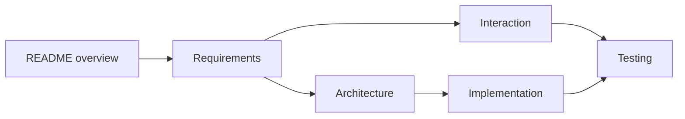
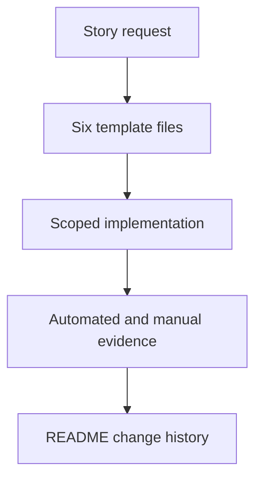

# J3. Story 文档体系：把项目规约变成可实施规格

## 问题

OriginOS 当前已有 `docs/specs/` 和 Story 六文档模板。它是项目自己的交付规范，不等于 OpenSpec artifact。Story 将用户价值、边界、交互、架构、文件改动和测试闭环放在固定位置，防止实施只剩口头需求。

## 图解






## 源码入口

- [Story 模板 README](../../../../docs/templates/story-spec-template/README.md#L1)
- [requirements 模板](../../../../docs/templates/story-spec-template/requirements.md#L1)
- [interaction 模板](../../../../docs/templates/story-spec-template/interaction.md#L1)
- [architecture 模板](../../../../docs/templates/story-spec-template/architecture.md#L1)
- [implementation 模板](../../../../docs/templates/story-spec-template/implementation.md#L1)
- [testing 模板](../../../../docs/templates/story-spec-template/testing.md#L1)
- [文档管理规范](../../../../docs/DOCUMENTATION-MANAGEMENT.md#L1)

AGENTS 规定 Story 目录必须有这六份文件，Epic 还要有 README。纯后端/纯文档也不能悄悄省掉 interaction，而要写“不适用”及原因。

## 调用链

```text
Epic README identifies Story
  -> README defines owner and summary acceptance
  -> requirements defines Given When Then and edges
  -> interaction defines user flow when UI exists
  -> architecture proves dependencies and data flow
  -> implementation lists file-level scope
  -> testing maps cases to automated/manual evidence
```

## 关键类型

| 文档 | 主要读者 | 核心产出 |
| --- | --- | --- |
| README | 所有人 | 状态、导航、验收摘要、历史。 |
| requirements | 产品/开发/测试 | 需求、场景、边界与依赖。 |
| interaction | 设计/前端/测试 | 流程、状态、错误、可访问性。 |
| architecture | 开发/审查者 | 模块、依赖、数据/API、安全性能。 |
| implementation | 实施者 | 文件范围、步骤、迁移和审查点。 |
| testing | QA/实施者 | case、入口、验收证据。 |

## 测试入口

- [Story testing 模板](../../../../docs/templates/story-spec-template/testing.md#L1)
- [现有 QA 报告示例](../../../../docs/QA/OS.8-System-Integration-Test-Report.md#L1)
- [E2E 测试计划示例](../../../../docs/QA/e2e-test-suite-plan.md#L1)

AGENTS 要求先有 Story test cases 才能实施，完成后创建自动化验证 goal。文档存在不代表 case 覆盖充分，需检查成功、失败、边界、UI/API/持久化/跨进程点。

## 逐行精读

1. 先读模板 README，识别 Story 编号、状态、Owner、导航和变更历史的固定责任。
2. requirements 必须把“应该能做”写成可观察 Given/When/Then，而不是只写标题。
3. architecture 必须证明没有违反 AGENTS 的单向依赖和目录规则。
4. implementation 应写到文件级，防止实现阶段随手跨越模块边界。
5. testing 是执行入口，不是最后补的“已测试”句子。

## 深度拆解

**六文档不是六次重复。** 同一事实从不同角度被约束：需求说“为何/什么”，架构说“如何保持边界”，实现说“改哪里”，测试说“怎样证明”。互相复制会让变更时难同步。

**文档与代码的链接是双向的。** 实施者从 Story 找入口和限制；审查者从 diff 回看 Story 是否漏了契约、迁移或失败路径。

## 常见故障

| 现象 | 根因 | 修正 |
| --- | --- | --- |
| 只有 README | 缺少可执行细节 | 补六文件完整模板。 |
| UI 做完才想错误状态 | interaction 缺失 | 先定义状态与反馈。 |
| 架构图好看却违规 | 未审查依赖方向 | 对照 AGENTS 逐条证明。 |
| 测试写“手工验证” | case 不可复现 | 写步骤、预期、证据与风险。 |

## 改动场景判断

- **新功能**：创建完整 Story。
- **纯服务/文档**：interaction 标不适用并说明原因，其他五份仍需完整。
- **跨 IPC/持久化/UI**：testing 至少包括每个边界的集成点。
- **范围改变**：先更新 Story，再改代码，避免文档成为旧叙事。

## 源码追问清单

1. 本 Story 的 Given/When/Then 是否含失败和边界？
2. architecture 是否列出影响模块和禁止依赖？
3. implementation 的文件清单是否与 diff 一致？
4. testing 是否能定位自动化命令和人工证据？
5. README 变更历史是否记录关键决定？

## 练习

为“增加协作会话 abort”写六文档各一句核心内容。特别写出 interaction 的确认/失败状态，architecture 的 IPC/runtime 边界，以及 testing 的重复 abort 幂等场景。

## 验收

- 能说出六份 Story 文档各自的唯一职责。
- 能区分项目 Story 体系与 OpenSpec artifacts。
- 能从需求追到架构、文件范围和测试证据。
- 能发现缺少失败/边界/跨进程测试的 Story。
