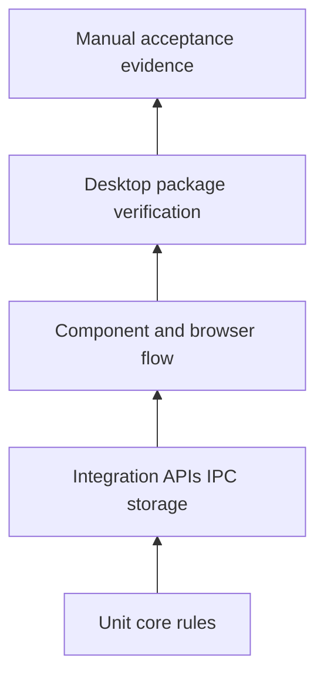
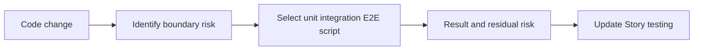
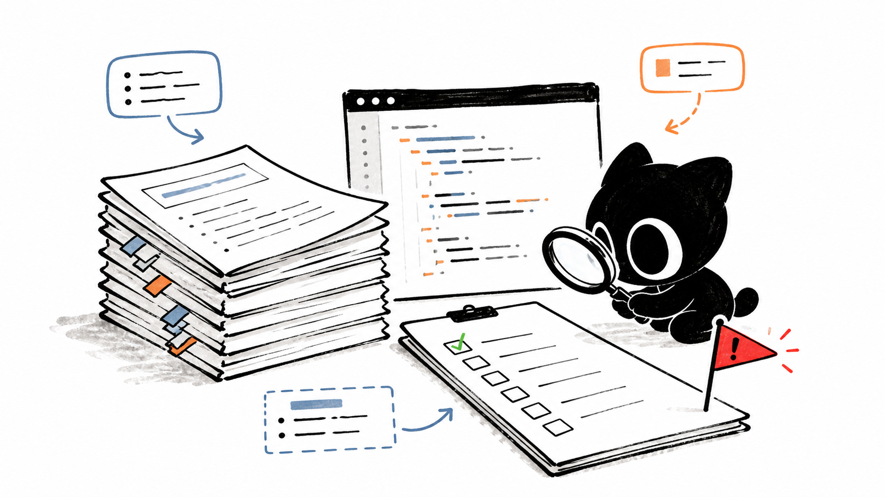

# J4. 测试体系：以风险选择正确证据

## 问题

“跑过测试”没有意义，除非知道它证明了什么。OriginOS 包含 core 单元测试、route/IPC 集成测试、组件逻辑测试、打包验证脚本、E2E 计划和 QA 报告。它们覆盖的故障面不同，不能用低层 mock 测试替代真实打包或跨进程验证。

## 图解







## 源码入口

- [core Vitest 配置](../../../../packages/core/vitest.config.ts#L1)
- [desktop Vitest 配置](../../../../packages/desktop/vitest.config.ts#L1)
- [DAG executor 测试](../../../../packages/core/src/modules/collaboration-runtime/engine/__tests__/dag-executor.test.ts#L1)
- [workspace 路径测试](../../../../packages/core/src/lib/integrations/electron/__tests__/workspace-paths.test.ts#L1)
- [协作 human-review route 测试](../../../../packages/web/src/app/api/collaboration/sessions/[id]/human-review/__tests__/route.test.ts#L1)
- [E2E 测试计划](../../../../docs/QA/e2e-test-suite-plan.md#L1)
- [desktop package 验证](../../../../packages/desktop/scripts/verify-mac-package.js#L1)

## 调用链

```text
Story acceptance case
  -> identify domain rule and boundary
  -> unit test deterministic rule
  -> integration test API IPC persistence bridge
  -> E2E or manual test critical user flow
  -> package verifier for desktop runtime assets
  -> record evidence and remaining risk
```

## 关键类型

| 层次 | 证明什么 | 不证明什么 |
| --- | --- | --- |
| unit | 纯规则、状态机、DTO 转换 | 真正 transport/文件/窗口。 |
| integration | API、IPC、存储、服务协作 | 完整用户界面体验。 |
| component | 渲染/交互逻辑 | Electron 打包资源。 |
| E2E | 关键用户路径 | 所有边界组合。 |
| package verifier | 包内文件、路径、metadata | 业务规则正确性。 |
| manual evidence | 自动化难覆盖的真实观察 | 可重复的长期回归保护。 |

## 测试入口

- [ontology data store 测试](../../../../packages/core/src/lib/features/ontology-data-store/__tests__/ontology-data-store.test.ts#L1)
- [cognitive manager 测试](../../../../packages/core/src/lib/integrations/pi-agent/cognitive/__tests__/agent-manager-cognitive.test.ts#L1)
- [desktop package verifier test](../../../../packages/desktop/scripts/__tests__/verify-pi-task-runtime-package.test.mjs#L1)
- [QA 系统集成报告](../../../../docs/QA/OS.8-System-Integration-Test-Report.md#L1)

## 逐行精读

1. 从一个 `__tests__` 先找到 `describe` 的行为意图，再追到被测 API；不要仅统计 test 数量。
2. 对 route test，核对输入解析、错误 status、service 调用与响应 mapping。
3. 对 IPC/文件测试，必须有拒绝路径，如目录穿越、无效 id、重复操作。
4. 对 package verifier，核对它具体检查的是文件位置、签名、asar require 还是 update metadata。

## 深度拆解

**覆盖率不是闭环。** 高覆盖的 pure function 仍无法证明 BrowserWindow、preload、IPC 与 packaged resource 能接起来。反过来一个 E2E 成功也不代表所有分支可回归。

**失败路径通常更跨层。** 例如上传失败可能涉及 UI 错误、IPC payload、main 路径校验、文件系统错误与通知。测试设计应从 Story 边界条件反推，而不是仅覆盖 happy path。

## 常见故障

| 现象 | 缺的证据 | 应补 |
| --- | --- | --- |
| 单测绿但桌面白屏 | package/runtime | 打包验证和真实启动。 |
| API 测绿但 UI 不更新 | event transport/store | 组件或 E2E 事件流。 |
| 修复回归 | 没有失败回归 | 复现 bug 的最小测试。 |
| QA 报告不可复核 | 缺命令、版本、步骤 | 结构化证据与残余风险。 |

## 改动场景判断

- **改纯 core 算法**：unit 为主，补边界。
- **改 API/IPC/存储**：至少 integration，含错误与持久化。
- **改流式 UI**：组件 + 真实 transport/E2E 验证。
- **改打包/worker 依赖**：跑 package verifier，不能只跑 Vitest。
- **无法自动化**：记录人工步骤、预期、环境、证据和风险。

## 源码追问清单

1. 这个 test 断言的是行为还是实现细节？
2. 哪个失败/边界仍未覆盖？
3. IPC/Web/Electron 是否都有集成证据？
4. 包验证是否覆盖新增资源？
5. 人工验证能否被别人重复？

## 练习

为“用户恢复协作 HITL 节点”列一份测试矩阵：核心状态机、human-review route、UI timeline、断线重连、desktop 打包。说明每一项测试的最小断言。

## 验收

- 能按风险而非习惯选择测试层。
- 能解释 unit、integration、E2E、package verifier 的不同证明力。
- 能为跨进程改动写成功、失败、边界三类证据。
- 能在无法自动化时给出可复现人工验收。
