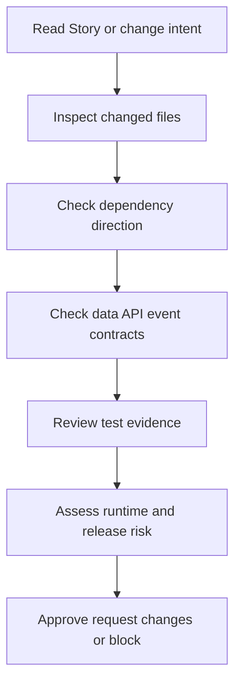
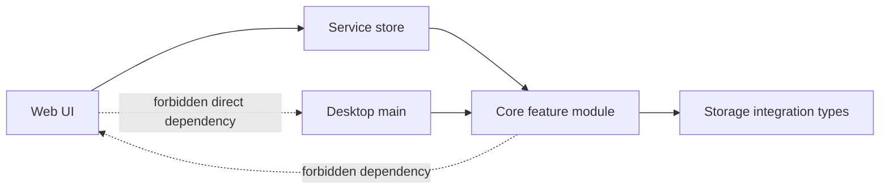

# J5. 维护者审查法：从能运行到值得合并

## 问题

维护者不只检查“代码有没有报错”，而是判断改动是否放在正确层、是否改变契约、是否有可证明的测试、是否会在桌面/打包/数据迁移中失效。审查是一条从用户行为到模块边界再到发布风险的证据链。

## 图解






## 源码入口

- [项目架构规约](../../../../AGENTS.md#L1)
- [文档管理规范](../../../../docs/DOCUMENTATION-MANAGEMENT.md#L1)
- [Story 模板 architecture](../../../../docs/templates/story-spec-template/architecture.md#L1)
- [Story 模板 testing](../../../../docs/templates/story-spec-template/testing.md#L1)
- [QA 报告示例](../../../../docs/QA/STARTUP-TEST-REPORT.md#L1)
- [desktop 发布验证脚本](../../../../packages/desktop/scripts/verify-release-artifacts.js#L1)

`AGENTS.md` 是审查的最高本地规约：App Router 不放业务逻辑、core 与 web/desktop 单向依赖、feature 只经公共 index 导出、运行产物不是修复入口。这些不是风格偏好，而是合并门槛。

## 调用链

```text
User need
  -> Story/OpenSpec artifacts
  -> file-level implementation plan
  -> diff and dependency graph
  -> automated evidence
  -> manual/package evidence
  -> review decision with residual risks
```

## 关键类型

| 审查维度 | 要问的问题 | 典型红旗 |
| --- | --- | --- |
| scope | 改动是否只服务本需求？ | 顺手大重构、无关格式化。 |
| ownership | 文件是否在正确层？ | `app/` 塞业务；desktop 复制 core。 |
| dependency | 是否单向、经公共 API？ | core import web、跨 feature 私有导入。 |
| contract | API/event/data 是否兼容？ | DTO 混入展示字段；隐式默认值。 |
| tests | 成功/失败/边界有证据？ | 只跑 lint 或只手工点过。 |
| release | 打包/迁移/权限是否受影响？ | 改 worker/路径未跑 verifier。 |

## 测试入口

- [core Vitest 配置](../../../../packages/core/vitest.config.ts#L1)
- [desktop Vitest 配置](../../../../packages/desktop/vitest.config.ts#L1)
- [release artifact verifier](../../../../packages/desktop/scripts/verify-release-artifacts.js#L1)
- [QA 测试计划](../../../../docs/QA/e2e-test-suite-plan.md#L1)

审查者应要求与风险匹配的证据，而不是一个模糊的“tests passed”。无法运行的测试也要报告命令、阻塞原因、人工步骤和残余风险。

## 逐行精读

1. 先读 AGENTS 的目录规约：`app/` 只页面/API 边界，核心逻辑下沉 core。
2. 再读依赖层级：desktop/main、web/app、components、services/store、core feature、infra 只能向下依赖。
3. 再读数据规约：JSON envelope、版本与时间字段、版本追溯要求。
4. 最后读测试规约：Story 先有 case，实施后必须完成自动化验证 goal。

## 深度拆解

**审查先看不变量，再看实现风格。** 若 core 反向 import UI，即使代码整洁也会破坏可测试性和运行边界。若 API route 包含业务状态机，即使功能可用也会使 Web/desktop 复用变难。

**最小改动是风险控制。** 较小 diff 更易将行为、契约和测试对应起来。它不等于拒绝重构：当依赖违规或重复逻辑已造成风险时，重构应有明确范围、迁移策略和更广证据。

**“没有问题”也要有依据。** 审查结论应说明看过哪些文件、测试/脚本结果和仍未覆盖的区域，不能将未验证猜测写成已确认事实。

## 常见故障

| 现象 | 审查遗漏 | 修正 |
| --- | --- | --- |
| Web 改动破坏 desktop | 未看 transport/IPC contract | 联查 web service、preload、main service。 |
| 数据升级后旧文件报错 | 未看 envelope/version | 设计兼容和迁移测试。 |
| 合并后打包失败 | 未看 resources/worker | 运行 package verifier。 |
| 测试很多仍有回归 | 未覆盖真实边界 | 从失败路径补 integration/E2E。 |

## 改动场景判断

- **新业务规则**：检查 core feature、公共 export、types、unit test。
- **新页面/API**：检查 `app/` 是否只有边界、组件/store 是否向下依赖。
- **新文件/路径操作**：检查 main/服务端验证、穿越与权限测试。
- **新 Agent 工具/技能**：检查 scope、CWD、产物目录、流式/取消行为。
- **新打包资源**：检查 builder、verifier、真实安装包风险。

## 源码追问清单

1. 这份 diff 对应哪项已批准需求与验收？
2. 是否跨越了 AGENTS 的目录或依赖边界？
3. 新/改 DTO 是否把显示字段带入持久化或请求？
4. 哪个失败路径仍没有测试？
5. 哪个命令实际运行过，哪个只是计划？
6. 是否影响 desktop、打包、运行数据或版本兼容？

## 练习

拿一个假设 diff：在 `packages/web/src/app/api/` 内直接读写 JSON 并被 React component 直接 import。按本课表格写出至少四条 review finding，并给出正确迁移方向。再为“新增 worker 依赖”列出需要检查的代码、builder、验证脚本与风险。

## 验收

- 能以 AGENTS 的目录/依赖规约审查一个 diff。
- 能把需求、文件、契约、测试、发布风险连成审查证据链。
- 能区分必须阻塞的架构违规与可记录的测试缺口。
- 能输出具体、可执行、带源码入口的 review finding。
