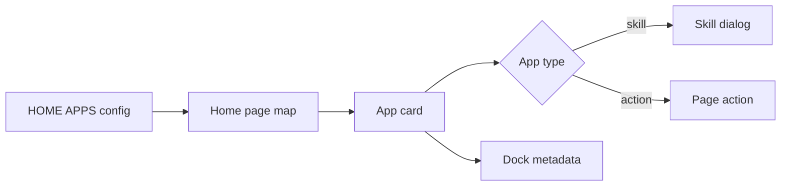

# P1. 小实战：新增或调整首页入口

## 问题

现在要新增一个首页入口，例如一个已有 Skill。目标不是改一个数组后“看见卡片”就结束，而是保证配置、点击分流、SkillDialog 与 Dock 元数据保持一致。

## 图解




## 源码入口

- [首页入口配置（第 8 行）](../../../../packages/web/src/config/homeApps.ts#L8)
- [首页卡片映射（第 1425 行）](../../../../packages/web/src/app/page.tsx#L1425)
- [点击分流（第 1436 行）](../../../../packages/web/src/app/page.tsx#L1436)
- [AppCard props（第 28 行）](../../../../packages/web/src/components/framework/AppCard.tsx#L28)
- [Dock 去重测试](../../../../packages/web/src/store/__tests__/dockStore.test.ts#L18)

## 调用链

```text
HOME_APPS item -> page map -> AppCard onClick
  -> skill: handleSkillLaunch(skillName, name) -> SkillDialog
  -> action: explicit page handler
  -> optional Dock pin preserves id, type, skillName
```

## 关键类型

| 类型 | 必须满足 |
| --- | --- |
| `HomeAppConfig` | id/name/description/icon/color/type；skill 再有 skillName。 |
| `AppCardType` | 只能是 `skill` 或 `action`。 |
| Dock app | `skillName` 是 skill 去重与恢复的重要身份，不是展示文本。 |

## 测试入口

- [Dock store 去重测试](../../../../packages/web/src/store/__tests__/dockStore.test.ts#L18)
- [Skill export policy 测试](../../../../packages/web/src/components/skills/__tests__/skill-export-policy.test.ts#L1)

未发现 HOME_APPS 专属组件测试。修改入口至少做 TypeScript/lint，并手工验证 card、点击、SkillDialog、Dock pin；高风险改动应补首页映射测试。

## 逐行精读

1. `HOME_APPS` 顺序就是渲染顺序（[第 23 行](../../../../packages/web/src/config/homeApps.ts#L23)）。
2. `type: 'skill'` 只描述分流，`skillName` 才是实际技能标识（[第 16 行](../../../../packages/web/src/config/homeApps.ts#L16)）。
3. 页面按 `app.type` 与 `app.action` 显式分支（[第 1436 行](../../../../packages/web/src/app/page.tsx#L1436)）。
4. AppCard click 优先 `path`，否则调用 onClick（[第 73 行](../../../../packages/web/src/components/framework/AppCard.tsx#L73)）。

## 深度拆解

配置驱动的价值是入口资料集中；但配置不是“自动路由”。新增 action 必须有实际 handler，新增 skill 必须确保名字可被 loader 找到。不要把“创建 Agent”这类 action 错写成 skill，只因它看起来像工具。

## 常见故障

| 现象 | 排查 |
| --- | --- |
| 卡片不出现 | `HOME_APPS` 是否导入/页面是否在 loading 分支外。 |
| 点击无响应 | `type`、`skillName`、action handler 是否匹配。 |
| Dock 重复 | id 与 skillName 是否稳定。 |
| 打开错误技能 | 不要用展示 name 代替 skillName。 |

## 改动场景判断

- 已有 skill：只新增 `HomeAppConfig`，确认真实 skillName。
- 新业务动作：先实现 handler，再加 `action` config。
- 新页面 route：可用 `path`，不要再写重复 onClick。
- 改名称：展示 name 可改，id/skillName 要审视兼容与 Dock。

## 源码追问清单

1. `handleSkillLaunch` 怎样创建窗口和 stable session id？
2. skillName 在 loader 中如何解析多源技能？
3. action 缺失时页面如何反馈？
4. Dock 恢复时按 id 还是 skillName 去重？

## 练习

为已有 `task-manager` Skill 新增一个首页入口。只写配置草案，再逐项验证 id 唯一、skillName 存在、点击进入 SkillDialog、固定到 Dock 后刷新不重复。不要在本练习中修改源码。

## 验收

- 能从 config 追到 card、点击分流与 SkillDialog。
- 能区分展示 name、稳定 id、skillName。
- 能为新入口列出最小自动化与手工验证。
