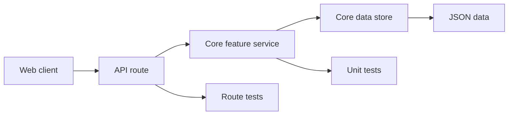
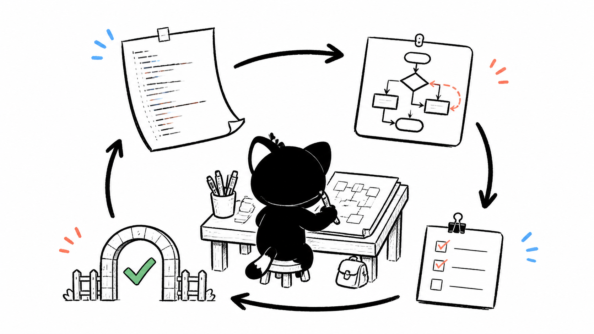

# P3. 中高实战：新增一个 Core-backed API

## 问题

练习目标是给现有本体数据增加一个查询 API，而不是在 Next.js route 里读写 JSON。route 负责请求/响应边界，core feature 负责业务与类型，storage 负责持久化；三层各自可测。

## 图解





## 源码入口

- [Ontology data store types（第 11 行）](../../../../packages/core/src/lib/features/ontology-data-store/types.ts#L11)
- [store CRUD（第 28 行）](../../../../packages/core/src/lib/features/ontology-data-store/store.ts#L28)
- [query engine 实现](../../../../packages/core/src/lib/features/ontology-data-store/query-engine.ts#L9)
- [ontology data store 测试](../../../../packages/core/src/lib/features/ontology-data-store/__tests__/ontology-data-store.test.ts#L1)
- [本体生成 route 示例](../../../../packages/web/src/app/api/ontology/generate/route.ts#L1)

## 调用链

```text
GET or POST API route
  -> parse and validate request
  -> call exported core service
  -> store query or mutation
  -> map typed result to HTTP response
  -> test service success/failure and route mapping
```

## 关键类型

| 类型 | 责任 |
| --- | --- |
| Query input | 可序列化、可验证的请求契约。 |
| Core result | 业务成功/失败数据，不能依赖 NextResponse。 |
| DTO | route 与客户端之间的稳定映射，不能混展示状态。 |
| Store record | JSON 持久化的内部事实。 |

## 测试入口

- [Ontology data store 测试](../../../../packages/core/src/lib/features/ontology-data-store/__tests__/ontology-data-store.test.ts#L1)
- [ontology data store config 测试](../../../../packages/core/src/lib/features/ontology-data-store/__tests__/config.test.ts#L1)
- [API route 示例](../../../../packages/web/src/app/api/ontology/generate/route.ts#L1)

新增 route 时应补 route test；若现有 route 没有 test，这是缺口，不是省略测试的理由。

## 逐行精读

1. types 先界定 instance/schema/query，再让 store 实现这些边界。
2. store CRUD 是持久化层，不应接收 HTTP Request/Response。
3. query 将索引/分页/过滤逻辑集中，避免页面拼 JSON。
4. route 示例展示的是参数解析、调用服务、响应映射，不应承载领域算法。

## 深度拆解

一个 core-backed API 的价值是 Web 与 Electron 复用同一业务规则。把规则写入 route 会令 IPC、CLI 或 desktop service 只能复制实现。反过来，core 也不能 import Next.js；HTTP status/code 属于 route 适配。

## 常见故障

| 现象 | 修正 |
| --- | --- |
| route 很长且直接访问文件 | 下沉 core service/store。 |
| 返回字段随 UI 改动 | 定义 DTO，显示字段留 UI。 |
| 只测成功 | 加无效输入、找不到、权限/路径与持久化失败。 |
| Web/desktop 结果不一致 | 共用 core 公共 API，别各写 route/service。 |

## 改动场景判断

- 新查询：先定义 Query/Result，再实现 core，再加 route。
- 新写操作：明确 JSON version、并发/原子性、错误映射。
- 只改显示：不要扩请求 DTO。
- 跨 feature：通过 `index.ts` 公共 API，不导入内部 store。

## 源码追问清单

1. 查询 input 怎样验证与默认分页？
2. store 错误怎样转为领域错误？
3. route 怎样区分 400、404、500？
4. desktop 服务怎样调用相同 core API？

## 练习

设计 `GET /api/ontology-data/instances` 的伪契约：输入、成功响应、无效输入、概念不存在、空列表。列出 core types/service/store、route、unit、route test 的文件级改动，再检查是否违反 `app/` 不放业务逻辑。

## 验收

- 能画出 route -> core -> store 的单向调用。
- 能区分 DTO、领域类型、持久化记录。
- 能为成功、失败、边界提出对应测试。
