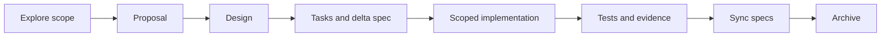

# P4. 完整实战：OpenSpec 变更闭环

## 问题

最后练习把前面所有能力串起来：以“新增工作区导出入口”为假设变更，从探索到 proposal/design/tasks、实现、测试、spec sync、archive。重点不是机械执行命令，而是每一步都留下可审查证据。

## 图解




## 源码入口

- [OpenSpec explore skill](../../../../.codex/skills/openspec-explore/SKILL.md#L1)
- [OpenSpec propose skill](../../../../.codex/skills/openspec-propose/SKILL.md#L1)
- [OpenSpec apply skill](../../../../.codex/skills/openspec-apply-change/SKILL.md#L1)
- [OpenSpec sync skill](../../../../.codex/skills/openspec-sync-specs/SKILL.md#L1)
- [OpenSpec archive skill](../../../../.codex/skills/openspec-archive-change/SKILL.md#L1)
- [Entry export desktop service](../../../../packages/desktop/src/main/services/entry-export-service.ts#L1)

本仓库当前未发现一个本地 OpenSpec change，因此这是一份操作演练，不会擅自创建/归档真实 change。实际 artifact 位置必须读 CLI `status --json`。

## 调用链

```text
clarify user outcome -> explore code and constraints
  -> propose resolves artifact schema
  -> write proposal/design/tasks/delta spec
  -> apply reads every context file and changes code
  -> run tests/package checks and record evidence
  -> sync delta specs to main specs
  -> archive only when artifacts/tasks are complete
```

## 关键类型

| 证据 | 回答的问题 |
| --- | --- |
| proposal | 为什么做、范围与非目标。 |
| design | 模块边界、数据/IPC/API、风险。 |
| tasks | 可勾选的最小实施和验证工作。 |
| delta spec | 外部行为怎样变。 |
| test evidence | 实际运行了什么、结果和残余风险。 |

## 测试入口

- [OpenSpec apply 的 context/task 规则](../../../../.codex/skills/openspec-apply-change/SKILL.md#L48)
- [OpenSpec archive 完成性规则](../../../../.codex/skills/openspec-archive-change/SKILL.md#L27)
- [desktop 发布产物验证](../../../../packages/desktop/scripts/verify-release-artifacts.js#L1)

## 逐行精读

1. explore 只思考/调查，不实现（[第 10 行](../../../../.codex/skills/openspec-explore/SKILL.md#L10)）。
2. propose 从 status 取得 artifact 依赖与路径，不猜模板（[第 27 行](../../../../.codex/skills/openspec-propose/SKILL.md#L27)）。
3. apply 必须读 instructions 给出的全部 contextFiles（[第 48 行](../../../../.codex/skills/openspec-apply-change/SKILL.md#L48)）。
4. sync 合并 delta，而非覆盖主 spec（[第 30 行](../../../../.codex/skills/openspec-sync-specs/SKILL.md#L30)）。
5. archive 会检查 artifact/task completion 与 spec sync（[第 27 行](../../../../.codex/skills/openspec-archive-change/SKILL.md#L27)）。

## 深度拆解

完整闭环的质量在于“每层可反向追溯”：用户验收能追到 spec，spec 能追到 task，task 能追到 diff 和测试，发布风险能追到 package verifier。任何一层空白，后续维护者都只能猜。

## 常见故障

| 现象 | 修正 |
| --- | --- |
| 需求未清就开始 apply | 回 explore/propose，先收敛范围。 |
| tasks 已勾却没测试结果 | 取消勾选或补证据。 |
| delta spec 忘同步 | archive 前执行 sync assessment。 |
| 打包资源改了没验证 | 加入 build/package verifier。 |

## 改动场景判断

- 模糊风险：explore。
- 明确新行为：propose + delta spec。
- 只剩已批准实现：apply。
- 行为已经实现但主规格未更新：sync。
- 所有证据已齐：archive。

## 源码追问清单

1. 当前 change 的 schema 和 apply requires 是什么？
2. 哪个文件是业务边界、哪个只是 adapter？
3. 导出是否影响 IPC、权限、文件路径和打包？
4. 每个 task 的测试证据是什么？
5. 还有哪些已知风险不能自动验证？

## 练习

完成一份“新增工作区导出入口”的模拟 change 包：写出非目标、架构边界、五个任务、一个 delta scenario、成功/失败/打包三类验证。只在确认每项有证据后才模拟 archive。

## 验收

- 能按正确顺序选择 explore/propose/apply/sync/archive。
- 能把代码、测试、规格、发布证据连成闭环。
- 能明确何时不能归档。
