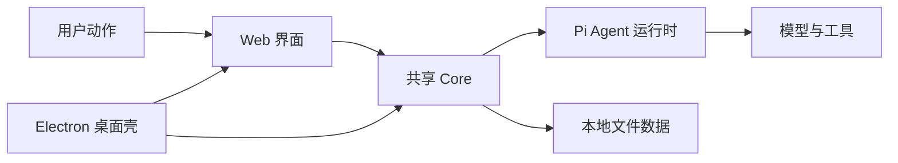

# A01：OriginOS 不是“聊天页面加 API”

## 从首页看得见的现象开始

打开 OriginOS 首页，你会同时看到「创建 Agent」「创建角色」「技能市场」「工作区」「头脑风暴」「工作流构建」六个入口。它们不是同一类东西的六种皮肤：有的入口点进去会打开一个对话窗口，有的入口点进去会打开文件工作区。这个差异本身就在说明：OriginOS 不是把一切都塞进一个聊天框。

想象两种产品。

**产品甲**只有消息列表。你说一句话，服务端返回一段文字；刷新页面后这次交流是否存在，由另一个系统决定。你的请求、模型的回复、可能产生的文件之间没有稳定关系。

**产品乙**要完成「帮我为课程设计一个项目」：它需要读取模板、追问缺失信息、创建文件、把过程保存在某个工作目录、让你稍后从项目窗口继续编辑。OriginOS 讨论的是第二类产品。

这里的难点不是模型能否写出一句好话，而是系统能否回答五个问题：

| 问题 | 若系统答不上来会怎样 | OriginOS 把责任放在哪里 |
|------|----------------------|--------------------------|
| 用户从哪里开始 | 所有能力挤进一个聊天框 | 首页卡片、Dock、窗口与路由 |
| 模型能做什么 | 模型只能输出文本 | 技能与工具定义可执行能力 |
| 结果放在哪里 | 文本离开页面就丢失 | 会话、项目和本地文件存储 |
| 用户怎样继续 | 每次都从零开始描述上下文 | 会话恢复、工作区和记忆 |
| 桌面怎样参与 | 浏览器不能直接承担原生窗口职责 | Electron main、IPC、原生窗口 |

这张表建立了本书反复使用的一条判断：遇到一段 Agent 代码时，先问它是在解决「理解用户」「决定动作」「执行动作」「保存结果」中的哪一个问题。不要把所有问题都归给模型。

## 四个角色与一本规约

这是一张职责图，不是数据流图。`Web 界面` 负责呈现卡片、输入和窗体；`Core` 放可共享的业务、类型、存储与集成；`Pi Agent 运行时` 管理会话、消息、技能和工具；`Electron` 为桌面版提供原生窗口和进程能力。`Core -> 文件数据` 说明 MVP 以本地文件保存项目和会话，而非数据库。

图中有两类箭头容易混淆。横向箭头表示一次用户动作通常从界面逐步进入业务与运行时；指向 `本地文件数据` 的箭头表示状态并不只停留在内存。`Electron -> Web/Core` 的两条箭头尤其容易误读：Electron 不是替代 Web 的另一套产品，它为桌面运行提供进程和窗口能力，同时复用已有 Web 与 Core。

这些分工不是口头约定，而是写进了 [`AGENTS.md`](../../../../AGENTS.md#L1) 。它把 MVP 范围落到首页内置应用、技能系统、会话交互层、文件管理层、工作空间编辑器、窗体与可视化、本体构建系统，并规定了技术栈、目录结构、依赖方向和数据存储方式。阅读任何源码之前，先知道有这本规约；判断一段代码是否放错位置时，再回来查具体条款。

## 源码中的第一个证据：入口配置

[`packages/web/src/config/homeApps.ts` 第 8—21 行](../../../../packages/web/src/config/homeApps.ts#L8) 定义了 `AppCardType = 'skill' | 'action'`。这不是视觉样式，而是产品入口的分类：

| 入口类型 | 配置含义 | 后续路径 |
|----------|----------|----------|
| `skill` | 需要一个技能名 | 打开技能对话，再进入 Agent 会话 |
| `action` | 需要一个明确动作 | 例如打开工作区，不必请求模型 |

「创建 Agent」在 [`HOME_APPS` 第 29—37 行](../../../../packages/web/src/config/homeApps.ts#L29) 中只声明 `skillName: 'agent-creator'`。首页没有复制 Agent 创建算法。这种把入口描述与实现分开的方式称为**配置驱动**：新增产品入口时，先增加数据，控制逻辑保持集中。

这个分类也解释了为什么首页不能只有「聊天」一个入口。如果所有功能都走聊天框，`type` 这个字段就失去意义；正是因为有些入口需要 Agent 会话、有些只需要打开窗口，`type` 才成为源码中必须被检查的合同。

## Agent 与模型：两个不能互换的概念

**模型**预测文本；**Agent** 管理工作过程。OriginOS 中，一个 Agent 至少需要：系统提示词、会话历史、工具集合、工作目录、项目上下文和持久化位置。模型不能自己决定文件应写到哪里，也不能自己在窗口关闭时整理记忆。

两者的差别可以从失败现象看得最清楚：

- 若模型暂时不可用，Agent 仍应知道这次会话属于谁、已经产生了哪些文件、哪些工具正在执行。
- 若窗口被关闭，模型本身也不会通知存储层清理资源。

把这些生命周期责任交给运行时，才使模型可以被替换而系统保持完整。 [`packages/web/src/app/page.tsx` 第 28—69 行](../../../../packages/web/src/app/page.tsx#L28) 的导入列表可以验证这个分工：它同时导入 `SkillDialog`（UI）、`AppWindowManager`（窗口生命周期服务）、Pi Agent client（运行时配置），三者各司其职。

## 一个容易犯的错误

把 `packages/web/src/app/page.tsx` 当作「整个系统的入口」是只对一半的说法。它确实是浏览器首页的入口，但不是所有运行形态的入口，也不是 Agent 的唯一创建点。 [`AGENTS.md` 的目录规则](../../../../AGENTS.md#L166) 明确要求 `app/` 保持页面和 API 边界，业务逻辑下沉到 Core。后续阅读中，任何页面文件过度膨胀都应触发这个警觉。

## 测试证据与缺口

A01 还在建立产品地图，没有单一测试能证明「OriginOS 是什么系统」。但可以通过以下入口验证自己的理解：

- [`packages/web/src/config/homeApps.ts`](../../../../packages/web/src/config/homeApps.ts#L1) 中 `type: 'skill'` 与 `type: 'action'` 的数量和字段差异。
- [`package.json`](../../../../package.json#L1) 中的 `name`、`description` 和 `scripts`，确认项目不是单一应用而是 monorepo。
- [`AGENTS.md`](../../../../AGENTS.md#L1) 的 MVP 范围与禁止技术清单。

当前缺口：没有自动化测试验证「首页入口分类是否符合产品意图」。这个判断目前靠人工 review 配置。

## 练习与口头验收

1. 在 `HOME_APPS` 中找出一个 `skill` 和一个 `action`，分别写出它们完成工作时最先缺少的能力。
2. 在首页导入列表中找到 `SkillDialog`、`AppWindowManager` 和 Pi Agent client，说明它们分别属于图中的哪一个对象。
3. 解释为什么「模型返回一段文字」不能证明一个项目已经被创建。
4. 打开 `AGENTS.md`，找出 MVP 范围中哪一项对应「结果放在哪里」。

合上本页后，应能用自己的话说出：OriginOS 用 Web 给用户入口，用 Core 固化共享规则，用 Pi Agent 组织模型与工具，用 Electron 把同一能力带到桌面；并且能指出 `type: 'skill'` 与 `type: 'action'` 在源码中的第一个判断点。

下一章从一条真实点击出发，追踪这几个角色第一次怎样接力。
