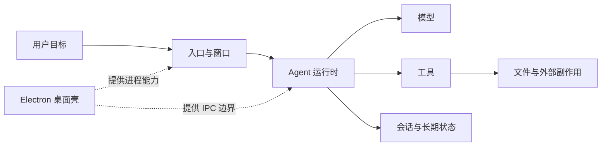

# A01：OriginOS 为什么不能理解成“聊天页面加一个 API”

## 从一个看得见却解释不完的现象开始

首页上的“头脑风暴”和“工作区”都是卡片。点击前者会打开技能对话，点击后者会打开项目文件窗口。视觉上相似的入口，后续却需要完全不同的能力：一个要准备 Agent、会话、工具和产物目录；另一个只需打开已有工作空间。

如果把 OriginOS 理解成“输入一句话，模型返回一句话”，就解释不了四个问题：

1. 为什么无需模型的工作区也属于首页应用？
2. 为什么关闭窗口后历史仍可能存在？
3. 为什么同一项能力既能在浏览器运行，也能进入 Electron 桌面？
4. 为什么模型说“文件已保存”仍不能证明磁盘真的有文件？

本章建立最小产品模型，只讲清系统需要哪些角色以及它们的边界；各角色内部实现留到后续章节。

## 第一个概念阶梯：模型、Agent、应用与操作系统

| 名称 | 最小准确解释 | 在头脑风暴案例中的作用 | 不能把它误认为 |
| --- | --- | --- | --- |
| 模型 | 根据上下文生成内容的推理引擎 | 生成创意文本或工具调用意图 | 会话管理器、文件系统 |
| Agent | 组织提示词、消息、工具和生命周期的运行主体 | 把用户要求变成若干轮推理与操作 | 一个聊天气泡 |
| 应用入口 | 告诉首页“展示什么、点击后走哪条路径”的配置 | `bmad-brainstorming` Skill 入口 | 已加载的 Skill 实例 |
| OriginOS | 协调入口、窗口、运行时、工具、存储和桌面形态的系统 | 让一次请求成为可恢复、可执行的工作 | 单一模型 SDK 的包装页 |

模型只负责推理，不自动拥有文件权限，也不知道哪个窗口正在关闭。Agent 管理一次工作的上下文，却仍需要 UI 提供入口、存储保存状态、工具执行外部动作。OriginOS 的“OS”价值正是在这些责任之间建立长期稳定的边界。

## 一张图只回答一个问题：为什么模型外面还需要系统



从左到右解释每根箭头：

- 用户目标先进入入口和窗口，因为系统必须知道用户启动的是 Skill、工作区还是别的应用。
- 窗口把身份和启动材料交给 Agent；窗口本身不推理。
- Agent 把合适的上下文交给模型，同时只暴露允许的工具。
- 工具才会真正读写文件或访问外部资源；模型文本不是副作用证据。
- 会话保存已发生的消息与配置，使窗口关闭或服务重启后仍可能恢复。
- Electron 虚线表示它提供另一种运行环境，并不替代 Web 和 Core 的业务职责。

## 源码证据一：入口首先是一份数据

[packages/web/src/config/homeApps.ts 第 8—21 行](../../../../packages/web/src/config/homeApps.ts#L8) 定义首页入口合同：

```ts
export type AppCardType = 'skill' | 'action';

export interface HomeAppConfig {
  id: string;
  name: string;
  description: string;
  icon: string;
  color: string;
  type: AppCardType;
  skillName?: string;
  action?: string;
}
```

`type` 是必填判别字段；`skillName` 和 `action` 却是可选字段。这是一个尚未完全收紧的合同：TypeScript 允许写出 `{ type: 'skill' }` 却没有 `skillName` 的对象，运行时必须再检查。

[同文件第 27—83 行](../../../../packages/web/src/config/homeApps.ts#L27) 给出真实数据。“头脑风暴”的关键值是：

```ts
{
  id: 'app-brainstorming',
  name: '头脑风暴',
  type: 'skill',
  skillName: 'bmad-brainstorming',
}
```

而“工作区”是 `type: 'action'`、`action: 'open-workspace'`。因此，页面上同样的卡片只代表同一种展示方式，不代表同一种业务能力。

## 源码证据二：卡片没有执行 Skill 的知识

[packages/web/src/components/framework/AppCard.tsx 第 73—79 行](../../../../packages/web/src/components/framework/AppCard.tsx#L73) 的点击逻辑只有两种动作：

```ts
const handleClick = () => {
  if (path) {
    window.location.href = path;
  } else if (onClick) {
    onClick();
  }
};
```

这段代码的输入是 `path` 或父组件传入的 `onClick`；输出是一次导航或一次回调。它既不读取 `SKILL.md`，也不创建会话。由此可以得出可复查结论：**AppCard 是展示与事件触发组件，不是 Skill 运行器。**

## 源码证据三：页面才解释入口类别

[packages/web/src/app/page.tsx 第 1426—1447 行](../../../../packages/web/src/app/page.tsx#L1426) 在渲染卡片时创建闭包：

```tsx
onClick={() => {
  if (app.type === 'skill' && app.skillName) {
    handleSkillLaunch(app.skillName, app.name);
  } else if (app.action === 'create-agent') {
    handleCreateProject();
  } else if (app.action === 'open-workspace') {
    const firstProject = projects[0];
    if (firstProject) {
      handleOpenWorkspace(firstProject.id);
    }
  }
}}
```

这一窗口解释了为什么视觉相同的卡片可以进入不同系统能力。页面读取 `type`、`skillName`、`action` 和当前 `projects` 状态，再选择 handler。它仍没有读取 SKILL.md 或直接写磁盘；页面拥有的是入口编排，不是下游业务实现。

三个分支还有三种不同失败条件：Skill 缺少 `skillName` 时静默结束；工作区没有 `projects[0]` 时也静默结束；创建 Agent 则不依赖这两个字段。只看 AppCard 无法区分它们，必须进入页面闭包。

## 用一条真实输入逐步推演

给定 `HOME_APPS` 中的头脑风暴对象：

1. React 遍历配置并渲染一张 `AppCard`。
2. 卡片显示 `name`、`description`、`icon` 和 `color`。
3. 用户点击后，卡片只执行父级闭包 `onClick()`。
4. 此时尚未加载 `bmad-brainstorming` 的 `SKILL.md`，没有 session JSON，也没有模型请求。

继续追踪到页面条件后，状态才从“用户事件发生”变成“系统选择了 Skill handler”。真正窗口副作用仍在 `handleSkillLaunch → AppWindowManager`；因此本章在 handler 调用处停止，不把“已选中路径”误写成“窗口或会话已经成功”。

将 `name` 改成“学习产品创意”，但保留 `skillName`，只会改变可见名称和后续窗口标题；实际加载目标仍是 `bmad-brainstorming`。将 `skillName` 删除，卡片仍可能渲染，但页面的防御条件会阻止 Skill 启动。

## 从故障现象反推责任边界

| 用户现象 | 第一检查点 | 此时不能先下的结论 |
| --- | --- | --- |
| 首页没有头脑风暴卡片 | `HOME_APPS` 是否包含条目 | “模型配置坏了” |
| 卡片可见但点击没反应 | `type`、`skillName` 和页面分支 | “Skill 文件不存在” |
| 窗口出现但没有会话 | `SkillDialog` 初始化路径 | “AppCard 没触发” |
| 模型声称写了文件但磁盘没有 | 工具调用与输出目录 | “模型回复正确所以保存成功” |

这种排查顺序体现了本书的第一条阅读原则：从最靠近现象的责任层开始，用证据逐层向下，不跨层猜测。

## 测试证据与没有被证明的部分

当前没有一项自动化测试能单独证明“OriginOS 是 AI Native 操作系统”，也没有专门测试约束每个 `skill` 条目必须具有 `skillName`。本章结论来自产品配置、组件实现与架构规约的联合证据。

按 Given/When/Then 拆开测试缺口：Given 是一个 `type='skill'` 但没有 `skillName` 的配置；When 页面渲染并点击对应卡片；Then 当前代码应当既不调用 Skill handler，也不调用 action handler。这个行为现在能由源码推演，却没有测试将它固定，更没有 UI 提示说明为什么无动作。

这能证明入口分类和卡片点击职责；不能证明 Skill 一定能加载、模型一定可用、工具一定执行成功或桌面形态一定可启动。把这些边界说清，才不会把源码存在误写成生产链路已接通。

## 小实验：改一个字段，预测三个结果

先不运行项目，在纸上完成预测：

```ts
{
  id: 'app-brainstorming',
  name: '学习产品创意',
  type: 'skill',
  skillName: 'bmad-brainstorming',
}
```

预测答案：卡片标题改变；窗口标题会使用新名称；加载的 Skill 代码仍为 `bmad-brainstorming`。然后再用源码分别指出三项预测的证据位置。只有“预测 + 源码依据”同时具备，实验才完成。

## 口头验收与本章收束

合上本页，应能说明：

1. 模型、Agent、应用入口和 OriginOS 为什么不是同义词。
2. `type`、`name`、`skillName` 分别控制什么。
3. 为什么 AppCard 可见不能推出 Skill 已加载。
4. 为什么模型文本不能证明文件副作用已经发生。
5. 卡片消失、点击失效、会话失效应分别从哪一层开始排查。

本章得到的核心判断是：**先按责任拆系统，再按证据解释现象。** 下一章沿同一次点击，区分控制流、数据流与生命周期三条同时发生但不能混用的链。
