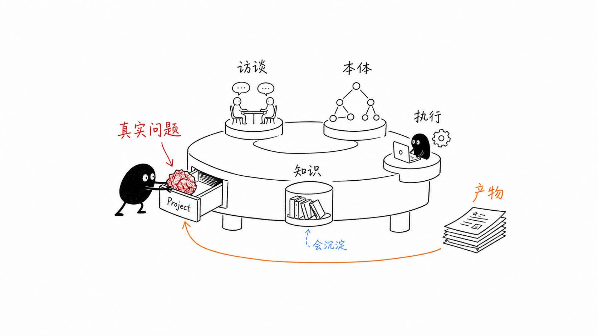
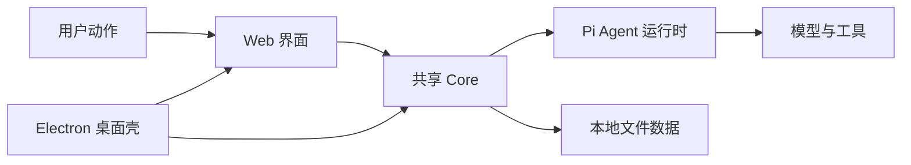

# A01：OriginOS 是怎样一种系统

## 从一个看得见的现象开始

首页同时放着“创建 Agent”“技能市场”“工作区”和“头脑风暴”。这组入口说明 OriginOS 不把一次对话当成一次孤立问答：对话可以启动工作，工作会留下文件和会话，结果还能回到桌面继续使用。

想象两个产品。产品甲只有消息列表：输入一句话，服务端返回一段文字，刷新页面后这次交流是否存在由另一个系统决定。产品乙则要完成“帮我为课程设计一个项目”：它需要读取模板、追问缺失信息、创建文件、把过程保存在某个工作目录、让用户稍后从项目窗口继续编辑。OriginOS 讨论的是第二类产品。

这里的难点不是模型能否写出一句好话，而是系统能否回答五个问题：

| 问题 | 若没有系统能力会怎样 | OriginOS 中的责任方向 |
| --- | --- | --- |
| 用户从哪里开始 | 所有能力挤进一个聊天框 | 首页卡片、Dock、窗口与路由 |
| 模型能做什么 | 模型只能输出文本 | 技能与工具定义可执行能力 |
| 结果放在哪里 | 文本离开页面就丢失 | 会话、项目和本地文件存储 |
| 用户怎样继续 | 每次都从零开始描述上下文 | 会话恢复、工作区和记忆 |
| 桌面怎样参与 | 浏览器不能直接承担原生窗口职责 | Electron main、IPC、原生窗口 |

这张表建立了本书反复使用的一条判断：遇到一段 Agent 代码时，先问它是在解决“理解用户”“决定动作”“执行动作”“保存结果”中的哪一个问题。不要把所有问题都归给模型。

 [根 package.json（第 2-24 行）](../../../../package.json#L2) 把项目描述为 AI-native desktop OS prototype，并列出 `electron`、`nextjs`、`multi-agent`、`collaboration`、`pi-agent`。这些词不是功能清单，而是四种必须协作的能力：界面、共享业务、Agent 运行时和桌面环境。

图中的小黑代表用户。它把一个模糊意图交给系统；右侧不是一段回答文本，而是文件、会话、窗体或新的 Agent。图的重点在中间：意图必须经过界面、规则、工具和存储的共同处理，模型只是其中一个参与者。

## 四个角色

这是一张职责图。`Web 界面` 负责呈现卡片、输入和窗体；`Core` 放可共享的业务、类型、存储与集成；`Pi Agent 运行时` 管理会话、消息、技能和工具；`Electron` 为桌面版提供原生窗口和进程能力。`Core -> 文件数据` 说明 MVP 以本地文件保存项目和会话，而非数据库。

图中有两类箭头。横向箭头表示一次用户动作通常从界面逐步进入业务与运行时；指向 `本地文件数据` 的箭头表示状态并不只停留在内存。`Electron -> Web/Core` 的两条箭头尤其容易误读：Electron 不是替代 Web 的另一套产品，它为桌面运行提供进程和窗口能力，同时复用已有 Web 与 Core。

### 图中的对象怎样落到源码

| 图中对象 | 第一处源码入口 | 阅读时暂不展开的内容 |
| --- | --- | --- |
| Web 界面 | [page.tsx（第 28-69 行）](../../../../packages/web/src/app/page.tsx#L28) | 具体页面布局和样式 |
| 首页入口 | [homeApps.ts（第 8-27 行）](../../../../packages/web/src/config/homeApps.ts#L8) | 每个技能自身的说明文件 |
| Core 公共边界 | [core/src/index.ts（第 1-3 行）](../../../../packages/core/src/index.ts#L1) | 每个 feature 的内部实现 |
| Pi Agent 运行时 | [pi-agent 目录](../../../../packages/core/src/lib/integrations/pi-agent) | 会话与工具细节，留给 Part E |
| 桌面启动 | [desktop package scripts（第 5-10 行）](../../../../packages/desktop/package.json#L5) | IPC 协议细节，留给桌面 Part |

## 源码中的第一个证据

 [首页应用配置（第 8-27 行）](../../../../packages/web/src/config/homeApps.ts#L8) 定义了 `AppCardType = 'skill' | 'action'`。这不是视觉样式，而是产品入口的分类：

| 入口 | 配置含义 | 后续路径 |
| --- | --- | --- |
| `skill` | 需要一个技能名 | 打开技能对话，再进入 Agent 会话 |
| `action` | 需要一个明确动作 | 例如打开工作区，不必请求模型 |

“创建 Agent”在 [HOME_APPS（第 29-37 行）](../../../../packages/web/src/config/homeApps.ts#L29) 中只声明 `skillName: 'agent-creator'`。首页没有复制 Agent 创建算法。这种把入口描述与实现分开的方式称为配置驱动：新增产品入口时，先增加数据，控制逻辑保持集中。

## Agent 与模型

模型预测文本；Agent 管理工作过程。OriginOS 中，一个 Agent 至少需要：系统提示词、会话历史、工具集合、工作目录、项目上下文和持久化位置。模型不能自己决定文件应写到哪里，也不能自己在窗口关闭时整理记忆。Part E 将把这些概念对应到实际类型和函数。

两者的差别可以从失败现象看得最清楚。若模型暂时不可用，Agent 仍应知道这次会话属于谁、已经产生了哪些文件、哪些工具正在执行；若窗口被关闭，模型本身也不会通知存储层清理资源。把这些生命周期责任交给运行时，才使模型可以被替换而系统保持完整。

## 一个容易犯的错误

把 `packages/web/src/app/page.tsx` 当作“整个系统的入口”是只对一半的说法。它确实是浏览器首页的入口，但不是所有运行形态的入口，也不是 Agent 的唯一创建点。 [AGENTS.md 的目录规则（第 166-170 行）](../../../../AGENTS.md#L166) 明确要求 `app/` 保持页面和 API 边界，业务逻辑下沉到 Core。后续阅读中，任何页面文件过度膨胀都应触发这个警觉。

## 验证活动

1. 在 `HOME_APPS` 找出一个 `skill` 和一个 `action`，分别写出它们完成工作时最先缺少的能力。
2. 在首页导入列表中找到 `SkillDialog`、`AppWindowManager` 和 Pi Agent client；说明它们分别属于图中的哪一个对象。
3. 解释为什么“模型返回一段文字”不能证明一个项目已经被创建。

## 本章小结

OriginOS 不是“聊天页面加 API”。它用 Web 给用户入口，用 Core 固化共享规则，用 Pi Agent 组织模型与工具，用 Electron 把同一能力带到桌面。下一章从一张真实技能卡片出发，追踪这几个角色第一次怎样接力。

## 思考题

为什么“打开工作区”和“启动头脑风暴”不能设计成同一种模型请求？答案应同时涉及 `action`、`skill` 和是否需要 Agent 会话。
