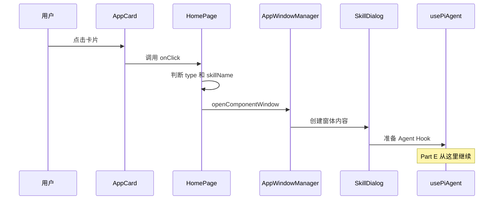

# A02：一次点击怎样走到 Agent 会话门口

一次技能启动可以分成两个相连但不同的阶段：前半段把首页配置转换成一个技能窗体；后半段由窗体进入 Agent 会话运行时。本章分析前半段，并在 `SkillDialog` 与 `usePiAgent` 的交界处停下。会话创建、消息流和工具执行将在 Pi Agent 章节展开。

## 0. 调查现场：一张“头脑风暴”卡片

[HOME_APPS（第 67-74 行）](../../../../packages/web/src/config/homeApps.ts#L67) 中的“头脑风暴”不是组件，只是一条数据：`type: 'skill'`，`skillName: 'bmad-brainstorming'`。数据不会自己打开窗口，必须有代码解释它。

**思考**：删掉 `skillName` 后，卡片还会显示吗？点击后会发生什么？先形成判断，再用源码验证。

## 1. 第一跳：配置变成可点击卡片

打开 [首页应用启动器（第 1425-1450 行）](../../../../packages/web/src/app/page.tsx#L1425) ，只读这个核心分支：

```ts
if (app.type === 'skill' && app.skillName) {
  handleSkillLaunch(app.skillName, app.name);
}
```

`HOME_APPS.map` 负责把每条配置变成 `AppCard`；`key={app.id}` 只给 React 识别列表，不是 Session ID；`onClick` 是真正的控制点。条件同时验证“它是 skill”与“必要参数存在”。因此卡片仍可渲染，但缺少 `skillName` 时不会进入启动函数。类型表达设计意图，运行时判断防御错误配置，两者缺一不可。



图中没有网络箭头。`AppCard -> HomePage` 是子组件执行父组件传下来的回调；`HomePage -> AppWindowManager` 是把产品入口翻译成窗口配置；最后一箭头才抵达 Agent 运行时。

## 2. 第二跳：产品数据被翻译成窗口配置

读 [handleSkillLaunch（第 845-869 行）](../../../../packages/web/src/app/page.tsx#L845) 。它把一个 `skillName` 转换成下面几项：

| 输入 | 输出 | 原因 |
| --- | --- | --- |
| `skillName` | `skill-${skillName}` | 稳定窗口 id，避免重复点击产生随机窗口 |
| `name` | 窗口标题 | 用户看到产品名称，不必看内部代码名 |
| `skillName` | `SkillDialog` prop | 对话界面才能读取正确的技能 |
| `entryType/entryId` | metadata | 关闭或恢复时能辨认入口身份 |

[第 866 行](../../../../packages/web/src/app/page.tsx#L866) 的 `sessionId` 只是窗口层的关联键，**不等于已经在磁盘创建了会话**。这条区分以后会反复出现：一个 id 存在，不代表对应资源已经被初始化。

## 3. 第三跳：窗口管理器管理生命周期

[openComponentWindow（第 245-259 行）](../../../../packages/web/src/services/AppWindowManager.ts#L245) 把 id、标题、组件和 props 合成窗口配置，再交给 `openWindow`。这不是 `window.open`；它让 Web 模式和 Electron 原生窗口模式共享同一个入口。

再看 [关闭回调注入（第 28-54 行）](../../../../packages/web/src/services/AppWindowManager.ts#L28) 。对于 `skill`，窗口关闭时会请求销毁 Agent Session 并触发记忆整理。窗体因此是**运行时生命周期边界**，不只是视觉容器。

## 4. 第四跳：SkillDialog 是交界面，不是 Agent 本体

[SkillDialog 的导入区（第 1-26 行）](../../../../packages/web/src/components/skills/SkillDialog.tsx#L1) 给出三个关键线索：第 5 行导入 `usePiAgent`；第 59-98 行 `loadSkillContent` 读取技能内容；第 103-220 行构建系统提示词，写入工作目录、输出目录和只读技能资源目录。

因此它负责准备 UI 与会话所需材料，却不应在本课被误说成“模型执行器”。真正的 Session 创建、消息流、工具调用和持久化都留给 Part E 用真实类型和测试证明。

## 5. 思考与练习

不看本文回答：

1. `app.id`、`skillName`、`sessionId` 为什么不是同一种 id？
2. 为什么判断放在 `HomePage`，而非 `AppCard`？
3. 为什么窗口打开不等于模型已经回复？

练习：对比 `app-workspace` 与 `app-brainstorming`，在 [点击分支（第 1436-1446 行）](../../../../packages/web/src/app/page.tsx#L1436) 找到各自路径。写出“缺少 `skillName`”时卡片显示、点击分支、窗口创建三个结果。

**验收**：答案必须明确区分“卡片渲染”“窗口创建”“Agent Session 初始化”三个阶段，并能画出：

```text
HOME_APPS -> onClick -> handleSkillLaunch -> AppWindowManager -> SkillDialog -> usePiAgent
```

下一课 A03 解释这条链路为何分散在多个 package，而不是塞进首页一个文件。
