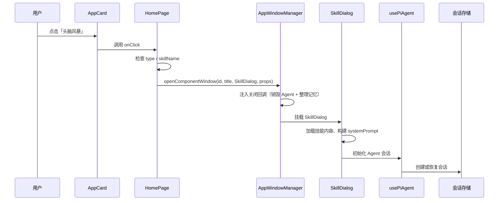

# A02：从一次点击看系统角色的接力

## 一个可观察的现象

用户在首页点击「头脑风暴」卡片。三件事情几乎同时发生：卡片被按下、一个标题为「头脑风暴」的窗口出现、窗口里出现一句欢迎语。如果只看 UI，很容易以为「卡片直接打开了窗口」。但源码中不存在「AppCard 打开窗口」的函数；卡片只负责触发点击事件，真正决定打开什么、怎么打开的代码在页面层和窗口服务层。

这个分工是 OriginOS 学习的第一条重要经验：**不要把视觉结果直接归给最近的视觉组件**。本章用一次点击画出系统在 Web、Core、Runtime、Storage、Desktop 五个角色之间的高层接力，为 Part B 的逐文件追踪建立整体地图。

## 系统角色接力图



这张图不展示网络请求细节、不展示流式响应过程、不展示工具执行链。它只回答一个问题：**一次点击后，控制权依次经过哪些系统角色，每个角色新增了什么责任**。

- `AppCard` 只负责展示和触发点击，不知道 Skill 如何运行。
- `HomePage` 负责把配置翻译成窗口配置，并产生稳定的窗口 id。
- `AppWindowManager` 负责窗口生命周期，并在关闭时注入 Agent 销毁和记忆整理。
- `SkillDialog` 负责准备 UI 与会话所需材料（技能内容、提示词、工作目录）。
- `usePiAgent` 负责客户端与会话运行时的交互。
- `会话存储` 负责把会话状态持久化到本地文件。

注意：图中没有从 `AppCard` 直接到 `SkillDialog` 的箭头。卡片甚至不知道 SkillDialog 的存在；它只向上抛 `onClick`。

## 为什么必须分这么多层

假设把所有代码都放进 `page.tsx`。第一天，点击卡片和对话框都能工作；第二天，桌面端需要复用会话逻辑，测试又需要在没有浏览器的环境中创建会话，页面文件就开始同时依赖 DOM、磁盘、Electron 与模型配置。任何一个环境变化都会牵动全部代码。

分层的目的就是限制这种「最初方便，后来无法移动」的结构。每个角色只负责一种稳定变化：

| 角色 | 负责什么 | 不负责的典型错误 |
|------|----------|------------------|
| Web 组件 | 展示与事件触发 | 直接调用模型或写文件 |
| 页面编排 | 把配置映射到窗口/服务 | 复制 Core 的业务规则 |
| 窗口服务 | 窗口生命周期与关闭回调 | 决定 Agent 内部如何推理 |
| Core 集成 | 会话、技能、工具的公共边界 | 渲染 React 组件 |
| 存储 | 把状态落到本地文件 | 解释用户意图 |

[`AGENTS.md` 的依赖层级](../../../../AGENTS.md#L198) 把这条规则具体化了：app routes 依赖 components，components 依赖 services/stores，services 依赖 core features，core features 依赖 storage/integrations。反过来就是违规。

## 源码中的三个边界信号

### 信号 1：卡片只做触发

[`packages/web/src/components/framework/AppCard.tsx` 第 73—79 行](../../../../packages/web/src/components/framework/AppCard.tsx#L73) 的 `handleClick` 只有两条分支：

```ts
const handleClick = () => {
  if (path) {
    window.location.href = path;
  } else if (onClick) {
    onClick();
  }
};
```

它要么跳转链接，要么调用父组件传进来的回调。 `skillName` 只是作为 prop 被传入， `AppCard` 内部从不读取它来决定行为。

### 信号 2：页面负责翻译

[`packages/web/src/app/page.tsx` 第 1426—1450 行](../../../../packages/web/src/app/page.tsx#L1426) 把 `HOME_APPS` 的每条配置映射成 `AppCard`，并在 `onClick` 中判断 `type` 和 `skillName`：

```ts
onClick={() => {
  if (app.type === 'skill' && app.skillName) {
    handleSkillLaunch(app.skillName, app.name);
  } else if (app.action === 'open-workspace') {
    const firstProject = projects[0];
    if (firstProject) {
      handleOpenWorkspace(firstProject.id);
    }
  }
}}
```

这里有两个容易被忽略的事实。第一，条件同时检查 `type === 'skill'` 和 `skillName` 存在，缺少 `skillName` 时卡片仍可渲染，但点击无响应。第二，`app.id` 只用于 React 列表 key，不是窗口 id，也不是 session id；三个 id 承担完全不同的职责。

### 信号 3：窗口服务注入生命周期

[`packages/web/src/services/AppWindowManager.ts` 第 31—54 行](../../../../packages/web/src/services/AppWindowManager.ts#L31) 在打开窗口时检查 `entryType`，如果属于 `role-agent`、`agent`、`project`、`solution`、`skill` 之一，就为该窗口注入 `onClose` 回调：关闭时调用 `destroyAgentSession` 和 `consolidateMemory`。

这意味着**窗口不仅是视觉容器，还是运行时生命周期边界**。窗口关闭会触发运行时的清理动作，但清理的是内存中的 Agent 实例和记忆整理，不是删除持久化会话文件。

## 关键区分：三种 id

一次点击会同时出现三种 id，但它们不是一回事：

| id | 例子 | 由谁产生 | 生命周期 |
|----|------|----------|----------|
| `app.id` | `app-brainstorming` | 配置文件 | 跟随 `HOME_APPS` 静态存在 |
| 窗口 id | `skill-bmad-brainstorming` | `handleSkillLaunch` | 窗口打开时产生，关闭时销毁 |
| session id | `skill-bmad-brainstorming` | 初始化时生成或复用 | 窗口关闭后仍保留在磁盘 |

在 [`handleSkillLaunch` 第 849—866 行](../../../../packages/web/src/app/page.tsx#L849) 可以看到窗口 id 和 session id 目前都使用 `skill-${skillName}`。这个选择是为了让重复点击同一卡片时聚焦已有窗口，并复用同一项目范围。但它也带来一个风险：如果误以为「窗口 id 就是 session id 且已创建会话」，会忽略 `SkillDialog` 初始化时真正创建会话的那一步。

## 失败路径

1. **卡片渲染 ≠ 点击能工作**：缺少 `skillName` 的 `skill` 类型卡片仍会显示，但点击后没有任何反应。
2. **窗口打开 ≠ 会话已创建**：`AppWindowManager` 只创建窗口和元数据关联，`SkillDialog` 内的 `usePiAgent.initialize` 才是真正创建或恢复会话的地方。
3. **窗口关闭 ≠ 会话删除**：关闭窗口触发 `destroyAgentSession` 清理运行时实例，但 `agentSessionService` 保存的 JSON 文件仍保留，供下次恢复。

## 测试证据与缺口

当前没有单一单元测试覆盖「从首页点击到窗口打开」的完整链路。相关验证分散在：

- [`packages/web/src/components/skills/__tests__/skill-export-policy.test.ts`](../../../../packages/web/src/components/skills/__tests__/skill-export-policy.test.ts#L1) 验证 Skill UI 附近的策略。
- [`tests/e2e/epic-2-workspace.spec.ts`](../../../../tests/e2e/epic-2-workspace.spec.ts#L1) 覆盖端到端用户流程。
- 首页入口配置目前没有自动化测试，缺失 `skillName` 的场景只能靠人工 review 或 E2E 捕获。

缺口：建议为 `HOME_APPS` 配置增加一个结构测试，断言每个 `type: 'skill'` 条目都有非空 `skillName`。

## 练习与口头验收

1. 不看本文回答：`app.id`、`skillName`、窗口 id、session id 为什么不是同一种 id？
2. 为什么判断 `type === 'skill'` 放在 `HomePage` 而不是 `AppCard`？
3. 画出一次技能启动的控制流、数据流和生命周期边界，分别指出 Web、Core、Pi Agent、Electron 的职责。
4. 假设把 `handleSkillLaunch` 中的会话持久化代码搬进 `page.tsx`，说明它违反的是哪条边界、应下沉到哪里。

合上本页后，应能准确说明：卡片只触发事件，页面负责翻译，窗口服务负责生命周期，SkillDialog 准备材料，usePiAgent 进入运行时；并且能区分「卡片渲染」「窗口创建」「Agent 会话初始化」三个阶段。

下一章进入 Monorepo 包边界：这些角色为什么必须分布在不同 package 中。
